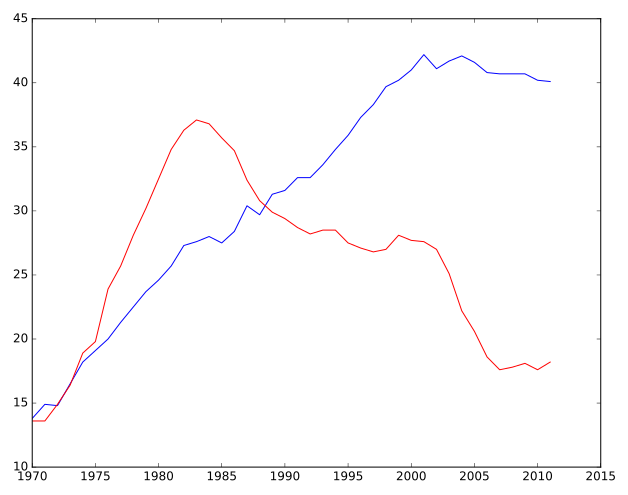
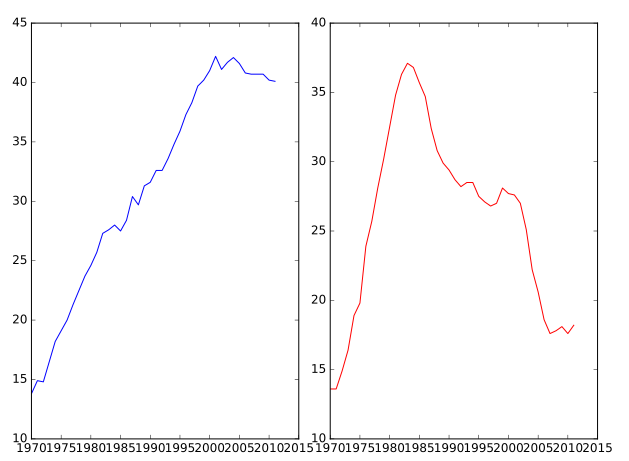
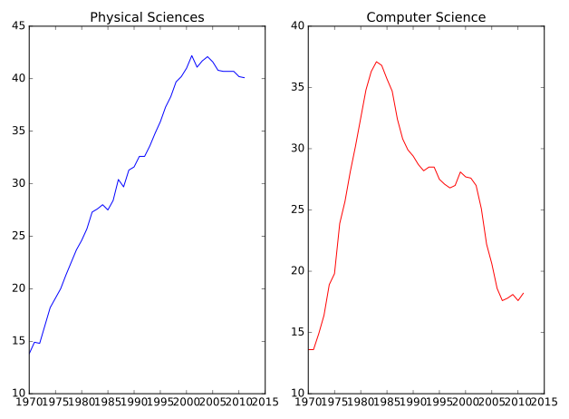

# Chapter 01: Customizing Plots

## 01. Multiple plots on single axis
It is time now to put together some of what you have learned and combine line plots on a common set of axes. The data set here comes from records of undergraduate degrees awarded to women in a variety of fields from 1970 to 2011. You can compare trends in degrees most easily by viewing two curves on the same set of axes.

Here, three NumPy arrays have been pre-loaded for you: year (enumerating years from 1970 to 2011 inclusive), physical_sciences (representing the percentage of Physical Sciences degrees awarded to women each in corresponding year), and computer_science (representing the percentage of Computer Science degrees awarded to women in each corresponding year).

You will issue two plt.plot() commands to draw line plots of different colors on the same set of axes. Here, year represents the x-axis, while `physical_sciences` and `computer_science` are the y-axes.

### Instructions:
* Import `matplotlib.pyplot` as its usual alias.
* Add a 'blue' line plot of the % of degrees awarded to women in the Physical Sciences (physical_sciences) from 1970 to 2011 (year). Note that the x-axis should be specified first.
* Add a 'red' line plot of the % of degrees awarded to women in Computer Science (computer_science) from 1970 to 2011 (year).
* Use `plt.show()` to display the figure with the curves on the same axes.

#### Script:
```
# Import matplotlib.pyplot
import matplotlib.pyplot as plt

# Plot in blue the % of degrees awarded to women in the Physical Sciences
plt.plot(year, physical_sciences, color='blue')

# Plot in red the % of degrees awarded to women in Computer Science
plt.plot(year, computer_science, color='red')

# Display the plot
plt.show()

```
#### Output:
```
In [2]: year
Out[2]: 
array([1970, 1971, 1972, 1973, 1974, 1975, 1976, 1977, 1978, 1979, 1980,
       1981, 1982, 1983, 1984, 1985, 1986, 1987, 1988, 1989, 1990, 1991,
       1992, 1993, 1994, 1995, 1996, 1997, 1998, 1999, 2000, 2001, 2002,
       2003, 2004, 2005, 2006, 2007, 2008, 2009, 2010, 2011])

In [3]: physical_sciences
Out[3]: 
array([13.8, 14.9, 14.8, 16.5, 18.2, 19.1, 20. , 21.3, 22.5, 23.7, 24.6,
       25.7, 27.3, 27.6, 28. , 27.5, 28.4, 30.4, 29.7, 31.3, 31.6, 32.6,
       32.6, 33.6, 34.8, 35.9, 37.3, 38.3, 39.7, 40.2, 41. , 42.2, 41.1,
       41.7, 42.1, 41.6, 40.8, 40.7, 40.7, 40.7, 40.2, 40.1])

In [4]: computer_science
Out[4]: 
array([13.6, 13.6, 14.9, 16.4, 18.9, 19.8, 23.9, 25.7, 28.1, 30.2, 32.5,
       34.8, 36.3, 37.1, 36.8, 35.7, 34.7, 32.4, 30.8, 29.9, 29.4, 28.7,
       28.2, 28.5, 28.5, 27.5, 27.1, 26.8, 27. , 28.1, 27.7, 27.6, 27. ,
       25.1, 22.2, 20.6, 18.6, 17.6, 17.8, 18.1, 17.6, 18.2])
```


#### Comment:
Well done! It looks like, for the last 25 years or so, more women have been awarded undergraduate degrees in the Physical Sciences than in Computer Science.

## 02. Using axes()
Rather than overlaying line plots on common axes, you may prefer to plot different line plots on distinct axes. The command plt.axes() is one way to do this (but it requires specifying coordinates relative to the size of the figure).

Here, you have the same three arrays year, physical_sciences, and computer_science representing percentages of degrees awarded to women over a range of years. You will use plt.axes() to create separate sets of axes in which you will draw each line plot.

In calling `plt.axes([xlo, ylo, width, height])`, a set of axes is created and made active with lower corner at coordinates `(xlo, ylo)` of the specified width and height. Note that these coordinates can be passed to plt.axes() in the form of a list or a tuple.

The coordinates and lengths are values between 0 and 1 representing lengths relative to the dimensions of the figure. After issuing a plt.axes() command, plots generated are put in that set of axes.

### Instructions:
* Create a set of plot axes with lower corner xlo and ylo of 0.05 and 0.05, width of 0.425, and height of 0.9 (in units relative to the figure dimension).
** Note: Remember to pass these coordinates to plt.axes() in the form of a list: [xlo, ylo, width, height].
* Plot the percentage of degrees awarded to women in Physical Sciences in blue in the active axes just created.
* Create a set of plot axes with lower corner xlo and ylo of 0.525 and 0.05, width of 0.425, and height of 0.9 (in units relative to the figure dimension).
* Plot the percentage of degrees awarded to women in Computer Science in red in the active axes just created.

#### Script:
```
# Create plot axes for the first line plot
# define a rect
plt.axes([0.05, 0.05, 0.425, 0.9])

# Plot in blue the % of degrees awarded to women in the Physical Sciences
plt.plot(year, physical_sciences, color='blue')

# Create plot axes for the second line plot
# define another rect
plt.axes([0.525, 0.05, 0.425, 0.9])

# Plot in red the % of degrees awarded to women in Computer Science
plt.plot(year, computer_science, color='red')

# Display the plot
plt.show()
```
#### Output:


#### Comment:
Great work! As you can see, not only are there now two separate plots with their own axes, but the axes for each plot are slightly different.

## 03. Using subplot() (1)
The command `plt.axes()` requires a lot of effort to use well because the coordinates of the axes need to be set manually. A better alternative is to use `plt.subplot()` to determine the layout automatically.

In this exercise, you will continue working with the same arrays from the previous exercises: year, physical_sciences, and computer_science. Rather than using plt.axes() to explicitly lay out the axes, you will use plt.subplot(m, n, k) to make the subplot grid of dimensions m by n and to make the kth subplot active (subplots are numbered starting from 1 row-wise from the top left corner of the subplot grid).

### Instructions:
* Use plt.subplot() to create a figure with 1x2 subplot layout & make the first subplot active.
* Plot the percentage of degrees awarded to women in Physical Sciences in blue in the active subplot.
* Use plt.subplot() again to make the second subplot active in the current 1x2 subplot grid.
* Plot the percentage of degrees awarded to women in Computer Science in red in the active subplot.

#### Script:
```
# Create a figure with 1x2 subplot and make the left subplot active
plt.subplot(1, 2, 1)

# Plot in blue the % of degrees awarded to women in the Physical Sciences
plt.plot(year, physical_sciences, color='blue')
plt.title('Physical Sciences')

# Make the right subplot active in the current 1x2 subplot grid
plt.subplot(1, 2, 2)

# Plot in red the % of degrees awarded to women in Computer Science
plt.plot(year, computer_science, color='red')
plt.title('Computer Science')

# Use plt.tight_layout() to improve the spacing between subplots
plt.tight_layout()
plt.show()
```
#### Output:


#### Comment:
Excellent work! Using subplots like this is a better alternative to using plt.axes().
