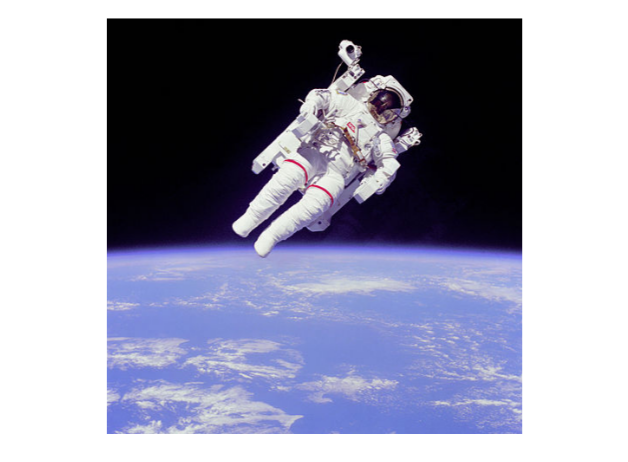

# Chaper 02: Generating Meshes

## 01. Generating meshes
In order to visualize two-dimensional arrays of data, it is necessary to understand how to generate and manipulate 2-D arrays. Many Matplotlib plots support arrays as input and in particular, they support NumPy arrays. The NumPy library is the most widely-supported means for supporting numeric arrays in Python.

In this exercise, you will use the meshgrid function in NumPy to generate 2-D arrays which you will then visualize using `plt.imshow()`. The simplest way to generate a meshgrid is as follows:
```
import numpy as np
Y,X = np.meshgrid(range(10),range(20))
```
This will create two arrays with a shape of (20,10), which corresponds to 20 rows along the Y-axis and 10 columns along the X-axis. In this exercise, you will use np.meshgrid() to generate a regular 2-D sampling of a mathematical function.

### Instructions:
* Import the numpy and matplotlib.pyplot modules using the respective aliases np and plt.
* Generate two one-dimensional arrays u and v using np.linspace(). The array u should contain 41 values uniformly spaced beween -2 and +2. The array v should contain 21 values uniformly spaced between -1 and +1.
* Construct two two-dimensional arrays X and Y from u and v using np.meshgrid(). The resulting arrays should have shape (41,21).
* After the array Z is computed using X and Y, visualize the array Z using plt.pcolor() and `plt.show()`.
* Save the resulting figure as `'sine_mesh.png'`.

#### Script:
```
# Import numpy and matplotlib.pyplot
import matplotlib.pyplot as plt
import numpy as np

# Generate two 1-D arrays: u, v
u = np.linspace(-2, 2, 41)
v = np.linspace(-1, 1, 21)

# Generate 2-D arrays from u and v: X, Y
X,Y = np.meshgrid(u, v)

# Compute Z based on X and Y
Z = np.sin(3*np.sqrt(X**2 + Y**2)) 

# Display the resulting image with pcolor()
# plt.pcolor(Z)
plt.pcolor(Z)
plt.show()

# Save the figure to 'sine_mesh.png'
plt.savefig('sine_mesh.png')

```
#### Output:


#### Comment:
Great work!

## 02. Array orientation


The commands
```
In [1]: plt.pcolor(A, cmap='Blues')
In [2]: plt.colorbar()
In [3]: plt.show()
```
produce the pseudocolor plot above using a Numpy array A. Which of the commands below could have generated A?

numpy and `matplotlib.pyplot` have been imported as np and plt respectively. Play around in the IPython shell with different arrays and generate pseudocolor plots from them to identify which of the below commands could have generated A.

### Possible Answers
* `A = np.array([[1, 2, 1], [0, 0, 1], [-1, 1, 1]])`
* `A = np.array([[1, 0, -1], [2, 0, 1], [1, 1, 1]])`
* `A = np.array([[-1, 0, 1], [1, 0, 2], [1, 1, 1]])`
* `A = np.array([[1, 1, 1], [2, 0, 1], [1, 0, -1]])`

#### Answer:
2

#### Comment:
Well done!

## 03. Contour & filled contour plots
Although `plt.imshow()` or `plt.pcolor()` are often used to visualize a 2-D array in entirety, there are other ways of visualizing such data without displaying all the available sample values. One option is to use the array to compute contours that are visualized instead.

Two types of contour plot supported by Matplotlib are plt.contour() and plt.contourf() where the former displays the contours as lines and the latter displayed filled areas between contours. Both these plotting commands accept a two dimensional array from which the appropriate contours are computed.

In this exercise, you will visualize a 2-D array repeatedly using both plt.contour() and plt.contourf(). You will use plt.subplot() to display several contour plots in a common figure, using the meshgrid X, Y as the axes. For example, plt.contour(X, Y, Z) generates a default contour map of the array Z.

### Instructions:
* Using the meshgrid `X`, `Y` as axes:
** Generate a default contour plot of the array Z in the upper left subplot.
** Generate a contour plot of the array Z in the upper right subplot with 20 contours.
** Generate a default filled contour plot of the array Z in the lower left subplot.
** Generate a default filled contour plot of the array Z in the lower right subplot with 20 contours.
* Improve the spacing between the subplots with `plt.tight_layout()` and display the figure.

#### Script:
```
# Generate a default contour map of the array Z
plt.subplot(2,2,1)
plt.contour(X, Y, Z)

# Generate a contour map with 20 contours
plt.subplot(2,2,2)
plt.contour(X, Y, Z, 20)

# Generate a default filled contour map of the array Z
plt.subplot(2,2,3)
plt.contourf(X, Y, Z)

# Generate a default filled contour map with 20 contours
plt.subplot(2,2,4)
plt.contourf(X, Y, Z, 20)

# Improve the spacing between subplots
plt.tight_layout()

# Display the figure
plt.show()
```

#### Output:
```
In [1]: X
Out[1]: 
array([[-2.  , -1.96, -1.92, ...,  1.92,  1.96,  2.  ],
       [-2.  , -1.96, -1.92, ...,  1.92,  1.96,  2.  ],
       [-2.  , -1.96, -1.92, ...,  1.92,  1.96,  2.  ],
       ...,
       [-2.  , -1.96, -1.92, ...,  1.92,  1.96,  2.  ],
       [-2.  , -1.96, -1.92, ...,  1.92,  1.96,  2.  ],
       [-2.  , -1.96, -1.92, ...,  1.92,  1.96,  2.  ]])

In [2]: Y
Out[2]: 
array([[0.  , 0.  , 0.  , ..., 0.  , 0.  , 0.  ],
       [0.04, 0.04, 0.04, ..., 0.04, 0.04, 0.04],
       [0.08, 0.08, 0.08, ..., 0.08, 0.08, 0.08],
       ...,
       [1.92, 1.92, 1.92, ..., 1.92, 1.92, 1.92],
       [1.96, 1.96, 1.96, ..., 1.96, 1.96, 1.96],
       [2.  , 2.  , 2.  , ..., 2.  , 2.  , 2.  ]])

In [3]: Z
Out[3]: 
array([[0.90929743, 0.92521152, 0.93964547, ..., 0.93964547, 0.92521152,
        0.90929743],
       [0.90913091, 0.92505658, 0.93950285, ..., 0.93950285, 0.92505658,
        0.90913091],
       [0.9086307 , 0.92459103, 0.93907417, ..., 0.93907417, 0.92459103,
        0.9086307 ],
       ...,
       [0.36082926, 0.38745795, 0.41350716, ..., 0.41350716, 0.38745795,
        0.36082926],
       [0.33471894, 0.36136749, 0.38745795, ..., 0.38745795, 0.36136749,
        0.33471894],
       [0.30807174, 0.33471894, 0.36082926, ..., 0.36082926, 0.33471894,
        0.30807174]])

In [4]: 
```


#### Comment:
Great work! As you can see, the bottom two contour plots are filled, because you used `plt.contourf()` instead of `plt.contour()`.

## 04. Modifying colormaps
When displaying a 2-D array with `plt.imshow()` or `plt.pcolor()`, the values of the array are mapped to a corresponding color. The set of colors used is determined by a colormap which smoothly maps values to colors, making it easy to understand the structure of the data at a glance.

It is often useful to change the colormap from the default 'jet' colormap used by matplotlib. A good colormap is visually pleasing and conveys the structure of the data faithfully and in a way that makes sense for the application.

* Some matplotlib colormaps have unique names such as 'jet', 'coolwarm', 'magma' and 'viridis'.
* Others have a naming scheme based on overall color such as 'Greens', 'Blues', 'Reds', and 'Purples'.
* Another four colormaps are based on the seasons, namely 'summer', 'autumn', 'winter' and 'spring'.
* You can insert the option cmap=<name> into most matplotlib functions to change the color map of the resulting plot.
In this exercise, you will explore four different colormaps together using plt.subplot(). You will use a pregenerated array Z and a meshgrid X, Y to generate the same filled contour plot with four different color maps. Be sure to also add a color bar to each filled contour plot with plt.colorbar().
       
### Instructions:
* Modify the call to plt.contourf() so the filled contours in the top left subplot use the 'viridis' colormap.
* Modify the call to plt.contourf() so the filled contours in the top right subplot use the 'gray' colormap.
* Modify the call to plt.contourf() so the filled contours in the bottom left subplot use the 'autumn' colormap.
* Modify the call to plt.contourf() so the filled contours in the bottom right subplot use the 'winter' colormap.

#### Script:
```
# Create a filled contour plot with a color map of 'viridis'
plt.subplot(2,2,1)
plt.contourf(X,Y,Z,20, cmap='viridis')
plt.colorbar()
plt.title('Viridis')

# Create a filled contour plot with a color map of 'gray'
plt.subplot(2,2,2)
plt.contourf(X,Y,Z,20, cmap='gray')
plt.colorbar()
plt.title('Gray')

# Create a filled contour plot with a color map of 'autumn'
plt.subplot(2,2,3)
plt.contourf(X, Y, Z, 20, cmap = 'autumn')
plt.colorbar()
plt.title('Autumn')

# Create a filled contour plot with a color map of 'winter'
plt.subplot(2,2,4)
plt.contourf(X, Y, Z, 20, cmap = 'winter')
plt.colorbar()
plt.title('Winter')

# Improve the spacing between subplots and display them
plt.tight_layout()
plt.show()
```
#### Output:


#### Comment:
Excellent work! Choosing a good color map can make it significantly easier to quickly understand the structure of your data.

## 05. Using hist2d()
Given a set of ordered pairs describing data points, you can count the number of points with similar values to construct a two-dimensional histogram. This is similar to a one-dimensional histogram, but it describes the joint variation of two random variables rather than just one.

In matplotlib, one function to visualize 2-D histograms is plt.hist2d().

* You specify the coordinates of the points using plt.hist2d(x,y) assuming x and y are two vectors of the same length.
* You can specify the number of bins with the argument bins=(nx, ny) where nx is the number of bins to use in the horizontal direction and ny is the number of bins to use in the vertical direction.
* You can specify the rectangular region in which the samples are counted in constructing the 2D histogram. The optional parameter required is range=((xmin, xmax), (ymin, ymax)) where
* xmin and xmax are the respective lower and upper limits for the variables on the x-axis and
* ymin and ymax are the respective lower and upper limits for the variables on the y-axis. Notice that the optional range argument can use nested tuples or lists.
In this exercise, you'll use some data from the auto-mpg data set. There are two arrays mpg and hp that respectively contain miles per gallon and horse power ratings from over three hundred automobiles built.

#### Instructions:
* Generate a two-dimensional histogram to view the joint variation of the mpg and hp arrays.
* Put hp along the horizontal axis and mpg along the vertical axis.
* Specify 20 by 20 rectangular bins with the bins argument.
* Specify the region covered with the optional range argument so that the plot samples hp between 40 and 235 on the x-axis and mpg between 8 and 48 on the y-axis.
* Add a color bar to the histogram.

#### Script:
```
# Generate a 2-D histogram
plt.hist2d(hp, mpg, bins=(20, 20), range=[[40, 235], [8, 48]])

# Add a color bar to the histogram
plt.colorbar()

# Add labels, title, and display the plot
plt.xlabel('Horse power [hp]')
plt.ylabel('Miles per gallon [mpg]')
plt.title('hist2d() plot')
plt.show()
```
#### Output:


#### Comment:
Superb work! As you might expect, cars with higher hp have lower mpg.

## 06. Using hexbin()
The function `plt.hist2d()` uses rectangular bins to construct a two dimensional histogram. As an alternative, the function `plt.hexbin()` uses hexagonal bins. The underlying algorithm (based on this article from 1987) constructs a hexagonal tesselation of a planar region and aggregates points inside hexagonal bins.

* The optional gridsize argument (default 100) gives the number of hexagons across the x-direction used in the hexagonal tiling. If specified as a list or a tuple of length two, gridsize fixes the number of hexagon in the x- and y-directions respectively in the tiling.
* The optional parameter extent=(xmin, xmax, ymin, ymax) specifies rectangular region covered by the hexagonal tiling. In that case, xmin and xmax are the respective lower and upper limits for the variables on the x-axis and ymin and ymax are the respective lower and upper limits for the variables on the y-axis.
In this exercise, you'll use the same auto-mpg data as in the last exercise (again using arrays mpg and hp). This time, you'll use plt.hexbin() to visualize the two-dimensional histogram.

### Instructions:
* Generate a two-dimensional histogram with plt.hexbin() to view the joint variation of the mpg and hp vectors.
* Put hp along the horizontal axis and mpg along the vertical axis.
* Specify a hexagonal tesselation with 15 hexagons across the x-direction and 12 hexagons across the y-direction using gridsize.
* Specify the rectangular region covered with the optional extent argument: use hp from 40 to 235 and mpg from 8 to 48.
* Add a color bar to the histogram.

#### Script:
```
# Generate a 2d histogram with hexagonal bins
plt.hexbin(hp, mpg, gridsize=(15, 12), extent=[40, 235, 8, 48])
       
# Add a color bar to the histogram
plt.colorbar()

# Add labels, title, and display the plot
plt.xlabel('Horse power [hp]')
plt.ylabel('Miles per gallon [mpg]')
plt.title('hexbin() plot')
plt.show()
```
#### Output:


#### Comment:
Well done! Sometimes, you may prefer to use hexagonal bins, like in this plot, instead of rectangular bins.

## 07. Loading, examining images
Color images such as photographs contain the intensity of the red, green and blue color channels.

* To read an image from file, use `plt.imread()` by passing the path to a file, such as a PNG or JPG file.
* The color image can be plotted as usual using `plt.imshow()`.
* The resulting image loaded is a NumPy array of three dimensions. The array typically has dimensions M×N×3, where M×N is the dimensions of the image. The third dimensions are referred to as color channels (typically red, green, and blue).
* The color channels can be extracted by Numpy array slicing.

In this exercise, you will load & display an <a href="https://en.wikipedia.org/wiki/File:Astronaut-EVA.jpg">image of an astronaut</a> (by NASA (Public domain), via <a href="https://commons.wikimedia.org/">Wikimedia Commons</a>). You will also examine its attributes to understand how color images are represented.

### Instructions:
* Load the file '480px-Astronaut-EVA.jpg' into an array.
* Print the shape of the img array. How wide and tall do you expect the image to be?
* Prepare img for display using `plt.imshow()`.
* Turn off the axes using `plt.axis('off')`.

#### Script:
```
# Load the image into an array: img
img = plt.imread('480px-Astronaut-EVA.jpg')

# Print the shape of the image
print(img.shape)

# Display the image
plt.imshow(img)

# Hide the axes
plt.axis('off')
plt.show()

```
#### Output:


#### Comment:
Excellent work! This image is represented as a 3D array. As you can see in the IPython Shell, its shape is `(480, 480, 3)`.

## 08. Pseudocolor plot from image data
Image data comes in many forms and it is not always appropriate to display the available channels in RGB space. In many situations, an image may be processed and analysed in some way before it is visualized in pseudocolor, also known as 'false' color.

In this exercise, you will perform a simple analysis using the image showing an astronaut as viewed from space. Instead of simply displaying the image, you will compute the total intensity across the red, green and blue channels. The result is a single two dimensional array which you will display using `plt.imshow()` with the `'gray'` colormap.

### Instructions:
* Print the shape of the existing image array.
* Compute the sum of the red, green, and blue channels of img by using the `.sum()` method with axis=2.
* Print the shape of the intensity array to verify this is the shape you expect.
* Plot intensity with `plt.imshow()` using a 'gray' colormap.
* Add a colorbar to the figure.

#### Script:
```
# Load the image into an array: img
img = plt.imread('480px-Astronaut-EVA.jpg')

# Print the shape of the image
print(img.shape)

# Compute the sum of the red, green and blue channels: intensity
# this will 'collapse' the 3D numpy array into 2D numpy array.
# so the idea is removing the original color of the image and then give it a new color map. 
intensity = img.sum(axis=2)

# Print the shape of the intensity
print(intensity.shape)

# Display the intensity with a colormap of 'gray'
plt.imshow(intensity, cmap = 'gray')

# Add a colorbar
plt.colorbar()

# Hide the axes and show the figure
plt.axis('off')
plt.show()
```
#### Output:
```

<script.py> output:
    (480, 480, 3)
    (480, 480)
```
* Original image

* Image after reducing its dimension

* final image with cmap = `'gray'`. 


#### Comment:
Great work! Notice how the array is now 2D.
