# Chapter 03: Statistical Plots with Seaborn. 

## 01. Simple linear regressions
As you have seen, seaborn provides a convenient interface to generate complex and great-looking statistical plots. One of the simplest things you can do using seaborn is to fit and visualize a simple linear regression between two variables using `sns.lmplot()`.

One difference between seaborn and regular matplotlib plotting is that you can pass pandas DataFrames directly to the plot and refer to each column by name. For example, if you were to plot the column 'price' vs the column 'area' from a DataFrame df, you could call `sns.lmplot(x='area', y='price', data=df)`.

In this exercise, you will once again use the DataFrame auto containing the auto-mpg dataset. You will plot a linear regression illustrating the relationship between automobile weight and horse power.

### Instructions:
* Import `matplotlib.pyplot` and `seaborn using` the standard names plt and sns respectively.
* Plot a linear regression between the 'weight' column (on the x-axis) and the 'hp' column (on the y-axis) from the DataFrame auto.
* Display the plot as usual with plt.show(). This has been done for you, so hit 'Submit Answer' to view the plot. 

#### Script:
```
# Import plotting modules
import matplotlib.pyplot as plt
import seaborn as sns

# Plot a linear regression between 'weight' and 'hp'
sns.lmplot(x = 'weight', y = 'hp', data=auto)

# Display the plot
plt.show()

```
#### Output:
```
In [4]: auto.head()
Out[4]: 
    mpg  cyl  displ   hp  weight  accel  yr  origin              name  color  \
0  18.0    6  250.0   88    3139   14.5  71      US      ford mustang    red   
1   9.0    8  304.0  193    4732   18.5  70      US          hi 1200d  green   
2  36.1    4   91.0   60    1800   16.4  78    Asia  honda civic cvcc   blue   
3  18.5    6  250.0   98    3525   19.0  77      US      ford granada    red   
4  34.3    4   97.0   78    2188   15.8  80  Europe         audi 4000   blue   

        size marker  
0  27.370336      o  
1  62.199511      o  
2   9.000000      x  
3  34.515625      o  
4  13.298178      s
```
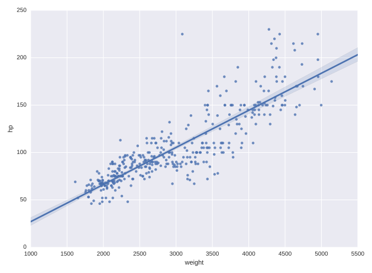

#### Comment:
Fantastic work! Unsurprisingly, there is a strong correlation between 'hp' and 'weight', and a linear regression is easily able to capture this trend.

## 02. Plotting residuals of a regression
Often, you don't just want to see the regression itself but also see the residuals to get a better idea how well the regression captured the data. Seaborn provides `sns.residplot()` for that purpose, visualizing how far datapoints diverge from the regression line.

In this exercise, you will visualize the residuals of a regression between the `'hp'` column (horse power) and the 'mpg' column (miles per gallon) of the auto DataFrame used previously.

### Instructions:
* Import `matplotlib.pyplot` and `seaborn` using the standard names plt and sns respectively.
* Generate a green residual plot of the regression between 'hp' (on the x-axis) and 'mpg' (on the y-axis). You will need to specify the additional data and color parameters.
* Display the plot as usual using plt.show(). This has been done for you, so hit 'Submit Answer' to view the plot.

#### Script:
```
# Import plotting modules
import matplotlib.pyplot as plt
import seaborn as sns

# Generate a green residual plot of the regression between 'hp' and 'mpg'
sns.residplot(x='hp', y='mpg', data=auto, color='green')

# Display the plot
plt.show()
```
#### Output:


#### Comment:
Excellent! Seaborn makes it very easy to quickly plot the residuals of regressions, as shown here.

## 03. Higher-order regressions
When there are more complex relationships between two variables, a simple first order regression is often not sufficient to accurately capture the relationship between the variables. Seaborn makes it simple to compute and visualize regressions of varying orders.

Here, you will plot a second order regression between the horse power ('hp') and miles per gallon ('mpg') using sns.regplot() (the function sns.lmplot() is a higher-level interface to sns.regplot()). However, before plotting this relationship, compare how the residual changes depending on the order of the regression. Does a second order regression perform significantly better than a simple linear regression?

* A principal difference between sns.lmplot() and sns.regplot() is the way in which matplotlib options are passed (sns.regplot() is more permissive).
* For both sns.lmplot() and sns.regplot(), the keyword order is used to control the order of polynomial regression.
* The function `sns.regplot()` uses the argument `scatter=None` to prevent plotting the scatter plot points again.

### Instructions:
* Modify the call to `plt.scatter()` to plot `auto['weight']` on the x-axis and auto['mpg'] on the y-axis, filled with red circles and with label='data'.
* Plot a linear regression line of 'order 1' between 'weight' and 'mpg' in 'blue' without the scatter points.
** You need to specify the label and color parameters, in addition to scatter=None.
* Plot a linear regression line of 'order 2' between 'weight' and 'mpg' in 'green' without the scatter points.
** To force a higher order regression, you need to specify the order parameter. Here, it should be 2.
* Add a legend to the 'upper right'.

#### Script:
```
# Generate a scatter plot of 'weight' and 'mpg' using red circles
plt.scatter(auto['weight'], auto['mpg'], label='data', color='red', marker='o')

# Plot in blue a linear regression of order 1 between 'weight' and 'mpg'
# For the 'order 1' and 'order 2', we set the argument value of scatter to False. This is done so that we got the scatter from the 'data' plot (the one created with plt, instead of sns)
sns.regplot(x='weight', y='mpg', data=auto, order=1, color='blue', label='order 1', scatter=None)

# Plot in green a linear regression of order 2 between 'weight' and 'mpg'
sns.regplot(x='weight', y='mpg', data=auto, order=2, color='green', label='order 2', scatter=None)

# Add a legend and display the plot
plt.legend(loc='upper right')
plt.show()
```

#### Output:
```
In [1]: auto.head()
Out[1]: 
    mpg  cyl  displ   hp  weight  accel  yr  origin              name  color  \
0  18.0    6  250.0   88    3139   14.5  71      US      ford mustang    red   
1   9.0    8  304.0  193    4732   18.5  70      US          hi 1200d  green   
2  36.1    4   91.0   60    1800   16.4  78    Asia  honda civic cvcc   blue   
3  18.5    6  250.0   98    3525   19.0  77      US      ford granada    red   
4  34.3    4   97.0   78    2188   15.8  80  Europe         audi 4000   blue   

        size marker  
0  27.370336      o  
1  62.199511      o  
2   9.000000      x  
3  34.515625      o  
4  13.298178      s
```

##### **scatter plot with plt** <br />
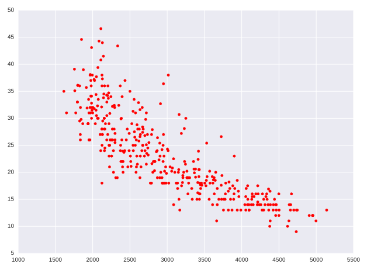
<br />

##### **Scatter plot with sns, scatter = True** <br />
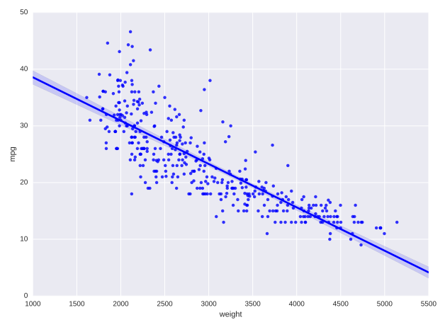
<br />

##### **Scatter plot with sns, scatter=None, no prev plt scatter** <br />
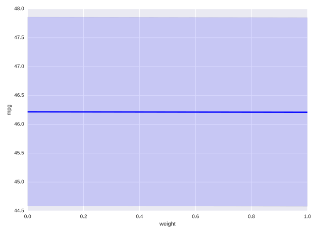
<br />

##### **Scatter plot with sns, scatter=None, with prev plt scatter** <br />

<br />

##### **Scatter plot with sns, scatter=None, order=2, no prev plt scatter** <br />
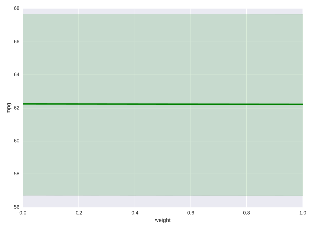
<br />

##### **Scatter plot with sns, scatter=None, order=2, with prev plt scatter** <br />
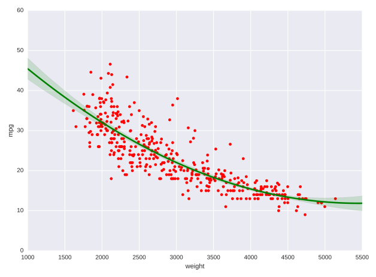
<br />

##### **Scatter plot with sns, scatter=True, order=2, no prev plt scatter** <br />
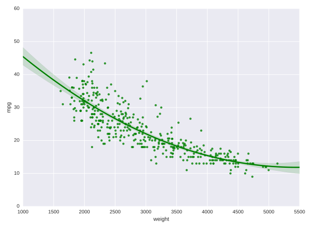
<br />

##### **Scatter plot with sns, order 1 & 2, scatter=None, with prev plt scatter** <br />
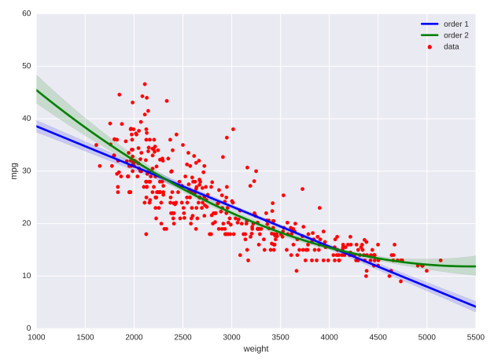

#### Comment:
Well done! It seems like a regression of order 2 is necessary to properly capture the relationship between 'weight' and 'mpg'.

## 04. Grouping linear regressions by hue
Often it is useful to compare and contrast trends between different groups. Seaborn makes it possible to apply linear regressions separately for subsets of the data by applying a groupby operation. Using the `hue` argument, you can specify a categorical variable by which to group data observations. The distinct groups of points are used to produce distinct regressions with different hues in the plot.

In the automobile dataset - which has been pre-loaded here as `auto` - you can view the relationship between weight ('weight') and horsepower ('hp') of the cars and group them by their origin ('origin'), giving you a quick visual indication how the relationship differs by continent.

### Instructions:
* Plot a linear regression between `'weight'` and `'hp'` grouped by `'origin'`.
** Use the keyword argument `hue` to group rows with the categorical column 'origin'.
** Use the keyword argument palette to specify the 'Set1' palette for coloring the distinct groups.

#### Script:
```
# Plot a linear regression between 'weight' and 'hp', with a hue of 'origin' and palette of 'Set1'
sns.lmplot('weight', 'hp', data=auto, hue='origin', palette='Set1')

# Display the plot
plt.show()
```
#### Output:
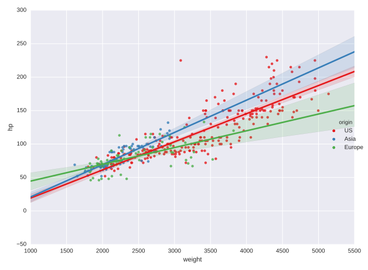

#### Comment:
Well done! It looks like US automobiles tend to have higher hp.

## 05. Grouping linear regressions by row or column
Rather than overlaying linear regressions of grouped data in the same plot, we may want to use a grid of subplots. The `sns.lmplot()` accepts the arguments `row` and/or col to arrangements of subplots for regressions.

You'll use the automobile dataset again and, this time, you'll use the keyword argument row to display the subplots organized in rows. That is, you'll produce horsepower vs. weight regressions grouped by continent of origin in separate subplots stacked vertically.

### Instructions:
* Plot linear regressions of 'hp' (on the y-axis) versus 'weight' (on the x-axis) grouped row-wise by 'origin' from DataFrame auto.
* Use the keyword argument `row` to group observations with the categorical column `'origin'` in subplots organized in rows.

#### Script:
```
# Plot linear regressions between 'weight' and 'hp' grouped row-wise by 'origin'
sns.lmplot('weight', 'hp', data=auto, row='origin')

# Display the plot
plt.show()
```
#### Output:


#### Comment:
Excellent work! It is easier to make sense of the three regression lines now that they each have their own subplot.

## 06. Constructing strip plots
Regressions are useful to understand relationships between two continuous variables. Often we want to explore how the distribution of a single continuous variable is affected by a second categorical variable. Seaborn provides a variety of plot types to perform these types of comparisons between univariate distributions.

The strip plot is one way of visualizing this kind of data. It plots the distribution of variables for each category as individual datapoints. For vertical strip plots (the default), distributions of continuous values are laid out parallel to the y-axis and the distinct categories are spaced out along the x-axis.

For example, `sns.stripplot(x='type', y='length', data=df)` produces a sequence of vertical strip plots of length distributions grouped by type (assuming length is a continuous column and type is a categorical column of the DataFrame df).
Overlapping points can be difficult to distinguish in strip plots. The argument jitter=True helps spread out overlapping points.
Other matplotlib arguments can be passed to `sns.stripplot()`, e.g., marker, color, size, etc.

### Instructions:
* In the first row of subplots, make a strip plot showing distribution of 'hp' values grouped horizontally by 'cyl'.
* In the second row of subplots, make a second strip plot with improved readability. In particular, you'll call `sns.stripplot()` again, this time adding `jitter=True` and decreasing the point size to 3 using the size parameter.

#### Script:
```
# Make a strip plot of 'hp' grouped by 'cyl'
plt.subplot(2,1,1)
sns.stripplot(x='cyl', y='hp', data=auto)

# Make the strip plot again using jitter and a smaller point size
# jitter = True --> spread out the stripplot
plt.subplot(2,1,2)
sns.stripplot(x='cyl', y='hp', data=auto, jitter=True, size=3)

# Display the plot
plt.show()
```
#### Output:
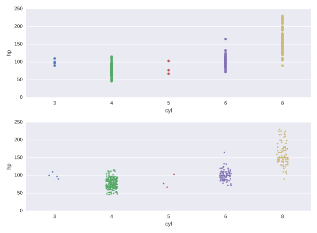

#### Comment:
Wonderful work! Here, 'hp' is the continuous variable, and 'cyl' is the categorical variable. The strip plot shows that automobiles with more cylinders tend to have higher horsepower.

## 07. Constructing swarm plots
As you have seen, a strip plot can be visually crowded even with jitter applied and smaller point sizes. An alternative is provided by the swarm plot (sns.swarmplot()), which is very similar but spreads out the points to avoid overlap and provides a better visual overview of the data.

* The syntax for `sns.swarmplot()` is similar to that of `sns.stripplot()`, e.g., `sns.swarmplot(x='type', y='length', data=df)`.
* The orientation for the continuous variable in the strip/swarm plot can be inferred from the choice of the columns x and y from the DataFrame data. The orientation can be set explicitly using orient='h' (horizontal) or orient='v' (vertical).
* Another grouping can be added in using the hue keyword. For instance, using sns.swarmplot(x='type', y='length', data=df, hue='build year') makes a swarm plot from the DataFrame df with the 'length' column values spread out vertically, horizontally grouped by the column 'type' and each point colored by the categorical column 'build year'.
In this exercise, you'll use the auto DataFrame again to illustrate the use of sns.swarmplot() with grouping by `hue` and with explicit specification of the orientation using the keyword `orient`.

### Instructions:
* In the first row of subplots, make a swarm plot showing distribution of `'hp'` values grouped horizontally by `'cyl'`.
* In the second row of subplots, make a second swarm plot with horizontal orientation (i.e., grouped vertically by 'cyl' with 'hp' value spread out horizontally) with points colored by 'origin'. You need to specify the orient parameter to explicitly set the horizontal orientation.

#### Script:
```# Generate a swarm plot of 'hp' grouped horizontally by 'cyl'  
plt.subplot(2,1,1)
sns.swarmplot(x='cyl', y='hp', data=auto)

# Generate a swarm plot of 'hp' grouped vertically by 'cyl' with a hue of 'origin'
plt.subplot(2,1,2)
sns.swarmplot(x='hp', y='cyl', data=auto, hue='origin', orient='h')

# Display the plot
plt.show()
```
#### Output:


#### Comment:
Well done! Swarm plots are generally easier to understand than strip plots because they spread out the points to avoid overlap.

## 08. Constructing violin plots
Both strip and swarm plots visualize all the datapoints. For large datasets, this can result in significant overplotting. Therefore, it is often useful to use plot types which reduce a dataset to more descriptive statistics and provide a good summary of the data. Box and whisker plots are a classic way of summarizing univariate distributions but seaborn provides a more sophisticated extension of the standard box plot, called a violin plot.

Here, you will produce violin plots of the distribution of horse power (`'hp'`) by the number of cylinders (`'cyl'`). Additionally, you will combine two different plot types by overlaying a strip plot on the violin plot.

As before, the DataFrame has been pre-loaded for you as auto.

### Instructions:
* In the first row of subplots, make a violin plot showing the distribution of 'hp' grouped by 'cyl'.
* In the second row of subplots, make a second violin plot without the inner annotations (by specifying `inner=None`) and with the color `'lightgray'`.
* In the second row of subplots, overlay a strip plot with jitter and a point size of 1.5.

#### Script:
```
# Generate a violin plot of 'hp' grouped horizontally by 'cyl'
plt.subplot(2,1,1)
sns.violinplot(x='cyl', y='hp', data=auto)

# Generate the same violin plot again with a color of 'lightgray' and without inner annotations
plt.subplot(2,1,2)
sns.violinplot(x='cyl', y='hp', data=auto, color='lightgray', inner=None)

# Overlay a strip plot on the violin plot
sns.stripplot(x='cyl', y='hp', data=auto, jitter=True, size=1.5)

# Display the plot
plt.show()
```
#### Output:
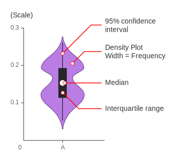

#### Comment:
Superb work! As you can see, violin plots are a nice way of visualizing the relationship between a continuous variable and a categorical variable.

## 09. Plotting joint distributions (1)
There are numerous strategies to visualize how pairs of continuous random variables vary jointly. Regression and residual plots are one strategy. Another is to visualize a bivariate distribution.

Seaborn's sns.jointplot() provides means of visualizing bivariate distributions. The basic calling syntax is similar to that of `sns.lmplot()`. By default, calling `sns.jointplot(x, y, data)` renders a few things:

* A scatter plot using the specified columns x and y from the DataFrame data.
* A (univariate) histogram along the top of the scatter plot showing distribution of the column x.
* A (univariate) histogram along the right of the scatter plot showing distribution of the column y.

## Instructions:
Use `sns.jointplot()` to visualize the joint variation of the columns `'hp'` (on the x-axis) and 'mpg' (on the y-axis) from the DataFrame auto.

### Script:
```
# Generate a joint plot of 'hp' and 'mpg'
sns.jointplot(x='hp', y='mpg', data=auto)

# Display the plot
plt.show()
```
