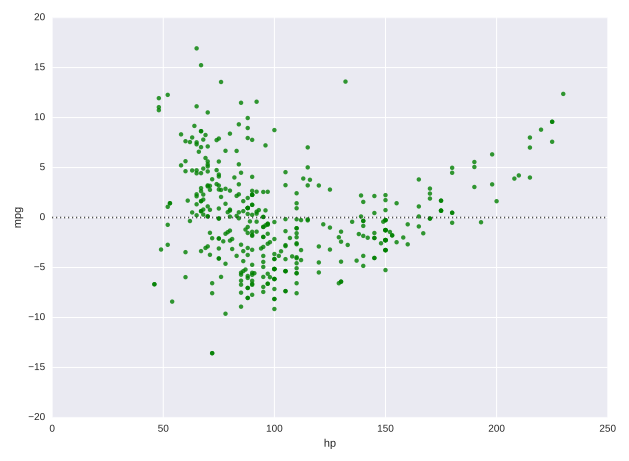

# Chapter 03: Statistical Plots with Seaborn. 

## 01. Simple linear regressions
As you have seen, seaborn provides a convenient interface to generate complex and great-looking statistical plots. One of the simplest things you can do using seaborn is to fit and visualize a simple linear regression between two variables using `sns.lmplot()`.

One difference between seaborn and regular matplotlib plotting is that you can pass pandas DataFrames directly to the plot and refer to each column by name. For example, if you were to plot the column 'price' vs the column 'area' from a DataFrame df, you could call `sns.lmplot(x='area', y='price', data=df)`.

In this exercise, you will once again use the DataFrame auto containing the auto-mpg dataset. You will plot a linear regression illustrating the relationship between automobile weight and horse power.

### Instructions:
* Import `matplotlib.pyplot` and `seaborn using` the standard names plt and sns respectively.
* Plot a linear regression between the 'weight' column (on the x-axis) and the 'hp' column (on the y-axis) from the DataFrame auto.
* Display the plot as usual with plt.show(). This has been done for you, so hit 'Submit Answer' to view the plot. 

#### Script:
```
# Import plotting modules
import matplotlib.pyplot as plt
import seaborn as sns

# Plot a linear regression between 'weight' and 'hp'
sns.lmplot(x = 'weight', y = 'hp', data=auto)

# Display the plot
plt.show()

```
#### Output:
```
In [4]: auto.head()
Out[4]: 
    mpg  cyl  displ   hp  weight  accel  yr  origin              name  color  \
0  18.0    6  250.0   88    3139   14.5  71      US      ford mustang    red   
1   9.0    8  304.0  193    4732   18.5  70      US          hi 1200d  green   
2  36.1    4   91.0   60    1800   16.4  78    Asia  honda civic cvcc   blue   
3  18.5    6  250.0   98    3525   19.0  77      US      ford granada    red   
4  34.3    4   97.0   78    2188   15.8  80  Europe         audi 4000   blue   

        size marker  
0  27.370336      o  
1  62.199511      o  
2   9.000000      x  
3  34.515625      o  
4  13.298178      s
```


#### Comment:
Fantastic work! Unsurprisingly, there is a strong correlation between 'hp' and 'weight', and a linear regression is easily able to capture this trend.

## 02. Plotting residuals of a regression
Often, you don't just want to see the regression itself but also see the residuals to get a better idea how well the regression captured the data. Seaborn provides `sns.residplot()` for that purpose, visualizing how far datapoints diverge from the regression line.

In this exercise, you will visualize the residuals of a regression between the `'hp'` column (horse power) and the 'mpg' column (miles per gallon) of the auto DataFrame used previously.

### Instructions:
* Import `matplotlib.pyplot` and `seaborn` using the standard names plt and sns respectively.
* Generate a green residual plot of the regression between 'hp' (on the x-axis) and 'mpg' (on the y-axis). You will need to specify the additional data and color parameters.
* Display the plot as usual using plt.show(). This has been done for you, so hit 'Submit Answer' to view the plot.

#### Script:
```
# Import plotting modules
import matplotlib.pyplot as plt
import seaborn as sns

# Generate a green residual plot of the regression between 'hp' and 'mpg'
sns.residplot(x='hp', y='mpg', data=auto, color='green')

# Display the plot
plt.show()
```
#### Output:


#### Comment:
Excellent! Seaborn makes it very easy to quickly plot the residuals of regressions, as shown here.

## 03. Higher-order regressions
When there are more complex relationships between two variables, a simple first order regression is often not sufficient to accurately capture the relationship between the variables. Seaborn makes it simple to compute and visualize regressions of varying orders.

Here, you will plot a second order regression between the horse power ('hp') and miles per gallon ('mpg') using sns.regplot() (the function sns.lmplot() is a higher-level interface to sns.regplot()). However, before plotting this relationship, compare how the residual changes depending on the order of the regression. Does a second order regression perform significantly better than a simple linear regression?

* A principal difference between sns.lmplot() and sns.regplot() is the way in which matplotlib options are passed (sns.regplot() is more permissive).
* For both sns.lmplot() and sns.regplot(), the keyword order is used to control the order of polynomial regression.
* The function `sns.regplot()` uses the argument `scatter=None` to prevent plotting the scatter plot points again.

### Instructions:
* Modify the call to `plt.scatter()` to plot `auto['weight']` on the x-axis and auto['mpg'] on the y-axis, filled with red circles and with label='data'.
* Plot a linear regression line of 'order 1' between 'weight' and 'mpg' in 'blue' without the scatter points.
** You need to specify the label and color parameters, in addition to scatter=None.
* Plot a linear regression line of 'order 2' between 'weight' and 'mpg' in 'green' without the scatter points.
** To force a higher order regression, you need to specify the order parameter. Here, it should be 2.
* Add a legend to the 'upper right'.

#### Script:
```
# Generate a scatter plot of 'weight' and 'mpg' using red circles
plt.scatter(auto['weight'], auto['mpg'], label='data', color='red', marker='o')

# Plot in blue a linear regression of order 1 between 'weight' and 'mpg'
# For the 'order 1' and 'order 2', we set the argument value of scatter to False. This is done so that we got the scatter from the 'data' plot (the one created with plt, instead of sns)
sns.regplot(x='weight', y='mpg', data=auto, order=1, color='blue', label='order 1', scatter=None)

# Plot in green a linear regression of order 2 between 'weight' and 'mpg'
sns.regplot(x='weight', y='mpg', data=auto, order=2, color='green', label='order 2', scatter=None)

# Add a legend and display the plot
plt.legend(loc='upper right')
plt.show()
```

#### Output:
```
In [1]: auto.head()
Out[1]: 
    mpg  cyl  displ   hp  weight  accel  yr  origin              name  color  \
0  18.0    6  250.0   88    3139   14.5  71      US      ford mustang    red   
1   9.0    8  304.0  193    4732   18.5  70      US          hi 1200d  green   
2  36.1    4   91.0   60    1800   16.4  78    Asia  honda civic cvcc   blue   
3  18.5    6  250.0   98    3525   19.0  77      US      ford granada    red   
4  34.3    4   97.0   78    2188   15.8  80  Europe         audi 4000   blue   

        size marker  
0  27.370336      o  
1  62.199511      o  
2   9.000000      x  
3  34.515625      o  
4  13.298178      s
```
<br />
**scatter plot with plt** <br />

<br />
**Scatter plot with sns, scatter = True** <br />

<br />
**Scatter plot with sns, scatter=None, no prev plt scatter** <br />

<br />
**Scatter plot with sns, scatter=None, with prev plt scatter** <br />

<br />
**Scatter plot with sns, scatter=True, order=2, no prev plt scatter** <br />

<br />
**Scatter plot with sns, scatter=None, order=2, with prev plt scatter** <br />

<br />
**Scatter plot with sns, scatter=True, order=2, no prev plt scatter** <br />

<br />
**Scatter plot with sns, order 1 & 2, scatter=None, with prev plt scatter** <br />

