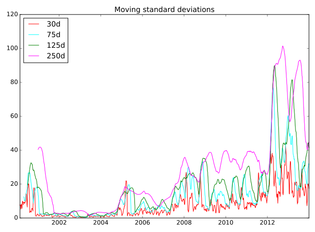
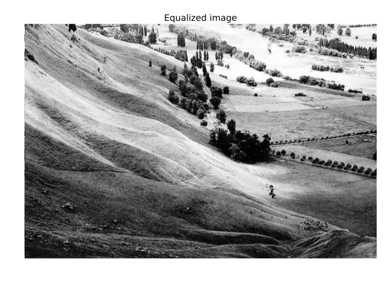

# Chapter 04: Analyzing Time Series and Images

## 01. Multiple time series on common axes
For this exercise, you will construct a plot showing four time series stocks on the same axes. The time series in question are represented in the session using the identifiers `aapl`, `ibm`, csco, and msft. You'll generate a single plot showing all the time series on common axes with a legend.

### Instructions:
* Plot the `aapl` time series in blue with a label of 'AAPL'.
* Plot the `ibm` time series in green with a label of 'IBM'.
* Plot the csco time series in red with a label of 'CSCO'.
* Plot the msft time series in magenta with a label of 'MSFT'.
* Specify a rotation of 60 for the xticks with plt.xticks().
* Add a legend in the 'upper left' corner of the plot.

#### Script:
```
# Import matplotlib.pyplot
from matplotlib import pyplot as plt

# Plot the aapl time series in blue
plt.plot(aapl, color='blue', label='AAPL')

# Plot the ibm time series in green
plt.plot(ibm, color='green', label='IBM')

# Plot the csco time series in red
plt.plot(csco, color='red', label='CSCO')

# Plot the msft time series in magenta
plt.plot(msft, color='magenta', label='MSFT')

# Add a legend in the top left corner of the plot
plt.legend(loc='upper left')

# Specify the orientation of the xticks
plt.xticks(rotation=60)

# Display the plot
plt.show()

```

#### Output:
```
In [1]: aapl.head()
Out[1]: 
Date
2000-01-03    111.937502
2000-01-04    102.500003
2000-01-05    103.999997
2000-01-06     94.999998
2000-01-07     99.500001
Name: AAPL, dtype: float64

In [2]: ibm.head()
Out[2]: 
Date
2000-01-03    116.0000
2000-01-04    112.0625
2000-01-05    116.0000
2000-01-06    114.0000
2000-01-07    113.5000
Name: IBM, dtype: float64

In [3]: csco.head()
Out[3]: 
Date
2000-01-03    108.0625
2000-01-04    102.0000
2000-01-05    101.6875
2000-01-06    100.0000
2000-01-07    105.8750
Name: CSCO, dtype: float64

In [4]: msft.head()
Out[4]: 
Date
2000-01-03    116.5625
2000-01-04    112.6250
2000-01-05    113.8125
2000-01-06    110.0000
2000-01-07    111.4375
Name: MSFT, dtype: float64

In [5]: 
```


#### Comment:
Great work! It looks like 'AAPL' has done particularly well in recent years!

## 02. Multiple time series slices (1)
You can easily slice subsets corresponding to different time intervals from a time series. In particular, you can use strings like `'2001:2005'`, `'2011-03:2011-12'`, or '2010-04-19:2010-04-30' to extract data from time intervals of length 5 years, 10 months, or 12 days respectively.

* Unlike slicing from standard Python lists, tuples, and strings, when slicing time series by labels (and other pandas Series & DataFrames by labels), the slice includes the right-most portion of the slice. That is, extracting my_time_series['1990':'1995'] extracts data from my_time_series corresponding to 1990, 1991, 1992, 1993, 1994, and 1995 inclusive.
* You can use partial strings or datetime objects for indexing and slicing from time series.
For this exercise, you will use time series slicing to plot the time series aapl over its full 11-year range and also over a shorter 2-year range. You'll arrange these plots in a 2×1 grid of subplots

### Instructions:
* Plot the series `aapl` in `'blue'` in the top subplot of a vertically-stacked pair of subplots, with the xticks rotated to 45 degrees.
* Extract a slice named view from the series aapl containing data from the years 2007 to 2008 (inclusive). This has been done for you.
* Plot the slice view in black in the bottom subplot.

#### Script:
```
# Plot the series in the top subplot in blue
plt.subplot(2,1,1)
plt.xticks(rotation=45)
plt.title('AAPL: 2001 to 2011')
plt.plot(aapl, color='blue')

# Slice aapl from '2007' to '2008' inclusive: view
view = aapl['2007':'2008']

# Plot the sliced data in the bottom subplot in black
plt.subplot(2,1,2)
plt.xticks(rotation=45)
plt.title('AAPL: 2007 to 2008')
plt.plot(view, color='black')
plt.tight_layout()
plt.show()

```
#### Output:


#### Comment:
Fantastic! Plotting time series at different intervals can provide you with deeper insight into your data. Here, for example, you can see that the AAPL stock price rose and fell a great amount between 2007 and 2008.

## 03. Multiple time series slices (2)
In this exercise, you will use the same time series aapl from the previous exercise and plot tighter views of the data.

* Partial string indexing works without slicing as well. For instance, using `my_time_series['1995']`, `my_time_series['1999-05']`, and my_time_series['2000-11-04'] respectively extracts views of the time series my_time_series corresponding to the entire year 1995, the entire month May 1999, and the entire day November 4, 2000.

### Instructions:
* Extract a slice named `view` from the series `aapl` containing data from November 2007 to April 2008 (inclusive). This has been done for you.
* Plot the slice view in 'red' in the top subplot of a vertically-stacked pair of subplots with the xticks rotated to 45 degrees.
* Reassign the slice view to contain data from the series aapl for January 2008. This has been done for you.
* Plot the slice view in 'green' in the bottom subplot with the xticks rotated to 45 degrees.

#### Script:
```
# Slice aapl from Nov. 2007 to Apr. 2008 inclusive: view
view = aapl['2007-11':'2008-04']

# Plot the sliced series in the top subplot in red
plt.subplot(2, 1, 1)
plt.plot(view, color='red')
plt.title('AAPL: Nov. 2007 to Apr. 2008')
plt.xticks(rotation=45)

# Reassign the series by slicing the month January 2008
view = aapl['2008-01']

# Plot the sliced series in the bottom subplot in green
plt.subplot(2, 1, 2)
plt.plot(view, color='green')
plt.title('AAPL: Jan. 2008')
plt.xticks(rotation=45)

# Improve spacing and display the plot
plt.tight_layout()
plt.show()
```
#### Output:


#### Comment:
Great work!

## 04. Plotting an inset view
Remember, rather than comparing plots with subplots or overlayed plots, you can generate an inset view directly using `plt.axes()`. In this exercise, you'll reproduce two of the time series plots from the preceding two exercises. Your figure will contain an inset plot to highlight the dramatic changes in AAPL stock price between November 2007 and April 2008 (as compared to the 11 years from 2001 to 2011).

### Instructions:
* Extract a slice of series `aapl` from November 2007 to April 2008 inclusive. This has been done for you.
* Plot the entire series `aapl`.
* Create a set of axes with lower left corner (0.25, 0.5), width 0.35, and height 0.35. Pass these coordinates to plt.axes() as a list (all in units relative to the figure dimensions).
* Plot the sliced view in the current axes in 'red'

#### Script:
```
# Slice aapl from Nov. 2007 to Apr. 2008 inclusive: view
view = aapl['2007-11':'2008-04']

# Plot the entire series 
plt.plot(aapl)
plt.xticks(rotation=45)
plt.title('AAPL: 2001-2011')

# Specify the axes
plt.axes([0.25, 0.5, 0.35, 0.35])

# Plot the sliced series in red using the current axes
plt.plot(view, color='red')
plt.xticks(rotation=45)
plt.title('2007/11-2008/04')
plt.show()
```
#### Output:


#### Comment:
Well done! Inset views are a useful way of comparing time series data.

## 05. Plotting moving averages
In this exercise, you will plot pre-computed moving averages of AAPL stock prices in distinct subplots.

* The time series aapl is overlayed in black in each subplot for comparison.
* The time series `mean_30`, `mean_75`, mean_125, and mean_250 have been computed for you (containing the windowed averages of the series aapl computed over windows of width 30 days, 75 days, 125 days, and 250 days respectively).

### Instructions:
* In the top left subplot, plot the 30-day moving averages series `mean_30` in 'green'.
* In the top right subplot, plot the 75-day moving averages series `mean_75` in 'red'.
* In the bottom left subplot, plot the 125-day moving averages series mean_125 in 'magenta'.
* In the bottom right subplot, plot the 250-day moving averages series mean_250 in 'cyan'.

#### Script:
```
# read about moving average here: https://chrisalbon.com/python/data_wrangling/pandas_moving_average/
# Plot the 30-day moving average in the top left subplot in green
plt.subplot(2, 2, 1)
plt.plot(mean_30, color='green')
plt.plot(aapl, 'k-.')
plt.xticks(rotation=60)
plt.title('30d averages')

# Plot the 75-day moving average in the top right subplot in red
plt.subplot(2,2, 2)
plt.plot(mean_75, color='red')
plt.plot(aapl, 'k-.')
plt.xticks(rotation=60)
plt.title('75d averages')

# Plot the 125-day moving average in the bottom left subplot in magenta
plt.subplot(2, 2, 3)
plt.plot(mean_125, color='magenta')
plt.plot(aapl, 'k-.')
plt.xticks(rotation=60)
plt.title('125d averages')

# Plot the 250-day moving average in the bottom right subplot in cyan
plt.subplot(2, 2, 4)
plt.plot(mean_250, color='cyan')
plt.plot(aapl, 'k-.')
plt.xticks(rotation=60)
plt.title('250d averages')

# Display the plot
plt.show()
```
#### Output:


#### Comment:
Great work!

## 06. Plotting moving standard deviations
Having plotted pre-computed moving averages of AAPL stock prices on distinct subplots in the previous exercise, you will now plot pre-computed moving standard deviations of the same stock prices, this time together on common axes.

* The time series aapl is not plotted in this case; it is of a different length scale than the standard deviations.
* The time series `std_30`, `std_75`, stdn_125, & std_250 have been computed for you (containing the windowed standard deviations of the series aapl computed over windows of width 30 days, 75 days, 125 days, & 250 days respectively).

### Instructions:
* Produce a single plot with four curves overlayed:
* the series `std_30` in `'red'` (with corresponding label `'30d'`).
* the series std_75 in 'cyan' (with corresponding label '75d').
* the series std_125 in 'green' (with corresponding label '125d').
* the series std_250 in 'magenta' (with corresponding label '250d').
* Add a legend to the 'upper left' corner of the plot.

#### Script:
```
# Plot std_30 in red
plt.plot(std_30, color='red', label='30d')

# Plot std_75 in cyan
plt.plot(std_75, color='cyan', label='75d')

# Plot std_125 in green
plt.plot(std_125, color='green', label='125d')

# Plot std_250 in magenta
plt.plot(std_250, color='magenta', label='250d')

# Add a legend to the upper left
plt.legend(loc='upper left')

# Add a title
plt.title('Moving standard deviations')

# Display the plot
plt.show()
```
#### Output:


#### Comment:
Great work!

## 07. Interpreting moving statistics
In the previous exercise, you generated the plot below.


What length is the moving window that most consistently produces the greatest variance (standard deviation) in the AAPL stock price over the time interval shown?

### Possible Answers
* 30 days
* 75 days
* 125 days
* 250 days

#### Answer:
4

#### Comment:
Exactly! Wider moving windows admit greater variability!


## 08. Extracting a histogram from a grayscale image
For grayscale images, various image processing algorithms use an image histogram. Recall that an image is a two-dimensional array of numerical intensities. An image histogram, then, is computed by counting the occurences of distinct pixel intensities over all the pixels in the image.

For this exercise, you will load <a href="https://commons.wikimedia.org/wiki/File:Unequalized_Hawkes_Bay_NZ.jpg">an unequalized low contrast image of Hawkes Bay, New Zealand</a> (originally by Phillip Capper, modified by User:Konstable, via Wikimedia Commons, <a href="http://creativecommons.org/licenses/by/2.0>"CC BY 2.0</a>). You will plot the image and use the pixel intensity values to plot a normalized histogram of pixel intensities.

### Instructions:
* Load data from the file '640px-Unequalized_Hawkes_Bay_NZ.jpg' into an array.
* Display image with a color map of 'gray' in the top subplot.
* Flatten image into a 1-D array using the .flatten() method.
* Display a histogram of pixels in the bottom subplot.
* Use histogram options bins=64, range=(0,256), and normed=True to control numerical binning and the vertical scale.
* Use plotting options `color='red'` and `alpha=0.4` to tailor the color and transparency.

#### Script:
```
# Load the image into an array: image
image = plt.imread('640px-Unequalized_Hawkes_Bay_NZ.jpg')

# Display image in top subplot using color map 'gray'
plt.subplot(2,1,1)
plt.title('Original image')
plt.axis('off')
plt.imshow(image, cmap='gray')

# Flatten the image into 1 dimension: pixels
pixels = image.flatten()

# Display a histogram of the pixels in the bottom subplot
plt.subplot(2,1,2)
plt.xlim((0,255))
plt.title('Normalized histogram')
plt.hist(pixels, bins=64, range=(0, 256), normed=True, color='red', alpha=0.4)

# Display the plot
plt.show()
```
#### Output:


#### Comment:
Well done! Image histograms are an important component of many image processing algorithms.

## 09. Cumulative Distribution Function from an image histogram
A histogram of a continuous random variable is sometimes called a Probability Distribution Function (or PDF). The area under a PDF (a definite integral) is called a Cumulative Distribution Function (or CDF). The CDF quantifies the probability of observing certain pixel intensities.

Your task here is to plot the PDF and CDF of pixel intensities from a grayscale image. You will use the <a href="https://commons.wikimedia.org/wiki/File:Unequalized_Hawkes_Bay_NZ.jpg">grayscale image of Hawkes Bay, New Zealand</a> (originally by Phillip Capper, modified by User:Konstable, via Wikimedia Commons, <a href="http://creativecommons.org/licenses/by/2.0">CC BY 2.0</a>). This time, the 2D array image will be pre-loaded and pre-flattened into the 1D array pixels for you.

* The histogram option cumulative=True permits viewing the CDF instead of the PDF.
* Notice that `plt.grid('off')` switches off distracting grid lines.
* The command `plt.twinx()` allows two plots to be overlayed sharing the x-axis but with different scales on the y-axis.

### Instructions:
* First, use `plt.hist()` to plot the histogram of the 1-D array `pixels` in the bottom subplot.
* Use the histogram options bins=64, range=(0,256), and normed=False.
* Use the plotting options alpha=0.4 and color='red' to make the overlayed plots easier to see.
* Second, use plt.twinx() to overlay plots with different vertical scales on a common horizontal axis.
* Third, call plt.hist() again to overlay the CDF in the bottom subplot.
* Use the histogram options bins=64, range=(0,256), and normed=True.
* This time, also use cumulative=True to compute and display the CDF.
* Also, use alpha=0.4 and color='blue' to make the overlayed plots easier to see.

#### Script:
```
# Load the image into an array: image
image = plt.imread('640px-Unequalized_Hawkes_Bay_NZ.jpg')

# Display image in top subplot using color map 'gray'
plt.subplot(2,1,1)
plt.imshow(image, cmap='gray')
plt.title('Original image')
plt.axis('off')

# Flatten the image into 1 dimension: pixels
pixels = image.flatten()

# Display a histogram of the pixels in the bottom subplot
plt.subplot(2,1,2)
pdf = plt.hist(pixels, bins=64, range=(0,256), normed=False, color='red', alpha=0.4)
plt.grid('off')

# Use plt.twinx() to overlay the CDF in the bottom subplot
plt.twinx()

# Display a cumulative histogram of the pixels
cdf = plt.hist(pixels, bins=64, range=(0,256),
               normed=True, cumulative=True,
               color='blue', alpha=0.4)
               
# Specify x-axis range, hide axes, add title and display plot
plt.xlim((0,256))
plt.grid('off')
plt.title('PDF & CDF (original image)')
plt.show()
```
#### Output:


#### Comment:
Great work! Notice that the histogram is not well centered over the range of possible pixel intensies. The CDF rises sharply near the middle (that relates to the overall grayness of the image).

## 10. Equalizing an image histogram
<a href="https://en.wikipedia.org/wiki/Histogram_equalization">Histogram equalizationa</a> is an image processing procedure that reassigns image pixel intensities. The basic idea is to use interpolation to map the original CDF of pixel intensities to a CDF that is almost a straight line. In essence, the pixel intensities are spread out and this has the practical effect of making a sharper, contrast-enhanced image. This is particularly useful in astronomy and medical imaging to help us see more features.

For this exercise, you will again work with the <a href="https://commons.wikimedia.org/wiki/File:Unequalized_Hawkes_Bay_NZ.jpg">grayscale image of Hawkes Bay, New Zealand</a> (originally by Phillip Capper, modified by User:Konstable, via Wikimedia Commons, <a href="http://creativecommons.org/licenses/by/2.0">CC BY 2.0</a>). Notice the sample code produces the same plot as the previous exercise. Your task is to modify the code from the previous exercise to plot the new equalized image as well as its PDF and CDF.

* The arrays `image` and `pixels` are extracted for you in advance.
* The CDF of the original image is computed using plt.hist().
* Notice an array new_pixels is created for you that interpolates new pixel values using the original image CDF.

### Instructions:
* Use the NumPy array method .reshape() to create a 2-D array new_image from the 1-D array new_pixels. The resulting new_image should have the same shape as image.shape.
* Display new_image with a 'gray' color map to display the sharper, equalized image.
* Plot the PDF of new_pixels in 'red'.
* Use plt.twinx() to overlay plots with different vertical scales on a common horizontal axis.
* Plot the CDF of `new_pixels` in `'blue'`.

#### Script:
```
# Load the image into an array: image
image = plt.imread('640px-Unequalized_Hawkes_Bay_NZ.jpg')

# Flatten the image into 1 dimension: pixels
pixels = image.flatten()

# Generate a cumulative histogram
cdf, bins, patches = plt.hist(pixels, bins=256, range=(0,256), normed=True, cumulative=True)
new_pixels = np.interp(pixels, bins[:-1], cdf*255)

# Reshape new_pixels as a 2-D array: new_image
new_image = new_pixels.reshape(427, 640)

# Display the new image with 'gray' color map
plt.subplot(2,1,1)
plt.title('Equalized image')
plt.axis('off')
plt.imshow(new_image, cmap='gray')

# Generate a histogram of the new pixels
plt.subplot(2,1,2)
pdf = plt.hist(new_pixels, bins=64, range=(0,256), normed=False, color='red', alpha=0.4)
plt.grid('off')

# Use plt.twinx() to overlay the CDF in the bottom subplot
plt.twinx()
plt.xlim((0,256))
plt.grid('off')

# Add title
plt.title('PDF & CDF (equalized image)')

# Generate a cumulative histogram of the new pixels
cdf = plt.hist(new_pixels, bins=64, range=(0,256),
               cumulative=True, normed=True,
               color='blue', alpha=0.4)
plt.show()
```

#### Output:
```
In [13]: image
Out[13]: 
array([[151, 141, 145, ..., 170, 176, 174],
       [160, 143, 134, ..., 148, 150, 147],
       [140, 146, 148, ..., 140, 145, 143],
       ...,
       [146, 130, 136, ..., 146, 146, 143],
       [142, 127, 134, ..., 146, 146, 143],
       [140, 124, 133, ..., 146, 146, 143]], dtype=uint8)
```
```
In [30]: image.shape
Out[30]: (427, 640)
```

```
In [15]: pixels
Out[15]: array([151, 141, 145, ..., 146, 146, 143], dtype=uint8)
```

```
In [2]: pixels.shape
Out[2]: (273280,)
```
```
In [22]: cdf
Out[22]: 
array([0.00000000e+00, 0.00000000e+00, 0.00000000e+00, 0.00000000e+00,
       0.00000000e+00, 0.00000000e+00, 0.00000000e+00, 0.00000000e+00,
       0.00000000e+00, 0.00000000e+00, 0.00000000e+00, 0.00000000e+00,
       0.00000000e+00, 0.00000000e+00, 0.00000000e+00, 0.00000000e+00,
       0.00000000e+00, 0.00000000e+00, 0.00000000e+00, 0.00000000e+00,
       0.00000000e+00, 0.00000000e+00, 0.00000000e+00, 0.00000000e+00,
       0.00000000e+00, 0.00000000e+00, 0.00000000e+00, 0.00000000e+00,
       0.00000000e+00, 0.00000000e+00, 0.00000000e+00, 0.00000000e+00,
       0.00000000e+00, 0.00000000e+00, 0.00000000e+00, 0.00000000e+00,
       0.00000000e+00, 0.00000000e+00, 0.00000000e+00, 0.00000000e+00,
       0.00000000e+00, 0.00000000e+00, 0.00000000e+00, 0.00000000e+00,
       0.00000000e+00, 0.00000000e+00, 0.00000000e+00, 0.00000000e+00,
       0.00000000e+00, 0.00000000e+00, 0.00000000e+00, 0.00000000e+00,
       0.00000000e+00, 0.00000000e+00, 0.00000000e+00, 0.00000000e+00,
       0.00000000e+00, 0.00000000e+00, 0.00000000e+00, 0.00000000e+00,
       0.00000000e+00, 0.00000000e+00, 0.00000000e+00, 0.00000000e+00,
       0.00000000e+00, 0.00000000e+00, 0.00000000e+00, 0.00000000e+00,
       0.00000000e+00, 0.00000000e+00, 0.00000000e+00, 0.00000000e+00,
       0.00000000e+00, 0.00000000e+00, 0.00000000e+00, 0.00000000e+00,
       0.00000000e+00, 0.00000000e+00, 0.00000000e+00, 0.00000000e+00,
       0.00000000e+00, 0.00000000e+00, 0.00000000e+00, 0.00000000e+00,
       0.00000000e+00, 0.00000000e+00, 0.00000000e+00, 0.00000000e+00,
       0.00000000e+00, 0.00000000e+00, 0.00000000e+00, 0.00000000e+00,
       0.00000000e+00, 0.00000000e+00, 0.00000000e+00, 0.00000000e+00,
       0.00000000e+00, 0.00000000e+00, 0.00000000e+00, 0.00000000e+00,
       0.00000000e+00, 0.00000000e+00, 0.00000000e+00, 0.00000000e+00,
       3.65925059e-06, 3.65925059e-06, 1.09777518e-05, 2.56147541e-05,
       3.65925059e-05, 4.39110070e-05, 6.58665105e-05, 1.09777518e-04,
       1.97599532e-04, 2.85421546e-04, 4.02517564e-04, 5.70843091e-04,
       8.12353630e-04, 1.17096019e-03, 1.63202576e-03, 2.28337237e-03,
       3.38480679e-03, 4.87778103e-03, 6.95257611e-03, 9.67505855e-03,
       1.33489461e-02, 1.75387881e-02, 2.28264052e-02, 2.89739461e-02,
       3.64132026e-02, 4.64322307e-02, 5.87639052e-02, 7.38766101e-02,
       9.31864754e-02, 1.16382465e-01, 1.43501171e-01, 1.74568208e-01,
       2.09459163e-01, 2.48902225e-01, 2.88264783e-01, 3.25237851e-01,
       3.59323770e-01, 3.92099678e-01, 4.23375293e-01, 4.53337237e-01,
       4.81831821e-01, 5.09843384e-01, 5.36651054e-01, 5.63722190e-01,
       5.90039520e-01, 6.15453015e-01, 6.40635978e-01, 6.65533519e-01,
       6.89940720e-01, 7.14172278e-01, 7.37090164e-01, 7.57739315e-01,
       7.75903835e-01, 7.93197453e-01, 8.08709016e-01, 8.23071575e-01,
       8.36157055e-01, 8.48378952e-01, 8.59982436e-01, 8.70897980e-01,
       8.80810890e-01, 8.89340603e-01, 8.97043326e-01, 9.04259368e-01,
       9.10867974e-01, 9.16741071e-01, 9.22065281e-01, 9.26997951e-01,
       9.31561036e-01, 9.35703308e-01, 9.39874854e-01, 9.43365779e-01,
       9.46567623e-01, 9.49304742e-01, 9.51928425e-01, 9.54361827e-01,
       9.56553718e-01, 9.58445550e-01, 9.60289813e-01, 9.62243852e-01,
       9.64278396e-01, 9.66280006e-01, 9.68296253e-01, 9.70575966e-01,
       9.73071575e-01, 9.75395199e-01, 9.77462676e-01, 9.79691159e-01,
       9.81765954e-01, 9.83913934e-01, 9.86028981e-01, 9.88326991e-01,
       9.91166569e-01, 9.94397687e-01, 9.96318794e-01, 9.97467799e-01,
       9.98287471e-01, 9.98682670e-01, 9.99033958e-01, 9.99227898e-01,
       9.99355972e-01, 9.99513320e-01, 9.99619438e-01, 9.99696282e-01,
       9.99762149e-01, 9.99817037e-01, 9.99828015e-01, 9.99864608e-01,
       9.99871926e-01, 9.99893882e-01, 9.99919496e-01, 9.99934133e-01,
       9.99941452e-01, 9.99952430e-01, 9.99956089e-01, 9.99959748e-01,
       9.99967067e-01, 9.99970726e-01, 9.99974385e-01, 9.99981704e-01,
       9.99981704e-01, 9.99985363e-01, 9.99989022e-01, 9.99989022e-01,
       9.99992681e-01, 9.99996341e-01, 1.00000000e+00, 1.00000000e+00,
       1.00000000e+00, 1.00000000e+00, 1.00000000e+00, 1.00000000e+00,
       1.00000000e+00, 1.00000000e+00, 1.00000000e+00, 1.00000000e+00,
       1.00000000e+00, 1.00000000e+00, 1.00000000e+00, 1.00000000e+00,
       1.00000000e+00, 1.00000000e+00, 1.00000000e+00, 1.00000000e+00,
       1.00000000e+00, 1.00000000e+00, 1.00000000e+00, 1.00000000e+00,
       1.00000000e+00, 1.00000000e+00, 1.00000000e+00, 1.00000000e+00])
```
```
In [23]: bins
Out[23]: 
array([  0.,   1.,   2.,   3.,   4.,   5.,   6.,   7.,   8.,   9.,  10.,
        11.,  12.,  13.,  14.,  15.,  16.,  17.,  18.,  19.,  20.,  21.,
        22.,  23.,  24.,  25.,  26.,  27.,  28.,  29.,  30.,  31.,  32.,
        33.,  34.,  35.,  36.,  37.,  38.,  39.,  40.,  41.,  42.,  43.,
        44.,  45.,  46.,  47.,  48.,  49.,  50.,  51.,  52.,  53.,  54.,
        55.,  56.,  57.,  58.,  59.,  60.,  61.,  62.,  63.,  64.,  65.,
        66.,  67.,  68.,  69.,  70.,  71.,  72.,  73.,  74.,  75.,  76.,
        77.,  78.,  79.,  80.,  81.,  82.,  83.,  84.,  85.,  86.,  87.,
        88.,  89.,  90.,  91.,  92.,  93.,  94.,  95.,  96.,  97.,  98.,
        99., 100., 101., 102., 103., 104., 105., 106., 107., 108., 109.,
       110., 111., 112., 113., 114., 115., 116., 117., 118., 119., 120.,
       121., 122., 123., 124., 125., 126., 127., 128., 129., 130., 131.,
       132., 133., 134., 135., 136., 137., 138., 139., 140., 141., 142.,
       143., 144., 145., 146., 147., 148., 149., 150., 151., 152., 153.,
       154., 155., 156., 157., 158., 159., 160., 161., 162., 163., 164.,
       165., 166., 167., 168., 169., 170., 171., 172., 173., 174., 175.,
       176., 177., 178., 179., 180., 181., 182., 183., 184., 185., 186.,
       187., 188., 189., 190., 191., 192., 193., 194., 195., 196., 197.,
       198., 199., 200., 201., 202., 203., 204., 205., 206., 207., 208.,
       209., 210., 211., 212., 213., 214., 215., 216., 217., 218., 219.,
       220., 221., 222., 223., 224., 225., 226., 227., 228., 229., 230.,
       231., 232., 233., 234., 235., 236., 237., 238., 239., 240., 241.,
       242., 243., 244., 245., 246., 247., 248., 249., 250., 251., 252.,
       253., 254., 255., 256.])
```
```
In [29]: new_pixels
Out[29]: 
array([169.71104728,  99.98541789, 130.01006294, ..., 136.84601874,
       136.84601874, 115.60099532])
```

<br />
<br />
<b> new image pixel histogram </b>  <br />

<br />
<br />
<b> new image pixel cdf histogram </b>  <br />

<br />
<br />
<b> final output </b>  <br />


#### Comment:
Excellent work! Histogram equalization can help make an image sharper.

## 11. Extracting histograms from a color image
This exercise resembles the last in that you will plot histograms from an image. This time, you will use <a href="http://imgsrc.hubblesite.org/hu/db/images/hs-2004-32-b-small_web.jpg">a color image of the Helix Nebula as seen by the Hubble and the Cerro Toledo Inter-American Observatory</a>. The separate RGB (red-green-blue) channels will be extracted for you as two-dimensional arrays `red`, `green`, and blue respectively. You will plot three overlaid color histograms on common axes (one for each channel) in a subplot as well as the original image in a separate subplot.

### Instructions:
* Display image in the top subplot of a 2×1 subplot grid. Don't use a colormap here.
* Flatten the 2-D arrays red, green, and blue into 1-D arrays.
* Display three histograms in the bottom subplot: one for `red_pixels`, one for `green_pixels`, and one for blue_pixels. For each, use 64 bins and specify a translucency of alpha=0.2.

#### Script:
```
# Load the image into an array: image
image = plt.imread('hs-2004-32-b-small_web.jpg')

# Display image in top subplot
plt.subplot(2,1,1)
plt.title('Original image')
plt.axis('off')
plt.imshow(image)

# Extract 2-D arrays of the RGB channels: red, blue, green
red, green, blue = image[:,:,0], image[:,:,1], image[:,:,2]

# Flatten the 2-D arrays of the RGB channels into 1-D
red_pixels = red.flatten()
blue_pixels = blue.flatten()
green_pixels = green.flatten()

# Overlay histograms of the pixels of each color in the bottom subplot
plt.subplot(2,1,2)
plt.title('Histograms from color image')
plt.xlim((0,256))
plt.hist(red_pixels, bins=64, normed=True, color='red', alpha=0.2)
plt.hist(blue_pixels, bins=64, normed=True, color='blue', alpha=0.2)
plt.hist(green_pixels, bins=64, normed=True, color='green', alpha=0.2)

# Display the plot
plt.show()

```

#### Output:
```
In [4]: image
Out[4]: 
array([[[135,  40,  36],
        [131,  36,  30],
        [124,  29,  23],
        ...,
        [ 28,   5,  11],
        [ 27,   6,  11],
        [ 27,   6,  11]],

       [[123,  30,  25],
        [121,  28,  23],
        [117,  24,  17],
        ...,
        [ 29,   6,  12],
        [ 28,   5,  11],
        [ 27,   6,  11]],

       [[108,  17,  14],
        [107,  16,  11],
        [108,  17,  12],
        ...,
        [ 30,   8,  11],
        [ 29,   7,  10],
        [ 29,   7,  10]],

       ...,

       [[ 32,   8,   8],
        [ 32,   8,   8],
        [ 32,   8,   8],
        ...,
        [ 33,   7,  16],
        [ 38,   8,  18],
        [ 39,   9,  19]],

       [[ 30,   9,   8],
        [ 30,   9,   8],
        [ 30,   9,   8],
        ...,
        [ 33,   7,  16],
        [ 38,   8,  18],
        [ 40,  10,  20]],

       [[ 29,   8,   7],
        [ 29,   8,   7],
        [ 29,   8,   7],
        ...,
        [ 33,   7,  16],
        [ 39,   9,  19],
        [ 40,  10,  20]]], dtype=uint8)
```
```
In [9]: image.shape
Out[9]: (200, 200, 3)
```
<br />
<br /> 
<b> Original Image of Helix </b>


```
In [10]: red
Out[10]: 
array([[135, 131, 124, ...,  28,  27,  27],
       [123, 121, 117, ...,  29,  28,  27],
       [108, 107, 108, ...,  30,  29,  29],
       ...,
       [ 32,  32,  32, ...,  33,  38,  39],
       [ 30,  30,  30, ...,  33,  38,  40],
       [ 29,  29,  29, ...,  33,  39,  40]], dtype=uint8)

In [11]: green
Out[11]: 
array([[40, 36, 29, ...,  5,  6,  6],
       [30, 28, 24, ...,  6,  5,  6],
       [17, 16, 17, ...,  8,  7,  7],
       ...,
       [ 8,  8,  8, ...,  7,  8,  9],
       [ 9,  9,  9, ...,  7,  8, 10],
       [ 8,  8,  8, ...,  7,  9, 10]], dtype=uint8)

In [12]: blue
Out[12]: 
array([[36, 30, 23, ..., 11, 11, 11],
       [25, 23, 17, ..., 12, 11, 11],
       [14, 11, 12, ..., 11, 10, 10],
       ...,
       [ 8,  8,  8, ..., 16, 18, 19],
       [ 8,  8,  8, ..., 16, 18, 20],
       [ 7,  7,  7, ..., 16, 19, 20]], dtype=uint8)
```


#### Comment:
Excellent work! Notice how the histogram generated from this color image differs from the histogram you generated earlier from a grayscale image.

## 12. Extracting bivariate histograms from a color image
Rather than overlaying univariate histograms of intensities in distinct channels, it is also possible to view the joint variation of pixel intensity in two different channels.

For this final exercise, you will use the same <a href="http://imgsrc.hubblesite.org/hu/db/images/hs-2004-32-b-small_web.jpg">color image of the Helix Nebula as seen by the Hubble and the Cerro Toledo Inter-American Observatory</a>. The separate RGB (red-green-blue) channels will be extracted for you as one-dimensional arrays `red_pixels`, `green_pixels`, & blue_pixels respectively.

### Instructions:
* Make a 2-D histogram in the top left subplot showing the joint variation of `red_pixels` (on the x-axis) and green_pixels (on the y-axis). Use bins=(32,32) to control binning.
* Make a 2-D histogram in the top right subplot showing the joint variation of `green_pixels` (on the x-axis) and blue_pixels (on the y-axis). Use bins=(32,32) to control binning.
* Make a 2-D histogram in the bottom left subplot showing the joint variation of `blue_pixels` (on the x-axis) and red_pixels (on the y-axis). Use bins=(32,32) to control binning.

#### Script:
```
# Load the image into an array: image
image = plt.imread('hs-2004-32-b-small_web.jpg')

# Extract RGB channels and flatten into 1-D array
red, blue, green = image[:,:,0], image[:,:,1], image[:,:,2]
red_pixels = red.flatten()
blue_pixels = blue.flatten()
green_pixels = green.flatten()

# Generate a 2-D histogram of the red and green pixels
plt.subplot(2,2,1)
plt.grid('off') 
plt.xticks(rotation=60)
plt.xlabel('red')
plt.ylabel('green')
plt.hist2d(red_pixels, green_pixels, bins=(32,32))

# Generate a 2-D histogram of the green and blue pixels
plt.subplot(2,2,2)
plt.grid('off')
plt.xticks(rotation=60)
plt.xlabel('green')
plt.ylabel('blue')
plt.hist2d(green_pixels, blue_pixels, bins=(32,32))

# Generate a 2-D histogram of the blue and red pixels
plt.subplot(2,2,3)
plt.grid('off')
plt.xticks(rotation=60)
plt.xlabel('blue')
plt.ylabel('red')
plt.hist2d(blue_pixels, red_pixels, bins=(32,32))

# Display the plot
plt.show()
```
#### Output:


#### Comment:
Brilliant work, and well done - you've reached the end of the course!
