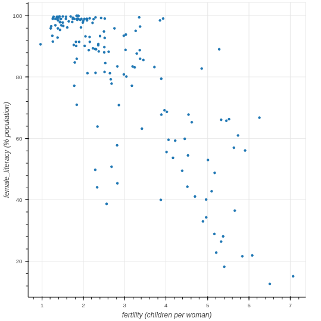
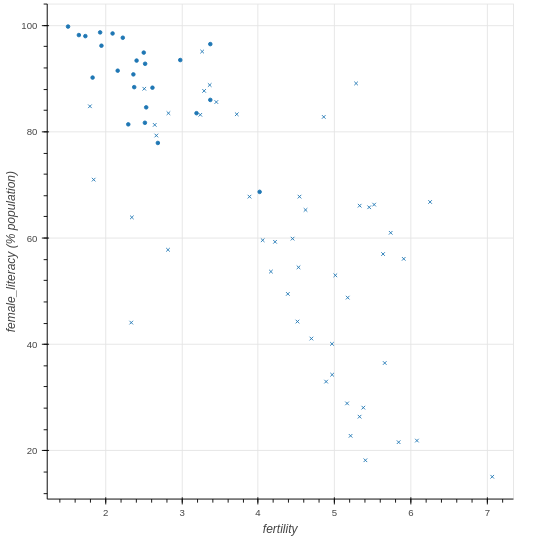
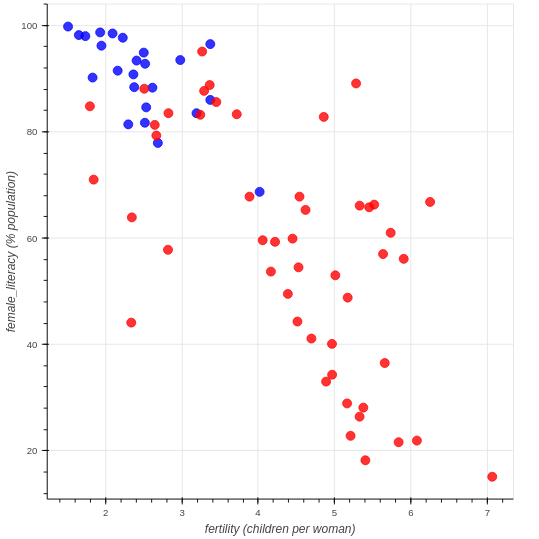

# Chapter 01: Basic Plotting with Bokeh

## 01. What are glyphs?
In Bokeh, visual properties of shapes are called glyphs. The visual properties of these glyphs such as position or color can be assigned single values, for example `x=10` or `fill_color='red'`.

What other kinds of values can glyph properties be set to in normal usage?

### Possible Answers
* Dictionaries
** press 1
* Sequences (lists, arrays)
** press 2
* Sets
** press 3

#### Answer:
2

#### Comment:
Correct. Multiple glyphs can be drawn by setting glyph properties to ordered sequences of values.

## 02. A simple scatter plot
In this example, you're going to make a scatter plot of female literacy vs fertility using data from the <a href="http://www.eea.europa.eu/data-and-maps/figures/correlation-between-fertility-and-female-education">European Environmental Agency</a>. This dataset highlights that countries with low female literacy have high birthrates. The x-axis data has been loaded for you as fertility and the y-axis data has been loaded as female_literacy.

Your job is to create a figure, assign x-axis and y-axis labels, and plot `female_literacy` vs `fertility` using the circle glyph.

After you have created the figure, in this exercise and the ones to follow, play around with it! Explore the different options available to you on the tab to the right, such as "Pan", "Box Zoom", and "Wheel Zoom". You can click on the question mark sign for more details on any of these tools.

Note: You may have to scroll down to view the lower portion of the figure.

### Instructions:
* Import the `figure` function from `bokeh.plotting`, and the output_file and show functions from bokeh.io.
* Create the figure p with figure(). It has two parameters: x_axis_label and y_axis_label.
8 Add a circle glyph to the figure p using the function p.circle() where the inputs are, in order, the x-axis data and y-axis data.
* Use the output_file() function to specify the name 'fert_lit.html' for the output file.
* Create and display the output file using show() and passing in the figure p.

#### Script:
```
# 1. Import figure from bokeh.plotting
from bokeh.plotting import figure

# 2. Import output_file and show from bokeh.io
from bokeh.io import output_file, show

# 3. instantiate the figure: let's say p
p = figure(x_axis_label='fertility (children per woman)', y_axis_label='female_literacy (% population)')

# 4. add glyph to the figure p
# p.circle(x, y, size, fill_color)
# p.line(x, y, line_width)
p.circle(fertility, female_literacy)

# 5. Call the output_file() function and specify the name of the file
output_file('fert_lit.html')

# 6. Display the plot
show(p)
```
#### Output:


#### Comment:
Great work! Be sure to experiment with the panning and zooming options Bokeh provides.

## 03. A scatter plot with different shapes
By calling multiple glyph functions on the same figure object, we can overlay multiple data sets in the same figure.

In this exercise, you will plot female literacy vs fertility for two different regions, Africa and Latin America. Each set of x and y data has been loaded separately for you as fertility_africa, female_literacy_africa, fertility_latinamerica, and female_literacy_latinamerica.

Your job is to plot the Latin America data with the `circle()` glyph, and the Africa data with the `x()` glyph.

figure has already been imported for you from bokeh.plotting.

### Instructions:
* Create the figure `p` with the `figure()` function. It has two parameters: x_axis_label and y_axis_label.
* Add a circle glyph to the figure p using the function p.circle() where the inputs are the x and y data from Latin America: fertility_latinamerica and female_literacy_latinamerica.
* Add an x glyph to the figure p using the function p.x() where the inputs are the x and y data from Africa: fertility_africa and female_literacy_africa.
* The code to create, display, and specify the name of the output file has been written for you, so after adding the x glyph, hit 'Submit Answer' to view the figure.

#### Script:
```
# Create the figure: p
p = figure(x_axis_label='fertility', y_axis_label='female_literacy (% population)')

# Add a circle glyph to the figure p
p.circle(fertility_latinamerica, female_literacy_latinamerica)

# Add an x glyph to the figure p
p.x(fertility_africa, female_literacy_africa)

# Specify the name of the file
output_file('fert_lit_separate.html')

# Display the plot
show(p)
```
#### Output:


#### Comment:
Great work! As you have seen, it is quite straightforward to add multiple glyph functions to the same Bokeh figure object.

## 04. Customizing your scatter plots
The three most important arguments to customize scatter glyphs are `color`, `size`, and alpha. Bokeh accepts colors as hexadecimal strings, tuples of RGB values between 0 and 255, and any of the 147 <a href="http://www.colors.commutercreative.com/grid/">CSS color names</a>. Size values are supplied in screen space units with 100 meaning the size of the entire figure.

The alpha parameter controls transparency. It takes in floating point numbers between 0.0, meaning completely transparent, and 1.0, meaning completely opaque.

In this exercise, you'll plot female literacy vs fertility for Africa and Latin America as red and blue circle glyphs, respectively.

### Instructions:
* Using the Latin America data (fertility_latinamerica and female_literacy_latinamerica), add a blue circle glyph of size=10 and alpha=0.8 to the figure p. To do this, you will need to specify the color, size and alpha keyword arguments inside p.circle().
* Using the Africa data (fertility_africa and female_literacy_africa), add a red circle glyph of `size=10` and `alpha=0.8` to the figure p.

#### Script:
```
# Create the figure: p
p = figure(x_axis_label='fertility (children per woman)', y_axis_label='female_literacy (% population)')

# Add a blue circle glyph to the figure p
p.circle(fertility_latinamerica, female_literacy_latinamerica, color='blue', size=10, alpha=0.8)

# Add a red circle glyph to the figure p
p.circle(fertility_africa, female_literacy_africa, color='red', size=10, alpha=0.8)

# Specify the name of the file
output_file('fert_lit_separate_colors.html')

# Display the plot
show(p)
```
#### Output:


#### Comment:
Great work! You can use these parameters to get really creative with the way you customize your scatter plots.
