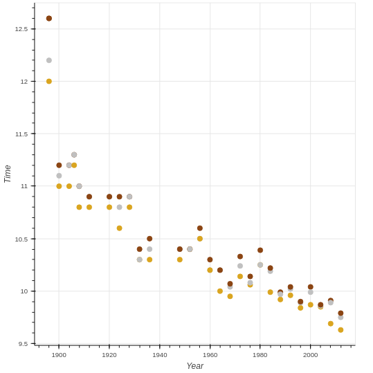
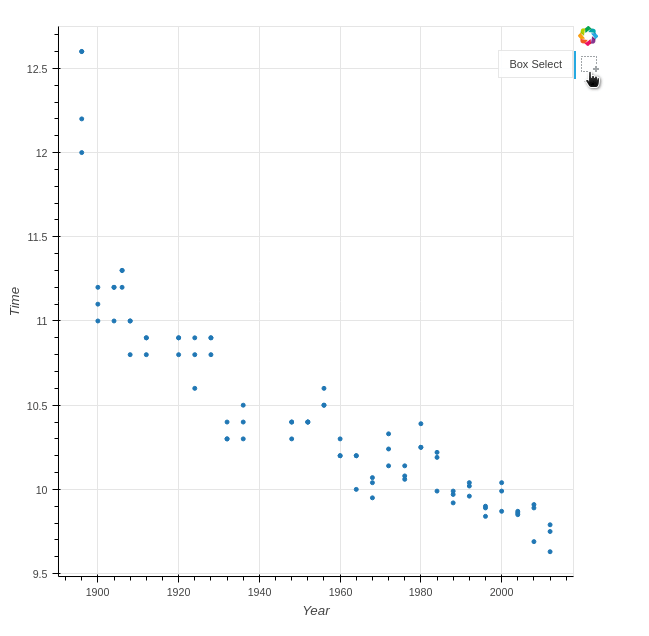
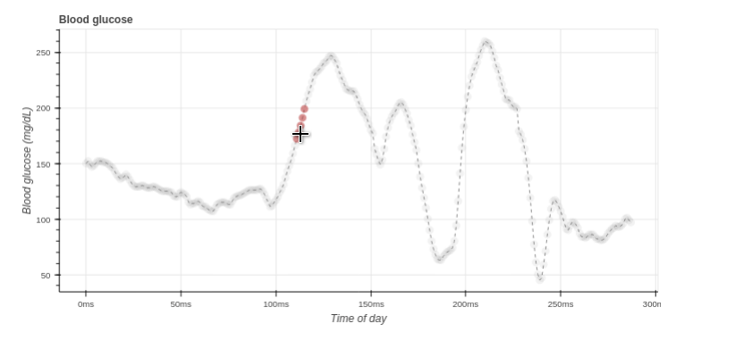

# Chapter 01: Basic Plotting with Bokeh

## 01. What are glyphs?
In Bokeh, visual properties of shapes are called glyphs. The visual properties of these glyphs such as position or color can be assigned single values, for example `x=10` or `fill_color='red'`.

What other kinds of values can glyph properties be set to in normal usage?

### Possible Answers
* Dictionaries
** press 1
* Sequences (lists, arrays)
** press 2
* Sets
** press 3

#### Answer:
2

#### Comment:
Correct. Multiple glyphs can be drawn by setting glyph properties to ordered sequences of values.

## 02. A simple scatter plot
In this example, you're going to make a scatter plot of female literacy vs fertility using data from the <a href="http://www.eea.europa.eu/data-and-maps/figures/correlation-between-fertility-and-female-education">European Environmental Agency</a>. This dataset highlights that countries with low female literacy have high birthrates. The x-axis data has been loaded for you as fertility and the y-axis data has been loaded as female_literacy.

Your job is to create a figure, assign x-axis and y-axis labels, and plot `female_literacy` vs `fertility` using the circle glyph.

After you have created the figure, in this exercise and the ones to follow, play around with it! Explore the different options available to you on the tab to the right, such as "Pan", "Box Zoom", and "Wheel Zoom". You can click on the question mark sign for more details on any of these tools.

Note: You may have to scroll down to view the lower portion of the figure.

### Instructions:
* Import the `figure` function from `bokeh.plotting`, and the output_file and show functions from bokeh.io.
* Create the figure p with figure(). It has two parameters: x_axis_label and y_axis_label.
8 Add a circle glyph to the figure p using the function p.circle() where the inputs are, in order, the x-axis data and y-axis data.
* Use the output_file() function to specify the name 'fert_lit.html' for the output file.
* Create and display the output file using show() and passing in the figure p.

#### Script:
```
# 1. Import figure from bokeh.plotting
from bokeh.plotting import figure

# 2. Import output_file and show from bokeh.io
from bokeh.io import output_file, show

# 3. instantiate the figure: let's say p
p = figure(x_axis_label='fertility (children per woman)', y_axis_label='female_literacy (% population)')

# 4. add glyph to the figure p
# p.circle(x, y, size, fill_color)
# p.line(x, y, line_width)
p.circle(fertility, female_literacy)

# 5. Call the output_file() function and specify the name of the file
output_file('fert_lit.html')

# 6. Display the plot
show(p)
```
#### Output:


#### Comment:
Great work! Be sure to experiment with the panning and zooming options Bokeh provides.

## 03. A scatter plot with different shapes
By calling multiple glyph functions on the same figure object, we can overlay multiple data sets in the same figure.

In this exercise, you will plot female literacy vs fertility for two different regions, Africa and Latin America. Each set of x and y data has been loaded separately for you as fertility_africa, female_literacy_africa, fertility_latinamerica, and female_literacy_latinamerica.

Your job is to plot the Latin America data with the `circle()` glyph, and the Africa data with the `x()` glyph.

figure has already been imported for you from bokeh.plotting.

### Instructions:
* Create the figure `p` with the `figure()` function. It has two parameters: x_axis_label and y_axis_label.
* Add a circle glyph to the figure p using the function p.circle() where the inputs are the x and y data from Latin America: fertility_latinamerica and female_literacy_latinamerica.
* Add an x glyph to the figure p using the function p.x() where the inputs are the x and y data from Africa: fertility_africa and female_literacy_africa.
* The code to create, display, and specify the name of the output file has been written for you, so after adding the x glyph, hit 'Submit Answer' to view the figure.

#### Script:
```
# Create the figure: p
p = figure(x_axis_label='fertility', y_axis_label='female_literacy (% population)')

# Add a circle glyph to the figure p
p.circle(fertility_latinamerica, female_literacy_latinamerica)

# Add an x glyph to the figure p
p.x(fertility_africa, female_literacy_africa)

# Specify the name of the file
output_file('fert_lit_separate.html')

# Display the plot
show(p)
```
#### Output:


#### Comment:
Great work! As you have seen, it is quite straightforward to add multiple glyph functions to the same Bokeh figure object.

## 04. Customizing your scatter plots
The three most important arguments to customize scatter glyphs are `color`, `size`, and alpha. Bokeh accepts colors as hexadecimal strings, tuples of RGB values between 0 and 255, and any of the 147 <a href="http://www.colors.commutercreative.com/grid/">CSS color names</a>. Size values are supplied in screen space units with 100 meaning the size of the entire figure.

The alpha parameter controls transparency. It takes in floating point numbers between 0.0, meaning completely transparent, and 1.0, meaning completely opaque.

In this exercise, you'll plot female literacy vs fertility for Africa and Latin America as red and blue circle glyphs, respectively.

### Instructions:
* Using the Latin America data (fertility_latinamerica and female_literacy_latinamerica), add a blue circle glyph of size=10 and alpha=0.8 to the figure p. To do this, you will need to specify the color, size and alpha keyword arguments inside p.circle().
* Using the Africa data (fertility_africa and female_literacy_africa), add a red circle glyph of `size=10` and `alpha=0.8` to the figure p.

#### Script:
```
# Create the figure: p
p = figure(x_axis_label='fertility (children per woman)', y_axis_label='female_literacy (% population)')

# Add a blue circle glyph to the figure p
p.circle(fertility_latinamerica, female_literacy_latinamerica, color='blue', size=10, alpha=0.8)

# Add a red circle glyph to the figure p
p.circle(fertility_africa, female_literacy_africa, color='red', size=10, alpha=0.8)

# Specify the name of the file
output_file('fert_lit_separate_colors.html')

# Display the plot
show(p)
```
#### Output:


#### Comment:
Great work! You can use these parameters to get really creative with the way you customize your scatter plots.

## 05. Lines
We can draw lines on Bokeh plots with the `line()` glyph function.

In this exercise, you'll plot the daily adjusted closing price of Apple Inc.'s stock (AAPL) from 2000 to 2013.

The data points are provided for you as lists. date is a list of <a href="https://docs.python.org/3.5/library/datetime.html">datetime objects</a> to plot on the x-axis and price is a list of prices to plot on the y-axis.

Since we are plotting dates on the x-axis, you must add `x_axis_type='datetime'` when creating the figure object.

### Instructions:
* Import the `figure` function from `bokeh.plotting`.
* Create a figure p using the figure() function with x_axis_type set to 'datetime'. The other two parameters are x_axis_label and y_axis_label.
* Plot date and price along the x- and y-axes using p.line().

#### Script:
```
# Import figure from bokeh.plotting
from bokeh.plotting import figure

# Create a figure with x_axis_type="datetime": p
p = figure(x_axis_type='datetime', x_axis_label='Date', y_axis_label='US Dollars')

# Plot date along the x axis and price along the y axis
p.line(date, price)

# Specify the name of the output file and show the result
output_file('line.html')
show(p)
```
#### Output:


#### Comment:
Great work! In the next exercise you will use the same dataset to plot lines and markers together.

## 06. Lines and markers
Lines and markers can be combined by plotting them separately using the same data points.

In this exercise, you'll plot a line and circle glyph for the AAPL stock prices. Further, you'll adjust the `fill_color` keyword argument of the `circle()` glyph function while leaving the line_color at the default value.

The date and price lists are provided. The Bokeh figure object p that you created in the previous exercise has also been provided.

### Instructions:
* Plot `date` along the x-axis and `price` along the y-axis with p.line().
* With date on the x-axis and price on the y-axis, use p.circle() to add a 'white' circle glyph of size 4. To do this, you will need to specify the fill_color and size arguments.

#### Script:
```
# Import figure from bokeh.plotting
from bokeh.plotting import figure

# Create a figure with x_axis_type='datetime': p
p = figure(x_axis_type='datetime', x_axis_label='Date', y_axis_label='US Dollars')

# Plot date along the x-axis and price along the y-axis
p.line(date, price)

# With date on the x-axis and price on the y-axis, add a white circle glyph of size 4
p.circle(date, price, fill_color='white', size=4)

# Specify the name of the output file and show the result
output_file('line.html')
show(p)
```

#### Output:


#### Comment:
Great work!

## 07. Patches
In Bokeh, extended geometrical shapes can be plotted by using the `patches()` glyph function. The patches glyph takes as input a list-of-lists collection of numeric values specifying the vertices in x and y directions of each distinct patch to plot.

In this exercise, you will plot the state borders of Arizona, Colorado, New Mexico and Utah. The latitude and longitude vertices for each state have been prepared as lists.

Your job is to plot longitude on the x-axis and latitude on the y-axis. The figure object has been created for you as `p`.

### Instructions:
* Create a list of the longitude positions for each state as x. This has already been done for you.
* Create a list of the latitude positions for each state as y. The variable names for the latitude positions are az_lats, co_lats, nm_lats, and ut_lats.
* Use p.patches() to add the patches glyph to the figure p. Supply the x and y lists as arguments along with a `line_color` of `'white'`.

#### Script:
```
# Create a list of az_lons, co_lons, nm_lons and ut_lons: x
x = [az_lons, co_lons, nm_lons, ut_lons]

# Create a list of az_lats, co_lats, nm_lats and ut_lats: y
y = [az_lats, co_lats, nm_lats, ut_lats]

# Add patches to figure p with line_color=white for x and y
p.patches(x, y, line_color='white')

# Specify the name of the output file and show the result
output_file('four_corners.html')
show(p)
```

#### Output:
```
In [3]: az_lons[:10]
Out[3]: 
[-114.63332,
 -114.63349,
 -114.63423,
 -114.60899,
 -114.63064,
 -114.57354,
 -114.58031,
 -114.61121,
 -114.6768,
 -114.66076]

In [4]: co_lons[:10]
Out[4]: 
[-109.04984,
 -109.06017,
 -109.06015,
 -109.05655,
 -109.05305,
 -109.05158,
 -109.05119,
 -109.05077,
 -109.05132,
 -109.05077]

In [5]: nm_lons[:10]
Out[5]: 
[-103.55583,
 -104.00265,
 -104.64165,
 -105.14679,
 -105.90075,
 -106.55721,
 -106.63119,
 -106.62216,
 -106.63325,
 -106.61103]

In [6]: ut_lons[:10]
Out[6]: 
[-114.04392,
 -114.04391,
 -114.04375,
 -114.04195,
 -114.04061,
 -114.04055,
 -114.0398,
 -114.04172,
 -114.0391,
 -113.80254]

In [7]: az_lats[0:10]
Out[7]: 
[34.87057,
 35.00186,
 35.00332,
 35.07971,
 35.11791,
 35.14231,
 35.21811,
 35.37012,
 35.49125,
 35.5417]

In [8]: co_lats[:10]
Out[8]: 
[38.215,
 38.40118,
 38.60929,
 38.81393,
 38.95788,
 39.11656,
 39.22605,
 39.36423,
 39.56752,
 39.79876]

In [9]: nm_lats[:10]
Out[9]: 
[32.00032,
 32.00001,
 32.00041,
 32.0005,
 32.00198,
 32.00076,
 31.98981,
 31.93601,
 31.90997,
 31.84661]

In [10]: ut_lats[:10]
Out[10]: 
[40.68928,
 40.68985,
 40.76026,
 41.05548,
 41.36,
 41.59062,
 41.89425,
 41.99372,
 41.99367,
 41.98895]

```
```
In [14]: len(az_lons)
Out[14]: 208

In [15]: len(az_lats)
Out[15]: 208

In [16]: len(co_lons)
Out[16]: 162

In [17]: len(co_lats)
Out[17]: 162

In [19]: len(nm_lons)
Out[19]: 208

In [20]: len(nm_lats)
Out[20]: 208

In [21]: len(ut_lons)
Out[21]: 135

In [22]: len(ut_lats)
Out[22]: 135
```


#### Comment:
Great work!

## 08. Plotting data from NumPy arrays
In the previous exercises, you made plots using data stored in lists. You learned that Bokeh can plot both numbers and datetime objects.

In this exercise, you'll generate NumPy arrays using `np.linspace()` and `np.cos()` and plot them using the circle glyph.

np.linspace() is a function that returns an array of evenly spaced numbers over a specified interval. For example, np.linspace(0, 10, 5) returns an array of 5 evenly spaced samples calculated over the interval [0, 10]. np.cos(x) calculates the element-wise cosine of some array x.

For more information on NumPy functions, you can refer to the <a href="https://docs.scipy.org/doc/numpy/user/index.html#user">NumPy User Guide</a> and <a href="https://docs.scipy.org/doc/numpy/reference/index.html">NumPy Reference</a>.

The figure p has been provided for you.

### Instructions:
* Import numpy as np.
* Create an array x using `np.linspace()` with 0, 5, and 100 as inputs.
* Create an array y using `np.cos()` with x as input.
* Add circles at x and y using p.circle().

#### Script:
```
In [5]: x[:10]
Out[5]: 
array([ 0.        ,  0.05050505,  0.1010101 ,  0.15151515,  0.2020202 ,
        0.25252525,  0.3030303 ,  0.35353535,  0.4040404 ,  0.45454545])

In [6]: len(x)
Out[6]: 100

In [7]: y[:10]
Out[7]: 
array([ 1.        ,  0.99872489,  0.99490282,  0.98854352,  0.97966323,
        0.96828458,  0.95443659,  0.93815458,  0.91948007,  0.89846069])

In [8]: len(y)
Out[8]: 100

```

#### Output:
```
In [5]: x[:10]
Out[5]: 
array([ 0.        ,  0.05050505,  0.1010101 ,  0.15151515,  0.2020202 ,
        0.25252525,  0.3030303 ,  0.35353535,  0.4040404 ,  0.45454545])

In [6]: len(x)
Out[6]: 100

In [7]: y[:10]
Out[7]: 
array([ 1.        ,  0.99872489,  0.99490282,  0.98854352,  0.97966323,
        0.96828458,  0.95443659,  0.93815458,  0.91948007,  0.89846069])

In [8]: len(y)
Out[8]: 100
```


#### Comment:
Great work!

## 09. Plotting data from Pandas DataFrames
You can create Bokeh plots from Pandas DataFrames by passing column selections to the glyph functions.

Bokeh can plot floating point numbers, integers, and datetime data types. In this example, you will read a CSV file containing information on 392 automobiles manufactured in the US, Europe and Asia from 1970 to 1982.

The CSV file is provided for you as 'auto.csv'.

Your job is to plot miles-per-gallon (`mpg`) vs horsepower (`hp`) by passing Pandas column selections into the p.circle() function. Additionally, each glyph will be colored according to values in the color column.

### Instructions:
* Import pandas as pd.
* Use the read_csv() function of pandas to read in 'auto.csv' and store it in the DataFrame df.
* Import figure from bokeh.plotting.
* Use the figure() function to create a figure p with the x-axis labeled 'HP' and the y-axis labeled 'MPG'.
* Plot mpg (on the y-axis) vs hp (on the x-axis) by color using p.circle(). Note that the x-axis should be specified before the y-axis inside p.circle(). You will need to use Pandas DataFrame indexing to pass in the columns. For example, to access the color column, you can use df['color'], and then pass it in as an argument to the color parameter of p.circle(). Also specify a size of 10.

#### Script:
```
# Import pandas as pd
import pandas as pd

# Read in the CSV file: df
df = pd.read_csv('auto.csv')

# Import figure from bokeh.plotting
from bokeh.plotting import figure

# Create the figure: p
p = figure(x_axis_label='HP', y_axis_label='MPG')

# Plot mpg vs hp by color
p.circle(df['hp'], df['mpg'], size=10, color=df['color'])

# Specify the name of the output file and show the result
output_file('auto-df.html')
show(p)

```

#### Output:
```
In [3]: df.head()
Out[3]: 
    mpg  cyl  displ   hp  weight  accel  yr  origin              name  color  \
0  18.0    6  250.0   88    3139   14.5  71      US      ford mustang   blue   
1   9.0    8  304.0  193    4732   18.5  70      US          hi 1200d   blue   
2  36.1    4   91.0   60    1800   16.4  78    Asia  honda civic cvcc    red   
3  18.5    6  250.0   98    3525   19.0  77      US      ford granada   blue   
4  34.3    4   97.0   78    2188   15.8  80  Europe         audi 4000  green   

   size  
0  15.0  
1  20.0  
2  10.0  
3  15.0  
4  10.0
```


#### Comment:
Great work!

## 10. The Bokeh ColumnDataSource
The ColumnDataSource is a table-like data object that maps string column names to sequences (columns) of data. It is the central and most common data structure in Bokeh.

Which of the following statements about ColumnDataSource objects is true?

### Possible Answers
* All columns in a ColumnDataSource must have the same length.
** press 1
* ColumnDataSource objects cannot be shared between different plots.
** press 2
* ColumnDataSource objects are interchangeable with Pandas DataFrames.
** press 3

#### Answer:
1

#### Comment:
Correct. Ragged (different length) columns are not permitted within a single ColumnDataSource.

## 11. The Bokeh ColumnDataSource (continued)
You can create a `ColumnDataSource` object directly from a Pandas DataFrame by passing the DataFrame to the class initializer.

In this exercise, we have imported pandas as `pd` and read in a data set containing all Olympic medals awarded in the 100 meter sprint from 1896 to 2012. A color column has been added indicating the CSS colorname we wish to use in the plot for every data point.

Your job is to import the ColumnDataSource class, create a new ColumnDataSource object from the DataFrame df, and plot circle glyphs with 'Year' on the x-axis and 'Time' on the y-axis. Color each glyph by the color column.

The figure object p has already been created for you.

### Instructions:
* Import the `ColumnDataSource` class from `bokeh.plotting`.
* Use the ColumnDataSource() function to make a new ColumnDataSource object called source from the DataFrame df.
* Use p.circle() to plot circle glyphs of size=8 on the figure p with 'Year' on the x-axis and 'Time' on the y-axis. Be sure to also specify source=source and color='color' so that the ColumnDataSource object is used and each glyph is colored by the color column.

#### Script:
```
# Import the ColumnDataSource class from bokeh.plotting
# from bokeh.models import ColumnDataSource
from bokeh.plotting import ColumnDataSource

# Create a ColumnDataSource from df: source
source = ColumnDataSource(df)

# Add circle glyphs to the figure p
p.circle(x = 'Year', y='Time', size=8, source=source, color='color')

# Specify the name of the output file and show the result
output_file('sprint.html')
show(p)

```

#### Output:
```
In [1]: df.head(12)
Out[1]: 
                Name Country   Medal   Time  Year        color
0         Usain Bolt     JAM    GOLD   9.63  2012    goldenrod
1        Yohan Blake     JAM  SILVER   9.75  2012       silver
2      Justin Gatlin     USA  BRONZE   9.79  2012  saddlebrown
3         Usain Bolt     JAM    GOLD   9.69  2008    goldenrod
4   Richard Thompson     TRI  SILVER   9.89  2008       silver
5         Walter Dix     USA  BRONZE   9.91  2008  saddlebrown
6      Justin Gatlin     USA    GOLD   9.85  2004    goldenrod
7   Francis Obikwelu     POR  SILVER   9.86  2004       silver
8     Maurice Greene     USA  BRONZE   9.87  2004  saddlebrown
9     Maurice Greene     USA    GOLD   9.87  2000    goldenrod
10        Ato Boldon     TRI  SILVER   9.99  2000       silver
11  Obadele Thompson     BAR  BRONZE  10.04  2000  saddlebrown
```
```
In [5]: source
Out[5]: ColumnDataSource(id='0432fe7d-c39d-4798-b502-99bc7d922e60', ...)
```


#### Comment:
Great work!

## 12. Selection and non-selection glyphs
In this exercise, you're going to add the `box_select` tool to a figure and change the selected and non-selected circle glyph properties so that selected glyphs are red and non-selected glyphs are transparent blue.

You'll use the ColumnDataSource object of the Olympic Sprint dataset you made in the last exercise. It is provided to you with the name `source`.

After you have created the figure, be sure to experiment with the Box Select tool you added! As in previous exercises, you may have to scroll down to view the lower portion of the figure.

### Instructions:
* Create a figure `p` with an `x-axis` label of 'Year', y-axis label of 'Time', and the 'box_select' tool. To add the 'box_select' tool, you have to specify the keyword argument tools='box_select' inside the figure() function.
* Now that you have added 'box_select' to p, add in circle glyphs with p.circle() such that the selected glyphs are red and non-selected glyphs are transparent blue. This can be done by specifying 'red' as the argument to selection_color and 0.1 to nonselection_alpha. Remember to also pass in the arguments for the x ('Year'), y ('Time'), and source parameters of p.circle().
* Click 'Submit Answer' to output the file and show the figure.

#### Script:
```
# Create a figure with the "box_select" tool: p
p = figure(x_axis_label='Year', y_axis_label='Time', tools='box_select')

# Add circle glyphs to the figure p with the selected and non-selected properties
p.circle(x='Year', y='Time', source=source, selection_color='red', nonselection_alpha=0.1)

# Specify the name of the output file and show the result
output_file('selection_glyph.html')
show(p)

```
#### Output:


#### Comment:
Great work!

## 13. Hover glyphs
Now let's practice using and customizing the hover tool.

In this exercise, you're going to plot the blood glucose levels for an unknown patient. The blood glucose levels were recorded every 5 minutes on October 7th starting at 3 minutes past midnight.

The date and time of each measurement are provided to you as x and the blood glucose levels in mg/dL are provided as y.

A bokeh figure is also provided in the workspace as p.

Your job is to add a circle glyph that will appear red when the mouse is hovered near the data points. You will also add a customized hover tool object to the plot.

When you're done, play around with the hover tool you just created! Notice how the points where your mouse hovers over turn red.

### Instructions:
* Import HoverTool from bokeh.models.
* Add a circle glyph to the existing figure p for x and y with a size of 10, fill_color of 'grey', alpha of 0.1, line_color of None, hover_fill_color of 'firebrick', hover_alpha of 0.5, and hover_line_color of 'white'.
* Use the HoverTool() function to create a HoverTool called hover with tooltips=None and mode='vline'.
* Add the HoverTool hover to the figure p using the p.add_tools() function.

#### Script:
```
# import the HoverTool
from bokeh.models import HoverTool

# Add circle glyphs to figure p
p.circle(x, y, size=10,
         fill_color='grey', alpha=0.1, line_color=None,
         hover_fill_color='firebrick', hover_alpha=0.5,
         hover_line_color='white')

# Create a HoverTool: hover
hover = HoverTool(tooltips=None, mode='vline')

# Add the hover tool to the figure p
p.add_tools(hover)

# Specify the name of the output file and show the result
output_file('hover_glyph.html')
show(p)
```
#### Output:


### Comment:
Great work!
