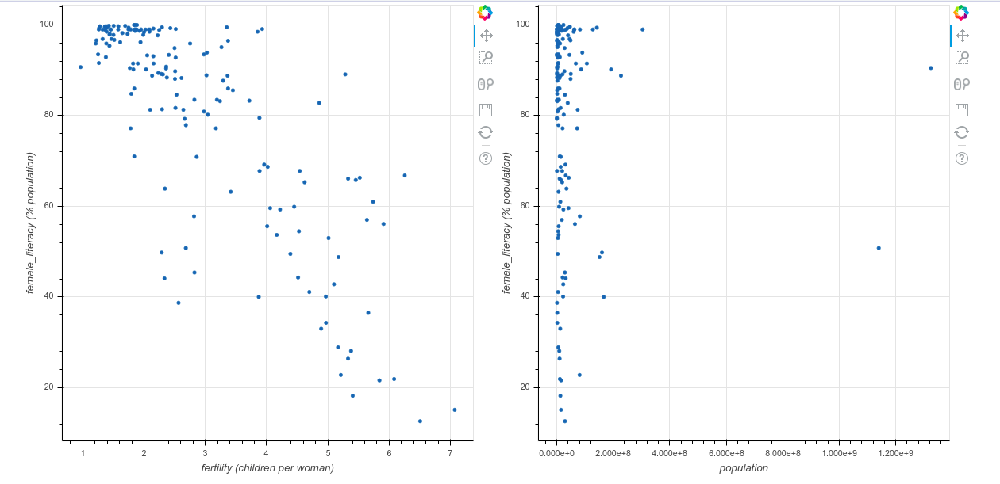
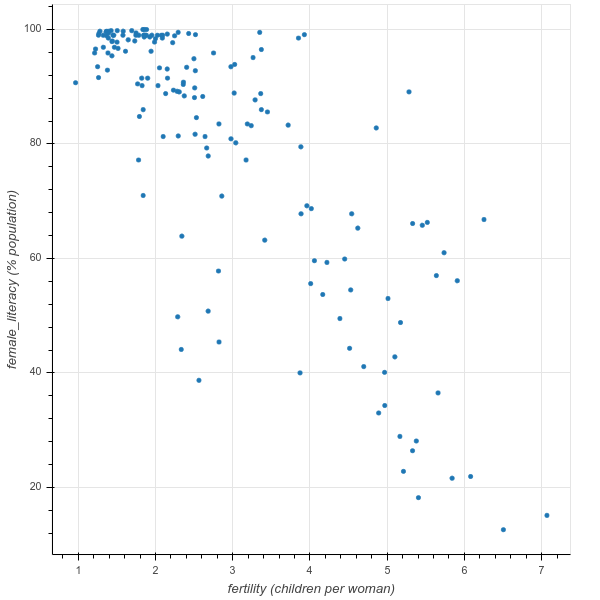
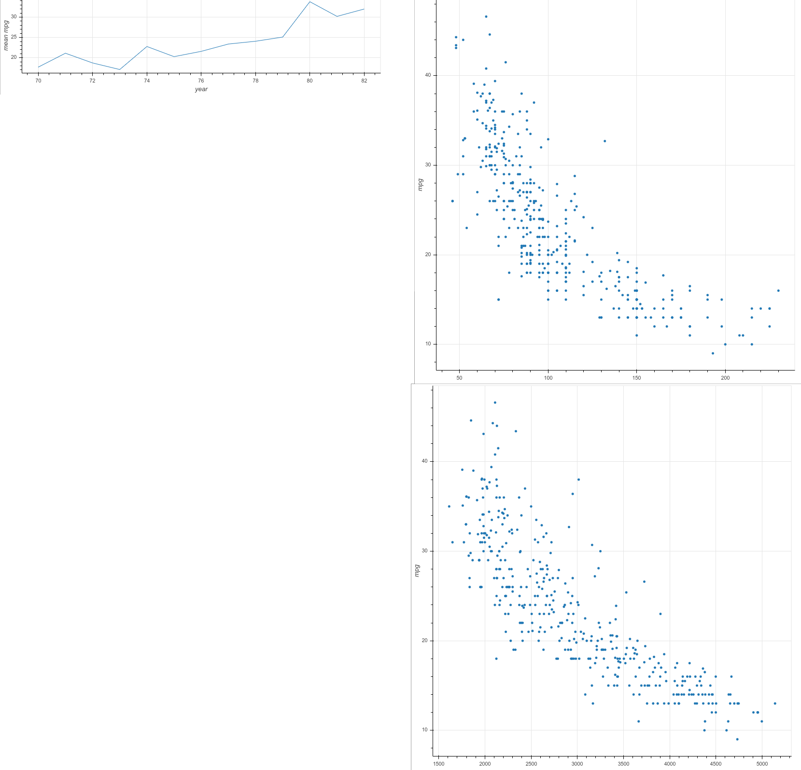
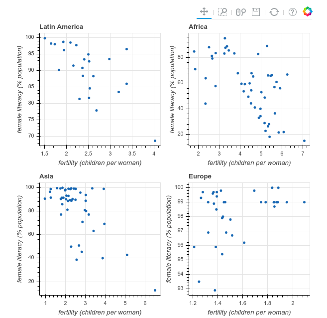

# Chapter 02: Layout, Interactions, and Annotations

## 01. Creating rows of plots
Layouts are collections of Bokeh figure objects.

In this exercise, you're going to create two plots from the Literacy and Birth Rate data set to plot fertility vs female literacy and population vs female literacy.

By using the row() method, you'll create a single layout of the two figures.

Remember, as in the previous chapter, once you have created your figures, you can interact with them in various ways.

In this exercise, you may have to scroll sideways to view both figures in the row layout. Alternatively, you can view the figures in a new window by clicking on the expand icon to the right of the "Bokeh plot" tab.

### Instructions:
Import row from the bokeh.layouts module.
Create a new figure p1 using the figure() function and specifying the two parameters x_axis_label and y_axis_label.
Add a circle glyph to p1. The x-axis data is fertility and y-axis data is female_literacy. Be sure to also specify source=source.
Create a new figure p2 using the figure() function and specifying the two parameters x_axis_label and y_axis_label.
Add a circle() glyph to p2, specifying the x and y parameters.
Put p1 and p2 into a horizontal layout using row().
Click 'Submit Answer' to output the file and show the figure.

#### Script:
```
# Import row from bokeh.layouts
from bokeh.layouts import row

# Create the first figure: p1
p1 = figure(x_axis_label='fertility (children per woman)', y_axis_label='female_literacy (% population)')

# Add a circle glyph to p1
p1.circle('fertility', 'female_literacy', source=source)

# Create the second figure: p2
p2 = figure(x_axis_label='population', y_axis_label='female_literacy (% population)')

# Add a circle glyph to p2
p2.circle('population', 'female_literacy', source=source)

# Put p1 and p2 into a horizontal row: layout
layout = row(p1, p2)

# Specify the name of the output_file and show the result
output_file('fert_row.html')
show(layout)
```
#### Output:


#### Comment:
Great work!

## 02. Creating columns of plots
In this exercise, you're going to use the column() function to create a single column layout of the two plots you created in the previous exercise.

Figure p1 has been created for you.

In this exercise and the ones to follow, you may have to scroll down to view the lower portion of the figure.

### Instructions:
* Import column from the bokeh.layouts module.
* The figure p1 has been created for you. Create a new figure p2 with an x-axis label of 'population' and y-axis label of 'female_literacy (% population)'.
* Add a circle glyph to the figure p2.
* Put p1 and p2 into a vertical layout using column().
* Click 'Submit Answer' to output the file and show the figure.

#### Script:
```
# Import column from the bokeh.layouts module
from bokeh.layouts import column

# Create a blank figure: p1
p1 = figure(x_axis_label='fertility (children per woman)', y_axis_label='female_literacy (% population)')

# Add circle scatter to the figure p1
p1.circle('fertility', 'female_literacy', source=source)

# Create a new blank figure: p2
p2 = figure(x_axis_label='population', y_axis_label='female_literacy (% population)')

# Add circle scatter to the figure p2
p2.circle('population', 'female_literacy', source=source)

# Put plots p1 and p2 in a column: layout
layout = column(p1, p2)

# Specify the name of the output_file and show the result
output_file('fert_column.html')
show(layout)
```
#### Output:


#### Comment:
Great work!

## 03. Nesting rows and columns of plots
You can create nested layouts of plots by combining row and column layouts.

In this exercise, you'll make a 3-plot layout in two rows using the auto-mpg data set.

Three plots have been created for you of average mpg vs year, mpg vs hp, and mpg vs weight.

Your job is to use the column() and row() functions to make a two-row layout where the first row will have only the average mpg vs year plot and the second row will have mpg vs hp and mpg vs weight plots as columns.

By using the sizing_mode argument, you can scale the widths to fill the whole figure.

### Instructions:
* Import row and column from bokeh.layouts.
* Create a column layout called row2 with the figures mpg_hp and mpg_weight in a list and set sizing_mode='scale_width'.
* Create a row layout called layout with the figure avg_mpg and the column layout row2 in a list and set sizing_mode='scale_width'.

#### Script:
```
# Import column and row from bokeh.layouts
from bokeh.layouts import row, column

# Make a column layout that will be used as the second row: row2
# mpg_hp and mpg_weight are figures provided for us to use. 
row2 = column([mpg_hp, mpg_weight], sizing_mode='scale_width')

# Make a row layout that includes the above column layout: layout
# avg_mpg is figure provided for us to use. 
layout = row([avg_mpg, row2], sizing_mode='scale_width')

# Specify the name of the output_file and show the result
output_file('layout_custom.html')
show(layout)
```
#### Output:


#### Comment:
Great work!

## 04. Investigating the layout API
Bokeh layouts allow for positioning items visually in the page presented to the user. What kinds of objects can be put into Bokeh layouts?

### Possible Answers
* Plots
** press 1
* Widgets
** press 2
* Other Layouts
** press 3
* All of the above
** press 4

#### Answer:
4

#### Comment:
Correct. Plots, widgets and nested sub-layouts can be handled.

## 05. Creating gridded layouts
Regular grids of Bokeh plots can be generated with gridplot.

In this example, you're going to display four plots of fertility vs female literacy for four regions: Latin America, Africa, Asia and Europe.

Your job is to create a list-of-lists for the four Bokeh plots that have been provided to you as p1, p2, p3 and p4. The list-of-lists defines the row and column placement of each plot.

### Instructions:
* Import gridplot from the bokeh.layouts module.
* Create a list called row1 containing plots p1 and p2.
* Create a list called row2 containing plots p3 and p4.
* Create a gridplot using row1 and row2. You will have to pass in row1 and row2 in the form of a list.

#### Script:
```
# Import gridplot from bokeh.layouts
from bokeh.layouts import gridplot

# Create a list containing plots p1 and p2: row1
row1 = [p1, p2]

# Create a list containing plots p3 and p4: row2
row2 = [p3, p4]

# Create a gridplot using row1 and row2: layout
layout = gridplot([row1, row2])

# Specify the name of the output_file and show the result
output_file('grid.html')
show(layout)
```
#### Output:


#### Comment:
Great work!
