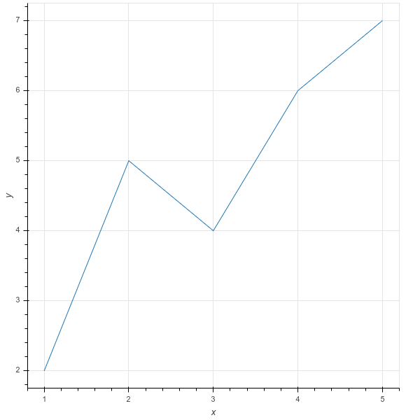
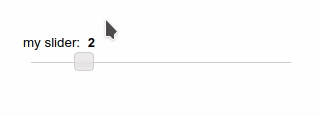
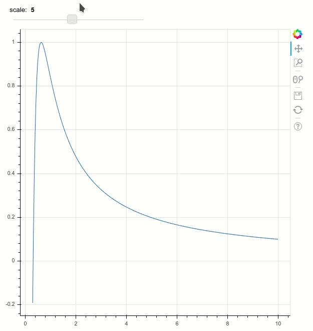
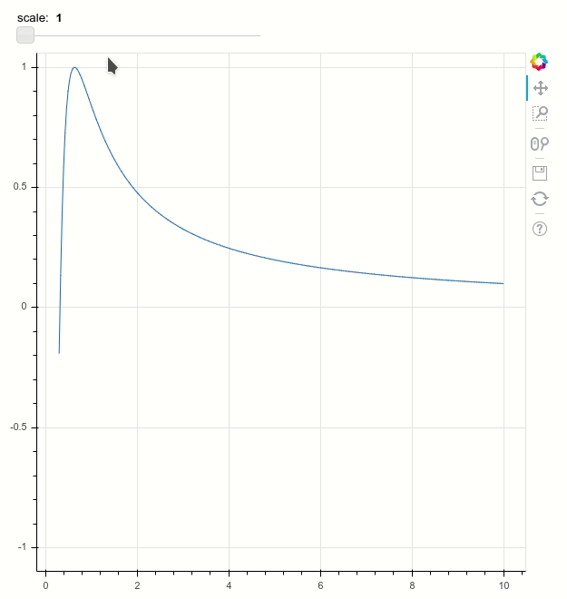

# Chapter 03: Building Interactive Apps with Bokeh

## 01. Understanding Bokeh apps
The main purpose of the Bokeh server is to synchronize python objects with web applications in a browser, so that rich, interactive data applications can be connected to powerful PyData libraries such as NumPy, SciPy, Pandas, and scikit-learn.

What sort of properties can the Bokeh server automatically keep in sync?

### Possible Answers
* Only data source objects.
** press 1
* Only glyph properties.
** press 2
* Any property of any Bokeh object.
** press 3

#### Answer:
3

#### Comment:
Correct. Bokeh server will automatically keep every property of any Bokeh object in sync.

## 02. Using the current document
Let's get started with building an interactive Bokeh app. This typically begins with importing the curdoc, or "current document", function from bokeh.io. This current document will eventually hold all the plots, controls, and layouts that you create. Your job in this exercise is to use this function to add a single plot to your application.

In the video, Bryan described the process for running a Bokeh app using the bokeh serve command line tool. In this chapter and the one that follows, the DataCamp environment does this for you behind the scenes. Notice that your code is part of a script.py file. When you hit 'Submit Answer', you'll see in the IPython Shell that we call bokeh serve script.py for you.

Remember, as in the previous chapters, that there are different options available for you to interact with your plots, and as before, you may have to scroll down to view the lower portion of the plots.

### Instructions:
* Import curdoc from bokeh.io and figure from bokeh.plotting.
* Create a new plot called plot using the figure() function.
* Add a line to the plot using [1,2,3,4,5] as the x coordinates and [2,5,4,6,7] as the y coordinates.
* Add the plot to the current document using curdoc().add_root(). It needs to be passed in as an argument to add_root().

#### Script:
```
# Perform necessary imports
from bokeh.io import curdoc
from bokeh.plotting import figure

# Create a new plot: plot
plot = figure(x_axis_label = 'x', y_axis_label = 'y')

# Add a line to the plot
plot.line([1,2,3,4,5], [2,5,4,6,7])

# Add the plot to the current document
curdoc().add_root(plot)
```
#### Output:


#### Comment:
Great work! In the next exercise, you'll practice adding a single slider to a current document.

## 03. Add a single slider
In the previous exercise, you added a single plot to the "current document" of your application. In this exercise, you'll practice adding a layout to your current document.

Your job here is to create a single slider, use it to create a widgetbox layout, and then add this layout to the current document.

The slider you create here cannot be used for much, but in the later exercises, you'll use it to update your plots!

### Instructions:
* Import curdoc from bokeh.io, widgetbox from bokeh.layouts, and Slider from bokeh.models.
* Create a slider called slider by using the Slider() function and specifying the parameters title, start, end, step, and value.
* Use the slider to create a widgetbox layout called layout.
* Add the layout to the current document using curdoc().add_root(). It needs to be passed in as an argument to add_root().

#### Script:
```
# Perform the necessary imports
from bokeh.io import curdoc
from bokeh.layouts import widgetbox
from bokeh.models import Slider

# Create a slider: slider
slider = Slider(title='my slider', start=0, end=10, step=0.1, value=2)

# Create a widgetbox layout: layout
layout = widgetbox(slider)

# Add the layout to the current document
curdoc().add_root(layout)
```
#### Output:


#### Comment:
Good job! You'll build on this in the next exercise by adding another slider to the current document!

## 04. Multiple sliders in one document
Having added a single slider in a widgetbox layout to your current document, you'll now add multiple sliders into the current document.

Your job in this exercise is to create two sliders, add them to a widgetbox layout, and then add the layout into the current document.

### Instructions:
* Create the first slider, slider1, using the Slider() function. Give it a title of 'slider1'. Have it start at 0, end at 10, with a step of 0.1 and initial value of 2.
* Create the second slider, slider2, using the Slider() function. Give it a title of 'slider2'. Have it start at 10, end at 100, with a step of 1 and initial value of 20.
* Use slider1 and slider2 to create a widgetbox layout called layout.
* Add the layout to the current document using curdoc().add_root(). This has already been done for you.

#### Script:
```
# Perform necessary imports
from bokeh.io import curdoc
from bokeh.layouts import widgetbox
from bokeh.models import Slider

# Create first slider: slider1
slider1 = Slider(title='slider1', start=0, end=10, step=0.1, value=2)

# Create second slider: slider2
slider2 = Slider(title='slider2', start=10, end=100, step=1, value=20)

# Add slider1 and slider2 to a widgetbox
layout = widgetbox(slider1, slider2)

# Add the layout to the current document
curdoc().add_root(layout)
```
#### Output:


#### Comment:
Excellent! The next step now is to learn how to connect these sliders to plots.

## 05. Adding callbacks to sliders
Callbacks are functions that a user can define, like def callback(attr, old, new), that can be called automatically when some property of a Bokeh object (e.g., the value of a Slider) changes.

How are callbacks added for the value property of Slider objects?

### Possible Answers
* By passing a callback function to the callback method.
** press 1
* By passing a callback function to the on_change method.
** press 2
* By assigning the callback function to the Slider.update property.
** press 3

#### Answer:
2

#### Comment:
Correct. A callback is added by calling myslider.on_change('value', callback).

## 06. How to combine Bokeh models into layouts
Let's begin making a Bokeh application that has a simple slider and plot, that also updates the plot based on the slider.

In this exercise, your job is to first explicitly create a ColumnDataSource. You'll then combine a plot and a slider into a single column layout, and add it to the current document.

After you are done, notice how in the figure you generate, the slider will not actually update the plot, because a widget callback has not been defined. You'll learn how to update the plot using widget callbacks in the next exercise.

All the necessary modules have been imported for you. The plot is available in the workspace as plot, and the slider is available as slider.

#### Instructions:
* Create a ColumnDataSource called source. Explicitly specify the data parameter of ColumnDataSource() with {'x': x, 'y': y}.
* Add a line to the figure plot, with 'x' and 'y' from the ColumnDataSource.
* Combine the slider and the plot into a column layout called layout. Be sure to first create a widgetbox layout using widgetbox() with slider and pass that into the column() function along with plot.

#### Script:
```
# Create ColumnDataSource: source
source = ColumnDataSource(data = {'x':x, 'y':y})

# Add a line to the plot
plot.line('x', 'y', source=source)

# Create a column layout: layout
layout = column(widgetbox(slider), plot)

# Add the layout to the current document
curdoc().add_root(layout)
```
#### Output:


#### Comment:
Great work! Since a widget callback hasn't been defined here, the slider does not update the figure.

## 07. Learn about widget callbacks
You'll now learn how to use widget callbacks to update the state of a Bokeh application, and in turn, the data that is presented to the user.

Your job in this exercise is to use the slider's on_change() function to update the plot's data from the previous example. NumPy's sin() function will be used to update the y-axis data of the plot.

Now that you have added a widget callback, notice how as you move the slider of your app, the figure also updates!

### Instructions:
* Define a callback function callback with the parameters attr, old, new.
* Read the current value of slider as a variable scale. You can do this using slider.value.
* Compute values for the updated y using np.sin(scale/x).
* Update source.data with the new data dictionary.
* Attach the callback to the 'value' property of slider. This can be done using on_change() and passing in 'value' and callback.

#### Script:
```
# Define a callback function: callback
def callback(attr, old, new):

    # Read the current value of the slider: scale
    scale = slider.value

    # Compute the updated y using np.sin(scale/x): new_y
    new_y = np.sin(scale/x)

    # Update source with the new data values
    source.data = {'x': x, 'y': new_y}

# Attach the callback to the 'value' property of slider
slider.on_change('value', callback)

# Create layout and add to current document
layout = column(widgetbox(slider), plot)
curdoc().add_root(layout)
```
#### Output:


#### Comment:
Fantastic! Now that you have added the callback, notice how the figure updates along with the slider!
