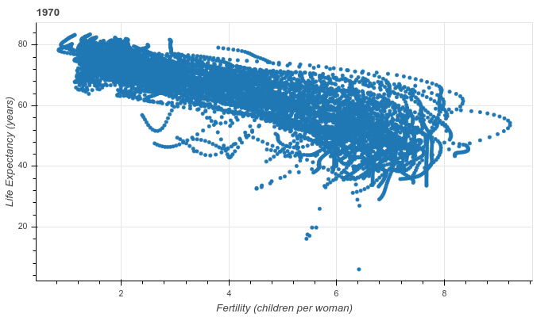
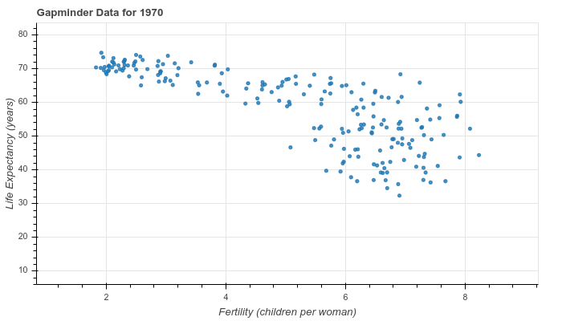
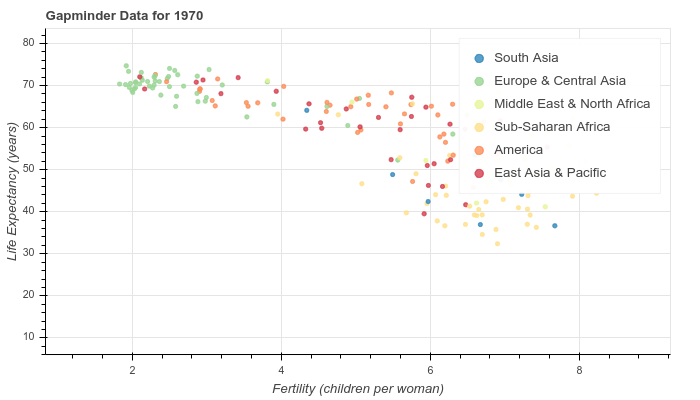
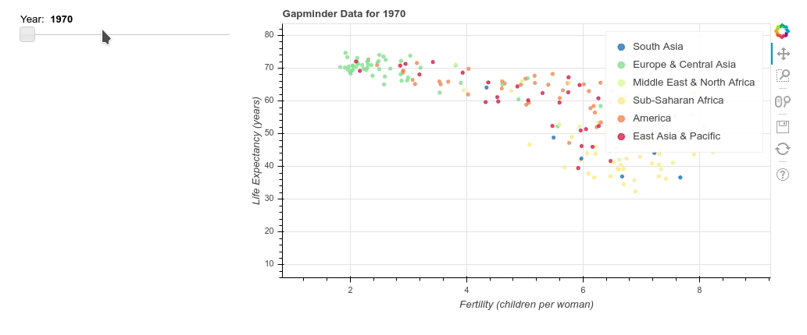

# Chapter 04: Putting It All Together: A Case Study

## 01. Introducing the project dataset
For the final chapter, you'll be looking at some of the Gapminder datasets combined into one tidy file called "gapminder_tidy.csv". This data set is available as a pandas DataFrame under the variable name `data`.

It is always a good idea to begin with some Exploratory Data Analysis. Pandas has a number of built-in methods that help with this. For example, data.head() displays the first five rows/entries of data, while data.tail() displays the last five rows/entries. data.shape gives you information about how many rows and columns there are in the data set. Another particularly useful method is `data.info()`, which provides a concise summary of data, including information about the number of entries, columns, data type of each column, and number of non-null entries in each column.

Use the IPython Shell and the pandas methods mentioned above to explore this data set. How many entries and columns does this data set have?

### Possible Answers
* 7 entries, 10111 columns.
* 10111 entries, 7 columns.
* 9000 entries, 7 columns.

#### Script:
```
In [1]: data.info()
<class 'pandas.core.frame.DataFrame'>
Int64Index: 10111 entries, 1964 to 2006
Data columns (total 7 columns):
Country            10111 non-null object
fertility          10100 non-null float64
life               10111 non-null float64
population         10108 non-null float64
child_mortality    9210 non-null float64
gdp                9000 non-null float64
region             10111 non-null object
dtypes: float64(5), object(2)
memory usage: 631.9+ KB

In [2]: 
```
#### Answer:
2

#### Comment:
Correct! There are 10111 entries, or rows, and 7 columns in the data set. Both the data.info() and data.shape methods provide this information.

## 02. Some exploratory plots of the data
Here, you'll continue your Exploratory Data Analysis by making a simple plot of Life Expectancy vs Fertility for the year 1970.

Your job is to import the relevant Bokeh modules and then prepare a ColumnDataSource object with the fertility, life and Country columns, where you only select the rows with the index value 1970.

Remember, as with the figures you generated in previous chapters, you can interact with your figures here with a variety of tools.

### Instructions:
* Import output_file and show from bokeh.io, figure from bokeh.plotting, and HoverTool and ColumnDataSource from bokeh.models.
* Make a ColumnDataSource called source with x set to the fertility column, y set to the life column and country set to the Country column. For all columns, select the rows with index value 1970. This can be done using data.loc[1970].column_name.

#### Script:
```
# Perform necessary imports
from bokeh.io import output_file, show
from bokeh.models import ColumnDataSource, HoverTool
from bokeh.plotting import figure

# Make the ColumnDataSource: source
source = ColumnDataSource(data={
    'x'       : data['fertility'],
    'y'       : data['life'],
    'country' : data['Country']
})

# Create the figure: p
p = figure(title='1970', x_axis_label='Fertility (children per woman)', y_axis_label='Life Expectancy (years)',
           plot_height=400, plot_width=700,
           tools=[HoverTool(tooltips='@country'), 'save'])

# Add a circle glyph to the figure p
p.circle(x='x', y='y', source=source)

# Output the file and show the figure
output_file('gapminder.html')
show(p)
```
#### Output:


#### Comment:
Great work!

## 03. Beginning with just a plot
Let's get started on the Gapminder app. Your job is to make the ColumnDataSource object, prepare the plot, and add circles for Life expectancy vs Fertility. You'll also set x and y ranges for the axes.

As in the previous chapter, the DataCamp environment executes the bokeh serve command to run the app for you. When you hit 'Submit Answer', you'll see in the IPython Shell that bokeh serve script.py gets called to run the app. This is something to keep in mind when you are creating your own interactive visualizations outside of the DataCamp environment.

### Instructions;
* Make a ColumnDataSource object called source with 'x', 'y', 'country', 'pop' and 'region' keys. The Pandas selections are provided for you.
* Save the minimum and maximum values of the life expectancy column data.life as ymin and ymax. As a guide, you can refer to the way we saved the minimum and maximum values of the fertility column data.fertility as xmin and xmax.
* Create a plot called plot by specifying the title, setting plot_height to 400, plot_width to 700, and adding the x_range and y_range parameters.
* Add circle glyphs to the plot. Specify an fill_alpha of 0.8 and source=source.

#### Script:
```
# Import the necessary modules
from bokeh.io import curdoc
from bokeh.models import ColumnDataSource
from bokeh.plotting import figure

# Make the ColumnDataSource: source
source = ColumnDataSource(data={
    'x'       : data.loc[1970].fertility,
    'y'       : data.loc[1970].life,
    'country' : data.loc[1970].Country,
    'pop'     : (data.loc[1970].population / 20000000) + 2,
    'region'  : data.loc[1970].region,
})

# Save the minimum and maximum values of the fertility column: xmin, xmax
xmin, xmax = min(data.fertility), max(data.fertility)

# Save the minimum and maximum values of the life expectancy column: ymin, ymax
ymin, ymax = min(data.life), max(data.life)

# Create the figure: plot
plot = figure(title='Gapminder Data for 1970', plot_height=400, plot_width=700,
              x_range=(xmin, xmax), y_range=(ymin, ymax))

# Add circle glyphs to the plot
plot.circle(x='x', y='y', fill_alpha=0.8, source=source)

# Set the x-axis label
plot.xaxis.axis_label ='Fertility (children per woman)'

# Set the y-axis label
plot.yaxis.axis_label = 'Life Expectancy (years)'

# Add the plot to the current document and add a title
curdoc().add_root(plot)
curdoc().title = 'Gapminder'
```
#### Output


#### Comment:
Great work! Notice how life expectancy seems to go down as fertility goes up? It would be interesting to see how this varies by continent. In the next exercise, you'll do this by shading each glyph by its continent.

## 04. Enhancing the plot with some shading
Now that you have the base plot ready, you can enhance it by coloring each circle glyph by continent.

Your job is to make a list of the unique regions from the data frame, prepare a ColorMapper, and add it to the circle glyph.

### Instructions:
* Make a list of the unique values from the region column. You can use the unique() and tolist() methods on data.region to do this.
* Import CategoricalColorMapper from bokeh.models and the Spectral6 palette from bokeh.palettes.
* Use the CategoricalColorMapper() function to make a color mapper called color_mapper with factors=regions_list and palette=Spectral6.
* Add the color mapper to the circle glyph as a dictionary with dict(field='region', transform=color_mapper) as the argument passed to the color parameter of plot.circle(). Also set the legend parameter to be the 'region'.
* Set the legend.location attribute of plot to 'top_right'.

#### Script:
```
# Make a list of the unique values from the region column: regions_list
regions_list = data.region.unique().tolist()

# Import CategoricalColorMapper from bokeh.models and the Spectral6 palette from bokeh.palettes
from bokeh.models import CategoricalColorMapper
from bokeh.palettes import Spectral6

# Make a color mapper: color_mapper
color_mapper = CategoricalColorMapper(factors=regions_list, palette=Spectral6)

# Add the color mapper to the circle glyph
plot.circle(x='x', y='y', fill_alpha=0.8, source=source,
            color=dict(field='region', transform=color_mapper), legend='region')

# Set the legend.location attribute of the plot to 'top_right'
plot.legend.location = 'top_right'

# Add the plot to the current document and add the title
curdoc().add_root(plot)
curdoc().title = 'Gapminder'
```
#### Output:


#### Comment:
Great work! The plot provides a lot more information now that you have added the shading. The next step is to add a slider to control the year. This will let you interactively visualize the change over the last few decades.

## 05. Adding a slider to vary the year
Until now, we've been plotting data only for 1970. In this exercise, you'll add a slider to your plot to change the year being plotted. To do this, you'll create an update_plot() function and associate it with a slider to select values between 1970 and 2010.

After you are done, you may have to scroll to the right to view the entire plot. As you play around with the slider, notice that the title of the plot is not updated along with the year. This is something you'll fix in the next exercise!

### Instructions:
* Import the widgetbox and row functions from bokeh.layouts, and the Slider function from bokeh.models.
* Define the update_plot callback function with parameters attr, old and new.
* Set the yr name to slider.value and set source.data = new_data.
* Make a slider object called slider using the Slider() function with a start year of 1970, end year of 2010, step of 1, value of 1970, and title of 'Year'.
* Attach the callback to the 'value' property of slider. This can be done using on_change() and passing in 'value' and update_plot.
* Make a row layout of widgetbox(slider) and plot and add it to the current document.

#### Script:
```
# Import the necessary modules
from bokeh.layouts import row, widgetbox
from bokeh.models import Slider

# Define the callback function: update_plot
def update_plot(attr, old, new):
    # Set the yr name to slider.value and new_data to source.data
    yr = slider.value
    new_data = {
        'x'       : data.loc[yr].fertility,
        'y'       : data.loc[yr].life,
        'country' : data.loc[yr].Country,
        'pop'     : (data.loc[yr].population / 20000000) + 2,
        'region'  : data.loc[yr].region,
    }
    source.data = new_data


# Make a slider object: slider
slider = Slider(title='Year', start=1970, end=2010, step=1, value=1970)

# Attach the callback to the 'value' property of slider
slider.on_change('value', update_plot)

# Make a row layout of widgetbox(slider) and plot and add it to the current document
layout = row(widgetbox(slider), plot)
curdoc().add_root(layout)
```
#### Output:


#### Comment:
Great work! If you have to scroll to the right to view the entire figure, it may be a good idea to expand the figure into a new window so you can see everything.

## 06. Customizing based on user input
Remember how in the plot from the previous exercise, the title did not update along with the slider? In this exercise, you'll fix this.

In Python, you can format strings by specifying placeholders with the % keyword. For example, if you have a string company = 'DataCamp', you can use print('%s' % company) to print DataCamp. Placeholders are useful when you are printing values that are not static, such as the value of the year slider. You can specify a placeholder for a number with %d. Here, when you're updating the plot title inside your callback function, you should make use of a placeholder so that the year displayed is in accordance with the value of the year slider.

In addition to updating the plot title, you'll also create the callback function and slider as you did in the previous exercise, so you get a chance to practice these concepts further.

All necessary modules have been imported for you, and as in the previous exercise, you may have to scroll to the right to view the entire figure.

### Instructions:
* Define the update_plot callback function with parameters attr, old and new.
* Inside update_plot(), assign the value of the slider, slider.value, to yr and set source.data = new_data.
* Inside update_plot(), specify plot.title.text to update the plot title and add it to the figure. You want the plot to update based on the value of the slider, which you have assigned above to yr. Make use of the placeholder syntax provided for you.
* Make a slider object called slider using the Slider() function with a start year of 1970, end year of 2010, step of 1, value of 1970, and title of 'Year'.
* Attach the callback to the 'value' property of slider. This can be done using on_change() and passing in 'value' and update_plot.
