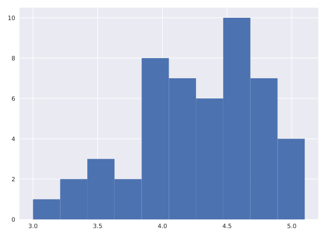

# Chapter 01: Graphical Exploratory Data Analysis

## 01. Tukey's comments on EDA
Even though you probably have not read Tukey's book, I suspect you already have a good idea about his viewpoint from the video introducing you to exploratory data analysis. Which of the following quotes is not directly from Tukey?

### Possible Answers
* Exploratory data analysis is detective work.
** press 1
* There is no excuse for failing to plot and look.
** press 2
* The greatest value of a picture is that it forces us to notice what we never expected to see.
** press 3
* It is important to understand what you can do before you learn how to measure how well you seem to have done it.
** press 4
* Often times EDA is too time consuming, so it is better to jump right in and do your hypothesis tests.
** press 5

#### Answer:
5

#### Comment:
You're right. That statement is pretty absurd. If you don't have time to do EDA, you really don't have time to do hypothesis tests. And you should always do EDA first.

## 02. Advantages of graphical EDA
Which of the following is not true of graphical EDA?

### Possible Answers
* It often involves converting tabular data into graphical form.
** press 1
* If done well, graphical representations can allow for more rapid interpretation of data.
** press 2
* A nice looking plot is always the end goal of a statistical analysis.
** press 3
* There is no excuse for neglecting to do graphical EDA.
** press 4

#### Answer:3
3

#### Comment:
Correct! While a good, informative plot can sometimes be the end point of an analysis, it is more like a beginning: it helps guide you in the quantitative statistical analyses that come next.

## 03. Plotting a histogram of iris data
For the exercises in this section, you will use a classic data set collected by botanist Edward Anderson and made famous by Ronald Fisher, one of the most prolific statisticians in history. Anderson carefully measured the anatomical properties of samples of three different species of iris, Iris setosa, Iris versicolor, and Iris virginica. The full data set is <a href="http://scikit-learn.org/stable/modules/generated/sklearn.datasets.load_iris.html">available as part of scikit-learn</a>. Here, you will work with his measurements of petal length.

Plot a histogram of the petal lengths of his 50 samples of Iris versicolor using matplotlib/seaborn's default settings. Recall that to specify the default seaborn style, you can use sns.set(), where sns is the alias that seaborn is imported as.

The subset of the data set containing the Iris versicolor petal lengths in units of centimeters (cm) is stored in the NumPy array versicolor_petal_length.

In the video, Justin plotted the histograms by using the pandas library and indexing the DataFrame to extract the desired column. Here, however, you only need to use the provided NumPy array. Also, Justin assigned his plotting statements (except for plt.show()) to the dummy variable _. This is to prevent unnecessary output from being displayed. It is not required for your solutions to these exercises, however it is good practice to use it. Alternatively, if you are working in an interactive environment such as a Jupyter notebook, you could use a ; after your plotting statements to achieve the same effect. Justin prefers using _. Therefore, you will see it used in the solution code.

### Instructions:
* Import matplotlib.pyplot and seaborn as their usual aliases (plt and sns).
* Use seaborn to set the plotting defaults.
* Plot a histogram of the Iris versicolor petal lengths using plt.hist() and the provided NumPy array versicolor_petal_length.
* Show the histogram using plt.show().

#### Script:
```
# Import plotting modules
import matplotlib.pyplot as plt
import seaborn as sns

# Set default Seaborn style
sns.set()

# Plot histogram of versicolor petal lengths
plt.hist(versicolor_petal_length)

# Show histogram
plt.show()
```
#### Output;


#### Comment:
Great work!
