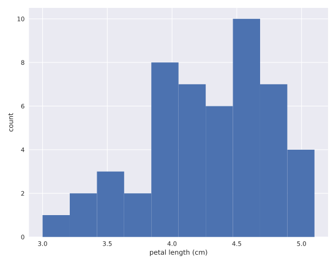
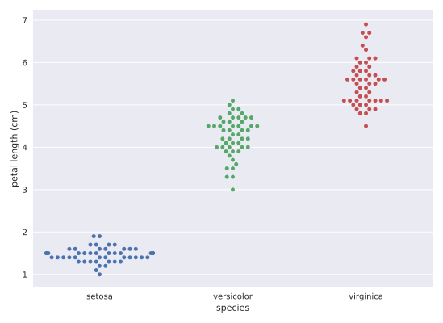

# Chapter 01: Graphical Exploratory Data Analysis

## 01. Tukey's comments on EDA
Even though you probably have not read Tukey's book, I suspect you already have a good idea about his viewpoint from the video introducing you to exploratory data analysis. Which of the following quotes is not directly from Tukey?

### Possible Answers
* Exploratory data analysis is detective work.
** press 1
* There is no excuse for failing to plot and look.
** press 2
* The greatest value of a picture is that it forces us to notice what we never expected to see.
** press 3
* It is important to understand what you can do before you learn how to measure how well you seem to have done it.
** press 4
* Often times EDA is too time consuming, so it is better to jump right in and do your hypothesis tests.
** press 5

#### Answer:
5

#### Comment:
You're right. That statement is pretty absurd. If you don't have time to do EDA, you really don't have time to do hypothesis tests. And you should always do EDA first.

## 02. Advantages of graphical EDA
Which of the following is not true of graphical EDA?

### Possible Answers
* It often involves converting tabular data into graphical form.
** press 1
* If done well, graphical representations can allow for more rapid interpretation of data.
** press 2
* A nice looking plot is always the end goal of a statistical analysis.
** press 3
* There is no excuse for neglecting to do graphical EDA.
** press 4

#### Answer:3
3

#### Comment:
Correct! While a good, informative plot can sometimes be the end point of an analysis, it is more like a beginning: it helps guide you in the quantitative statistical analyses that come next.

## 03. Plotting a histogram of iris data
For the exercises in this section, you will use a classic data set collected by botanist Edward Anderson and made famous by Ronald Fisher, one of the most prolific statisticians in history. Anderson carefully measured the anatomical properties of samples of three different species of iris, Iris setosa, Iris versicolor, and Iris virginica. The full data set is <a href="http://scikit-learn.org/stable/modules/generated/sklearn.datasets.load_iris.html">available as part of scikit-learn</a>. Here, you will work with his measurements of petal length.

Plot a histogram of the petal lengths of his 50 samples of Iris versicolor using matplotlib/seaborn's default settings. Recall that to specify the default seaborn style, you can use sns.set(), where sns is the alias that seaborn is imported as.

The subset of the data set containing the Iris versicolor petal lengths in units of centimeters (cm) is stored in the NumPy array versicolor_petal_length.

In the video, Justin plotted the histograms by using the pandas library and indexing the DataFrame to extract the desired column. Here, however, you only need to use the provided NumPy array. Also, Justin assigned his plotting statements (except for plt.show()) to the dummy variable _. This is to prevent unnecessary output from being displayed. It is not required for your solutions to these exercises, however it is good practice to use it. Alternatively, if you are working in an interactive environment such as a Jupyter notebook, you could use a ; after your plotting statements to achieve the same effect. Justin prefers using _. Therefore, you will see it used in the solution code.

### Instructions:
* Import matplotlib.pyplot and seaborn as their usual aliases (plt and sns).
* Use seaborn to set the plotting defaults.
* Plot a histogram of the Iris versicolor petal lengths using plt.hist() and the provided NumPy array versicolor_petal_length.
* Show the histogram using plt.show().

#### Script:
```
# Import plotting modules
import matplotlib.pyplot as plt
import seaborn as sns

# Set default Seaborn style
sns.set()

# Plot histogram of versicolor petal lengths
plt.hist(versicolor_petal_length)

# Show histogram
plt.show()
```
#### Output;


#### Comment:
Great work!

## 04. Axis labels!
In the last exercise, you made a nice histogram of petal lengths of Iris versicolor, but you didn't label the axes! That's ok; it's not your fault since we didn't ask you to. Now, add axis labels to the plot using plt.xlabel() and plt.ylabel(). Don't forget to add units and assign both statements to _. The packages matplotlib.pyplot and seaborn are already imported with their standard aliases. This will be the case in what follows, unless specified otherwise.

### Instructions:
* Label the axes. Don't forget that you should always include units in your axis labels. Your y-axis label is just 'count'. Your x-axis label is 'petal length (cm)'. The units are essential!
* Display the plot constructed in the above steps using plt.show().

#### Script:
```
# Plot histogram of versicolor petal lengths
plt.hist(versicolor_petal_length)

# Label axes
plt.xlabel('petal length (cm)')
plt.ylabel('count')

# Show histogram
plt.show()

```
#### Output:


#### Comment:
Great work!

## 05. Adjusting the number of bins in a histogram
The histogram you just made had ten bins. This is the default of matplotlib. The "square root rule" is a commonly-used rule of thumb for choosing number of bins: choose the number of bins to be the square root of the number of samples. Plot the histogram of Iris versicolor petal lengths again, this time using the square root rule for the number of bins. You specify the number of bins using the bins keyword argument of plt.hist().

The plotting utilities are already imported and the seaborn defaults already set. The variable you defined in the last exercise, versicolor_petal_length, is already in your namespace.

### Instructions:
* Import numpy as np. This gives access to the square root function, np.sqrt().
* Determine how many data points you have using len().
* Compute the number of bins using the square root rule.
* Convert the number of bins to an integer using the built in int() function.
* Generate the histogram and make sure to use the bins keyword argument.
* Hit 'Submit Answer' to plot the figure and see the fruit of your labors!

#### Script:
```
# Import numpy
import numpy as np

# Compute number of data points: n_data
n_data = len(versicolor_petal_length)

# Number of bins is the square root of number of data points: n_bins
n_bins = np.sqrt(n_data)

# Convert number of bins to integer: n_bins
n_bins = int(n_bins)

# Plot the histogram
plt.hist(versicolor_petal_length, bins = n_bins)

# Label axes
_ = plt.xlabel('petal length (cm)')
_ = plt.ylabel('count')

# plt.xlabel('petal length (cm)')
# plt.ylabel('count')

# Show histogram
plt.show()
```
#### Output:


#### Comment:
Great work!

## 06. Bee swarm plot
Make a bee swarm plot of the iris petal lengths. Your x-axis should contain each of the three species, and the y-axis the petal lengths. A data frame containing the data is in your namespace as df.

For your reference, the code Justin used to create the bee swarm plot in the video is provided below:
```
_ = sns.swarmplot(x='state', y='dem_share', data=df_swing)
_ = plt.xlabel('state')
_ = plt.ylabel('percent of vote for Obama')
plt.show()
```
In the IPython Shell, you can use sns.swarmplot? or help(sns.swarmplot) for more details on how to make bee swarm plots using seaborn.

### Instructions:
* In the IPython Shell, inspect the DataFrame df using df.head(). This will let you identify which column names you need to pass as the x and y keyword arguments in your call to sns.swarmplot().
* Use sns.swarmplot() to make a bee swarm plot from the DataFrame containing the Fisher iris data set, df. The x-axis should contain each of the three species, and the y-axis should contain the petal lengths.
* Label the axes.
* Show your plot.

#### Script:
```
# Create bee swarm plot with Seaborn's default settings
sns.swarmplot(x='species', y='petal length (cm)', data=df)

# Label the axes
plt.xlabel('species')
plt.ylabel('petal length (cm)')

# Show the plot
plt.show()
```
#### Output:


#### Comment:
Great work!

## 07. Interpreting a bee swarm plot
Which of the following conclusions could you draw from the bee swarm plot of iris petal lengths you generated in the previous exercise? For your convenience, the bee swarm plot is regenerated and shown to the right.

### Possible Answers
* All I. versicolor petals are shorter than I. virginica petals.
* I. setosa petals have a broader range of lengths than the other two species.
* I. virginica petals tend to be the longest, and I. setosa petals tend to be the shortest of the three species.
* I. versicolor is a hybrid of I. virginica and I. setosa.

#### Answer:
3

#### Comment:
Correct! Notice that we said "tend to be." Some individual I. virginica flowers may be shorter than individual I. versicolor flowers. It is also possible that an individual I. setosa flower may have longer petals than in individual I. versicolor flower, though this is highly unlikely, and was not observed by Anderson.
