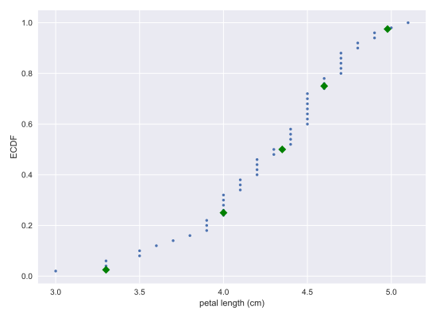
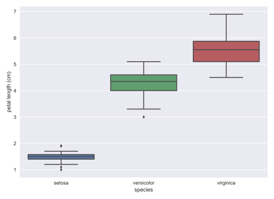

# Chapter 02: Quantitative Exploratory Data Analysis

## 01. Means and medians
Which one of the following statements is true about means and medians?

### Possible Answers
* An outlier can significantly affect the value of both the mean and the median.
** press 1
* An outlier can significantly affect the value of the mean, but not the median.
** press 2
* Means and medians are in general both robust to single outliers.
** press 3
* The mean and median are equal if there is an odd number of data points.
** press 4

#### Answer:
2

#### Comment:
Correct!

## 02. Computing means
The mean of all measurements gives an indication of the typical magnitude of a measurement. It is computed using np.mean().

### Instructions:
* Compute the mean petal length of Iris versicolor from Anderson's classic data set. The variable versicolor_petal_length is provided in your namespace. Assign the mean to mean_length_vers.
* Hit submit to print the result.

#### Script:
```
# Compute the mean: mean_length_vers
mean_length_vers = np.mean(versicolor_petal_length)

# Print the result with some nice formatting
print('I. versicolor:', mean_length_vers, 'cm')
# print("I. versicolor: {} cm".format(mean_length_vers))
```
#### Output:
```
<script.py> output:
    I. versicolor: 4.26 cm
```
#### Comment:
Great work!

## 03. Computing percentiles
In this exercise, you will compute the percentiles of petal length of Iris versicolor.

### Instructions:
* Create percentiles, a NumPy array of percentiles you want to compute. These are the 2.5th, 25th, 50th, 75th, and 97.5th. You can do so by creating a list containing these ints/floats and convert the list to a NumPy array using np.array(). For example, np.array([30, 50]) would create an array consisting of the 30th and 50th percentiles.
* Use np.percentile() to compute the percentiles of the petal lengths from the Iris versicolor samples. The variable versicolor_petal_length is in your namespace.
* Print the percentiles.

#### Script:
```
# Specify array of percentiles: percentiles
percentiles = np.array([2.5, 25, 50, 75, 97.5])

# Compute percentiles: ptiles_vers
ptiles_vers = np.percentile(versicolor_petal_length, percentiles)

# Print the result
print(ptiles_vers)
```
#### Output:
```
<script.py> output:
    [3.3    4.     4.35   4.6    4.9775]
```
#### Comment:
Great work!

## 04. Comparing percentiles to ECDF
To see how the percentiles relate to the ECDF, you will plot the percentiles of Iris versicolor petal lengths you calculated in the last exercise on the ECDF plot you generated in chapter 1. The percentile variables from the previous exercise are available in the workspace as ptiles_vers and percentiles.

Note that to ensure the Y-axis of the ECDF plot remains between 0 and 1, you will need to rescale the percentiles array accordingly - in this case, dividing it by 100.

### Instructions:
* Plot the percentiles as red diamonds on the ECDF. Pass the x and y co-ordinates - ptiles_vers and percentiles/100 - as positional arguments and specify the marker='D', color='red' and linestyle='none' keyword arguments. The argument for the y-axis - percentiles/100 has been specified for you.
* Display the plot.

#### Script:
```
# Plot the ECDF
_ = plt.plot(x_vers, y_vers, '.')
_ = plt.xlabel('petal length (cm)')
_ = plt.ylabel('ECDF')

# Overlay percentiles as red diamonds.
_ = plt.plot(ptiles_vers, percentiles/100, marker='D', color='green', linestyle='none')

# Show the plot
plt.show()

```
#### Output:


#### Comment:
Great work!

## 05. Box-and-whisker plot
Making a box plot for the petal lengths is unnecessary because the iris data set is not too large and the bee swarm plot works fine. However, it is always good to get some practice. Make a box plot of the iris petal lengths. You have a pandas DataFrame, df, which contains the petal length data, in your namespace. Inspect the data frame df in the IPython shell using df.head() to make sure you know what the pertinent columns are.

For your reference, the code used to produce the box plot in the video is provided below:

_ = sns.boxplot(x='east_west', y='dem_share', data=df_all_states)

_ = plt.xlabel('region')

_ = plt.ylabel('percent of vote for Obama')

In the IPython Shell, you can use sns.boxplot? or help(sns.boxplot) for more details on how to make box plots using seaborn.

### Instructions:
* The set-up is exactly the same as for the bee swarm plot; you just call sns.boxplot() with the same keyword arguments as you would sns.swarmplot(). The x-axis is 'species' and y-axis is 'petal length (cm)'.
* Don't forget to label your axes!
* Display the figure using the normal call.

#### Script:
```
# Create box plot with Seaborn's default settings
sns.boxplot(x='species', y='petal length (cm)', data=df)

# Label the axes
plt.xlabel('species')
plt.ylabel('petal length (cm)')


# Show the plot
plt.show()

```
#### Output:


#### Comment:
Great work!

## 06. Computing the variance
It is important to have some understanding of what commonly-used functions are doing under the hood. Though you may already know how to compute variances, this is a beginner course that does not assume so. In this exercise, we will explicitly compute the variance of the petal length of Iris veriscolor using the equations discussed in the videos. We will then use np.var() to compute it.

### Instructions:
* Create an array called differences that is the difference between the petal lengths (versicolor_petal_length) and the mean petal length. The variable versicolor_petal_length is already in your namespace as a NumPy array so you can take advantage of NumPy's vectorized operations.
* Square each element in this array. For example, `x**2` squares each element in the array x. Store the result as diff_sq.
* Compute the mean of the elements in diff_sq using np.mean(). Store the result as variance_explicit.
* Compute the variance of versicolor_petal_length using np.var(). Store the result as variance_np.
* Print both variance_explicit and variance_np in one print call to make sure they are consistent.

#### Script:
```
# Array of differences to mean: differences
differences = versicolor_petal_length - versicolor_petal_length.mean()

# Square the differences: diff_sq
diff_sq = differences ** 2

# Compute the mean square difference: variance_explicit
variance_explicit = np.mean(diff_sq)

# Compute the variance using NumPy: variance_np
variance_np = np.var(versicolor_petal_length)

# Print the results
print(variance_explicit, variance_np)

```

#### Output:
```
In [1]: versicolor_petal_length
Out[1]: 
array([4.7, 4.5, 4.9, 4. , 4.6, 4.5, 4.7, 3.3, 4.6, 3.9, 3.5, 4.2, 4. ,
       4.7, 3.6, 4.4, 4.5, 4.1, 4.5, 3.9, 4.8, 4. , 4.9, 4.7, 4.3, 4.4,
       4.8, 5. , 4.5, 3.5, 3.8, 3.7, 3.9, 5.1, 4.5, 4.5, 4.7, 4.4, 4.1,
       4. , 4.4, 4.6, 4. , 3.3, 4.2, 4.2, 4.2, 4.3, 3. , 4.1])
```
```
In [4]: versicolor_petal_length.mean()
Out[4]: 4.26
```
```
In [7]: differences
Out[7]: 
array([ 0.44,  0.24,  0.64, -0.26,  0.34,  0.24,  0.44, -0.96,  0.34,
       -0.36, -0.76, -0.06, -0.26,  0.44, -0.66,  0.14,  0.24, -0.16,
        0.24, -0.36,  0.54, -0.26,  0.64,  0.44,  0.04,  0.14,  0.54,
        0.74,  0.24, -0.76, -0.46, -0.56, -0.36,  0.84,  0.24,  0.24,
        0.44,  0.14, -0.16, -0.26,  0.14,  0.34, -0.26, -0.96, -0.06,
       -0.06, -0.06,  0.04, -1.26, -0.16])
```
```
In [9]: diff_sq
Out[9]: 
array([0.1936, 0.0576, 0.4096, 0.0676, 0.1156, 0.0576, 0.1936, 0.9216,
       0.1156, 0.1296, 0.5776, 0.0036, 0.0676, 0.1936, 0.4356, 0.0196,
       0.0576, 0.0256, 0.0576, 0.1296, 0.2916, 0.0676, 0.4096, 0.1936,
       0.0016, 0.0196, 0.2916, 0.5476, 0.0576, 0.5776, 0.2116, 0.3136,
       0.1296, 0.7056, 0.0576, 0.0576, 0.1936, 0.0196, 0.0256, 0.0676,
       0.0196, 0.1156, 0.0676, 0.9216, 0.0036, 0.0036, 0.0036, 0.0016,
       1.5876, 0.0256])
```
```
In [11]: variance_explicit
Out[11]: 0.21640000000000004

```
```
In [13]: variance_np
Out[13]: 0.21640000000000004
```
```
<script.py> output:
    0.21640000000000004 0.21640000000000004
```
#### Comment:
Great work!

## 07. The standard deviation and the variance
As mentioned in the video, the standard deviation is the square root of the variance. You will see this for yourself by computing the standard deviation using np.std() and comparing it to what you get by computing the variance with np.var() and then computing the square root.

### Instructions:
* Compute the variance of the data in the versicolor_petal_length array using np.var() and store it in a variable called variance.
* Print the square root of this value.
* Print the standard deviation of the data in the versicolor_petal_length array using np.std().

#### Script:
```
# Compute the variance: variance
variance = np.var(versicolor_petal_length)

# Print the square root of the variance
print(np.sqrt(variance))

# Print the standard deviation
print(np.std(versicolor_petal_length))
```
#### Output:
```
<script.py> output:
    0.4651881339845203
    0.4651881339845203

```
