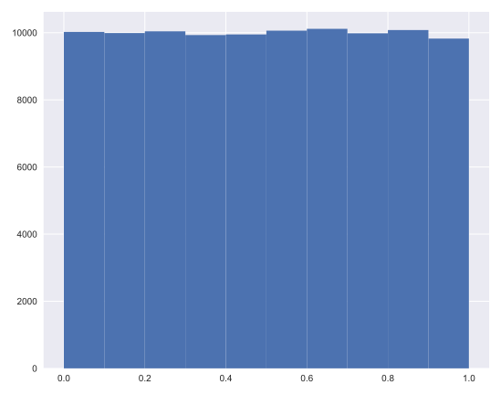

# Chapter 03: Thinking Probabistically -- Discrete Variables

## 01. What is the goal of statistical inference?

Why do we do statistical inference?

## Possible Answers
* To draw probabilistic conclusions about what we might expect if we collected the same data again.
** press 1
* To draw actionable conclusions from data.
** press 2
* To draw more general conclusions from relatively few data or observations.
** press 3
* All of these.
** press 4

### Answer:
4

#### Comment:
Correct! Statistical inference involves taking your data to probabilistic conclusions about what you would expect if you took even more data, and you can make decisions based on these conclusions.

## 02. Why do we use the language of probability?
Which of the following is not a reason why we use probabilistic language in statistical inference?

### Possible Answers
* Probability provides a measure of uncertainty.
** press 1
* Probabilistic language is not very precise.
** press 2
* Data are almost never exactly the same when acquired again, and probability allows us to say how much we expect them to vary.
** press 3

#### Answer:
2

#### Comment:
Correct. Probabilistic language is in fact very precise. It precisely describes uncertainty.

## 03. Generating random numbers using the np.random module
We will be hammering the np.random module for the rest of this course and its sequel. Actually, you will probably call functions from this module more than any other while wearing your hacker statistician hat. Let's start by taking its simplest function, np.random.random() for a test spin. The function returns a random number between zero and one. Call np.random.random() a few times in the IPython shell. You should see numbers jumping around between zero and one.

In this exercise, we'll generate lots of random numbers between zero and one, and then plot a histogram of the results. If the numbers are truly random, all bars in the histogram should be of (close to) equal height.

You may have noticed that, in the video, Justin generated 4 random numbers by passing the keyword argument size=4 to np.random.random(). Such an approach is more efficient than a for loop: in this exercise, however, you will write a for loop to experience hacker statistics as the practice of repeating an experiment over and over again.

### Instructions:
* Seed the random number generator using the seed 42.
* Initialize an empty array, random_numbers, of 100,000 entries to store the random numbers. Make sure you use np.empty(100000) to do this.
* Write a for loop to draw 100,000 random numbers using np.random.random(), storing them in the random_numbers array. To do so, loop over range(100000).
* Plot a histogram of random_numbers. It is not necessary to label the axes in this case because we are just checking the random number generator. Hit 'Submit Answer' to show your plot.

#### Script:
```
# Seed the random number generator
np.random.seed(42)

# Initialize random numbers: random_numbers
random_numbers = np.empty(100000)

# Generate random numbers by looping over range(100000)
for i in range(100000):
    random_numbers[i] = np.random.random()

# Plot a histogram
_ = plt.hist(random_numbers)

# Show the plot
plt.show()

# for i in random_numbers:
#     random_numbers[i] = np.random.random()
#     print(random_numbers[i])
```
#### Output:


#### Comment:
Good work! The histogram is almost exactly flat across the top, indicating that there is equal chance that a randomly-generated number is in any of the bins of the histogram.

## 04. The np.random module and Bernoulli trials
You can think of a Bernoulli trial as a flip of a possibly biased coin. Specifically, each coin flip has a probability p of landing heads (success) and probability 1−p of landing tails (failure). In this exercise, you will write a function to perform n Bernoulli trials, perform_bernoulli_trials(n, p), which returns the number of successes out of n Bernoulli trials, each of which has probability p of success. To perform each Bernoulli trial, use the np.random.random() function, which returns a random number between zero and one.

### Instructions:
* Define a function with signature perform_bernoulli_trials(n, p).
** Initialize to zero a variable n_success the counter of Trues, which are Bernoulli trial successes.
** Write a for loop where you perform a Bernoulli trial in each iteration and increment the number of success if the result is True. Perform n iterations by looping over range(n).
*** To perform a Bernoulli trial, choose a random number between zero and one using np.random.random(). If the number you chose is less than p, increment n_success (use the += 1 operator to achieve this).
* The function returns the number of successes n_success.

#### Script:
```
def perform_bernoulli_trials(n, p):
    """Perform n Bernoulli trials with success probability p
    and return number of successes."""
    # Initialize number of successes: n_success
    n_success = 0

    # Perform trials
    for i in range(n):
        # Choose random number between zero and one: random_number
        random_number = np.random.random()

        # If less than p, it's a success so add one to n_success
        if random_number < p:
            n_success += 1

    return n_success
```
#### Comment:
Good work!
