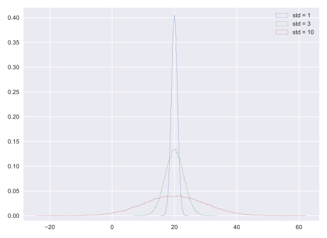

# Chapter 04: Thinking probabilistically-- Continuous variables

## 01. Interpreting PDFs
Consider the PDF shown to the right (it may take a second to load!). Which of the following is true?


### Possible AnswersThinking probabilistically-- Continuous variables
* x is more likely than not less than 10.
* x is more likely than not greater than 10.
* We cannot tell from the PDF if x is more likely to be greater than or less than 10.
* This is not a valid PDF because it has two peaks.

#### Answer:
1

#### Comment:
Correct! The probability is given by the area under the PDF, and there is more area to the left of 10 than to the right.

## 02. Interpreting CDFs
At right is the CDF corresponding to the PDF you considered in the last exercise. Using the CDF, what is the probability that x is greater than 10?


### Possible Answers
* 0.25
* 0.75
* 3.75
* 15

#### Answer:
1

#### Comment:
Correct! The value of the CDF at x = 10 is 0.75, so the probability that x < 10 is 0.75. Thus, the probability that x > 10 is 0.25.

## 03. The Normal PDF
In this exercise, you will explore the Normal PDF and also learn a way to plot a PDF of a known distribution using hacker statistics. Specifically, you will plot a Normal PDF for various values of the variance.

### Instructions:
* Draw 100,000 samples from a Normal distribution that has a mean of 20 and a standard deviation of 1. Do the same for Normal distributions with standard deviations of 3 and 10, each still with a mean of 20. Assign the results to samples_std1, samples_std3 and samples_std10, respectively.
* Plot a histograms of each of the samples; for each, use 100 bins, also using the keyword arguments normed=True and histtype='step'. The latter keyword argument makes the plot look much like the smooth theoretical PDF. You will need to make 3 plt.hist() calls.
* Hit 'Submit Answer' to make a legend, showing which standard deviations you used, and show your plot! There is no need to label the axes because we have not defined what is being described by the Normal distribution; we are just looking at shapes of PDFs.

#### Script:
```
# Draw 100000 samples from Normal distribution with stds of interest: samples_std1, samples_std3, samples_std10
samples_std1 = np.random.normal(20, 1, 100000)
samples_std3 = np.random.normal(20, 3, 100000)
samples_std10 = np.random.normal(20, 10, 100000)

# Make histograms
plt.hist(samples_std1, bins=100, normed=True, histtype='step')
plt.hist(samples_std3, bins=100, normed=True, histtype='step')
plt.hist(samples_std10, bins=100, normed=True, histtype='step')

# Make a legend, set limits and show plot
_ = plt.legend(('std = 1', 'std = 3', 'std = 10'))
plt.ylim(-0.01, 0.42)
plt.show()

```
#### Output:


#### Comment:
Great work! You can see how the different standard deviations result in PDFs of different widths. The peaks are all centered at the mean of 20.
