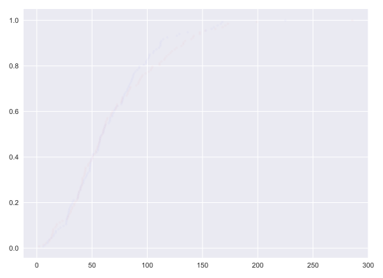
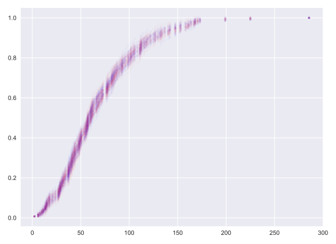
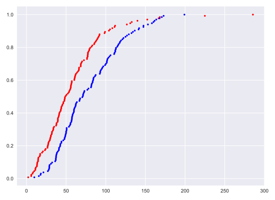
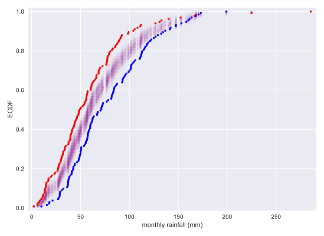
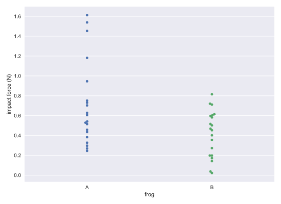

# Chapter 03: Introduction to Hypothesis Testing

## 01. Generating a permutation sample
In the video, you learned that permutation sampling is a great way to simulate the hypothesis that two variables have identical probability distributions. This is often a hypothesis you want to test, so in this exercise, you will write a function to generate a permutation sample from two data sets.

Remember, a permutation sample of two arrays having respectively n1 and n2 entries is constructed by concatenating the arrays together, scrambling the contents of the concatenated array, and then taking the first n1 entries as the permutation sample of the first array and the last n2 entries as the permutation sample of the second array.

### Instructions:
* Concatenate the two input arrays into one using np.concatenate(). Be sure to pass in data1 and data2 as one argument (data1, data2).
* Use np.random.permutation() to permute the concatenated array.
* Store the first len(data1) entries of permuted_data as perm_sample_1 and the last len(data2) entries of permuted_data as perm_sample_2. In practice, this can be achieved by using :len(data1) and len(data1): to slice permuted_data.
* Return perm_sample_1 and perm_sample_2.

#### Script:
```
def permutation_sample(data1, data2):
    """Generate a permutation sample from two data sets."""

    # Concatenate the data sets: data
    data = np.concatenate([data1, data2])

    # Permute the concatenated array: permuted_data
    permuted_data = np.random.permutation(data)

    # Split the permuted array into two: perm_sample_1, perm_sample_2
    perm_sample_1 = permuted_data[:len(data1)]
    perm_sample_2 = permuted_data[len(data1):]

    return perm_sample_1, perm_sample_2
```
#### Comment:
Great work!

## 02. Visualizing permutation sampling
To help see how permutation sampling works, in this exercise you will generate permutation samples and look at them graphically.

We will use the Sheffield Weather Station data again, this time considering the monthly rainfall in July (a dry month) and November (a wet month). We expect these might be differently distributed, so we will take permutation samples to see how their ECDFs would look if they were identically distributed.

The data are stored in the Numpy arrays rain_june and rain_november.

As a reminder, permutation_sample() has a function signature of permutation_sample(data_1, data_2) with a return value of permuted_data[:len(data_1)], permuted_data[len(data_1):], where `permuted_data = np.random.permutation(np.concatenate((data_1, data_2)))`.

### Instructions:
* Write a for loop to 50 generate permutation samples, compute their ECDFs, and plot them.
** Generate a permutation sample pair from rain_june and rain_november using your permutation_sample() function.
** Generate the x and y values for an ECDF for each of the two permutation samples for the ECDF using your ecdf() function.
** Plot the ECDF of the first permutation sample (x_1 and y_1) as dots. Do the same for the second permutation sample (x_2 and y_2).
* Generate x and y values for ECDFs for the rain_june and rain_november data and plot the ECDFs using respectively the keyword arguments color='red' and color='blue'.
* Label your axes, set a 2% margin, and show your plot. This has been done for you, so just hit 'Submit Answer' to view the plot!

#### Script:
```
for i in range(50):
    # Generate permutation samples
    perm_sample_1, perm_sample_2 = permutation_sample(rain_june, rain_november)


    # Compute ECDFs
    x_1, y_1 = ecdf(perm_sample_1)
    x_2, y_2 = ecdf(perm_sample_2)

    # Plot ECDFs of permutation sample
    _ = plt.plot(x_1, y_1, marker='.', linestyle='none',
                 color='red', alpha=0.02)
    _ = plt.plot(x_2, y_2, marker='.', linestyle='none',
                 color='blue', alpha=0.02)

# Create and plot ECDFs from original data
x_1, y_1 = ecdf(rain_june)
x_2, y_2 = ecdf(rain_november)
_ = plt.plot(x_1, y_1, marker='.', linestyle='none', color='red')
_ = plt.plot(x_2, y_2, marker='.', linestyle='none', color='blue')

# Label axes, set margin, and show plot
plt.margins(0.02)
_ = plt.xlabel('monthly rainfall (mm)')
_ = plt.ylabel('ECDF')
plt.show()
```

#### Output:
```
In [1]: rain_june[:5]
Out[1]: array([66.2, 39.7, 76.4, 26.5, 11.2])

In [2]: len(rain_june)
Out[2]: 133

In [3]: rain_november[:5]
Out[3]: array([83.6, 30.9, 62.2, 37. , 41. ])

In [4]: len(rain_november)
Out[4]: 133
```
##### ECDF plot for 133 permuted samples (1 iteration) 


##### ECDF plot for 133 permuted samples (5 iterations) 


##### ECDF plot for 133 permuted samples (50 iterations) 


##### ECDF Plot for the original data


##### ECDF plot for 133 samples, both the original and the permuted samples (50 iterations)


#### Comment:
Great work! Notice that the permutation samples ECDFs overlap and give a purple haze. None of the ECDFs from the permutation samples overlap with the observed data, suggesting that the hypothesis is not commensurate with the data. July and November rainfall are not identically distributed.

## 03. Test statistics
When performing hypothesis tests, your choice of test statistic should be:

### Possible Answers
* something well-known, like the mean or median.
** press 1
* be a parameter that can be estimated.
** press 2
* be pertinent to the question you are seeking to answer in your hypothesis test.
** press 3

#### Answer:
3

#### Comment:
Yes! The most important thing to consider is: What are you asking?

## 04. What is a p-value?
The p-value is generally a measure of:

### Possible Answers
* the probability that the hypothesis you are testing is true.
** press 1
* the probability of observing your data if the hypothesis you are testing is true.
** press 2
* the probability of observing a test statistic equally or more extreme than the one you observed, given that the null hypothesis is true.
** press 3

#### Answer:
3

#### Comment:
Correct!

## 05. Generating permutation replicates
As discussed in the video, a permutation replicate is a single value of a statistic computed from a permutation sample. As the draw_bs_reps() function you wrote in chapter 2 is useful for you to generate bootstrap replicates, it is useful to have a similar function, draw_perm_reps(), to generate permutation replicates. You will write this useful function in this exercise.

The function has call signature draw_perm_reps(data_1, data_2, func, size=1). Importantly, func must be a function that takes two arrays as arguments. In most circumstances, func will be a function you write yourself.

### Instructions:
* Define a function with this signature: draw_perm_reps(data_1, data_2, func, size=1).
** Initialize an array to hold the permutation replicates using np.empty().
** Write a for loop to:
*** Compute a permutation sample using your permutation_sample() function
*** Pass the samples into func() to compute the replicate and store the result in your array of replicates.
** Return the array of replicates.

#### Script:
```
def draw_perm_reps(data_1, data_2, func, size=1):
    """Generate multiple permutation replicates."""

    # Initialize array of replicates: perm_replicates
    perm_replicates = np.empty(size)

    for i in range(size):
        # Generate permutation sample
        perm_sample_1, perm_sample_2 = permutation_sample(data_1, data_2)

        # Compute the test statistic
        perm_replicates[i] = func(perm_sample_1, perm_sample_2)

    return perm_replicates
```
#### Comment:
Great work!

## 06. Look before you leap: EDA before hypothesis testing
Kleinteich and Gorb (Sci. Rep., 4, 5225, 2014) performed an interesting experiment with South American horned frogs. They held a plate connected to a force transducer, along with a bait fly, in front of them. They then measured the impact force and adhesive force of the frog's tongue when it struck the target.

Frog A is an adult and Frog B is a juvenile. The researchers measured the impact force of 20 strikes for each frog. In the next exercise, we will test the hypothesis that the two frogs have the same distribution of impact forces. But, remember, it is important to do EDA first! Let's make a bee swarm plot for the data. They are stored in a Pandas data frame, df, where column ID is the identity of the frog and column impact_force is the impact force in Newtons (N).

### Instructions:
* Use sns.swarmplot() to make a bee swarm plot of the data by specifying the x, y, and data keyword arguments.
* Label your axes.
* Show the plot.

#### Script:
```
# Make bee swarm plot
_ = sns.swarmplot(x= 'ID', y='impact_force', data=df)

# Label axes
_ = plt.xlabel('frog')
_ = plt.ylabel('impact force (N)')

# Show the plot
plt.show()
```

#### Output:
```
In [1]: df.head(10)
Out[1]: 
   ID  impact_force
20  A         1.612
21  A         0.605
22  A         0.327
23  A         0.946
24  A         0.541
25  A         1.539
26  A         0.529
27  A         0.628
28  A         1.453
29  A         0.297

```
```
In [3]: df.shape
Out[3]: (40, 2)
```



#### Comment:
Eyeballing it, it does not look like they come from the same distribution. Frog A, the adult, has three or four very hard strikes, and Frog B, the juvenile, has a couple weak ones. However, it is possible that with only 20 samples it might be too difficult to tell if they have difference distributions, so we should proceed with the hypothesis test.

## 07. Permutation test on frog data
The average strike force of Frog A was 0.71 Newtons (N), and that of Frog B was 0.42 N for a difference of 0.29 N. It is possible the frogs strike with the same force and this observed difference was by chance. You will compute the probability of getting at least a 0.29 N difference in mean strike force under the hypothesis that the distributions of strike forces for the two frogs are identical. We use a permutation test with a test statistic of the difference of means to test this hypothesis.

For your convenience, the data has been stored in the arrays force_a and force_b.

### Instructions:
* Define a function with call signature diff_of_means(data_1, data_2) that returns the differences in means between two data sets, mean of data_1 minus mean of data_2.
* Use this function to compute the empirical difference of means that was observed in the frogs.
* Draw 10,000 permutation replicates of the difference of means.
* Compute the p-value.
* Print the p-value.


#### Script:
```
def diff_of_means(data_1, data_2):
    """Difference in means of two arrays."""

    # The difference of means of data_1, data_2: diff
    diff = np.mean(data_1) - np.mean(data_2)

    return diff

# Compute difference of mean impact force from experiment: empirical_diff_means
empirical_diff_means = diff_of_means(force_a, force_b)

# Draw 10,000 permutation replicates: perm_replicates
perm_replicates = draw_perm_reps(force_a, force_b,
                                 diff_of_means, size=10000)

# Compute p-value: p
p = np.sum(perm_replicates >= empirical_diff_means) / len(perm_replicates)

# Print the result
print('p-value =', p)
```

#### Output:
```
In [1]: force_a
Out[1]: 
array([1.612, 0.605, 0.327, 0.946, 0.541, 1.539, 0.529, 0.628, 1.453,
       0.297, 0.703, 0.269, 0.751, 0.245, 1.182, 0.515, 0.435, 0.383,
       0.457, 0.73 ])

In [2]: force_b
Out[2]: 
array([0.172, 0.142, 0.037, 0.453, 0.355, 0.022, 0.502, 0.273, 0.72 ,
       0.582, 0.198, 0.198, 0.597, 0.516, 0.815, 0.402, 0.605, 0.711,
       0.614, 0.468])

In [3]: type(force_a)
Out[3]: numpy.ndarray

In [4]: type(force_b)
Out[4]: numpy.ndarray
```
```
In [2]: empirical_diff_means
Out[2]: 0.28825000000000006
```
```
In [6]: perm_replicates
Out[6]: array([ 0.00865,  0.00935,  0.01845, ..., -0.05835,  0.25855,  0.16225])

In [7]: len(perm_replicates)
Out[7]: 10000
```
```
<script.py> output:
    p-value = 0.0063
```
#### Comment:
The p-value tells you that there is about a 0.6% chance that you would get the difference of means observed in the experiment if frogs were exactly the same. A p-value below 0.01 is typically said to be "statistically significant," but: warning! warning! warning! You have computed a p-value; it is a number. I encourage you not to distill it to a yes-or-no phrase. p = 0.006 and p = 0.000000006 are both said to be "statistically significant," but they are definitely not the same!
