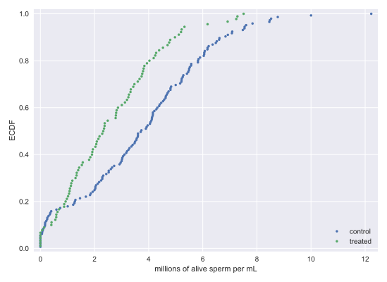

# Chapter 04: Hypothesis Test Examples

## 01. The vote for the Civil Rights Act in 1964
The Civil Rights Act of 1964 was one of the most important pieces of legislation ever passed in the USA. Excluding "present" and "abstain" votes, 153 House Democrats and 136 Republicans voted yea. However, 91 Democrats and 35 Republicans voted nay. Did party affiliation make a difference in the vote?

To answer this question, you will evaluate the hypothesis that the party of a House member has no bearing on his or her vote. You will use the fraction of Democrats voting in favor as your test statistic and evaluate the probability of observing a fraction of Democrats voting in favor at least as small as the observed fraction of 153/244. (That's right, at least as small as. In 1964, it was the Democrats who were less progressive on civil rights issues.) To do this, permute the party labels of the House voters and then arbitrarily divide them into "Democrats" and "Republicans" and compute the fraction of Democrats voting yea.

### Instructions:
* Construct Boolean arrays, dems and reps that contain the votes of the respective parties; e.g., dems has 153 True entries and 91 False entries.
* Write a function, frac_yea_dems(dems, reps) that returns the fraction of Democrats that voted yea. The first input is an array of Booleans, Two inputs are required to use your draw_perm_reps() function, but the second is not used.
* Use your draw_perm_reps() function to draw 10,000 permutation replicates of the fraction of Democrat yea votes.
* Compute and print the p-value.

#### Script:
```
# Construct arrays of data: dems, reps
dems = np.array([True] * 153 + [False] * 91)
reps = np.array([True] * 136 + [False] * 35)

def frac_yea_dems(dems, reps):
    """Compute fraction of Democrat yea votes."""
    frac = len(dems[dems == True]) / len(dems)
    return frac

# Acquire permutation samples: perm_replicates
perm_replicates = draw_perm_reps(dems, reps, frac_yea_dems, 10000)

# Compute and print p-value: p
p = np.sum(perm_replicates <= 153/244) / len(perm_replicates)
print('p-value =', p)
```
#### Output:
```
<script.py> output:
    p-value = 0.0002
```
#### Comment:
Great work! This small p-value suggests that party identity had a lot to do with the voting. Importantly, the South had a higher fraction of Democrat representatives, and consequently also a more racist bias.

## 02. What is equivalent?
You have experience matching a stories to probability distributions. Similarly, you use the same procedure for two different A/B tests if their stories match. In the Civil Rights Act example you just did, you performed an A/B test on voting data, which has a Yes/No type of outcome for each subject (in that case, a voter). Which of the following situations involving testing by a web-based company has an equivalent set up for an A/B test as the one you just did with the Civil Rights Act of 1964?

### Possible Answers
* You measure how much time each customer spends on your website before and after an advertising campaign.
** press 1
* You measure the number of people who click on an ad on your company's website before and after changing its color.
** press 2
* You measure how many clicks each person has on your company's website before and after changing the header layout.
** press 3

#### Answer:
2

#### Comment:
Yup! The "Democrats" are those who view the ad before the color change, and the "Republicans" are those who view it after.

## 03. A time-on-website analog
It turns out that you already did a hypothesis test analogous to an A/B test where you are interested in how much time is spent on the website before and after an ad campaign. The frog tongue force (a continuous quantity like time on the website) is an analog. "Before" = Frog A and "after" = Frog B. Let's practice this again with something that actually is a before/after scenario.

We return to the no-hitter data set. In 1920, Major League Baseball implemented important rule changes that ended the so-called dead ball era. Importantly, the pitcher was no longer allowed to spit on or scuff the ball, an activity that greatly favors pitchers. In this problem you will perform an A/B test to determine if these rule changes resulted in a slower rate of no-hitters (i.e., longer average time between no-hitters) using the difference in mean inter-no-hitter time as your test statistic. The inter-no-hitter times for the respective eras are stored in the arrays nht_dead and nht_live, where "nht" is meant to stand for "no-hitter time."

Since you will be using your draw_perm_reps() function in this exercise, it may be useful to remind yourself of its call signature: draw_perm_reps(d1, d2, func, size=1) or even referring back to the chapter 3 exercise in which you defined it.

### Instructions:
* Compute the observed difference in mean inter-nohitter time using diff_of_means().
* Generate 10,000 permutation replicates of the difference of means using draw_perm_reps().
* Compute and print the p-value.

#### Script
```
# Compute the observed difference in mean inter-no-hitter times: nht_diff_obs
nht_diff_obs = diff_of_means(nht_dead, nht_live)

# Acquire 10,000 permutation replicates of difference in mean no-hitter time: perm_replicates
perm_replicates = draw_perm_reps(nht_dead, nht_live, diff_of_means, 10000)


# Compute and print the p-value: p
p = np.sum(perm_replicates <= nht_diff_obs)/len(perm_replicates)
print('p-val =', p)
```

#### Output
```
In [1]: type(nht_dead)
Out[1]: numpy.ndarray

In [2]: type(nht_live)
Out[2]: numpy.ndarray

In [3]: nht_dead[:10]
Out[3]: array([ -1, 894,  10, 130,   1, 934,  29,   6, 485, 254])

In [5]: nht_live[:10]
Out[5]: array([ 645, 2088,   42, 2090,   11,  886, 1665, 1084, 2900, 2432])
```
```
<script.py> output:
    p-val = 0.0001
```
#### Comment:
Your p-value is 0.0001, which means that only one out of your 10,000 replicates had a result as extreme as the actual difference between the dead ball and live ball eras. This suggests strong statistical significance. Watch out, though, you could very well have gotten zero replicates that were as extreme as the observed value. This just means that the p-value is quite small, almost certainly smaller than 0.001.

## 04. What should you have done first?
That was a nice hypothesis test you just did to check out whether the rule changes in 1920 changed the rate of no-hitters. But what should you have done with the data first?

### Possible Answers
* Performed EDA, perhaps plotting the ECDFs of inter-no-hitter times in the dead ball and live ball eras.
** press 1
* Nothing. The hypothesis test was only a few lines of code.
** press 2

#### Answer:
1

#### Comment:
Yes! Always a good idea to do first! I encourage you to go ahead and plot the ECDFs right now. You will see by eye that the null hypothesis that the distributions are the same is almost certainly not true.

## 05. Simulating a null hypothesis concerning correlation
The observed correlation between female illiteracy and fertility in the data set of 162 countries may just be by chance; the fertility of a given country may actually be totally independent of its illiteracy. You will test this null hypothesis in the next exercise.

To do the test, you need to simulate the data assuming the null hypothesis is true. Of the following choices, which is the best way to to do it?

### Possible Answers
* Choose 162 random numbers to represent the illiteracy rate and 162 random numbers to represent the corresponding fertility rate.
** press 1
* Do a pairs bootstrap: Sample pairs of observed data with replacement to generate a new set of (illiteracy, fertility) data.
** press 2
* Do a bootstrap sampling in which you sample 162 illiteracy values with replacement and then 162 fertility values with replacement.
** press 3
* Do a permutation test: Permute the illiteracy values but leave the fertility values fixed to generate a new set of (illiteracy, fertility) data.
** press 4
* Do a permutation test: Permute both the illiteracy and fertility values to generate a new set of (illiteracy, fertility data).
** press 5

#### Answer:
4

#### Explanation:
* option 1: If you just randomly choose numbers, they have nothing at all to do with the measured data.
* option 2: Pairs bootstrap will get you a confidence interval on the Pearson correlation. You can get a confidence interval for its value. You would find, for example, that it cannot be close to zero. But this is not a simulation of the null hypothesis.
* option 3: This works and is a legitimate way to simulate the data. The pairings are now random. However, it is not preferred because it is not exact like a permutation test is.
* option 4: Yes, this exactly simulates the null hypothesis and does so more efficiently than the last option. It is exact because it uses all data and eliminates any correlation because which illiteracy value pairs to which fertility value is shuffled.
* option 5: This works perfectly, and is exact because it uses all data and eliminates any correlation because which illiteracy value pairs to which fertility value is shuffled. However, it is not necessary, and computationally inefficient, to permute both illiteracy and fertility..

## 06. Hypothesis test on Pearson correlation
The observed correlation between female illiteracy and fertility may just be by chance; the fertility of a given country may actually be totally independent of its illiteracy. You will test this hypothesis. To do so, permute the illiteracy values but leave the fertility values fixed. This simulates the hypothesis that they are totally independent of each other. For each permutation, compute the Pearson correlation coefficient and assess how many of your permutation replicates have a Pearson correlation coefficient greater than the observed one.

The function pearson_r() that you wrote in the <a href="https://campus.datacamp.com/courses/statistical-thinking-in-python-part-1/quantitative-exploratory-data-analysis?ex=15">prequel to this course </a> for computing the Pearson correlation coefficient is already in your name space.

### Instructions:
* Compute the observed Pearson correlation between illiteracy and fertility.
* Initialize an array to store your permutation replicates.
* Write a for loop to draw 10,000 replicates:
* Permute the illiteracy measurements using np.random.permutation().
* Compute the Pearson correlation between the permuted illiteracy array, illiteracy_permuted, and fertility.
* Compute and print the p-value from the replicates.

#### Script:
```
# Compute observed correlation: r_obs
r_obs = pearson_r(illiteracy, fertility)

# Initialize permutation replicates: perm_replicates
perm_replicates = np.empty(10000)

# Draw replicates
for i in range(10000):
    # Permute illiteracy measurments: illiteracy_permuted
    illiteracy_permuted = np.random.permutation(illiteracy)

    # Compute Pearson correlation
    perm_replicates[i] = pearson_r(illiteracy_permuted, fertility)

# Compute p-value: p
p = np.sum(perm_replicates > r_obs)/len(perm_replicates)
print('p-val =', p)
```

#### Output:
```
In [5]: r_obs
Out[5]: 0.8041324026815344
```
```
In [27]: perm_replicates[:7]
Out[27]: 
array([4.04738577e-320, 1.66006057e-321, 0.00000000e+000, 2.23506445e-316,
       4.94065646e-324, 2.23507749e-316, 4.94065646e-324])
```
```
<script.py> output:
    p-val = 0.0
```
#### Comment:
You got a p-value of zero. In hacker statistics, this means that your p-value is very low, since you never got a single replicate in the 10,000 you took that had a Pearson correlation greater than the observed one. You could try increasing the number of replicates you take to continue to move the upper bound on your p-value lower and lower.

## 07. Do neonicotinoid insecticides have unintended consequences?
As a final exercise in hypothesis testing before we put everything together in our case study in the next chapter, you will investigate the effects of neonicotinoid insecticides on bee reproduction. These insecticides are very widely used in the United States to combat aphids and other pests that damage plants.

In a recent study, Straub, et al. (<a href="http://dx.doi.org/10.1098/rspb.2016.0506">Proc. Roy. Soc. B, 2016</a>) investigated the effects of neonicotinoids on the sperm of pollinating bees. In this and the next exercise, you will study how the pesticide treatment affected the count of live sperm per half milliliter of semen.

First, we will do EDA, as usual. Plot ECDFs of the alive sperm count for untreated bees (stored in the Numpy array control) and bees treated with pesticide (stored in the Numpy array treated).

### Instructions:
* Use your ecdf() function to generate x,y values from the control and treated arrays for plotting the ECDFs.
* Plot the ECDFs on the same plot.
* The margins have been set for you, along with the legend and axis labels. Hit 'Submit Answer' to see the result!

#### Script:
```
# Compute x,y values for ECDFs
x_control, y_control = ecdf(control)
x_treated, y_treated = ecdf(treated)

# Plot the ECDFs
plt.plot(x_control, y_control, marker='.', linestyle='none')
plt.plot(x_treated, y_treated, marker='.', linestyle='none')

# Set the margins
plt.margins(0.02)

# Add a legend
plt.legend(('control', 'treated'), loc='lower right')

# Label axes and show plot
plt.xlabel('millions of alive sperm per mL')
plt.ylabel('ECDF')
plt.show()

```
#### Output:


#### Comment:
Nice plot! The ECDFs show a pretty clear difference between the treatment and control; treated bees have fewer alive sperm. Let's now do a hypothesis test in the next exercise.

## 08. Bootstrap hypothesis test on bee sperm counts
Now, you will test the following hypothesis: On average, male bees treated with neonicotinoid insecticide have the same number of active sperm per milliliter of semen than do untreated male bees. You will use the difference of means as your test statistic.

For your reference, the call signature for the draw_bs_reps() function <a href="https://campus.datacamp.com/courses/statistical-thinking-in-python-part-2/bootstrap-confidence-intervals?ex=6">you wrote in chapter 2</a> is draw_bs_reps(data, func, size=1).

### Instructions:
* Compute the mean alive sperm count of control minus that of treated.
* Compute the mean of all alive sperm counts. To do this, first concatenate control and treated and take the mean of the concatenated array.
* Generate shifted data sets for both control and treated such that the shifted data sets have the same mean. This has already been done for you.
* Generate 10,000 bootstrap replicates of the mean each for the two shifted arrays. Use your draw_bs_reps() function.
* Compute the bootstrap replicates of the difference of means.
* The code to compute and print the p-value has been written for you. Hit 'Submit Answer' to see the result!
