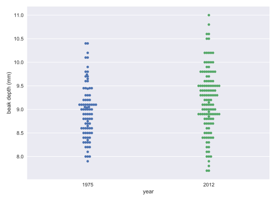
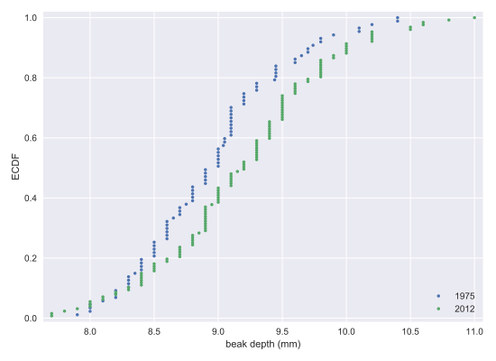
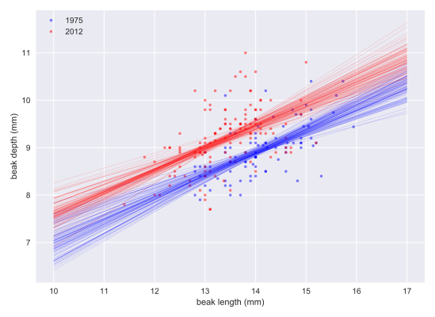
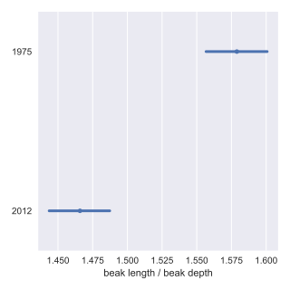
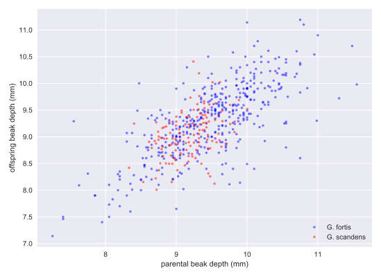

# Chapter 05: Putting It All Together: Case Study

## 01. EDA of beak depths of Darwin's finches
For your first foray into the Darwin finch data, you will study how the beak depth (the distance, top to bottom, of a closed beak) of the finch species Geospiza scandens has changed over time. The Grants have noticed some changes of beak geometry depending on the types of seeds available on the island, and they also noticed that there was some interbreeding with another major species on Daphne Major, Geospiza fortis. These effects can lead to changes in the species over time.

In the next few problems, you will look at the beak depth of G. scandens on Daphne Major in 1975 and in 2012. To start with, let's plot all of the beak depth measurements in 1975 and 2012 in a bee swarm plot.

The data are stored in a pandas DataFrame called df with columns 'year' and 'beak_depth'. The units of beak depth are millimeters (mm).

### Instructions:
* Create the beeswarm plot.
* Label the axes.
* Show the plot.

#### Script:
```
# Create bee swarm plot
_ = sns.swarmplot(x = 'year', y = 'beak_depth', data = df)

# Label the axes
_ = plt.xlabel('year')
_ = plt.ylabel('beak depth (mm)')

# Show the plot
plt.show()
```

#### Output:
```
In [5]: type(df)
Out[5]: pandas.core.frame.DataFrame
```
```
In [2]: df.columns
Out[2]: Index(['beak_depth', 'year'], dtype='object')
```
```
In [1]: df.head(7)
Out[1]: 
   beak_depth  year
0         8.4  1975
1         8.8  1975
2         8.4  1975
3         8.0  1975
4         7.9  1975
5         8.9  1975
6         8.6  1975
```


#### Comment:
It is kind of hard to see if there is a clear difference between the 1975 and 2012 data set. Eyeballing it, it appears as though the mean of the 2012 data set might be slightly higher, and it might have a bigger variance.

## 02. ECDFs of beak depths
While bee swarm plots are useful, we found that ECDFs are often even better when doing EDA. Plot the ECDFs for the 1975 and 2012 beak depth measurements on the same plot.

For your convenience, the beak depths for the respective years has been stored in the NumPy arrays bd_1975 and bd_2012.

### Instructions:
* Compute the ECDF for the 1975 and 2012 data.
* Plot the two ECDFs.
* Set a 2% margin and add axis labels and a legend to the plot.
* Hit 'Submit Answer' to view the plot!

#### Script:
```
# Compute ECDFs
x_1975, y_1975 = ecdf(bd_1975)
x_2012, y_2012 = ecdf(bd_2012)

# Plot the ECDFs
_ = plt.plot(x_1975, y_1975, marker='.', linestyle='none')
_ = plt.plot(x_2012, y_2012, marker='.', linestyle='none')

# Set margins
plt.margins(0.02)

# Add axis labels and legend
_ = plt.xlabel('beak depth (mm)')
_ = plt.ylabel('ECDF')
_ = plt.legend(('1975', '2012'), loc='lower right')

# Show the plot
plt.show()
```

#### Output:
```
In [1]: type(bd_1975)
Out[1]: numpy.ndarray

In [2]: bd_1975.shape
Out[2]: (87,)
```
```
In [4]: bd_1975[:7]
Out[4]: array([8.4, 8.8, 8.4, 8. , 7.9, 8.9, 8.6])
```
```
In [5]: bd_2012[:7]
Out[5]: array([ 9.4,  8.9,  9.5, 11. ,  8.7,  8.4,  9.1])
```


#### Comment:
The differences are much clearer in the ECDF. The mean is larger in the 2012 data, and the variance does appear larger as well.

## 03. Parameter estimates of beak depths
Estimate the difference of the mean beak depth of the G. scandens samples from 1975 and 2012 and report a 95% confidence interval.

Since in this exercise you will use the draw_bs_reps() function you wrote in chapter 2, it may be helpful to <a href="https://campus.datacamp.com/courses/statistical-thinking-in-python-part-2/bootstrap-confidence-intervals?ex=6">refer back to it</a>.

### Instructions:
* Compute the difference of the sample means.
* Take 10,000 bootstrap replicates of the mean for the 1975 beak depths using your draw_bs_reps() function. Also get 10,000 bootstrap replicates of the mean for the 2012 beak depths.
* Subtract the 1975 replicates from the 2012 replicates to get bootstrap replicates of the difference of means.
* Use the replicates to compute the 95% confidence interval.
* Hit 'Submit Answer' to view the results!

#### Script:
```
# Compute the difference of the sample means: mean_diff
mean_diff = np.mean(bd_2012) - np.mean(bd_1975)

# Get bootstrap replicates of means
bs_replicates_1975 = draw_bs_reps(bd_1975, np.mean, 10000)
bs_replicates_2012 = draw_bs_reps(bd_2012, np.mean, 10000)

# Compute samples of difference of means: bs_diff_replicates
bs_diff_replicates = bs_replicates_2012 - bs_replicates_1975

# Compute 95% confidence interval: conf_int
conf_int = np.percentile(bs_diff_replicates, [2.5, 97.5])

# Print the results
print('difference of means =', mean_diff, 'mm')
print('95% confidence interval =', conf_int, 'mm')
```
#### Output:
```
<script.py> output:
    difference of means = 0.22622047244094645 mm
    95% confidence interval = [0.05633521 0.39190544] mm
```
#### Comment:
Great work!

## 04. Hypothesis test: Are beaks deeper in 2012?
Your plot of the ECDF and determination of the confidence interval make it pretty clear that the beaks of G. scandens on Daphne Major have gotten deeper. But is it possible that this effect is just due to random chance? In other words, what is the probability that we would get the observed difference in mean beak depth if the means were the same?

Be careful! The hypothesis we are testing is not that the beak depths come from the same distribution. For that we could use a permutation test. The hypothesis is that the means are equal. To perform this hypothesis test, we need to shift the two data sets so that they have the same mean and then use bootstrap sampling to compute the difference of means.

### Instructions:
* Make a concatenated array of the 1975 and 2012 beak depths and compute and store its mean.
* Shift bd_1975 and bd_2012 such that their means are equal to the one you just computed for the combined data set.
* Take 10,000 bootstrap replicates of the mean each for the 1975 and 2012 beak depths.
* Subtract the 1975 replicates from the 2012 replicates to get bootstrap replicates of the difference.
* Compute and print the p-value. The observed difference in means you computed in the last exercise is still in your namespace as mean_diff.

#### Script:
```
# Compute mean of combined data set: combined_mean
combined_mean = np.mean(np.concatenate((bd_1975, bd_2012)))

# Shift the samples
bd_1975_shifted = bd_1975 - np.mean(bd_1975) + combined_mean
bd_2012_shifted = bd_2012 - np.mean(bd_2012) + combined_mean

# Get bootstrap replicates of shifted data sets
bs_replicates_1975 = draw_bs_reps(bd_1975_shifted, np.mean, 10000)
bs_replicates_2012 = draw_bs_reps(bd_2012_shifted, np.mean, 10000)

# Compute replicates of difference of means: bs_diff_replicates
bs_diff_replicates = bs_replicates_2012 - bs_replicates_1975

# Compute the p-value
p = np.sum(bs_diff_replicates >= mean_diff) / len(bs_diff_replicates)

# Print p-value
print('p =', p)
```
#### Output:
```
<script.py> output:
    p = 0.0034
```
#### Comment:
We get a p-value of 0.0034, which suggests that there is a statistically significant difference. But remember: it is very important to know how different they are! In the previous exercise, you got a difference of 0.2 mm between the means. You should combine this with the statistical significance. Changing by 0.2 mm in 37 years is substantial by evolutionary standards. If it kept changing at that rate, the beak depth would double in only 400 years.

## 05. EDA of beak length and depth
The beak length data are stored as bl_1975 and bl_2012, again with units of millimeters (mm). You still have the beak depth data stored in bd_1975 and bd_2012. Make scatter plots of beak depth (y-axis) versus beak length (x-axis) for the 1975 and 2012 specimens.

### Instructions:
* Make a scatter plot of the 1975 data. Use the color='blue' keyword argument. Also use an alpha=0.5 keyword argument to have transparency in case data points overlap.
* Do the same for the 2012 data, but use the color='red' keyword argument.
* Add a legend and label the axes.
* Show your plot.

#### Script:
```
# Make scatter plot of 1975 data
_ = plt.plot(bl_1975, bd_1975, marker='.',
             linestyle='none', color='blue', alpha=0.5)

# Make scatter plot of 2012 data
_ = plt.plot(bl_2012, bd_2012, marker='.',
             linestyle='none', color='red', alpha=0.5)

# Label axes and make legend
_ = plt.xlabel('beak length (mm)')
_ = plt.ylabel('beak depth (mm)')
_ = plt.legend(('1975', '2012'), loc='upper left')

# Show the plot
plt.show()
```
#### Output:


#### Comment:
Great work! In looking at the plot, we see that beaks got deeper (the red points are higher up in the y-direction), but not really longer. If anything, they got a bit shorter, since the red dots are to the left of the blue dots. So, it does not look like the beaks kept the same shape; they became shorter and deeper.

## 06. Linear regressions
Perform a linear regression for both the 1975 and 2012 data. Then, perform pairs bootstrap estimates for the regression parameters. Report 95% confidence intervals on the slope and intercept of the regression line.

You will use the draw_bs_pairs_linreg() function you wrote back in chapter 2.

As a reminder, its call signature is draw_bs_pairs_linreg(x, y, size=1), and it returns bs_slope_reps and bs_intercept_reps.

### Instructions:
* Compute the slope and intercept for both the 1975 and 2012 data sets.
* Obtain 1000 pairs bootstrap samples for the linear regressions using your draw_bs_pairs_linreg() function.
* Compute 95% confidence intervals for the slopes and the intercepts.

#### Script:
```
# Compute the linear regressions
slope_1975, intercept_1975 = np.polyfit(bl_1975, bd_1975, deg = 1)
slope_2012, intercept_2012 = np.polyfit(bl_2012, bd_2012, deg = 1)

# Perform pairs bootstrap for the linear regressions
bs_slope_reps_1975, bs_intercept_reps_1975 = \
        draw_bs_pairs_linreg(bl_1975, bd_1975, 1000)
bs_slope_reps_2012, bs_intercept_reps_2012 = \
        draw_bs_pairs_linreg(bl_2012, bd_2012, 1000)

# Compute confidence intervals of slopes
slope_conf_int_1975 = np.percentile(bs_slope_reps_1975, [2.5, 97.5])
slope_conf_int_2012 = np.percentile(bs_slope_reps_2012, [2.5, 97.5])
intercept_conf_int_1975 = np.percentile(bs_intercept_reps_1975, [2.5, 97.5])
intercept_conf_int_2012 = np.percentile(bs_intercept_reps_2012, [2.5, 97.5])

# Print the results
print('1975: slope =', slope_1975,
      'conf int =', slope_conf_int_1975)
print('1975: intercept =', intercept_1975,
      'conf int =', intercept_conf_int_1975)
print('2012: slope =', slope_2012,
      'conf int =', slope_conf_int_2012)
print('2012: intercept =', intercept_2012,
      'conf int =', intercept_conf_int_2012)
```
#### Output:
```
<script.py> output:
    1975: slope = 0.4652051691605937 conf int = [0.33851226 0.59306491]
    1975: intercept = 2.3908752365842263 conf int = [0.64892945 4.18037063]
    2012: slope = 0.462630358835313 conf int = [0.33137479 0.60695527]
    2012: intercept = 2.977247498236019 conf int = [1.06792753 4.70599387]
```
#### Comment:
Nicely done! It looks like they have the same slope, but different intercepts.

## 07. Displaying the linear regression results
Now, you will display your linear regression results on the scatter plot, the code for which is already pre-written for you from your previous exercise. To do this, take the first 100 bootstrap samples (stored in bs_slope_reps_1975, bs_intercept_reps_1975, bs_slope_reps_2012, and bs_intercept_reps_2012) and plot the lines with alpha=0.2 and linewidth=0.5 keyword arguments to plt.plot().

### Instructions:
* Generate the x-values for the bootstrap lines using np.array(). They should consist of 10 mm and 17 mm.
* Write a for loop to plot 100 of the bootstrap lines for the 1975 and 2012 data sets. The lines for the 1975 data set should be 'blue' and those for the 2012 data set should be 'red'.
* Hit 'Submit Answer' to view the plot!

#### Script:
```
# Make scatter plot of 1975 data
_ = plt.plot(bl_1975, bd_1975, marker='.',
             linestyle='none', color='blue', alpha=0.5)

# Make scatter plot of 2012 data
_ = plt.plot(bl_2012, bd_2012, marker='.',
             linestyle='none', color='red', alpha=0.5)

# Label axes and make legend
_ = plt.xlabel('beak length (mm)')
_ = plt.ylabel('beak depth (mm)')
_ = plt.legend(('1975', '2012'), loc='upper left')

# Generate x-values for bootstrap lines: x
x = np.array([10, 17])

# Plot the bootstrap lines
for i in range(100):
    plt.plot(x, (bs_slope_reps_1975[i]*x) + bs_intercept_reps_1975[i],
             linewidth=0.5, alpha=0.2, color='blue')
    plt.plot(x, (bs_slope_reps_2012[i]*x) + bs_intercept_reps_2012[i],
             linewidth=0.5, alpha=0.2, color='red')

# Draw the plot again
plt.show()
```
#### Output:


#### Comment:
Great work!

## 08. Beak length to depth ratio
The linear regressions showed interesting information about the beak geometry. The slope was the same in 1975 and 2012, suggesting that for every millimeter gained in beak length, the birds gained about half a millimeter in depth in both years. However, if we are interested in the shape of the beak, we want to compare the ratio of beak length to beak depth. Let's make that comparison.

Remember, the data are stored in bd_1975, bd_2012, bl_1975, and bl_2012.

### Instructions:
* Make arrays of the beak length to depth ratio of each bird for 1975 and for 2012.
* Compute the mean of the length to depth ratio for 1975 and for 2012.
* Generate 10,000 bootstrap replicates each for the mean ratio for 1975 and 2012 using your draw_bs_reps() function.
* Get a 99% bootstrap confidence interval for the length to depth ratio for 1975 and 2012.
* Print the results.

#### Script:
```
# Compute length-to-depth ratios
ratio_1975 = bl_1975/bd_1975
ratio_2012 = bl_2012/bd_2012

# Compute means
mean_ratio_1975 = np.mean(ratio_1975)
mean_ratio_2012 = np.mean(ratio_2012)

# Generate bootstrap replicates of the means
bs_replicates_1975 = draw_bs_reps(ratio_1975, np.mean, 10000)
bs_replicates_2012 = draw_bs_reps(ratio_2012, np.mean, 10000)

# Compute the 99% confidence intervals
conf_int_1975 = np.percentile(bs_replicates_1975, [0.5, 99.5])
conf_int_2012 = np.percentile(bs_replicates_2012, [0.5, 99.5])

# Print the results
print('1975: mean ratio =', mean_ratio_1975,
      'conf int =', conf_int_1975)
print('2012: mean ratio =', mean_ratio_2012,
      'conf int =', conf_int_2012)

```
#### Output:
```
<script.py> output:
    1975: mean ratio = 1.5788823771858533 conf int = [1.55668803 1.60073509]
    2012: mean ratio = 1.4658342276847767 conf int = [1.44363932 1.48729149]

```
#### Comment:
Great work! You will interpret these results in the next exercise.

## 09. How different is the ratio?
In the previous exercise, you computed the mean beak length to depth ratio with 99% confidence intervals for 1975 and for 2012. The results of that calculation are shown graphically in the plot accompanying this problem. In addition to these results, what would you say about the ratio of beak length to depth?


### Possible Answers
* The mean beak length-to-depth ratio decreased by about 0.1, or 7%, from 1975 to 2012. The 99% confidence intervals are not even close to overlapping, so this is a real change. The beak shape changed.
* It is impossible to say if this is a real effect or just due to noise without computing a p-value. Let me compute the p-value and get back to you.

#### Answer:
2

#### Comment:
Great work!

## 10. EDA of heritability
The array bd_parent_scandens contains the average beak depth (in mm) of two parents of the species G. scandens. The array bd_offspring_scandens contains the average beak depth of the offspring of the respective parents. The arrays bd_parent_fortis and bd_offspring_fortis contain the same information about measurements from G. fortis birds.

Make a scatter plot of the average offspring beak depth (y-axis) versus average parental beak depth (x-axis) for both species. Use the alpha=0.5 keyword argument to help you see overlapping points.

### Instructions:
* Generate scatter plots for both species. Display the data for G. fortis in blue and G. scandens in red.
* Set the axis labels, make a legend, and show the plot.

#### Script:
```
# Make scatter plots
_ = plt.plot(bd_parent_fortis, bd_offspring_fortis,
             marker='.', linestyle='none', color='blue', alpha=0.5)
_ = plt.plot(bd_parent_scandens, bd_offspring_scandens,
             marker='.', linestyle='none', color='red', alpha=0.5)

# Label axes
_ = plt.xlabel('parental beak depth (mm)')
_ = plt.ylabel('offspring beak depth (mm)')

# Add legend
_ = plt.legend(('G. fortis', 'G. scandens'), loc='lower right')

# Show plot
plt.show()

```

#### Output:
```
In [1]: bd_parent_scandens[:14]
Out[1]: 
array([8.3318, 8.4035, 8.5317, 8.7202, 8.7089, 8.7541, 8.773 , 8.8107,
       8.7919, 8.8069, 8.6523, 8.6146, 8.6938, 8.7127])

In [2]: bd_offspring_scandens[:14]
Out[2]: 
array([8.419 , 9.2468, 8.1532, 8.0089, 8.2215, 8.3734, 8.5025, 8.6392,
       8.7684, 8.8139, 8.7911, 8.9051, 8.9203, 8.8747])

In [3]: bd_parent_fortis[:14]
Out[3]: 
array([10.1  ,  9.55 ,  9.4  , 10.25 , 10.125,  9.7  ,  9.05 ,  7.4  ,
        9.   ,  8.65 ,  9.625,  9.9  ,  9.55 ,  9.05 ])

In [4]: bd_offspring_fortis[:14]
Out[4]: 
array([10.7 ,  9.78,  9.48,  9.6 , 10.27,  9.5 ,  9.  ,  7.46,  7.65,
        8.63,  9.81,  9.4 ,  9.48,  8.75])

In [5]: 
```


#### Comment:
It appears as though there is a stronger correlation in G. fortis than in G. scandens. This suggests that beak depth is more strongly inherited in G. fortis. We'll quantify this correlation next.
