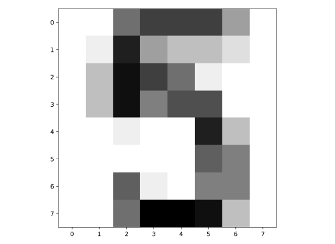
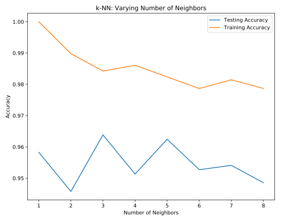

# Chapter 01: Classification

## 01. Which of these is a classification problem?
Once you decide to leverage supervised machine learning to solve a new problem, you need to identify whether your problem is better suited to classification or regression. This exercise will help you develop your intuition for distinguishing between the two.

Provided below are 4 example applications of machine learning. Which of them is a supervised classification problem?

### Possible Answers
* Using labeled financial data to predict whether the value of a stock will go up or go down next week.
** press 1
* Using labeled housing price data to predict the price of a new house based on various features.
** press 2
* Using unlabeled data to cluster the students of an online education company into different categories based on their learning styles.
** press 3
* Using labeled financial data to predict what the value of a stock will be next week.
** press 4

#### Answer:
1

#### Comment:
Exactly! In this example, there are two discrete, qualitative outcomes: the stock market going up, and the stock market going down. This can be represented using a binary variable, and is an application perfectly suited for classification.

## 02. Numerical EDA
In this chapter, you'll be working with a dataset obtained from the <a href="https://archive.ics.uci.edu/ml/datasets/Congressional+Voting+Records">UCI Machine Learning Repository</a> consisting of votes made by US House of Representatives Congressmen. Your goal will be to predict their party affiliation ('Democrat' or 'Republican') based on how they voted on certain key issues. Here, it's worth noting that we have preprocessed this dataset to deal with missing values. This is so that your focus can be directed towards understanding how to train and evaluate supervised learning models. Once you have mastered these fundamentals, you will be introduced to preprocessing techniques in Chapter 4 and have the chance to apply them there yourself - including on this very same dataset!

Before thinking about what supervised learning models you can apply to this, however, you need to perform Exploratory data analysis (EDA) in order to understand the structure of the data. For a refresher on the importance of EDA, check out the first two chapters of <a href="https://www.datacamp.com/courses/statistical-thinking-in-python-part-1">Statistical Thinking in Python (Part 1)</a>.

Get started with your EDA now by exploring this voting records dataset numerically. It has been pre-loaded for you into a DataFrame called df. Use pandas' .head(), .info(), and .describe() methods in the IPython Shell to explore the DataFrame, and select the statement below that is not true.

### Possible Answers
* The DataFrame has a total of 435 rows and 17 columns.
* Except for 'party', all of the columns are of type int64.
* The first two rows of the DataFrame consist of votes made by Republicans and the next three rows consist of votes made by Democrats.
* There are 17 predictor variables, or features, in this DataFrame.
* The target variable in this DataFrame is 'party'.

#### Answer:
4

#### Comment:
Great work! The number of columns in the DataFrame is not equal to the number of features. One of the columns - 'party' is the target variable.

## 03. Visual EDA
The Numerical EDA you did in the previous exercise gave you some very important information, such as the names and data types of the columns, and the dimensions of the DataFrame. Following this with some visual EDA will give you an even better understanding of the data. In the video, Hugo used the scatter_matrix() function on the Iris data for this purpose. However, you may have noticed in the previous exercise that all the features in this dataset are binary; that is, they are either 0 or 1. So a different type of plot would be more useful here, such as Seaborn's countplot.

Given on the right is a countplot of the 'education' bill, generated from the following code:
```
plt.figure()
sns.countplot(x='education', hue='party', data=df, palette='RdBu')
plt.xticks([0,1], ['No', 'Yes'])
plt.show()
```
In sns.countplot(), we specify the x-axis data to be 'education', and hue to be 'party'. Recall that 'party' is also our target variable. So the resulting plot shows the difference in voting behavior between the two parties for the 'education' bill, with each party colored differently. We manually specified the color to be 'RdBu', as the Republican party has been traditionally associated with red, and the Democratic party with blue.

It seems like Democrats voted resoundingly against this bill, compared to Republicans. This is the kind of information that our machine learning model will seek to learn when we try to predict party affiliation solely based on voting behavior. An expert in U.S politics may be able to predict this without machine learning, but probably not instantaneously - and certainly not if we are dealing with hundreds of samples!

In the IPython Shell, explore the voting behavior further by generating countplots for the 'satellite' and 'missile' bills, and answer the following question: Of these two bills, __for which ones do Democrats vote resoundingly in favor of, compared to Republicans?__ Be sure to begin your plotting statements for each figure with plt.figure() so that a new figure will be set up. Otherwise, your plots will be overlayed onto the same figure.

### Possible Answers
* 'satellite'.
* 'missile'.
* Both 'satellite' and 'missile'.
* Neither 'satellite' nor 'missile'.

#### Answer:
3

#### Script & Output for Satellite & Missile
```
In [1]: plt.figure()
... sns.countplot(x='satellite', hue='party', data=df, palette='RdBu')
... plt.xticks([0,1], ['No', 'Yes'])
... plt.show()

In [2]: plt.figure()
... sns.countplot(x='missile', hue='party', data=df, palette='RdBu')
... plt.xticks([0,1], ['No', 'Yes'])
... plt.show()
```
__satellite__

__missile__


#### Comment:
Correct! Democrats voted in favor of both 'satellite' and 'missile'

## 04. k-Nearest Neighbors: Fit
Having explored the Congressional voting records dataset, it is time now to build your first classifier. In this exercise, you will fit a k-Nearest Neighbors classifier to the voting dataset, which has once again been pre-loaded for you into a DataFrame df.

In the video, Hugo discussed the importance of ensuring your data adheres to the format required by the scikit-learn API. The features need to be in an array where each column is a feature and each row a different observation or data point - in this case, a Congressman's voting record. The target needs to be a single column with the same number of observations as the feature data. We have done this for you in this exercise. Notice we named the feature array X and response variable y: This is in accordance with the common scikit-learn practice.

Your job is to create an instance of a k-NN classifier with 6 neighbors (by specifying the n_neighbors parameter) and then fit it to the data. The data has been pre-loaded into a DataFrame called df.

### Instructions:
* Import KNeighborsClassifier from sklearn.neighbors.
* Create arrays X and y for the features and the target variable. Here this has been done for you. Note the use of .drop() to drop the target variable 'party' from the feature array X as well as the use of the .values attribute to ensure X and y are NumPy arrays. Without using .values, X and y are a DataFrame and Series respectively; the scikit-learn API will accept them in this form also as long as they are of the right shape.
* Instantiate a KNeighborsClassifier called knn with 6 neighbors by specifying the n_neighbors parameter.
* Fit the classifier to the data using the .fit() method.

#### Script:
```
# Import KNeighborsClassifier from sklearn.neighbors
from sklearn.neighbors import KNeighborsClassifier

# Create arrays for the features and the response variable
y = df['party'].values
X = df.drop('party', axis=1).values

# Create a k-NN classifier with 6 neighbors
knn = KNeighborsClassifier(n_neighbors=6)

# Fit the classifier to the data
knn.fit(X, y)

```

#### Output:
```
In [4]: df.head()
Out[4]: 
        party  infants  water  budget  physician  salvador  religious  \
0  republican        0      1       0          1         1          1   
1  republican        0      1       0          1         1          1   
2    democrat        0      1       1          0         1          1   
3    democrat        0      1       1          0         1          1   
4    democrat        1      1       1          0         1          1   

   satellite  aid  missile  immigration  synfuels  education  superfund  \
0          0    0        0            1         0          1          1   
1          0    0        0            0         0          1          1   
2          0    0        0            0         1          0          1   
3          0    0        0            0         1          0          1   
4          0    0        0            0         1          0          1   

   crime  duty_free_exports  eaa_rsa  
0      1                  0        1  
1      1                  0        1  
2      1                  0        0  
3      0                  0        1  
4      1                  1        1
```
```
In [5]: df.info()
<class 'pandas.core.frame.DataFrame'>
RangeIndex: 435 entries, 0 to 434
Data columns (total 17 columns):
party                435 non-null object
infants              435 non-null int64
water                435 non-null int64
budget               435 non-null int64
physician            435 non-null int64
salvador             435 non-null int64
religious            435 non-null int64
satellite            435 non-null int64
aid                  435 non-null int64
missile              435 non-null int64
immigration          435 non-null int64
synfuels             435 non-null int64
education            435 non-null int64
superfund            435 non-null int64
crime                435 non-null int64
duty_free_exports    435 non-null int64
eaa_rsa              435 non-null int64
dtypes: int64(16), object(1)
memory usage: 57.9+ KB
```
```
In [6]: df.columns
Out[6]: 
Index(['party', 'infants', 'water', 'budget', 'physician', 'salvador',
       'religious', 'satellite', 'aid', 'missile', 'immigration', 'synfuels',
       'education', 'superfund', 'crime', 'duty_free_exports', 'eaa_rsa'],
      dtype='object')
```
```
In [9]: df.shape
Out[9]: (435, 17)
```
```
In [10]: df.describe
Out[10]: 
<bound method NDFrame.describe of           party  infants  water  budget  physician  salvador  religious  \
0    republican        0      1       0          1         1          1   
1    republican        0      1       0          1         1          1   
2      democrat        0      1       1          0         1          1   
3      democrat        0      1       1          0         1          1   
4      democrat        1      1       1          0         1          1   
5      democrat        0      1       1          0         1          1   
6      democrat        0      1       0          1         1          1   
7    republican        0      1       0          1         1          1   
8    republican        0      1       0          1         1          1   
9      democrat        1      1       1          0         0          0   
10   republican        0      1       0          1         1          0   
11   republican        0      1       0          1         1          1   
12     democrat        0      1       1          0         0          0   
13     democrat        1      1       1          0         0          1   
14   republican        0      1       0          1         1          1   
15   republican        0      1       0          1         1          1   
16     democrat        1      0       1          0         0          1   
17     democrat        1      1       1          0         0          0   
18   republican        0      1       0          1         1          1   
19     democrat        1      1       1          0         0          0   
20     democrat        1      1       1          0         0          1   
21     democrat        1      1       1          0         0          0   
22     democrat        1      1       1          0         0          0   
23     democrat        1      1       1          0         0          0   
24     democrat        1      0       1          0         0          0   
25     democrat        1      0       1          0         0          0   
26     democrat        1      0       1          0         0          0   
27     democrat        1      1       1          0         0          0   
28   republican        1      0       0          1         1          0   
29     democrat        1      1       1          0         0          0   
..          ...      ...    ...     ...        ...       ...        ...   
405  republican        0      0       0          1         1          1   
406    democrat        1      0       1          0         1          1   
407    democrat        0      0       0          1         1          1   
408    democrat        1      0       1          0         0          1   
409  republican        0      0       0          1         1          1   
410  republican        0      0       0          1         1          1   
411    democrat        1      0       1          0         0          1   
412  republican        0      0       0          1         1          1   
413  republican        1      1       1          1         1          1   
414    democrat        1      1       1          0         0          0   
415    democrat        0      1       1          0         0          1   
416  republican        1      1       0          1         1          1   
417    democrat        1      1       1          0         0          0   
418    democrat        1      1       1          0         0          0   
419    democrat        1      1       1          0         0          0   
420  republican        1      1       1          1         1          1   
421    democrat        0      1       1          0         1          1   
422    democrat        0      0       1          0         0          1   
423    democrat        0      1       1          0         0          1   
424    democrat        0      1       1          0         0          1   
425    democrat        0      0       1          0         0          0   
426    democrat        1      0       1          0         0          0   
427  republican        0      0       0          1         1          1   
428    democrat        0      1       1          0         0          0   
429    democrat        1      0       1          0         1          0   
430  republican        0      0       1          1         1          1   
431    democrat        0      0       1          0         0          0   
432  republican        0      1       0          1         1          1   
433  republican        0      0       0          1         1          1   
434  republican        0      1       0          1         1          1   

     satellite  aid  missile  immigration  synfuels  education  superfund  \
0            0    0        0            1         0          1          1   
1            0    0        0            0         0          1          1   
2            0    0        0            0         1          0          1   
3            0    0        0            0         1          0          1   
4            0    0        0            0         1          0          1   
5            0    0        0            0         0          0          1   
6            0    0        0            0         0          0          1   
7            0    0        0            0         0          0          1   
8            0    0        0            0         0          1          1   
9            1    1        1            0         0          0          0   
10           0    0        0            0         0          0          1   
11           0    0        0            0         1          0          1   
12           1    1        1            0         0          0          1   
13           1    1        1            1         1          0          0   
14           0    0        0            0         0          1          1   
15           0    0        0            1         0          1          1   
16           0    1        1            1         1          1          1   
17           1    1        1            0         0          0          1   
18           0    0        0            0         0          0          1   
19           1    1        1            0         1          0          0   
20           1    1        0            0         1          0          0   
21           1    1        1            0         0          0          1   
22           1    1        1            0         0          0          0   
23           1    1        1            0         0          0          0   
24           1    1        1            0         0          0          0   
25           1    1        1            1         0          0          0   
26           1    1        1            0         1          0          0   
27           1    1        1            0         1          0          0   
28           1    1        1            0         0          1          1   
29           1    1        1            0         1          0          0   
..         ...  ...      ...          ...       ...        ...        ...   
405          0    0        0            0         0          1          1   
406          0    0        1            1         0          0          1   
407          0    0        0            0         1          1          1   
408          1    1        1            0         0          1          1   
409          0    0        0            0         0          1          1   
410          0    0        0            0         1          1          1   
411          1    1        1            1         1          0          0   
412          0    0        0            1         0          1          1   
413          1    1        0            1         0          0          1   
414          1    1        1            0         0          0          0   
415          1    1        1            1         0          0          0   
416          0    0        0            1         0          0          1   
417          1    1        1            1         1          0          1   
418          1    1        0            1         0          0          0   
419          1    1        1            0         0          0          0   
420          1    1        0            1         0          0          1   
421          1    1        0            0         1          0          1   
422          1    1        1            0         1          0          0   
423          1    1        1            0         1          0          0   
424          1    1        1            1         1          0          1   
425          1    1        0            1         1          0          0   
426          1    1        1            1         0          0          0   
427          1    1        0            1         0          1          1   
428          1    1        1            1         0          0          1   
429          1    1        1            1         0          1          0   
430          0    0        1            1         0          1          1   
431          1    1        1            1         0          0          0   
432          0    0        0            0         1          1          1   
433          1    1        1            1         0          1          1   
434          0    0        0            1         0          1          1   

     crime  duty_free_exports  eaa_rsa  
0        1                  0        1  
1        1                  0        1  
2        1                  0        0  
3        0                  0        1  
4        1                  1        1  
5        1                  1        1  
6        1                  1        1  
7        1                  0        1  
8        1                  0        1  
9        0                  0        1  
10       1                  0        0  
11       1                  0        1  
12       0                  0        1  
13       0                  1        1  
14       1                  0        1  
15       1                  0        1  
16       0                  0        1  
17       0                  1        1  
18       1                  0        0  
19       0                  1        1  
20       0                  1        1  
21       1                  1        1  
22       0                  1        1  
23       0                  1        1  
24       0                  1        1  
25       0                  1        1  
26       0                  1        1  
27       0                  1        1  
28       1                  0        1  
29       0                  1        1  
..     ...                ...      ...  
405      1                  0        1  
406      1                  0        1  
407      1                  0        0  
408      1                  1        1  
409      1                  0        0  
410      1                  0        1  
411      0                  0        1  
412      1                  0        1  
413      1                  0        1  
414      0                  0        1  
415      0                  0        1  
416      1                  0        1  
417      0                  0        1  
418      0                  0        1  
419      0                  0        1  
420      1                  0        1  
421      0                  1        1  
422      0                  1        1  
423      1                  1        1  
424      1                  1        1  
425      0                  1        1  
426      0                  1        1  
427      1                  0        1  
428      0                  1        1  
429      1                  1        1  
430      1                  0        1  
431      0                  0        1  
432      1                  0        1  
433      1                  0        1  
434      1                  0        0  

[435 rows x 17 columns]>
```
```
In [16]: y
Out[16]: 
array(['republican', 'republican', 'democrat', 'democrat', 'democrat',
       'democrat', 'democrat', 'republican', 'republican', 'democrat',
       'republican', 'republican', 'democrat', 'democrat', 'republican',
       'republican', 'democrat', 'democrat', 'republican', 'democrat',
       'democrat', 'democrat', 'democrat', 'democrat', 'democrat',
       'democrat', 'democrat', 'democrat', 'republican', 'democrat',
       'republican', 'democrat', 'democrat', 'republican', 'democrat',
       'republican', 'republican', 'republican', 'republican', 'democrat',
       'democrat', 'democrat', 'democrat', 'democrat', 'democrat',
       'democrat', 'democrat', 'democrat', 'democrat', 'republican',
       'democrat', 'republican', 'democrat', 'republican', 'democrat',
       'republican', 'republican', 'republican', 'republican',
       'republican', 'democrat', 'republican', 'democrat', 'democrat',
       'democrat', 'republican', 'republican', 'republican', 'democrat',
       'democrat', 'democrat', 'republican', 'democrat', 'republican',
       'democrat', 'democrat', 'democrat', 'democrat', 'democrat',
       'republican', 'democrat', 'democrat', 'republican', 'republican',
       'republican', 'democrat', 'republican', 'republican', 'democrat',
       'republican', 'democrat', 'democrat', 'democrat', 'democrat',
       'democrat', 'democrat', 'democrat', 'democrat', 'democrat',
       'republican', 'democrat', 'democrat', 'democrat', 'democrat',
       'democrat', 'democrat', 'republican', 'republican', 'democrat',
       'democrat', 'democrat', 'republican', 'democrat', 'republican',
       'democrat', 'democrat', 'democrat', 'republican', 'democrat',
       'republican', 'republican', 'republican', 'republican',
       'republican', 'democrat', 'republican', 'republican', 'democrat',
       'democrat', 'democrat', 'democrat', 'democrat', 'republican',
       'republican', 'republican', 'republican', 'republican', 'democrat',
       'democrat', 'democrat', 'republican', 'republican', 'republican',
       'democrat', 'democrat', 'democrat', 'republican', 'democrat',
       'republican', 'democrat', 'republican', 'democrat', 'democrat',
       'democrat', 'republican', 'republican', 'republican', 'democrat',
       'republican', 'democrat', 'democrat', 'democrat', 'democrat',
       'republican', 'democrat', 'democrat', 'republican', 'republican',
       'democrat', 'democrat', 'democrat', 'republican', 'democrat',
       'democrat', 'democrat', 'democrat', 'republican', 'democrat',
       'democrat', 'democrat', 'democrat', 'democrat', 'democrat',
       'democrat', 'democrat', 'democrat', 'democrat', 'democrat',
       'republican', 'democrat', 'republican', 'republican', 'democrat',
       'democrat', 'democrat', 'republican', 'democrat', 'republican',
       'democrat', 'democrat', 'democrat', 'democrat', 'democrat',
       'democrat', 'republican', 'democrat', 'republican', 'republican',
       'democrat', 'democrat', 'democrat', 'republican', 'democrat',
       'democrat', 'republican', 'democrat', 'democrat', 'republican',
       'democrat', 'democrat', 'democrat', 'democrat', 'democrat',
       'republican', 'republican', 'republican', 'democrat', 'democrat',
       'republican', 'republican', 'republican', 'republican', 'democrat',
       'republican', 'democrat', 'republican', 'democrat', 'democrat',
       'democrat', 'republican', 'republican', 'democrat', 'republican',
       'democrat', 'democrat', 'democrat', 'democrat', 'republican',
       'republican', 'democrat', 'republican', 'republican', 'democrat',
       'republican', 'democrat', 'democrat', 'republican', 'republican',
       'democrat', 'democrat', 'democrat', 'democrat', 'democrat',
       'democrat', 'democrat', 'democrat', 'republican', 'republican',
       'democrat', 'democrat', 'democrat', 'democrat', 'democrat',
       'republican', 'republican', 'democrat', 'republican', 'republican',
       'republican', 'republican', 'democrat', 'republican', 'republican',
       'republican', 'democrat', 'democrat', 'democrat', 'democrat',
       'democrat', 'democrat', 'democrat', 'democrat', 'democrat',
       'democrat', 'democrat', 'republican', 'republican', 'democrat',
       'democrat', 'democrat', 'republican', 'democrat', 'republican',
       'republican', 'republican', 'republican', 'republican', 'democrat',
       'republican', 'democrat', 'republican', 'democrat', 'democrat',
       'republican', 'republican', 'republican', 'democrat', 'democrat',
       'democrat', 'democrat', 'democrat', 'democrat', 'democrat',
       'democrat', 'republican', 'democrat', 'democrat', 'republican',
       'democrat', 'democrat', 'republican', 'democrat', 'democrat',
       'democrat', 'democrat', 'republican', 'democrat', 'democrat',
       'democrat', 'republican', 'republican', 'democrat', 'democrat',
       'republican', 'democrat', 'republican', 'republican', 'republican',
       'democrat', 'republican', 'democrat', 'republican', 'democrat',
       'republican', 'democrat', 'republican', 'republican', 'republican',
       'democrat', 'republican', 'democrat', 'democrat', 'democrat',
       'republican', 'republican', 'democrat', 'democrat', 'democrat',
       'democrat', 'republican', 'democrat', 'democrat', 'democrat',
       'democrat', 'republican', 'democrat', 'democrat', 'republican',
       'republican', 'republican', 'democrat', 'democrat', 'democrat',
       'democrat', 'democrat', 'democrat', 'democrat', 'democrat',
       'democrat', 'democrat', 'democrat', 'democrat', 'republican',
       'republican', 'democrat', 'democrat', 'democrat', 'democrat',
       'democrat', 'republican', 'republican', 'republican', 'republican',
       'republican', 'republican', 'republican', 'democrat', 'democrat',
       'democrat', 'republican', 'republican', 'democrat', 'republican',
       'republican', 'democrat', 'democrat', 'republican', 'democrat',
       'democrat', 'democrat', 'republican', 'democrat', 'democrat',
       'democrat', 'democrat', 'democrat', 'democrat', 'republican',
       'democrat', 'democrat', 'republican', 'democrat', 'republican',
       'republican', 'republican'], dtype=object)
```
```
In [17]: X
Out[17]: 
array([[0, 1, 0, ..., 1, 0, 1],
       [0, 1, 0, ..., 1, 0, 1],
       [0, 1, 1, ..., 1, 0, 0],
       ..., 
       [0, 1, 0, ..., 1, 0, 1],
       [0, 0, 0, ..., 1, 0, 1],
       [0, 1, 0, ..., 1, 0, 0]])
```
#### Comment:
Excellent! Now that your k-NN classifier with 6 neighbors has been fit to the data, it can be used to predict the labels of new data points.

## 05. k-Nearest Neighbors: Predict
Having fit a k-NN classifier, you can now use it to predict the label of a new data point. However, there is no unlabeled data available since all of it was used to fit the model! You can still use the .predict() method on the X that was used to fit the model, but it is not a good indicator of the model's ability to generalize to new, unseen data.

In the next video, Hugo will discuss a solution to this problem. For now, a random unlabeled data point has been generated and is available to you as X_new (__X_new is a numpy array__). You will use your classifier to predict the label for this new data point, as well as on the training data X that the model has already seen. Using .predict() on X_new will generate 1 prediction, while using it on X will generate 435 predictions: 1 for each sample.

The DataFrame has been pre-loaded as df. This time, you will create the feature array X and target variable array y yourself.

### Instructions:
* Create arrays for the features and the target variable from df. As a reminder, the target variable is 'party'.
* Instantiate a KNeighborsClassifier with 6 neighbors.
* Fit the classifier to the data.
* Predict the labels of the training data, X.
* Predict the label of the new data point X_new.


#### Script:
```
# Import KNeighborsClassifier from sklearn.neighbors
from sklearn.neighbors import KNeighborsClassifier 

# Create arrays for the features and the response variable
y = df['party'].values
X = df.drop('party', axis = 1).values

# Create a k-NN classifier with 6 neighbors: knn
knn = KNeighborsClassifier(6)

# Fit the classifier to the data
knn.fit(X, y)

# Predict the labels for the training data X
y_pred = knn.predict(X)

# Predict and print the label for the new data point X_new
new_prediction = knn.predict(X_new)
print("Prediction: {}".format(new_prediction))

```

#### Output:
```
In [1]: X_new
Out[1]: 
         0         1         2         3         4         5         6   \
0  0.334679  0.438609  0.074391  0.121746  0.640655  0.947909  0.202118   

         7        8         9         10        11        12        13  \
0  0.845946  0.67587  0.391028  0.049598  0.990629  0.173054  0.660467   

         14        15  
0  0.322205  0.944186
```
```
In [5]: X_new.columns
Out[5]: RangeIndex(start=0, stop=16, step=1)
```
```
In [11]: X_new.values
Out[11]: 
array([[ 0.33467875,  0.43860907,  0.07439147,  0.12174592,  0.64065524,
         0.94790857,  0.20211804,  0.84594625,  0.67587021,  0.39102782,
         0.0495982 ,  0.99062862,  0.17305422,  0.66046676,  0.32220512,
         0.94418573]])
```
```
<script.py> output:
    Prediction: ['democrat']
```
#### Comment:
Great work! Did your model predict 'democrat' or 'republican'? How sure can you be of its predictions? In other words, how can you measure its performance? This is what you will learn in the next video.

## 06. The digits recognition dataset
Up until now, you have been performing binary classification, since the target variable had two possible outcomes. Hugo, however, got to perform multi-class classification in the videos, where the target variable could take on three possible outcomes. Why does he get to have all the fun?! In the following exercises, you'll be working with the <a href="http://yann.lecun.com/exdb/mnist/">MNIST</a> digits recognition dataset, which has 10 classes, the digits 0 through 9! A reduced version of the MNIST dataset is one of scikit-learn's included datasets, and that is the one we will use in this exercise.

Each sample in this scikit-learn dataset is an 8x8 image representing a handwritten digit. Each pixel is represented by an integer in the range 0 to 16, indicating varying levels of black. Recall that scikit-learn's built-in datasets are of type `Bunch`, which are dictionary-like objects. Helpfully for the MNIST dataset, scikit-learn provides an 'images' key in addition to the 'data' and 'target' keys that you have seen with the Iris data. Because it is a 2D array of the images corresponding to each sample, this 'images' key is useful for visualizing the images, as you'll see in this exercise (for more on plotting 2D arrays, see <a href="https://www.datacamp.com/courses/introduction-to-data-visualization-with-python">Chapter 2</a> of DataCamp's course on Data Visualization with Python). On the other hand, the 'data' key contains the feature array - that is, the images as a flattened array of 64 pixels.

Notice that you can access the keys of these Bunch objects in two different ways: By using the . notation, as in digits.images, or the [] notation, as in digits['images'].

For more on the MNIST data, check out <a href="https://campus.datacamp.com/courses/importing-data-in-python-part-1/introduction-and-flat-files-1?ex=10">this exercise</a> in Part 1 of DataCamp's Importing Data in Python course. There, the full version of the MNIST dataset is used, in which the images are 28x28. It is a famous dataset in machine learning and computer vision, and frequently used as a benchmark to evaluate the performance of a new model.

### Instructions:
* Import datasets from sklearn and matplotlib.pyplot as plt.
* Load the digits dataset using the .load_digits() method on datasets.
* Print the keys and DESCR of digits.
* Print the shape of images and data keys using the . notation.
* Display the 1011th image using plt.imshow(). This has been done for you, so hit 'Submit Answer' to see which handwritten digit this happens to be!

#### Script:
```
# Import necessary modules
from sklearn import datasets
import matplotlib.pyplot as plt

# Load the digits dataset: digits
digits = datasets.load_digits()

# Print the keys and DESCR of the dataset
print(digits.keys())
print(digits.DESCR)

# Print the shape of the images and data keys
print(digits.images.shape)
print(digits.data.shape)

# Display digit 1010
plt.imshow(digits.images[1010], cmap=plt.cm.gray_r, interpolation='nearest')
plt.show()
```
#### Output:
```
<script.py> output:
    dict_keys(['data', 'target', 'target_names', 'images', 'DESCR'])
    Optical Recognition of Handwritten Digits Data Set
    ===================================================
    
    Notes
    -----
    Data Set Characteristics:
        :Number of Instances: 5620
        :Number of Attributes: 64
        :Attribute Information: 8x8 image of integer pixels in the range 0..16.
        :Missing Attribute Values: None
        :Creator: E. Alpaydin (alpaydin '@' boun.edu.tr)
        :Date: July; 1998
    
    This is a copy of the test set of the UCI ML hand-written digits datasets
    http://archive.ics.uci.edu/ml/datasets/Optical+Recognition+of+Handwritten+Digits
    
    The data set contains images of hand-written digits: 10 classes where
    each class refers to a digit.
    
    Preprocessing programs made available by NIST were used to extract
    normalized bitmaps of handwritten digits from a preprinted form. From a
    total of 43 people, 30 contributed to the training set and different 13
    to the test set. 32x32 bitmaps are divided into nonoverlapping blocks of
    4x4 and the number of on pixels are counted in each block. This generates
    an input matrix of 8x8 where each element is an integer in the range
    0..16. This reduces dimensionality and gives invariance to small
    distortions.
    
    For info on NIST preprocessing routines, see M. D. Garris, J. L. Blue, G.
    T. Candela, D. L. Dimmick, J. Geist, P. J. Grother, S. A. Janet, and C.
    L. Wilson, NIST Form-Based Handprint Recognition System, NISTIR 5469,
    1994.
    
    References
    ----------
      - C. Kaynak (1995) Methods of Combining Multiple Classifiers and Their
        Applications to Handwritten Digit Recognition, MSc Thesis, Institute of
        Graduate Studies in Science and Engineering, Bogazici University.
      - E. Alpaydin, C. Kaynak (1998) Cascading Classifiers, Kybernetika.
      - Ken Tang and Ponnuthurai N. Suganthan and Xi Yao and A. Kai Qin.
        Linear dimensionalityreduction using relevance weighted LDA. School of
        Electrical and Electronic Engineering Nanyang Technological University.
        2005.
      - Claudio Gentile. A New Approximate Maximal Margin Classification
        Algorithm. NIPS. 2000.
    
    (1797, 8, 8)
    (1797, 64)

```


#### Comment:
Good job! It looks like the image in question corresponds to the digit '5'. Now, can you build a classifier that can make this prediction not only for this image, but for all the other ones in the dataset? You'll do so in the next exercise!

## 07. Train/Test Split + Fit/Predict/Accuracy
Now that you have learned about the importance of splitting your data into training and test sets, it's time to practice doing this on the digits dataset! After creating arrays for the features and target variable, you will split them into training and test sets, fit a k-NN classifier to the training data, and then compute its accuracy using the .score() method.

### Instructions:
* Import KNeighborsClassifier from sklearn.neighbors and train_test_split from sklearn.model_selection.
* Create an array for the features using digits.data and an array for the target using digits.target.
* Create stratified training and test sets using 0.2 for the size of the test set. Use a random state of 42. Stratify the split according to the labels so that they are distributed in the training and test sets as they are in the original dataset.
* Create a k-NN classifier with 7 neighbors and fit it to the training data.
* Compute and print the accuracy of the classifier's predictions using the .score() method.

#### Script:
```
# Import necessary modules
from sklearn.neighbors import KNeighborsClassifier
from sklearn.model_selection import train_test_split

# Create feature and target arrays
X = digits.data
y = digits.target

# Split into training and test set
X_train, X_test, y_train, y_test = train_test_split(X, y, test_size = 0.2, random_state=42, stratify=y)

# Create a k-NN classifier with 7 neighbors: knn
knn = KNeighborsClassifier(n_neighbors=7)

# Fit the classifier to the training data
knn.fit(X_train, y_train)

# Print the accuracy
print(knn.score(X_test, y_test))
```
#### Output:
```
<script.py> output:
    0.983333333333
```
#### Comment:
Excellent work! Incredibly, this out of the box k-NN classifier with 7 neighbors has learned from the training data and predicted the labels of the images in the test set with 98% accuracy, and it did so in less than a second! This is one illustration of how incredibly useful machine learning techniques can be.

## 08. Overfitting and underfitting
Remember the model complexity curve that Hugo showed in the video? You will now construct such a curve for the digits dataset! In this exercise, you will compute and plot the training and testing accuracy scores for a variety of different neighbor values. By observing how the accuracy scores differ for the training and testing sets with different values of k, you will develop your intuition for overfitting and underfitting.

The training and testing sets are available to you in the workspace as X_train, X_test, y_train, y_test. In addition, KNeighborsClassifier has been imported from sklearn.neighbors.

### Instructions:
* Inside the for loop:
** Setup a k-NN classifier with the number of neighbors equal to k.
** Fit the classifier with k neighbors to the training data.
** Compute accuracy scores the training set and test set separately using the .score() method and assign the results to the train_accuracy and test_accuracy arrays respectively.

#### Script:
```
# Setup arrays to store train and test accuracies
neighbors = np.arange(1, 9)
train_accuracy = np.empty(len(neighbors))
test_accuracy = np.empty(len(neighbors))

# Loop over different values of k
for i, k in enumerate(neighbors):
    # print(i, k)
    # Setup a k-NN Classifier with k neighbors: knn
    knn = KNeighborsClassifier(k)

    # Fit the classifier to the training data
    knn.fit(X_train, y_train)
    
    #Compute accuracy on the training set
    train_accuracy[i] = knn.score(X_train, y_train)

    #Compute accuracy on the testing set
    test_accuracy[i] = knn.score(X_test, y_test)

# Generate plot
plt.title('k-NN: Varying Number of Neighbors')
plt.plot(neighbors, test_accuracy, label = 'Testing Accuracy')
plt.plot(neighbors, train_accuracy, label = 'Training Accuracy')
plt.legend()
plt.xlabel('Number of Neighbors')
plt.ylabel('Accuracy')
plt.show()

```

#### Output:
```
In [2]: neighbors
Out[2]: array([1, 2, 3, 4, 5, 6, 7, 8])
```
```
In [4]: train_accuracy
Out[4]: array([ 0.,  0.,  0.,  0.,  0.,  0.,  0.,  0.])
```
```
In [5]: test_accuracy
Out[5]: array([ 0.,  0.,  0.,  0.,  0.,  0.,  0.,  0.])
```
```
In [7]: for i, k in enumerate(neighbors):
            print(i, k)
0 1
1 2
2 3
3 4
4 5
5 6
6 7
7 8
```


#### Output:
Great work! It looks like the test accuracy is highest when using 3 and 5 neighbors. Using 8 neighbors or more seems to result in a simple model that underfits the data. Now that you've grasped the fundamentals of classification, you will learn about regression in the next chapter!
