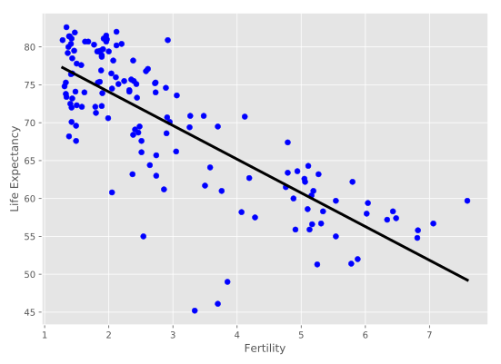

# Chapter 02: Regression

## 01. Which of the following is a regression problem?
Andy introduced regression to you using the Boston housing dataset. But regression models can be used in a variety of contexts to solve a variety of different problems.

Given below are four example applications of machine learning. Your job is to pick the one that is best framed as a regression problem.

### Possible Answers
* An e-commerce company using labeled customer data to predict whether or not a customer will purchase a particular item.
** press 1
* A healthcare company using data about cancer tumors (such as their geometric measurements) to predict whether a new tumor is benign or malignant.
** press 2
* A restaurant using review data to ascribe positive or negative sentiment to a given review.
** press 3
* A bike share company using time and weather data to predict the number of bikes being rented at any given hour.
** press 4

#### Answer:
4

#### Comment:
Great work! The target variable here - the number of bike rentals at any given hour - is quantitative, so this is best framed as a regression problem.

## 02. Importing data for supervised learning
In this chapter, you will work with <a href="https://www.gapminder.org/data/">Gapminder</a> data that we have consolidated into one CSV file available in the workspace as 'gapminder.csv'. Specifically, your goal will be to use this data to predict the life expectancy in a given country based on features such as the country's GDP, fertility rate, and population. As in Chapter 1, the dataset has been preprocessed.

Since the target variable here is quantitative, this is a regression problem. To begin, you will fit a linear regression with just one feature: 'fertility', which is the average number of children a woman in a given country gives birth to. In later exercises, you will use all the features to build regression models.

Before that, however, you need to import the data and get it into the form needed by scikit-learn. This involves creating feature and target variable arrays. Furthermore, since you are going to use only one feature to begin with, you need to do some reshaping using NumPy's .reshape() method. Don't worry too much about this reshaping right now, but it is something you will have to do occasionally when working with scikit-learn so it is useful to practice.

### Instructions:
* Import numpy and pandas as their standard aliases.
* Read the file 'gapminder.csv' into a DataFrame df using the read_csv() function.
* Create array X for the 'fertility' feature and array y for the 'life' target variable.
* Reshape the arrays by using the .reshape() method and passing in -1 and 1.

#### Script:
```
# Import numpy and pandas
import numpy as np
import pandas as pd

# Read the CSV file into a DataFrame: df
df = pd.read_csv('gapminder.csv')

# Create arrays for features and target variable
y = df.life
X = df.fertility

# Print the dimensions of X and y before reshaping
print("Dimensions of y before reshaping: {}".format(y.shape))
print("Dimensions of X before reshaping: {}".format(X.shape))

# Reshape X and y
y = y.reshape(-1, 1)
X = X.reshape(-1, 1)

# Print the dimensions of X and y after reshaping
print("Dimensions of y after reshaping: {}".format(y.shape))
print("Dimensions of X after reshaping: {}".format(X.shape))

```
#### Output:
```
<script.py> output:
    Dimensions of y before reshaping: (139,)
    Dimensions of X before reshaping: (139,)
    Dimensions of y after reshaping: (139, 1)
    Dimensions of X after reshaping: (139, 1)
```
#### Comment:
Great work! Notice the differences in shape before and after applying the .reshape() method. Getting the feature and target variable arrays into the right format for scikit-learn is an important precursor to model building.

## 03. Exploring the Gapminder data
As always, it is important to explore your data before building models. On the right, we have constructed a heatmap showing the correlation between the different features of the Gapminder dataset, which has been pre-loaded into a DataFrame as df and is available for exploration in the IPython Shell. Cells that are in green show positive correlation, while cells that are in red show negative correlation. Take a moment to explore this: Which features are positively correlated with life, and which ones are negatively correlated? Does this match your intuition?

Then, in the IPython Shell, explore the DataFrame using pandas methods such as .info(), .describe(), .head().

In case you are curious, the heatmap was generated using <a href="http://seaborn.pydata.org/generated/seaborn.heatmap.html">Seaborn's heatmap function</a> and the following line of code, where df.corr() computes the pairwise correlation between columns:

sns.heatmap(df.corr(), square=True, cmap='RdYlGn')

Once you have a feel for the data, consider the statements below and select the one that is not true. After this, Hugo will explain the mechanics of linear regression in the next video and you will be on your way building regression models!


### Possible Answer:
* The DataFrame has 139 samples (or rows) and 9 columns.
* life and fertility are negatively correlated.
* The mean of life is 69.602878.
* fertility is of type int64.
* GDP and life are positively correlated.

#### Answer:
4

#### Comment:
Good job! As seen by using df.info(), fertility, along with all the other columns, is of type float64, not int64.

## 04. Fit & predict for regression
Now, you will fit a linear regression and predict life expectancy using just one feature. You saw Andy do this earlier using the 'RM' feature of the Boston housing dataset. In this exercise, you will use the 'fertility' feature of the Gapminder dataset. Since the goal is to predict life expectancy, the target variable here is 'life'. The array for the target variable has been pre-loaded as y and the array for 'fertility' has been pre-loaded as X_fertility.

A scatter plot with 'fertility' on the x-axis and 'life' on the y-axis has been generated. As you can see, there is a strongly negative correlation, so a linear regression should be able to capture this trend. Your job is to fit a linear regression and then predict the life expectancy, overlaying these predicted values on the plot to generate a regression line. You will also compute and print the R2 score using sckit-learn's .score() method.


### Instructions:
* Import LinearRegression from sklearn.linear_model.
* Create a LinearRegression regressor called reg.
* Set up the prediction space to range from the minimum to the maximum of X_fertility. This has been done for you.
* Fit the regressor to the data (X_fertility and y) and compute its predictions using the .predict() method and the prediction_space array.
* Compute and print the R2 score using the .score() method.
* Overlay the plot with your linear regression line. This has been done for you, so hit 'Submit Answer' to see the result!

#### Script:
```
# Import LinearRegression
from sklearn.linear_model import LinearRegression

# Create the regressor: reg
reg = LinearRegression()

# Create the prediction space
prediction_space = np.linspace(min(X_fertility), max(X_fertility)).reshape(-1,1)

# Fit the model to the data
reg.fit(X_fertility, y)

# Compute predictions over the prediction space: y_pred
y_pred = reg.predict(prediction_space)

# Print R^2 
print(reg.score(X_fertility, y))

# Plot regression line
plt.plot(prediction_space, y_pred, color='black', linewidth=3)
plt.show()
```

#### Output:
```
In [2]: reg
Out[2]: LinearRegression(copy_X=True, fit_intercept=True, n_jobs=1, normalize=False)
```
```
In [11]: prediction_space
Out[11]: 
array([[ 1.28      ],
       [ 1.40877551],
       [ 1.53755102],
       [ 1.66632653],
       [ 1.79510204],
       [ 1.92387755],
       [ 2.05265306],
       [ 2.18142857],
       [ 2.31020408],
       [ 2.43897959],
       [ 2.5677551 ],
       [ 2.69653061],
       [ 2.82530612],
       [ 2.95408163],
       [ 3.08285714],
       [ 3.21163265],
       [ 3.34040816],
       [ 3.46918367],
       [ 3.59795918],
       [ 3.72673469],
       [ 3.8555102 ],
       [ 3.98428571],
       [ 4.11306122],
       [ 4.24183673],
       [ 4.37061224],
       [ 4.49938776],
       [ 4.62816327],
       [ 4.75693878],
       [ 4.88571429],
       [ 5.0144898 ],
       [ 5.14326531],
       [ 5.27204082],
       [ 5.40081633],
       [ 5.52959184],
       [ 5.65836735],
       [ 5.78714286],
       [ 5.91591837],
       [ 6.04469388],
       [ 6.17346939],
       [ 6.3022449 ],
       [ 6.43102041],
       [ 6.55979592],
       [ 6.68857143],
       [ 6.81734694],
       [ 6.94612245],
       [ 7.07489796],
       [ 7.20367347],
       [ 7.33244898],
       [ 7.46122449],
       [ 7.59      ]])
```
```
In [13]: prediction_space.shape
Out[13]: (50, 1)
```
```
In [14]: reg.fit(X_fertility, y)
Out[14]: LinearRegression(copy_X=True, fit_intercept=True, n_jobs=1, normalize=False)
```
```
In [16]: y_pred
Out[16]: 
array([[ 77.26904851],
       [ 76.69678573],
       [ 76.12452294],
       [ 75.55226016],
       [ 74.97999737],
       [ 74.40773459],
       [ 73.83547181],
       [ 73.26320902],
       [ 72.69094624],
       [ 72.11868345],
       [ 71.54642067],
       [ 70.97415788],
       [ 70.4018951 ],
       [ 69.82963232],
       [ 69.25736953],
       [ 68.68510675],
       [ 68.11284396],
       [ 67.54058118],
       [ 66.9683184 ],
       [ 66.39605561],
       [ 65.82379283],
       [ 65.25153004],
       [ 64.67926726],
       [ 64.10700447],
       [ 63.53474169],
       [ 62.96247891],
       [ 62.39021612],
       [ 61.81795334],
       [ 61.24569055],
       [ 60.67342777],
       [ 60.10116498],
       [ 59.5289022 ],
       [ 58.95663942],
       [ 58.38437663],
       [ 57.81211385],
       [ 57.23985106],
       [ 56.66758828],
       [ 56.0953255 ],
       [ 55.52306271],
       [ 54.95079993],
       [ 54.37853714],
       [ 53.80627436],
       [ 53.23401157],
       [ 52.66174879],
       [ 52.08948601],
       [ 51.51722322],
       [ 50.94496044],
       [ 50.37269765],
       [ 49.80043487],
       [ 49.22817208]])
```
##### Output of the R^2
```
<script.py> output:
    0.619244216774
```


#### Comment:
Fantastic! Notice how the line captures the underlying trend in the data. And the performance is quite decent for this basic regression model with only one feature!

## 05. Train/test split for regression
As you learned in Chapter 1, train and test sets are vital to ensure that your supervised learning model is able to generalize well to new data. This was true for classification models, and is equally true for linear regression models.

In this exercise, you will split the Gapminder dataset into training and testing sets, and then fit and predict a linear regression over all features. In addition to computing the R2 score, you will also compute the Root Mean Squared Error (RMSE), which is another commonly used metric to evaluate regression models. The feature array X and target variable array y have been pre-loaded for you from the DataFrame df.

### Instructions:
* Import LinearRegression from sklearn.linear_model, mean_squared_error from sklearn.metrics, and train_test_split from sklearn.model_selection.
* Using X and y, create training and test sets such that 30% is used for testing and 70% for training. Use a random state of 42.
* Create a linear regression regressor called reg_all, fit it to the training set, and evaluate it on the test set.
* Compute and print the R2 score using the .score() method on the test set.
* Compute and print the RMSE. To do this, first compute the Mean Squared Error using the mean_squared_error() function with the arguments y_test and y_pred, and then take its square root using np.sqrt().

#### Script:
```
# Import necessary modules
from sklearn.linear_model import LinearRegression
from sklearn.metrics import mean_squared_error
from sklearn.model_selection import train_test_split

# Create training and test sets
X_train, X_test, y_train, y_test = train_test_split(X, y, test_size = 0.3, random_state=42)

# Create the regressor: reg_all
reg_all = LinearRegression()

# Fit the regressor to the training data
reg_all.fit(X_train, y_train)

# Predict on the test data: y_pred
y_pred = reg_all.predict(X_test)

# Compute and print R^2 and RMSE
print("R^2: {}".format(reg_all.score(X_test, y_test)))
rmse = np.sqrt(mean_squared_error(y_test, y_pred))
print("Root Mean Squared Error: {}".format(rmse))

```
#### Output:
```
<script.py> output:
    R^2: 0.838046873142936
    Root Mean Squared Error: 3.2476010800377213
```
#### Comment:
Excellent! Using all features has improved the model score. This makes sense, as the model has more information to learn from. However, there is one potential pitfall to this process. Can you spot it? You'll learn about this as well how to better validate your models in the next video!

## 06. 5-fold cross-validation
Cross-validation is a vital step in evaluating a model. It maximizes the amount of data that is used to train the model, as during the course of training, the model is not only trained, but also tested on all of the available data.

In this exercise, you will practice 5-fold cross validation on the Gapminder data. By default, scikit-learn's cross_val_score() function uses R2 as the metric of choice for regression. Since you are performing 5-fold cross-validation, the function will return 5 scores. Your job is to compute these 5 scores and then take their average.

The DataFrame has been loaded as df and split into the feature/target variable arrays X and y. The modules pandas and numpy have been imported as pd and np, respectively.

### Instructions:
* Import LinearRegression from sklearn.linear_model and cross_val_score from sklearn.model_selection.
* Create a linear regression regressor called reg.
* Use the cross_val_score() function to perform 5-fold cross-validation on X and y.
* Compute and print the average cross-validation score. You can use NumPy's mean() function to compute the average.

#### Script:
```
# Import the necessary modules
from sklearn.linear_model import LinearRegression
from sklearn.model_selection import cross_val_score

# Create a linear regression object: reg
reg = LinearRegression()

# Compute 5-fold cross-validation scores: cv_scores
cv_scores = cross_val_score(reg, X, y, cv = 5)

# Print the 5-fold cross-validation scores
print("cv_scores = {}".format(cv_scores))

print("Average 5-Fold CV Score: {}".format(np.mean(cv_scores)))

```

#### Output:
```
In [3]: reg
Out[3]: LinearRegression(copy_X=True, fit_intercept=True, n_jobs=1, normalize=False)
```
