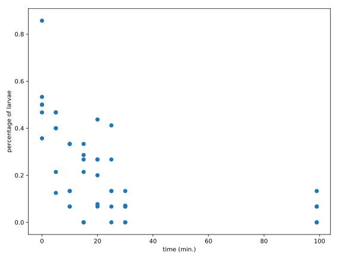

# Pop quiz: examples of flat files
You're now well-versed in importing text files and you're about to become a wiz at importing flat files. But can you remember exactly what a flat file is? Test your knowledge by answering the following question: which of these file types below is NOT an example of a flat file?

## Instructions
Possible Answers <br />
Click or Press Ctrl+1 to focus <br />
* A .csv file.
press 1
* A tab-delimited .txt.
press 2
* A relational database (e.g. PostgreSQL).
press 3

### Answers:3 

# Pop quiz: what exactly are flat files?
Which of the following statements about flat files is incorrect?

## Instructions:
Possible Answers <br />
Click or Press Ctrl+1 to focus <br />
* Flat files consist of rows and each row is called a record.
press 1
* Flat files consist of multiple tables with structured relationships between the tables.
press 2
* A record in a flat file is composed of fields or attributes, each of which contains at most one item of information.
press 3
* Flat files are pervasive in data science.
press 4

# Why we like flat files and the Zen of Python
In PythonLand, there are currently hundreds of Python Enhancement Proposals, commonly referred to as PEPs. PEP8, for example, is a standard style guide for Python, written by our sensei Guido van Rossum himself. It is the basis for how we here at DataCamp ask our instructors to style their code. Another one of my favorites is PEP20, commonly called the Zen of Python. Its abstract is as follows:

Long time Pythoneer Tim Peters succinctly channels the BDFL's guiding principles for Python's design into 20 aphorisms, only 19 of which have been written down.

If you don't know what the acronym BDFL stands for, I suggest that you look here. You can print the Zen of Python in your shell by typing import this into it! You're going to do this now and the 5th aphorism (line) will say something of particular interest.

The question you need to answer is: what is the 5th aphorism of the Zen of Python?

## Instructions:
Possible Answers <br />
* Flat is better than nested. <br />
press 1
* Flat files are essential for data science. <br />
press 2
* The world is representable as a flat file. <br />
press 3
* Flatness is in the eye of the beholder. <br />
press 4

### Output:
```
In [1]: import this
The Zen of Python, by Tim Peters

Beautiful is better than ugly.
Explicit is better than implicit.
Simple is better than complex.
Complex is better than complicated.
Flat is better than nested.
Sparse is better than dense.
Readability counts.
Special cases aren't special enough to break the rules.
Although practicality beats purity.
Errors should never pass silently.
Unless explicitly silenced.
In the face of ambiguity, refuse the temptation to guess.
There should be one-- and preferably only one --obvious way to do it.
Although that way may not be obvious at first unless you're Dutch.
Now is better than never.
Although never is often better than *right* now.
If the implementation is hard to explain, it's a bad idea.
If the implementation is easy to explain, it may be a good idea.
Namespaces are one honking great idea -- let's do more of those!
```
# Using NumPy to import flat files
In this exercise, you're now going to load the MNIST digit recognition dataset using the numpy function loadtxt() and see just how easy it can be:

The first argument will be the filename.
The second will be the delimiter which, in this case, is a comma.
You can find more information about the MNIST dataset here on the webpage of Yann LeCun, who is currently Director of AI Research at Facebook and Founding Director of the NYU Center for Data Science, among many other things.

## Instructions:
* Fill in the arguments of np.loadtxt() by passing file and a comma ',' for the delimiter.
* Fill in the argument of print() to print the type of the object digits. Use the function type().
* Execute the rest of the code to visualize one of the rows of the data.

```{python}
# Import package
import numpy as np

# Assign filename to variable: file
file = 'digits.csv'

# Load file as array: digits
digits = np.loadtxt(file, delimiter=',')

# Print datatype of digits
print(type(digits))

# Select and reshape a row
im = digits[21, 1:]
im_sq = np.reshape(im, (28, 28))

# Plot reshaped data (matplotlib.pyplot already loaded as plt)
plt.imshow(im_sq, cmap='Greys', interpolation='nearest')
plt.show()
```

### Output:
```
In [1]: # Import package
        import numpy as np
        
        # Assign filename to variable: file
        file = 'digits.csv'

In [2]: # Load file as array: digits
        digits = np.loadtxt(file, delimiter=',')

In [3]: # Print datatype of digits
        print(type(digits))
<class 'numpy.ndarray'>

In [4]: ?loadtxt
Object `loadtxt` not found.

<script.py> output:
    <class 'numpy.ndarray'>
```

#### Comments:
Nice, that was a challenging one.

# Customizing your NumPy import
What if there are rows, such as a header, that you don't want to import? What if your file has a delimiter other than a comma? What if you only wish to import particular columns?

There are a number of arguments that np.loadtxt() takes that you'll find useful: delimiter changes the delimiter that loadtxt() is expecting, for example, you can use ',' and '\t' for comma-delimited and tab-delimited respectively; skiprows allows you to specify how many rows (not indices) you wish to skip; usecols takes a list of the indices of the columns you wish to keep.

The file that you'll be importing, digits_header.txt,

* has a header
* is tab-delimited.

## Instructions
* Complete the arguments of np.loadtxt(): the file you're importing is tab-delimited, you want to skip the first row and you only want to import the first and third columns.
* Complete the argument of the print() call in order to print the entire array that you just imported.

```{python}
# Import numpy
import numpy as np

# Assign the filename: file
file = 'digits_header.txt'

# Load the data: data
data = np.loadtxt(file, delimiter='\t', skiprows=1, usecols=[0,2])

# Print data
print(data)
```
### Output:
```
<script.py> output:
    [[ 0.  0.]
     [ 0.  0.]
     [ 0.  0.]
     [ 0.  0.]
     [ 0.  0.]
     [ 0.  0.]
     [ 0.  0.]
     [ 0.  0.]
     [ 0.  0.]
     [ 0.  0.]
     [ 0.  0.]
     [ 0.  0.]
     [ 0.  0.]
     [ 0.  0.]
     [ 0.  0.]
     [ 0.  0.]
     [ 0.  0.]
     [ 0.  0.]
     [ 0.  0.]
     [ 0.  0.]
     [ 0.  0.]
     [ 0.  0.]
     [ 0.  0.]
     [ 0.  0.]
     [ 0.  0.]
     [ 0.  0.]
     [ 0.  0.]
     [ 0.  0.]
     [ 0.  0.]
     [ 0.  0.]
     [ 0.  0.]
     [ 0.  0.]
     [ 0.  0.]
     [ 0.  0.]
     [ 0.  0.]
     [ 0.  0.]
     [ 0.  0.]
     [ 0.  0.]
     [ 0.  0.]
     [ 0.  0.]
     [ 0.  0.]
     [ 0.  0.]
     [ 0.  0.]
     [ 0.  0.]
     [ 0.  0.]
     [ 0.  0.]
     [ 0.  0.]
     [ 0.  0.]
     [ 0.  0.]
     [ 0.  0.]
     [ 0.  0.]
     [ 0.  0.]
     [ 0.  0.]
     [ 0.  0.]
     [ 0.  0.]
     [ 0.  0.]
     [ 0.  0.]
     [ 0.  0.]
     [ 0.  0.]
     [ 0.  0.]
     [ 0.  0.]
     [ 0.  0.]
     [ 0.  0.]
     [ 0.  0.]
     [ 0.  0.]
     [ 0.  0.]
     [ 0.  0.]
     [ 0.  0.]
     [ 0.  0.]
     [ 0.  0.]
     [ 0.  0.]
     [ 0.  0.]
     [ 0.  0.]
     [ 0.  0.]
     [ 0.  0.]
     [ 0.  0.]
     [ 0.  0.]
     [ 0.  0.]
     [ 0.  0.]
     [ 0.  0.]
     [ 0.  0.]
     [ 0.  0.]
     [ 0.  0.]
     [ 0.  0.]
     [ 0.  0.]
     [ 0.  0.]
     [ 0.  0.]
     [ 0.  0.]
     [ 0.  0.]
     [ 0.  0.]
     [ 0.  0.]
     [ 0.  0.]
     [ 0.  0.]
     [ 0.  0.]
     [ 0.  0.]
     [ 0.  0.]
     [ 0.  0.]
     [ 0.  0.]
     [ 0.  0.]
     [ 0.  0.]]

<script.py> output:
    [[ 1.  0.]
     [ 0.  0.]
     [ 1.  0.]
     [ 4.  0.]
     [ 0.  0.]
     [ 0.  0.]
     [ 7.  0.]
     [ 3.  0.]
     [ 5.  0.]
     [ 3.  0.]
     [ 8.  0.]
     [ 9.  0.]
     [ 1.  0.]
     [ 3.  0.]
     [ 3.  0.]
     [ 1.  0.]
     [ 2.  0.]
     [ 0.  0.]
     [ 7.  0.]
     [ 5.  0.]
     [ 8.  0.]
     [ 6.  0.]
     [ 2.  0.]
     [ 0.  0.]
     [ 2.  0.]
     [ 3.  0.]
     [ 6.  0.]
     [ 9.  0.]
     [ 9.  0.]
     [ 7.  0.]
     [ 8.  0.]
     [ 9.  0.]
     [ 4.  0.]
     [ 9.  0.]
     [ 2.  0.]
     [ 1.  0.]
     [ 3.  0.]
     [ 1.  0.]
     [ 1.  0.]
     [ 4.  0.]
     [ 9.  0.]
     [ 1.  0.]
     [ 4.  0.]
     [ 4.  0.]
     [ 2.  0.]
     [ 6.  0.]
     [ 3.  0.]
     [ 7.  0.]
     [ 7.  0.]
     [ 4.  0.]
     [ 7.  0.]
     [ 5.  0.]
     [ 1.  0.]
     [ 9.  0.]
     [ 0.  0.]
     [ 2.  0.]
     [ 2.  0.]
     [ 3.  0.]
     [ 9.  0.]
     [ 1.  0.]
     [ 1.  0.]
     [ 1.  0.]
     [ 5.  0.]
     [ 0.  0.]
     [ 6.  0.]
     [ 3.  0.]
     [ 4.  0.]
     [ 8.  0.]
     [ 1.  0.]
     [ 0.  0.]
     [ 3.  0.]
     [ 9.  0.]
     [ 6.  0.]
     [ 2.  0.]
     [ 6.  0.]
     [ 4.  0.]
     [ 7.  0.]
     [ 1.  0.]
     [ 4.  0.]
     [ 1.  0.]
     [ 5.  0.]
     [ 4.  0.]
     [ 8.  0.]
     [ 9.  0.]
     [ 2.  0.]
     [ 9.  0.]
     [ 9.  0.]
     [ 8.  0.]
     [ 9.  0.]
     [ 6.  0.]
     [ 3.  0.]
     [ 6.  0.]
     [ 4.  0.]
     [ 6.  0.]
     [ 2.  0.]
     [ 9.  0.]
     [ 1.  0.]
     [ 2.  0.]
     [ 0.  0.]
     [ 5.  0.]]
```
#### Comments:
Good job!

# Importing different datatypes
The file seaslug.txt

* has a text header, consisting of strings
* is tab-delimited.
These data consists of percentage of sea slug larvae that had metamorphosed in a given time period. Read more <a href="http://www.stat.ucla.edu/projects/datasets/seaslug-explanation.html">here</a>.

Due to the header, if you tried to import it as-is using np.loadtxt(), Python would throw you a ValueError and tell you that it could not convert string to float. There are two ways to deal with this: firstly, you can set the data type argument dtype equal to str (for string).

Alternatively, you can skip the first row as we have seen before, using the skiprows argument.

## Instructions:
* Complete the first call to np.loadtxt() by passing file as the first argument.
* Execute print(data[0]) to print the first element of data.
* Complete the second call to np.loadtxt(). The file you're importing is tab-delimited, the datatype is float, and you want to skip the first row.
* Print the 10th element of data_float by completing the print() command. Be guided by the previous print() call.
* Execute the rest of the code to visualize the data.

```{python}
# Assign filename: file
file = 'seaslug.txt'

# Import file: data
data = np.loadtxt(file, delimiter='\t', dtype=str)

# Print the first element of data
print(data[0])

# Import data as floats and skip the first row: data_float
data_float = np.loadtxt(file, delimiter='\t', dtype=float, skiprows=1)

# Print the 10th element of data_float
print(data_float[9])

# Plot a scatterplot of the data
plt.scatter(data_float[:, 0], data_float[:, 1])
plt.xlabel('time (min.)')
plt.ylabel('percentage of larvae')
plt.show()
```


### Output:
```
<script.py> output:
    ["b'Time'" "b'Percent'"]
    [ 0.     0.357]
```
#### Comments:
Nice!

# Working with mixed datatypes (1)
Much of the time you will need to import datasets which have different datatypes in different columns; one column may contain strings and another floats, for example. The function np.loadtxt() will freak at this. There is another function, np.genfromtxt(), which can handle such structures. If we pass dtype=None to it, it will figure out what types each column should be.

Import 'titanic.csv' using the function np.genfromtxt() as follows:
```
data = np.genfromtxt('titanic.csv', delimiter=',', names=True, dtype=None)
```
Here, the first argument is the filename, the second specifies the delimiter , and the third argument names tells us there is a header. Because the data are of different types, data is an object called a structured array. Because numpy arrays have to contain elements that are all the same type, the structured array solves this by being a 1D array, where each element of the array is a row of the flat file imported. You can test this by checking out the array's shape in the shell by executing np.shape(data).

Accessing rows and columns of structured arrays is super-intuitive: to get the ith row, merely execute data[i] and to get the column with name 'Fare', execute data['Fare'].

Print the entire column with name Survived to the shell. What are the last 4 values of this column?

## Instructions:
Possible Answers <br />
* 1,0,0,1. <br />
press 1
* 1,2,0,0. <br />
press 2
* 1,0,1,0.  <br />
press 3
* 0,1,1,1.  <br />
press 4

### Output:
```
In [6]: data['Survived']
Out[6]: 
array([0, 1, 1, 1, 0, 0, 0, 0, 1, 1, 1, 1, 0, 0, 0, 1, 0, 1, 0, 1, 0, 1, 1,
       1, 0, 1, 0, 0, 1, 0, 0, 1, 1, 0, 0, 0, 1, 0, 0, 1, 0, 0, 0, 1, 1, 0,
       0, 1, 0, 0, 0, 0, 1, 1, 0, 1, 1, 0, 1, 0, 0, 1, 0, 0, 0, 1, 1, 0, 1,
       0, 0, 0, 0, 0, 1, 0, 0, 0, 1, 1, 0, 1, 1, 0, 1, 1, 0, 0, 1, 0, 0, 0,
       0, 0, 0, 0, 0, 1, 1, 0, 0, 0, 0, 0, 0, 0, 1, 1, 0, 1, 0, 0, 0, 0, 0,
       0, 0, 0, 0, 0, 0, 0, 0, 1, 0, 1, 0, 1, 1, 0, 0, 0, 0, 1, 0, 0, 1, 0,
       0, 0, 0, 1, 1, 0, 0, 0, 1, 0, 0, 0, 0, 1, 0, 0, 0, 0, 1, 0, 0, 0, 0,
       1, 0, 0, 0, 1, 1, 0, 0, 0, 0, 0, 1, 0, 0, 0, 0, 0, 0, 0, 0, 0, 0, 1,
       1, 0, 1, 1, 0, 0, 1, 0, 1, 1, 1, 1, 0, 0, 1, 0, 0, 0, 0, 0, 1, 0, 0,
       1, 1, 1, 0, 1, 0, 0, 0, 1, 1, 0, 1, 0, 1, 0, 0, 0, 1, 0, 1, 0, 0, 0,
       1, 0, 0, 1, 0, 0, 0, 1, 0, 0, 0, 1, 0, 0, 0, 0, 0, 1, 1, 0, 0, 0, 0,
       0, 0, 1, 1, 1, 1, 1, 0, 1, 0, 0, 0, 0, 0, 1, 1, 1, 0, 1, 1, 0, 1, 1,
       0, 0, 0, 1, 0, 0, 0, 1, 0, 0, 1, 0, 1, 1, 1, 1, 0, 0, 0, 0, 0, 0, 1,
       1, 1, 1, 0, 1, 0, 1, 1, 1, 0, 1, 1, 1, 0, 0, 0, 1, 1, 0, 1, 1, 0, 0,
       1, 1, 0, 1, 0, 1, 1, 1, 1, 0, 0, 0, 1, 0, 0, 1, 1, 0, 1, 1, 0, 0, 0,
       1, 1, 1, 1, 0, 0, 0, 0, 0, 0, 0, 1, 0, 1, 1, 0, 0, 0, 0, 0, 0, 1, 1,
       1, 1, 1, 0, 0, 0, 0, 1, 1, 0, 0, 0, 1, 1, 0, 1, 0, 0, 0, 1, 0, 1, 1,
       1, 0, 1, 1, 0, 0, 0, 0, 1, 1, 0, 0, 0, 0, 0, 0, 1, 0, 0, 0, 0, 1, 0,
       1, 0, 1, 1, 0, 0, 0, 0, 0, 0, 0, 0, 1, 1, 0, 1, 1, 1, 1, 0, 0, 1, 0,
       1, 0, 0, 1, 0, 0, 1, 1, 1, 1, 1, 1, 1, 0, 0, 0, 1, 0, 1, 0, 1, 1, 0,
       1, 0, 0, 0, 0, 0, 0, 0, 0, 1, 0, 0, 1, 1, 0, 0, 0, 0, 0, 1, 0, 0, 0,
       1, 1, 0, 1, 0, 0, 1, 0, 0, 0, 0, 0, 0, 1, 0, 0, 0, 0, 0, 0, 0, 1, 0,
       1, 1, 0, 1, 1, 0, 1, 1, 0, 0, 1, 0, 1, 0, 1, 0, 0, 1, 0, 0, 1, 0, 0,
       0, 1, 0, 0, 1, 0, 1, 0, 1, 0, 1, 1, 0, 0, 1, 0, 0, 1, 1, 0, 1, 1, 0,
       0, 1, 1, 0, 1, 0, 1, 1, 0, 0, 0, 0, 0, 0, 0, 0, 0, 1, 1, 1, 1, 1, 0,
       0, 1, 1, 0, 1, 1, 1, 0, 0, 0, 1, 0, 1, 0, 0, 0, 1, 0, 0, 0, 0, 1, 0,
       0, 1, 1, 0, 0, 0, 1, 0, 0, 1, 1, 1, 0, 0, 1, 0, 0, 1, 0, 0, 1, 0, 0,
       1, 1, 0, 0, 0, 0, 1, 0, 0, 1, 0, 1, 0, 0, 1, 0, 0, 0, 0, 0, 1, 0, 1,
       1, 1, 0, 1, 0, 1, 0, 1, 0, 1, 0, 0, 0, 0, 0, 0, 1, 0, 0, 0, 1, 0, 0,
       0, 0, 1, 1, 0, 0, 1, 0, 0, 0, 1, 0, 1, 0, 1, 0, 0, 0, 0, 0, 0, 0, 1,
       1, 1, 1, 0, 0, 0, 0, 1, 0, 0, 1, 1, 0, 0, 0, 0, 1, 1, 1, 1, 1, 0, 1,
       0, 0, 0, 1, 1, 0, 0, 1, 0, 0, 0, 1, 0, 1, 1, 0, 0, 1, 0, 0, 0, 0, 0,
       0, 1, 0, 0, 1, 0, 1, 0, 1, 0, 0, 1, 0, 0, 1, 1, 0, 0, 1, 1, 0, 0, 0,
       1, 0, 0, 1, 1, 0, 1, 0, 0, 0, 0, 0, 0, 0, 0, 1, 0, 0, 1, 0, 1, 1, 1,
       0, 0, 0, 0, 1, 0, 1, 0, 0, 0, 0, 0, 0, 0, 1, 1, 0, 0, 0, 1, 1, 1, 1,
       0, 0, 0, 0, 1, 0, 0, 0, 0, 0, 0, 0, 0, 0, 0, 1, 1, 0, 1, 0, 0, 0, 1,
       1, 1, 1, 1, 0, 0, 0, 1, 0, 0, 1, 1, 0, 0, 1, 0, 0, 0, 0, 0, 0, 1, 0,
       0, 0, 1, 0, 1, 1, 1, 1, 0, 0, 0, 1, 0, 0, 1, 1, 0, 0, 1, 0, 1, 0, 0,
       1, 1, 0, 0, 0, 1, 1, 0, 0, 0, 0, 0, 0, 1, 0, 1, 0])
```
### Answer:
3

#### Comments:
Correct!

# Working with mixed datatypes (2)
You have just used np.genfromtxt() to import data containing mixed datatypes. There is also another function np.recfromcsv() that behaves similarly to np.genfromtxt(), except that its default dtype is None. In this exercise, you'll practice using this to achieve the same result.

## Instructions:
* Import titanic.csv using the function np.recfromcsv() and assign it to the variable, d. You'll only need to pass file to it because it has the defaults delimiter=',' and names=True in addition to dtype=None!
* Run the remaining code to print the first three entries of the resulting array d.

```{python}
# Assign the filename: file
file = 'titanic.csv'

# Import file using np.recfromcsv: d
d = np.recfromcsv(file)

# Print out first three entries of d
print(d[:3])
```
### Output:
```
<script.py> output:
    [(1, 0, 3, b'male', 22.0, 1, 0, b'A/5 21171', 7.25, b'', b'S')
     (2, 1, 1, b'female', 38.0, 1, 0, b'PC 17599', 71.2833, b'C85', b'C')
     (3, 1, 3, b'female', 26.0, 0, 0, b'STON/O2. 3101282', 7.925, b'', b'S')]
```

#### Comments:
Good job. 
