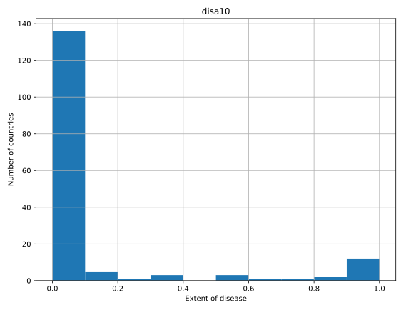

# Chapter 2: Importing data from other file types

## Not so flat any more
In Chapter 1, you learned how to use the IPython magic command ! ls to explore your current working directory. You can also do this natively in Python using the library os, which consists of miscellaneous operating system interfaces.

The first line of the following code imports the library os, the second line stores the name of the current directory in a string called wd and the third outputs the contents of the directory in a list to the shell.
```
import os
wd = os.getcwd()
os.listdir(wd)
```
Run this code in the IPython shell and answer the following questions. Ignore the files that begin with ..

Check out the contents of your current directory and answer the following questions: (1) which file is in your directory strucand NOT an example of a flat file; (2) why is it not a flat file?

### Instructions:
Possible Answers <br />
* database.db is not a flat file because relational databases contain structured relationships and flat files do not. <br />
press 1
*battledeath.xlsx is not a flat because it is a spreadsheet consisting of many sheets, not a single table. <br />
press 2
* titanic.txt is not a flat file because it is a .txt, not a .csv. <br />
press 3

```
In [1]: import os

In [2]: wd = os.getcwd()

In [3]: os.listdir(wd)
Out[3]: ['titanic.txt', 'battledeath.xlsx']
```
#### Comments:
Correct!

## Loading a pickled file
There are a number of datatypes that cannot be saved easily to flat files, such as lists and dictionaries. If you want your files to be human readable, you may want to save them as text files in a clever manner. JSONs, which you will see in a later chapter, are appropriate for Python dictionaries.

However, if you merely want to be able to import them into Python, you can serialize them. All this means is converting the object into a sequence of bytes, or a bytestream.

In this exercise, you'll import the pickle package, open a previously pickled data structure from a file and load it.

### Instructions:
* Import the pickle package.
* Complete the second argument of open() so that it is read only for a binary file. This argument will be a string of two letters, one signifying 'read only', the other 'binary'.
* Pass the correct argument to pickle.load(); it should use the variable that is bound to open.
* Print the data, d.
* Print the datatype of d; take your mind back to your previous use of the function type().

```{python}
# Import pickle package
import pickle

# Open pickle file and load data: d
with open('data.pkl', 'rb') as file:
    d = pickle.load(file)

# Print d
print(d)

# Print datatype of d
print(type(d))

```
#### Output:
```
<script.py> output:
    {'Airline': '8', 'June': '69.4', 'Aug': '85', 'Mar': '84.4'}
    <class 'dict'>
```

##### Comments:
Awesome!

## Listing sheets in Excel files
Whether you like it or not, any working data scientist will need to deal with Excel spreadsheets at some point in time. You won't always want to do so in Excel, however!

Here, you'll learn how to use pandas to import Excel spreadsheets and how to list the names of the sheets in any loaded .xlsx file.

Recall from the video that, given an Excel file imported into a variable spreadsheet, you can retrieve a list of the sheet names using the attribute spreadsheet.sheet_names.

Specifically, you'll be loading and checking out the spreadsheet 'battledeath.xlsx', modified from the Peace Research Institute Oslo's (PRIO) dataset. This data contains age-adjusted mortality rates due to war in various countries over several years.

### Instructions
* Assign the filename to the variable file.
* Pass the correct argument to pd.ExcelFile() to load the file using pandas.
* Print the sheetnames of the Excel spreadsheet by passing the necessary argument to the print() function.

```{python}
# Import pandas
import pandas as pd

# Assign spreadsheet filename: file
file = 'battledeath.xlsx'

# Load spreadsheet: xl
xl = pd.ExcelFile(file)

# Print sheet names
print(xl.sheet_names)
```
#### Output:
```
<script.py> output:
    ['2002', '2004']
```

##### Comments:
Good job!

## Importing sheets from Excel files
In the previous exercises, you saw that the Excel file contains two sheets, '2002' and '2004'. The next step is to import these.

In this exercise, you'll learn how to import any given sheet of your loaded .xlsx file as a DataFrame. You'll be able to do so by specifying either the sheet's name or its index.

The spreadsheet 'battledeath.xlsx' is already loaded as xl.

### Instructions:
* Load the sheet '2004' into the DataFrame df1 using its name as a string.
* Print the head of df1 to the shell.
* Load the sheet 2002 into the DataFrame df2 using its index (0).
* Print the head of df2 to the shell.

```{python}
# Load a sheet into a DataFrame by name: df1
df1 = xl.parse('2004')

# Print the head of the DataFrame df1
print(df1.head())

# Load a sheet into a DataFrame by index: df2
df2 = xl.parse('2002')

# Print the head of the DataFrame df2
print(df2.head())
```
#### Output:
```
<script.py> output:
      War(country)      2004
    0  Afghanistan  9.451028
    1      Albania  0.130354
    2      Algeria  3.407277
    3      Andorra  0.000000
    4       Angola  2.597931
      War, age-adjusted mortality due to       2002
    0                        Afghanistan  36.083990
    1                            Albania   0.128908
    2                            Algeria  18.314120
    3                            Andorra   0.000000
    4                             Angola  18.964560
```

##### Comments:
Awesome! You'll typically find yourself referring to the Excel sheet by name, but it's good to know you can also use indexes

## Customizing your spreadsheet import
Here, you'll parse your spreadsheets and use additional arguments to skip rows, rename columns and select only particular columns.

The spreadsheet 'battledeath.xlsx' is already loaded as xl.

As before, you'll use the method parse(). This time, however, you'll add the additional arguments skiprows, names and parse_cols. These skip rows, name the columns and designate which columns to parse, respectively. All these arguments can be assigned to lists containing the specific row numbers, strings and column numbers, as appropriate.

### Instructions:
* Parse the first sheet by index. In doing so, skip the first row of data and name the columns 'Country' and 'AAM due to War (2002)' using the argument names. The values passed to skiprows and names all need to be of type list.
* Parse the second sheet by index. In doing so, parse only the first column with the parse_cols parameter, skip the first row and rename the column 'Country'. The argument passed to parse_cols also needs to be of type list.

```{python}
# Parse the first sheet and rename the columns: df1
df1 = xl.parse(xl.sheet_names[0], skiprows=1, names=["Country", "AAM due to War (2002)"])

# Print the head of the DataFrame df1
print(df1.head())

# Parse the first column of the second sheet and rename the column: df2
df2 = xl.parse(xl.sheet_names[1], parse_cols=0, skiprows=1, names=['Country'])

# Print the head of the DataFrame df2
print(df2.head())
```

#### Output:
```
<script.py> output:
                   Country  AAM due to War (2002)
    0              Albania               0.128908
    1              Algeria              18.314120
    2              Andorra               0.000000
    3               Angola              18.964560
    4  Antigua and Barbuda               0.000000
                   Country
    0              Albania
    1              Algeria
    2              Andorra
    3               Angola
    4  Antigua and Barbuda
```

##### Comments:
Awesome!

## How to import SAS7BDAT
How do you correctly import the function SAS7BDAT() from the package sas7bdat?

### Instructions:
Possible Answers <br />
* import SAS7BDAT from sas7bdat <br />
press 1
* from SAS7BDAT import sas7bdat <br />
press 2
* import sas7bdat from SAS7BDAT <br />
press 3
* from sas7bdat import SAS7BDAT <br />
press 4

#### Comments:
Correct!

## Importing SAS files
In this exercise, you'll figure out how to import a SAS file as a DataFrame using SAS7BDAT and pandas. The file 'sales.sas7bdat' is already in your working directory and both pandas and matplotlib.pyplot have already been imported as follows:
```
import pandas as pd
import matplotlib.pyplot as plt
```
The data are adapted from the website of the undergraduate text book Principles of Econometrics by Hill, Griffiths and Lim.

### Instructions
* Import the module SAS7BDAT from the library sas7bdat.
* In the context of the file 'sales.sas7bdat', load its contents to a DataFrame df_sas, using the method to_data_frame() on the object file.
* Print the head of the DataFrame df_sas.
* Execute your entire script to produce a histogram plot!

```{python}
# Import sas7bdat package
from sas7bdat import SAS7BDAT

# Save file to a DataFrame: df_sas
with SAS7BDAT('sales.sas7bdat') as file:
    # converting sas object to dataframe
    df_sas = file.to_data_frame()

# Print head of DataFrame
print(df_sas.head())

# Plot histogram of DataFrame features (pandas and pyplot already imported)
# selection using double bracket [['P']] returns a result in dataframe format. 
# if we want a result in series format, use single bracket ['P']
pd.DataFrame.hist(df_sas[['P']])
plt.ylabel('count')
plt.show()
```
#### Output:
```
<script.py> output:
         YEAR     P           S
    0  1950.0  12.9  181.899994
    1  1951.0  11.9  245.000000
    2  1952.0  10.7  250.199997
    3  1953.0  11.3  265.899994
    4  1954.0  11.2  248.500000
```


##### Comments:
Awesome!

## Using read_stata to import Stata files
The pandas package has been imported in the environment as pd and the file disarea.dta is in your working directory. The data consist of disease extents for several diseases in various countries (more information can be found here).

What is the correct way of using the read_stata() function to import disarea.dta into the object df?

### Possible Answers
* df = 'disarea.dta'  &emsp;&emsp; press 1
* df = read_stata.pd('disarea.dta')    &emsp;&emsp; press 2
* df = pd.read_stata('disarea.dta')    &emsp;&emsp; press 3
* df = pd.read_stata(disarea.dta)      &emsp;&emsp; press 4

#### Answer:
4

##### Comments:
Correct.

## Importing Stata files
Here, you'll gain expertise in importing Stata files as DataFrames using the pd.read_stata() function from pandas. The last exercise's file, 'disarea.dta', is still in your working directory.

### Instructions:
* Use pd.read_stata() to load the file 'disarea.dta' into the DataFrame df.
* Print the head of the DataFrame df.
* Visualize your results by plotting a histogram of the column disa10. We’ve already provided this code for you, so just run it!

```{python}
# Import pandas
import pandas as pd

# Load Stata file into a pandas DataFrame: df
df =  pd.read_stata('disarea.dta')

# Print the head of the DataFrame df
print(df.head())

# Plot histogram of one column of the DataFrame
pd.DataFrame.hist(df[['disa10']])
plt.xlabel('Extent of disease')
plt.ylabel('Number of countries')
plt.show()
```
#### Output:
```
<script.py> output:
      wbcode               country  disa1  disa2  disa3  disa4  disa5  disa6  \
    0    AFG           Afghanistan   0.00   0.00   0.76   0.73    0.0   0.00   
    1    AGO                Angola   0.32   0.02   0.56   0.00    0.0   0.00   
    2    ALB               Albania   0.00   0.00   0.02   0.00    0.0   0.00   
    3    ARE  United Arab Emirates   0.00   0.00   0.00   0.00    0.0   0.00   
    4    ARG             Argentina   0.00   0.24   0.24   0.00    0.0   0.23   
    
       disa7  disa8   ...    disa16  disa17  disa18  disa19  disa20  disa21  \
    0   0.00    0.0   ...       0.0     0.0     0.0    0.00    0.00     0.0   
    1   0.56    0.0   ...       0.0     0.4     0.0    0.61    0.00     0.0   
    2   0.00    0.0   ...       0.0     0.0     0.0    0.00    0.00     0.0   
    3   0.00    0.0   ...       0.0     0.0     0.0    0.00    0.00     0.0   
    4   0.00    0.0   ...       0.0     0.0     0.0    0.00    0.05     0.0   
    
       disa22  disa23  disa24  disa25  
    0    0.00    0.02    0.00    0.00  
    1    0.99    0.98    0.61    0.00  
    2    0.00    0.00    0.00    0.16  
    3    0.00    0.00    0.00    0.00  
    4    0.00    0.01    0.00    0.11  
    
    [5 rows x 27 columns]
```
 

##### Comment:
Great job!

## Using File to import HDF5 files
The h5py package has been imported in the environment and the file LIGO_data.hdf5 is loaded in the object h5py_file.

What is the correct way of using the h5py function, File(), to import the file in h5py_file into an object, h5py_data, for reading only?

### Possible Answers
* h5py_data = File(h5py_file, 'r')  &emsp;&emsp; press 1
* h5py_data = h5py.File(h5py_file, 'r')   &emsp;&emsp; press 2
* h5py_data = h5py.File(h5py_file, read)   &emsp;&emsp;   press 3
* h5py_data = h5py.File(h5py_file, 'read')   &emsp;&emsp;   press 

#### Answer:
2

##### Comment:
Correct!
