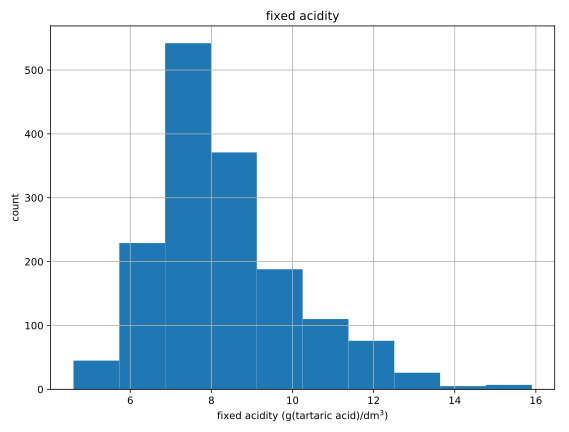

# Chapter 01: Importing Data from The Internet

## Importing flat files from the web: your turn!
You are about to import your first file from the web! The flat file you will import will be 'winequality-red.csv' from the University of California, Irvine's Machine Learning repository. The flat file contains tabular data of physiochemical properties of red wine, such as pH, alcohol content and citric acid content, along with wine quality rating.

The URL of the file is
```
'https://s3.amazonaws.com/assets.datacamp.com/production/course_1606/datasets/winequality-red.csv
```
After you import it, you'll check your working directory to confirm that it is there and then you'll load it into a pandas DataFrame.

### Instructions
* Import the function urlretrieve from the subpackage urllib.request.
* Assign the URL of the file to the variable url.
* Use the function urlretrieve() to save the file locally as 'winequality-red.csv'.
* Execute the remaining code to load 'winequality-red.csv' in a pandas DataFrame and to print its head to the shell.

```{python}
# Import package
from urllib.request import urlretrieve

# Import pandas
import pandas as pd

# Assign url of file: url
url = 'https://s3.amazonaws.com/assets.datacamp.com/production/course_1606/datasets/winequality-red.csv'

# Save file locally
urlretrieve(url, 'winequality-red.csv')

# Read file into a DataFrame and print its head
df = pd.read_csv('winequality-red.csv', sep=';')
print(df.head())

```
#### Output:
```
<script.py> output:
       fixed acidity  volatile acidity  citric acid  residual sugar  chlorides  \
    0            7.4              0.70         0.00             1.9      0.076   
    1            7.8              0.88         0.00             2.6      0.098   
    2            7.8              0.76         0.04             2.3      0.092   
    3           11.2              0.28         0.56             1.9      0.075   
    4            7.4              0.70         0.00             1.9      0.076   
    
       free sulfur dioxide  total sulfur dioxide  density    pH  sulphates  \
    0                 11.0                  34.0   0.9978  3.51       0.56   
    1                 25.0                  67.0   0.9968  3.20       0.68   
    2                 15.0                  54.0   0.9970  3.26       0.65   
    3                 17.0                  60.0   0.9980  3.16       0.58   
    4                 11.0                  34.0   0.9978  3.51       0.56   
    
       alcohol  quality  
    0      9.4        5  
    1      9.8        5  
    2      9.8        5  
    3      9.8        6  
    4      9.4        5
```

##### Comment:
Awesome!

## Opening and reading flat files from the web
You have just imported a file from the web, saved it locally and loaded it into a DataFrame. If you just wanted to load a file from the web into a DataFrame without first saving it locally, you can do that easily using pandas. In particular, you can use the function pd.read_csv() with the URL as the first argument and the separator sep as the second argument.

The URL of the file, once again, is
```
'https://s3.amazonaws.com/assets.datacamp.com/production/course_1606/datasets/winequality-red.csv'
```

### Instructions:
* Assign the URL of the file to the variable url.
* Read file into a DataFrame df using pd.read_csv(), recalling that the separator in the file is ';'.
* Print the head of the DataFrame df.
* Execute the rest of the code to plot histogram of the first feature in the DataFrame df.

```{python}
# Import packages
import matplotlib.pyplot as plt
import pandas as pd

# Assign url of file: url
url = 'https://s3.amazonaws.com/assets.datacamp.com/production/course_1606/datasets/winequality-red.csv'

# Read file into a DataFrame: df
df = pd.read_csv(url, sep=';')

# Print the head of the DataFrame
print(df.head())

# Plot first column of df
pd.DataFrame.hist(df.ix[:, 0:1])
plt.xlabel('fixed acidity (g(tartaric acid)/dm$^3$)')
plt.ylabel('count')
plt.show()
```
#### Output:
```
<script.py> output:
       fixed acidity  volatile acidity  citric acid  residual sugar  chlorides  \
    0            7.4              0.70         0.00             1.9      0.076   
    1            7.8              0.88         0.00             2.6      0.098   
    2            7.8              0.76         0.04             2.3      0.092   
    3           11.2              0.28         0.56             1.9      0.075   
    4            7.4              0.70         0.00             1.9      0.076   
    
       free sulfur dioxide  total sulfur dioxide  density    pH  sulphates  \
    0                 11.0                  34.0   0.9978  3.51       0.56   
    1                 25.0                  67.0   0.9968  3.20       0.68   
    2                 15.0                  54.0   0.9970  3.26       0.65   
    3                 17.0                  60.0   0.9980  3.16       0.58   
    4                 11.0                  34.0   0.9978  3.51       0.56   
    
       alcohol  quality  
    0      9.4        5  
    1      9.8        5  
    2      9.8        5  
    3      9.8        6  
    4      9.4        5
```


##### Comment:
Awesome!

## Importing non-flat files from the web
Congrats! You've just loaded a flat file from the web into a DataFrame without first saving it locally using the pandas function pd.read_csv(). This function is super cool because it has close relatives that allow you to load all types of files, not only flat ones. In this interactive exercise, you'll use pd.read_excel() to import an Excel spreadsheet.

The URL of the spreadsheet is
```
'http://s3.amazonaws.com/assets.datacamp.com/course/importing_data_into_r/latitude.xls'
```
Your job is to use pd.read_excel() to read in all of its sheets, print the sheet names and then print the head of the first sheet using its name, not its index.

Note that the output of pd.read_excel() is a Python dictionary with sheet names as keys and corresponding DataFrames as corresponding values.

### Instructions:
* Assign the URL of the file to the variable url.
* Read the file in url into a dictionary xl using pd.read_excel() recalling that, in order to import all sheets you need to pass None to the argument sheetname.
* Print the names of the sheets in the Excel spreadsheet; these will be the keys of the dictionary xl.
* Print the head of the first sheet using the sheet name, not the index of the sheet! The sheet name is '1700'

```{python}
# Import package
import pandas as pd

# Assign url of file: url
url = 'http://s3.amazonaws.com/assets.datacamp.com/course/importing_data_into_r/latitude.xls'

# Read in all sheets of Excel file: xl
# xl.keys returns a vector of excel sheets from the last sheet to the first. 
xl = pd.read_excel(url, sheetname=None)

# Print the sheetnames to the shell
print(xl.keys())

# Print the head of the first sheet (using its name, NOT its index)
print(xl['1700'].head())
```
#### Output:
```
<script.py> output:
    dict_keys(['1900', '1700'])
                     country       1700
    0            Afghanistan  34.565000
    1  Akrotiri and Dhekelia  34.616667
    2                Albania  41.312000
    3                Algeria  36.720000
    4         American Samoa -14.307000
```
##### Comment:
Awesome!

## Performing HTTP requests in Python using urllib
Now that you know the basics behind HTTP GET requests, it's time to perform some of your own. In this interactive exercise, you will ping our very own DataCamp servers to perform a GET request to extract information from our teach page, "http://www.datacamp.com/teach/documentation".

In the next exercise, you'll extract the HTML itself. Right now, however, you are going to package and send the request and then catch the response.

### Instructions:
* Import the functions urlopen and Request from the subpackage urllib.request.
* Package the request to the url "http://www.datacamp.com/teach/documentation" using the function Request() and assign it to request.
* Send the request and catch the response in the variable response with the function urlopen().
* Run the rest of the code to see the datatype of response and to close the connection!

```
# Import packages
from urllib.request import urlopen, Request

# Specify the url
url = "http://www.datacamp.com/teach/documentation"

# This packages the request: request
request = Request(url)

# Sends the request and catches the response: response
response = urlopen(request)

# Print the datatype of response
print(type(response))

# Be polite and close the response!
response.close()
```
#### Output:
```
<script.py> output:
    <class 'http.client.HTTPResponse'>
```
##### Comments:
Awesome!
