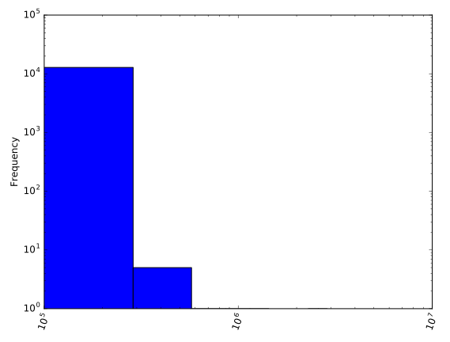
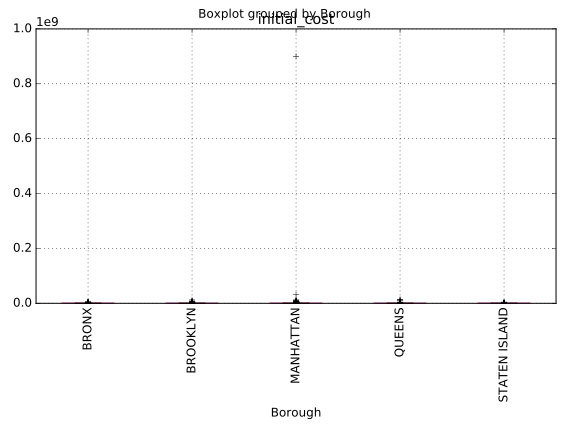
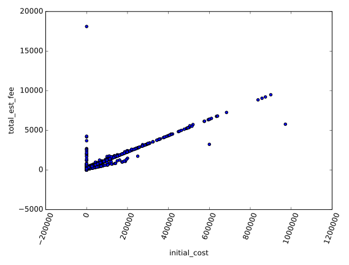

# Chapter 01: Exploring your data

## 1. Loading and viewing your data
In this chapter, you're going to look at a subset of the Department of Buildings Job Application Filings dataset from the NYC Open Data portal. This dataset consists of job applications filed on January 22, 2017.

Your first task is to load this dataset into a DataFrame and then inspect it using the .head() and .tail() methods. However, you'll find out very quickly that the printed results don't allow you to see everything you need, since there are too many columns. Therefore, you need to look at the data in another way.

The .shape and .columns attributes let you see the shape of the DataFrame and obtain a list of its columns. From here, you can see which columns are relevant to the questions you'd like to ask of the data. To this end, a new DataFrame, df_subset, consisting only of these relevant columns, has been pre-loaded. This is the DataFrame you'll work with in the rest of the chapter.

Get acquainted with the dataset now by exploring it with pandas! This initial exploratory analysis is a crucial first step of data cleaning.

### Instructions:
* Import pandas as pd.
* Read 'dob_job_application_filings_subset.csv' into a DataFrame called df.
* Print the head and tail of df.
* Print the shape of df and its columns. Note: .shape and .columns are attributes, not methods, so you don't need to follow these with parentheses ().
* Hit 'Submit Answer' to view the results! Notice the suspicious number of 0 values. Perhaps these represent missing data.

#### Script:
```
# Import pandas
import pandas as pd

# Read the file into a DataFrame: df
df = pd.read_csv('dob_job_application_filings_subset.csv')

# Print the head of df
print(df.head())

# Print the tail of df
print(df.tail())

# Print the shape of df
print(df.shape)

# Print the columns of df
print(df.columns)

# Print the head and tail of df_subset
print(df_subset.head())
print(df_subset.tail())

```
#### Output:
```
<script.py> output:
           Job #  Doc #        Borough       House #  \
    0  121577873      2      MANHATTAN  386            
    1  520129502      1  STATEN ISLAND  107            
    2  121601560      1      MANHATTAN  63             
    3  121601203      1      MANHATTAN  48             
    4  121601338      1      MANHATTAN  45             
    
                            Street Name  Block  Lot    Bin # Job Type Job Status  \
    0  PARK AVENUE SOUTH                   857   38  1016890       A2          D   
    1  KNOX PLACE                          342    1  5161350       A3          A   
    2  WEST 131 STREET                    1729    9  1053831       A2          Q   
    3  WEST 25TH STREET                    826   69  1015610       A2          D   
    4  WEST 29 STREET                      831    7  1015754       A3          D   
    
                ...                         Owner's Last Name  \
    0           ...            MIGLIORE                         
    1           ...            BLUMENBERG                       
    2           ...            MARKOWITZ                        
    3           ...            CASALE                           
    4           ...            LEE                              
    
                  Owner's Business Name Owner's House Number  \
    0  MACKLOWE MANAGEMENT                      126            
    1  NA                                       107            
    2  635 RIVERSIDE DRIVE NY LLC               619            
    3  48 W 25 ST LLC C/O BERNSTEIN             150            
    4  HYUNG-HYANG REALTY CORP                  614            
    
               Owner'sHouse Street Name            City  State    Zip  \
    0  EAST 56TH STREET                  NEW YORK           NY  10222   
    1  KNOX PLACE                        STATEN ISLAND      NY  10314   
    2  WEST 54TH STREET                  NEW YORK           NY  10016   
    3  WEST 30TH STREET                  NEW YORK           NY  10001   
    4  8 AVENUE                          NEW YORK           NY  10001   
    
      Owner'sPhone #                                    Job Description  \
    0     2125545837  GENERAL MECHANICAL & PLUMBING MODIFICATIONS AS...   
    1     3477398892  BUILDERS PAVEMENT PLAN 143 LF.                ...   
    2     2127652555  GENERAL CONSTRUCTION TO INCLUDE NEW PARTITIONS...   
    3     2125941414  STRUCTURAL CHANGES ON THE 5TH FLOOR (MOONDOG E...   
    4     2019881222  FILING HEREWITH FACADE REPAIR PLANS. WORK SCOP...   
    
                   DOBRunDate  
    0  04/26/2013 12:00:00 AM  
    1  04/26/2013 12:00:00 AM  
    2  04/26/2013 12:00:00 AM  
    3  04/26/2013 12:00:00 AM  
    4  04/26/2013 12:00:00 AM  
    
    [5 rows x 82 columns]
               Job #  Doc #        Borough       House #  \
    12841  520143988      1  STATEN ISLAND  8              
    12842  121613833      1      MANHATTAN  724            
    12843  121681260      1      MANHATTAN  350            
    12844  320771704      1       BROOKLYN  499            
    12845  520143951      1  STATEN ISLAND  1755           
    
                                Street Name  Block  Lot    Bin # Job Type  \
    12841  NOEL STREET                        5382   20  5069722       A2   
    12842  10 AVENUE                          1059    4  1082503       A2   
    12843  MANHATTAN AVE.                     1848   31  1055849       A2   
    12844  UNION STREET                        431   43  3007185       A2   
    12845  RICHMOND ROAD                       887   28  5022931       A2   
    
          Job Status           ...                         Owner's Last Name  \
    12841          D           ...            MALITO                           
    12842          D           ...            CROMAN                           
    12843          A           ...            ARYEH                            
    12844          D           ...            WIGGINS                          
    12845          D           ...            CAMBRIA                          
    
                      Owner's Business Name Owner's House Number  \
    12841  GENO MALITO                              8              
    12842  722-724 10TH AVENUE HOLDING LLC          632            
    12843  DG UWS LLC                               619            
    12844  N/A                                      77             
    12845  RONALD CAMBRIA                           1755           
    
                   Owner'sHouse Street Name            City  State    Zip  \
    12841  NOEL STREET                       STATEN ISLAND      NY  10312   
    12842  BROADWAY                          NEW YORK           NY  10012   
    12843  WEST 54TH STREET                  NEW YORK           NY  10019   
    12844  PROSPECT PLACE                    BROOKLYN           NY  11217   
    12845  RICHMOND ROAD                     STATEN ISLAND      NY  10304   
    
          Owner'sPhone #                                    Job Description  \
    12841     9174685659  HORIZONTAL ENLARGEMENT OF ATTACHED ONE CAR GAR...   
    12842     2122289300  RENOVATION OF EXISTING APARTMENT #3B ON THIRD ...   
    12843     2127652555  REPLACE BURNER IN EXSTG BOILER WITH NEW GAS BU...   
    12844     9178487799  INSTALL NEW SPRINKLER SYSTEM THROUGHOUT THE BU...   
    12845     7184482740  INTERIOR PARTITIONS AND MINOR PLUMBING WORK TO...   
    
                       DOBRunDate  
    12841  06/13/2013 12:00:00 AM  
    12842  06/13/2013 12:00:00 AM  
    12843  06/13/2013 12:00:00 AM  
    12844  06/13/2013 12:00:00 AM  
    12845  06/13/2013 12:00:00 AM  
    
    [5 rows x 82 columns]
    (12846, 82)
    Index(['Job #', 'Doc #', 'Borough', 'House #', 'Street Name', 'Block', 'Lot',
           'Bin #', 'Job Type', 'Job Status', 'Job Status Descrp',
           'Latest Action Date', 'Building Type', 'Community - Board', 'Cluster',
           'Landmarked', 'Adult Estab', 'Loft Board', 'City Owned', 'Little e',
           'PC Filed', 'eFiling Filed', 'Plumbing', 'Mechanical', 'Boiler',
           'Fuel Burning', 'Fuel Storage', 'Standpipe', 'Sprinkler', 'Fire Alarm',
           'Equipment', 'Fire Suppression', 'Curb Cut', 'Other',
           'Other Description', 'Applicant's First Name', 'Applicant's Last Name',
           'Applicant Professional Title', 'Applicant License #',
           'Professional Cert', 'Pre- Filing Date', 'Paid', 'Fully Paid',
           'Assigned', 'Approved', 'Fully Permitted', 'Initial Cost',
           'Total Est. Fee', 'Fee Status', 'Existing Zoning Sqft',
           'Proposed Zoning Sqft', 'Horizontal Enlrgmt', 'Vertical Enlrgmt',
           'Enlargement SQ Footage', 'Street Frontage', 'ExistingNo. of Stories',
           'Proposed No. of Stories', 'Existing Height', 'Proposed Height',
           'Existing Dwelling Units', 'Proposed Dwelling Units',
           'Existing Occupancy', 'Proposed Occupancy', 'Site Fill', 'Zoning Dist1',
           'Zoning Dist2', 'Zoning Dist3', 'Special District 1',
           'Special District 2', 'Owner Type', 'Non-Profit', 'Owner's First Name',
           'Owner's Last Name', 'Owner's Business Name', 'Owner's House Number',
           'Owner'sHouse Street Name', 'City ', 'State', 'Zip', 'Owner'sPhone #',
           'Job Description', 'DOBRunDate'],
          dtype='object')
           Job #  Doc #        Borough Initial Cost Total Est. Fee  \
    0  121577873      2      MANHATTAN    $75000.00        $986.00   
    1  520129502      1  STATEN ISLAND        $0.00       $1144.00   
    2  121601560      1      MANHATTAN    $30000.00        $522.50   
    3  121601203      1      MANHATTAN     $1500.00        $225.00   
    4  121601338      1      MANHATTAN    $19500.00        $389.50   
    
       Existing Zoning Sqft  Proposed Zoning Sqft  Enlargement SQ Footage  \
    0                     0                     0                       0   
    1                     0                     0                       0   
    2                     0                     0                       0   
    3                     0                     0                       0   
    4                     0                     0                       0   
    
       Street Frontage  ExistingNo. of Stories  Proposed No. of Stories  \
    0                0                       0                        0   
    1              143                       0                        0   
    2                0                       5                        5   
    3                0                      12                       12   
    4                0                       6                        6   
    
       Existing Height  Proposed Height  
    0                0                0  
    1                0                0  
    2               54               54  
    3              120              120  
    4               64               64  
               Job #  Doc #        Borough Initial Cost Total Est. Fee  \
    12841  520143988      1  STATEN ISLAND    $30700.00        $448.62   
    12842  121613833      1      MANHATTAN    $62000.00        $852.10   
    12843  121681260      1      MANHATTAN   $166000.00       $1923.30   
    12844  320771704      1       BROOKLYN    $65000.00        $883.00   
    12845  520143951      1  STATEN ISLAND     $9500.00        $316.50   
    
           Existing Zoning Sqft  Proposed Zoning Sqft  Enlargement SQ Footage  \
    12841                  1490                  1782                     206   
    12842                     0                     0                       0   
    12843                     0                     0                       0   
    12844                     0                     0                       0   
    12845                     0                     0                       0   
    
           Street Frontage  ExistingNo. of Stories  Proposed No. of Stories  \
    12841                0                       1                        1   
    12842                0                       5                        5   
    12843                0                       6                        6   
    12844                0                       1                        1   
    12845                0                       1                        1   
    
           Existing Height  Proposed Height  
    12841               10               10  
    12842               55               55  
    12843               64               64  
    12844               18               18  
    12845               18               18
```

##### Comment:
Great work! In addition to the suspicious number of 0 values, which may represent missing data, notice that the columns that contain monetary values - 'Initial Cost' and 'Total Est. Fee' - have a dollar sign in the beginning. These columns may be coded as strings instead of numeric values. You will check this in the next exercise.

## 2. Further diagnosis
In the previous exercise, you identified some potentially unclean or missing data. Now, you'll continue to diagnose your data with the very useful .info() method.

The .info() method provides important information about a DataFrame, such as the number of rows, number of columns, number of non-missing values in each column, and the data type stored in each column. This is the kind of information that will allow you to confirm whether the 'Initial Cost' and 'Total Est. Fee' columns are numeric or strings. From the results, you'll also be able to see whether or not all columns have complete data in them.

The full DataFrame df and the subset DataFrame df_subset have been pre-loaded. Your task is to use the .info() method on these and analyze the results.

### Instructions:
* Print the info of df.
* Print the info of the subset dataframe, df_subset.

#### Script:
```
# Print the info of df
print(df.info())

# Print the info of df_subset
print(df_subset.info())

```
#### Output:
```
<script.py> output:
    <bound method DataFrame.info of            Job #  Doc #        Borough       House #  \
    0      121577873      2      MANHATTAN  386            
    1      520129502      1  STATEN ISLAND  107            
    2      121601560      1      MANHATTAN  63             
    3      121601203      1      MANHATTAN  48             
    4      121601338      1      MANHATTAN  45             
    5      121589753      1      MANHATTAN  350            
    6      320738001      1       BROOKLYN  437            
    7      121601374      1      MANHATTAN  99             
    8      121583054      1      MANHATTAN  1355           
    9      121601392      1      MANHATTAN  1              
    10     121601169      1      MANHATTAN  591            
    11     420828206      1         QUEENS  33-14          
    12     420828493      1         QUEENS  147-01         
    13     440075142      1         QUEENS  150-15         
    14     420836723      1         QUEENS  34-20          
    15     121584525      1      MANHATTAN  440            
    16     121600311      1      MANHATTAN  535            
    17     320744290      1       BROOKLYN  948            
    18     320744557      1       BROOKLYN  50             
    19     320744370      1       BROOKLYN  875            
    20     220286232      1          BRONX  2247           
    21     121599779      1      MANHATTAN  823            
    22     420837401      1         QUEENS  157-02         
    23     220286287      1          BRONX  100            
    24     240024362      1          BRONX  3555           
    25     320744316      1       BROOKLYN  153            
    26     121601249      3      MANHATTAN  150            
    27     121592605      1      MANHATTAN  1290           
    28     121577873      1      MANHATTAN  386            
    29     520129496      1  STATEN ISLAND  331            
    ...          ...    ...            ...           ...   
    12816  121675188      1      MANHATTAN  572            
    12817  520143942      1  STATEN ISLAND  1949           
    12818  320833586      1       BROOKLYN  150            
    12819  220307406      2          BRONX  1000           
    12820  121641312      1      MANHATTAN  346            
    12821  140087322      1      MANHATTAN  229            
    12822  121680859      1      MANHATTAN  340            
    12823  121678167      1      MANHATTAN  7              
    12824  320721206      4       BROOKLYN  589            
    12825  121681019      1      MANHATTAN  123            
    12826  520143862      1  STATEN ISLAND  46             
    12827  520143933      1  STATEN ISLAND  1934           
    12828  320723160      1       BROOKLYN  351            
    12829  420857022      1         QUEENS  66-36          
    12830  420857077      1         QUEENS  69-65          
    12831  220307433      1          BRONX  290            
    12832  320590552      1       BROOKLYN  11             
    12833  420606865      4         QUEENS  97-08          
    12834  121681135      1      MANHATTAN  28             
    12835  121632331      1      MANHATTAN  1220           
    12836  121681108      1      MANHATTAN  595            
    12837  121330087      2      MANHATTAN  247            
    12838  140087420      1      MANHATTAN  30             
    12839  440089538      1         QUEENS  22-46          
    12840  420606865      2         QUEENS  97-08          
    12841  520143988      1  STATEN ISLAND  8              
    12842  121613833      1      MANHATTAN  724            
    12843  121681260      1      MANHATTAN  350            
    12844  320771704      1       BROOKLYN  499            
    12845  520143951      1  STATEN ISLAND  1755           
    
                                Street Name  Block   Lot    Bin # Job Type  \
    0      PARK AVENUE SOUTH                   857    38  1016890       A2   
    1      KNOX PLACE                          342     1  5161350       A3   
    2      WEST 131 STREET                    1729     9  1053831       A2   
    3      WEST 25TH STREET                    826    69  1015610       A2   
    4      WEST 29 STREET                      831     7  1015754       A3   
    5      FIFTH AVENUE                        835    41  1015862       A2   
    6      TOMPKINS AVENUE                    1846     9  3331251       A2   
    7      JOHN ST                              76  7502  1087867       A2   
    8      FIRST AVENUE                       1447    27  1088591       A2   
    9      MANHATTAN PLAZA                    9999     1  1813346       A2   
    10     LEXINGTON AVE                      1306    50  1036464       A2   
    11     DITMARS BLVD                        832    57  4017011       A2   
    12     JAMAICA AVE                        9677     1  4206783       A2   
    13     14TH AVENUE                        4518    53  4102714       A2   
    14     JUNCTION BOULEVARD                 1455     7  4035802       A1   
    15     EAST 12TH STREET                    439    27  1005976       DM   
    16     WEST 24TH STREET                    696    13  1012366       A2   
    17     BROADWAY                           1586    34  3042898       A2   
    18     KENT AVENUE                        2287     1  3251725       A2   
    19     GRAND ST                           2922    39  3070447       A2   
    20     WALTON AVENUE                      3186    76  2014073       A2   
    21     1 AV                               1339    19  1038903       A3   
    22     CROSS BAY BLVD.                   13972    64  4292707       A2   
    23     BAYCHESTER AVENUE                  5141     3  2087397       A2   
    24     BIVONA STREET                      5263    40  2093875       A3   
    25     HAVEMEYER STREET                   2421     7  3063168       A2   
    26     EAST 58TH STREET                   1312    41  1036915       A2   
    27     AVENUE OF THE AMERICAS             1267     1  1034510       A2   
    28     PARK AVENUE SOUTH                   857    38  1016890       A2   
    29     NEW DORP LANE                      3649    27  5052864       A2   
    ...                                 ...    ...   ...      ...      ...   
    12816  GRAND STREET                        321     1  1083419       A2   
    12817  RICHMOND AVENUE                    2030     1  5107285       A2   
    12818  55TH STREET                         828     1  3014856       A3   
    12819  WEST 261ST STREET                  5933   425  2098644       A2   
    12820  EAST 18 STREET                      923    39  1020443       A2   
    12821  EAST 79 STREET                     1525    15  1048513       A2   
    12822  EAST 72ND STREET                   1446    38  1044864       A2   
    12823  LINCOLN SQUARE                     1119    61  1028235       A2   
    12824  PROSPECT AVENUE                    1116    43  3027435       A1   
    12825  EAST 12TH STREET                    558    43  1009026       A2   
    12826  ANDROVETTE STREET                  7590    26  5087217       NB   
    12827  RICHMOND TERRACE                   1008    37  5129305       A2   
    12828  54TH ST                             814    55  3014212       A1   
    12829  FRESH POND ROAD                    3528    78  4084894       A2   
    12830  GRAND AVENUE                       2501    29  4058560       A2   
    12831  BAYCHESTER AVENUE                  5141    25  2102452       A2   
    12832  ORIENT AVE                         2907    68  3325362       NB   
    12833  SPRINGFIELD BLVD                  10770    25  4230876       A1   
    12834  WEST 130 STREET                    1727    51  1053747       A3   
    12835  PARK AVE                           1507    33  1047431       A2   
    12836  MAIN STREET                        1373     1  1084707       A2   
    12837  W 13 STREET                         618    63  1011129       A1   
    12838  WEST 26TH STREET                    827    64  1015629       A2   
    12839  31 STREET                           844    55  4017621       A3   
    12840  SPRINGFIELD BLVD                  10770    25  4230876       A1   
    12841  NOEL STREET                        5382    20  5069722       A2   
    12842  10 AVENUE                          1059     4  1082503       A2   
    12843  MANHATTAN AVE.                     1848    31  1055849       A2   
    12844  UNION STREET                        431    43  3007185       A2   
    12845  RICHMOND ROAD                       887    28  5022931       A2   
    
          Job Status           ...                         Owner's Last Name  \
    0              D           ...            MIGLIORE                         
    1              A           ...            BLUMENBERG                       
    2              Q           ...            MARKOWITZ                        
    3              D           ...            CASALE                           
    4              D           ...            LEE                              
    5              Q           ...            SILVESTRI                        
    6              P           ...            SALEH                            
    7              D           ...            FRANCESE                         
    8              D           ...            MENDLOW                          
    9              P           ...            PORTER                           
    10             R           ...             DERMER                          
    11             R           ...            CINQUEMANI                       
    12             D           ...            BLUTH                            
    13             H           ...            KIM                              
    14             D           ...            CAPPA                            
    15             E           ...            STEINER                          
    16             P           ...            RATHE                            
    17             P           ...            SALEM                            
    18             P           ...            CASEY                            
    19             D           ...            MORENO                           
    20             D           ...            RAJPUT                           
    21             R           ...            LOBRON                           
    22             D           ...            GREY                             
    23             R           ...            LAUGHREA                         
    24             H           ...            MCNEVIN                          
    25             P           ...            YOUNG WOO                        
    26             P           ...            SONITIS                          
    27             D           ...            SONITIS                          
    28             D           ...            MIGLIORE                         
    29             D           ...            LAM                              
    ...          ...           ...                                       ...   
    12816          A           ...            WOLLMAN                          
    12817          D           ...            SILVESTRI                        
    12818          D           ...            DELUCIA                          
    12819          J           ...            DEGROAT                          
    12820          D           ...            CROMAN                           
    12821          Q           ...            RUSSO                            
    12822          D           ...            BRUHN                            
    12823          P           ...            HEADLEY                          
    12824          R           ...            GELLER                           
    12825          P           ...            KASSIN                           
    12826          D           ...            SHAPIRO                          
    12827          D           ...            PRITCHARD                        
    12828          H           ...            LIN                              
    12829          D           ...            FERNANDEZ                        
    12830          D           ...            MARTINEZ                         
    12831          R           ...            ALLEN                            
    12832          A           ...            RUBINOFF                         
    12833          A           ...            FRASCA                           
    12834          P           ...            JUSTINIANO                       
    12835          P           ...            NEGRIN                           
    12836          J           ...            KRAMER                           
    12837          F           ...            KOLBO                            
    12838          H           ...            DE ROSA                          
    12839          H           ...            CERINA                           
    12840          A           ...            FRASCA                           
    12841          D           ...            MALITO                           
    12842          D           ...            CROMAN                           
    12843          A           ...            ARYEH                            
    12844          D           ...            WIGGINS                          
    12845          D           ...            CAMBRIA                          
    
                      Owner's Business Name Owner's House Number  \
    0      MACKLOWE MANAGEMENT                      126            
    1      NA                                       107            
    2      635 RIVERSIDE DRIVE NY LLC               619            
    3      48 W 25 ST LLC C/O BERNSTEIN             150            
    4      HYUNG-HYANG REALTY CORP                  614            
    5      EMPIRE STATE BUILDING CO., LLC           350            
    6      TOMPKINS DELI                            437            
    7      SKYLINE REALTY                           75             
    8      BLUE ROCK REAL ESTATE                    70             
    9      CARAVENTS INC.                           337            
    10     LEXCO MANAGEMENT CORP                    10             
    11     K & T QUALITY MEATS                      33-14          
    12     ALDBIN REALTY CO                         43-09          
    13     RASBERRY FARM MARKET                     150-15         
    14     HARTFORD LEASING, LLC                    34-20          
    15     181 AVENUE A, LLC                        15             
    16     GTM ASSOC. LLC (C/O ANDREWS BLD          666            
    17     948 BROADWAYREALTY LLC.                  948            
    18     AEG LIVE                                 145            
    19     N/A                                      975            
    20     2247 WALTON AVE LLC                      1815           
    21     ZECKENDORF DEVELOPMENT                   770            
    22     SMART REALTY & MANAGEMENT, LLC           PO BOX 338     
    23     JC PENNY                                 6501           
    24     NYCHA                                    90             
    25     KORAM REALTY CORP.                       153            
    26     VORNADO OFFICE MANAGEMENT                888            
    27     VORNADO OFFICE MANAGEMENT                888            
    28     MACKLOWE MANAGEMENT                      126            
    29     JADE ASIAN BISTRO                        331            
    ...                                 ...                  ...   
    12816  HILLMAN HOUSING CORP                     530            
    12817  N/A                                      4              
    12818  LUTHERAN MEDICAL CENTER                  150            
    12819  COLLEGE OF MOUNT ST VINCENT              6301           
    12820  M & E 336-348  E 18TH ST LLC             632            
    12821  KAUFMAN REALTY CORP                      450            
    12822  N/A                                      215            
    12823  AMERICAN BROADCASTING COS INC.           77             
    12824  589 PROPSECT AVENUE, L.P.                111            
    12825  WHITE KNIGHT NYC VENTURE, LLC            1407           
    12826  NA                                       111            
    12827  BRL HOLDINGS LLC                         1934           
    12828  N/A                                      351            
    12829  TAQUERIA KERMEZ INC                      66-36          
    12830  MASTER FIRE SYSTEMS INC                  1776           
    12831  PRIDE GROUP, LLC                         11100          
    12832  N/A                                      4              
    12833  FRASCA LIMITED PARTNERSHIP               4211           
    12834  N/A                                      115-52         
    12835  1220 PARK AVE CORP                       770            
    12836  HUDSON RELATED RETAIL, LLC               826            
    12837  JAMES C HAYS IRREVOCABLE GRANTOR         247            
    12838  30 WEST 26TH STREET ASSOCIATES           30             
    12839  CEPRINE SCAFFOLDING SERVICES             41-08          
    12840  FRASCA LIMITED PARTNERSHIP               4211           
    12841  GENO MALITO                              8              
    12842  722-724 10TH AVENUE HOLDING LLC          632            
    12843  DG UWS LLC                               619            
    12844  N/A                                      77             
    12845  RONALD CAMBRIA                           1755           
    
                   Owner'sHouse Street Name            City  State        Zip  \
    0      EAST 56TH STREET                  NEW YORK           NY      10222   
    1      KNOX PLACE                        STATEN ISLAND      NY      10314   
    2      WEST 54TH STREET                  NEW YORK           NY      10016   
    3      WEST 30TH STREET                  NEW YORK           NY      10001   
    4      8 AVENUE                          NEW YORK           NY      10001   
    5      FIFTH AVENUE                      NEW YORK           NY      10118   
    6      TOMPKINS AVENUE                   BROOKLYN           NY      11216   
    7      MAIDEN LANE                       NY                 NY      10038   
    8      EAST 55 STREET                    NEW YORK           NY      10022   
    9      S ROBERSON BLVD.                  BEVERLY HILLS      CA      90211   
    10      EAST 40TH STREET                 NEW YORK           NY      10016   
    11     DITMARS BLVD.                     ASTORIA            NY      11105   
    12     13TH AVE                          BROOKLYN           NY      11219   
    13     14TH AVENUE                       WHITESTONE         NY      11357   
    14     JUNCTION BOULEVARD                CORONA             NY      11368   
    15     WASHINGTON AVENUE                 BROOKLYN           NY      11205   
    16     BROADWAY                          NEW YORK           NY      10012   
    17     BROADWAY                          BROOKLYN           NY      11221   
    18     WEST 45TH STREET                  NEW YORK           NY      10036   
    19     GRAND ST                          BROOKLYN           NY      11211   
    20     WEST FARMS ROAD                   BRONX              NY      10460   
    21     LEXINGTON AVENUE                  NEW YORK           NY      10021   
    22     -                                 GARDEN CITY        NY      11530   
    23     LEGACY DRIVE                      PLANO              TX      75024   
    24     CHURCH STREET                     NEW YORK           NY      10007   
    25     HAVEMEYER STREET                  BROOKLYN           NY      11211   
    26     SEVENTH AVENUE                    NEW YORK           NY      10019   
    27     SEVENTH AVENUE                    NEW YORK           NY      10019   
    28     EAST 56TH STREET                  NEW YORK           NY      10222   
    29     NEW DORP LANE                     STATEN ISLAND      NY      10306   
    ...                                 ...              ...   ...        ...   
    12816  GRAND STREET                      NEW YORK           NY      10002   
    12817  GARY PLACE                        STATEN ISLAND      NY      10312   
    12818  55TH STREET                       BROOKLYN           NY      11220   
    12819  RIVERDALE AVENUE                  RIVERDALE          NY      10471   
    12820  BROADWAY                          NEW YORK           NY      10012   
    12821  SEVENTH AVENUE                    NEW YORK           NY      10123   
    12822  EAST 73RD STREET                  NEW YORK           NY      10021   
    12823  WEST 66TH STREET                  NEW YORK           NY      10023   
    12824   CHERRY VALLEY AVENUE             GARDEN CITY        NY      11530   
    12825  BROADWAY                          NEW YORK           NY      10018   
    12826  STORER AVENUE                     STATEN ISLAND      NY  103090000   
    12827  RICHMOND TERRACE                  S.I                NY      10302   
    12828  54 ST                             BROOLKLYN          NY      11226   
    12829  FRESH POND ROAD                   QUEENS             NY      11385   
    12830  E TREMONT AVENUE                  BRONX              NY      10460   
    12831  PO BOX                            CHANDLER           AZ      85248   
    12832  OAKLAND PLACE                     GREAT NECK         NY      11201   
    12833  FILLMORE AVENUE                   BROOKLYN           NY      11234   
    12834  VAN WYCK EXPRESSWAY               JAMAICA            NY      11420   
    12835  LEXINGTON AVE                     NEW YORK           NY      10065   
    12836  BROADWAY                          NEW YORK           NY      10003   
    12837  W 13TH STREET                     NEW YORK           NY      10011   
    12838  WEST 26TH STREET                  NEW YORK           NY      10010   
    12839  BERRIAN BLVD                      ASTORIA            NY      11105   
    12840  FILLMORE AVENUE                   BROOKLYN           NY      11234   
    12841  NOEL STREET                       STATEN ISLAND      NY      10312   
    12842  BROADWAY                          NEW YORK           NY      10012   
    12843  WEST 54TH STREET                  NEW YORK           NY      10019   
    12844  PROSPECT PLACE                    BROOKLYN           NY      11217   
    12845  RICHMOND ROAD                     STATEN ISLAND      NY      10304   
    
          Owner'sPhone #                                    Job Description  \
    0         2125545837  GENERAL MECHANICAL & PLUMBING MODIFICATIONS AS...   
    1         3477398892  BUILDERS PAVEMENT PLAN 143 LF.                ...   
    2         2127652555  GENERAL CONSTRUCTION TO INCLUDE NEW PARTITIONS...   
    3         2125941414  STRUCTURAL CHANGES ON THE 5TH FLOOR (MOONDOG E...   
    4         2019881222  FILING HEREWITH FACADE REPAIR PLANS. WORK SCOP...   
    5         2127363100  GENERAL CONSTRUCTION CHANGES TAKING PLACE ON T...   
    6         6462675576  APPLICATION FILED TO INSTALL A EXHAUST HOOD, D...   
    7         6464219861  COMBINE APT 502 AND 503  MINOR PARTITION WORK ...   
    8         2128431601  INSTALLATION OF TEMPORARY VERTICAL NETTING (CO...   
    9         3108559595  INSTALLATION OF POTENTIAL TEMPORARY RAIN CONTI...   
    10        2126836655  INTERIOR DEMOLITION OF EXISTING COMMERCIAL SPA...   
    11        7187283810  INSTALLING THREE (3) COMPRESSORS AT THE ROOF O...   
    12        7188514829  MISC. STORE RENOVATIONS AND NEW STORE FRONT. N...   
    13        7189397575  HEREWITH FILED TO CAP AND REMOVE (4) COOKING E...   
    14        7182718375  FILING HEREWITH FOR ADMINISTRATIVE ALT 1 FOR A...   
    15        7188581600  DEMOLITION OF STRUCTURE                       ...   
    16        2125295688  INTERIOR RENOVATION PER PLANS FILED HEREWITH. ...   
    17        9175266922  APPLICATION FILED TO INSTALL EXHAUST HOOD AND ...   
    18        2129305190  INSTALLATION OF A TEMPORARY STAGE, TENTS AND O...   
    19        7183356564  INSTALL GYPSUM BOARD PARTITION WALL AND NEW WO...   
    20        7189911700  MANUAL/AUTOMATIC SMOKE/HEAT DETECTION SPRINKLE...   
    21        2128262900  USE OF MONORAIL LIFTING SYSTEM AT 823 1 AVENUE...   
    22        5162222233  PROPOSE TO RENOVATE EXISTING STOREFRONT, FLOOR...   
    23        9724311662  ALTERATION TO EXISTING SPRINKLER SYSTEM IN CON...   
    24        2123062903  INSTALLATION OF SIDEWALK SHED AS PER PLANS.  N...   
    25        2013145235  APPLICATION FILED TO INSTALL EXHAUST HOOD, DUC...   
    26        2128947000  STRUCTURAL CHANGES ON THE 7TH AND 8TH FLOOR (B...   
    27        2128947000  MODIFICATION OF THE EXISTING CLASS E FIRE ALAR...   
    28        2125545837  GENERAL CONSTRUCTION AND EGREES MODIFICATION, ...   
    29        9175606525  FACADE FINISH WORK.                           ...   
    ...              ...                                                ...   
    12816     2126775858  COMBINING APTS # G1404 AND # G1403 INTO ONE AS...   
    12817     3475648580  INTERIOR RENOVATION OF EXISTING COMMERCIAL SPA...   
    12818     7186307030  REPLACEMENT OF TELECOMMUNICATIONS ANTENNAS ON ...   
    12819     7184053400  MECHANICAL, PLUMBING AND BOILER WORK AS SHOWN ...   
    12820     2122289300  RENOVATION OF EXISTING APARTMENT 1A ON SECOND ...   
    12821     2123733309  RENOVATE AND COMBINE APARTMENTS 10A AND 10B UN...   
    12822     9174947623  MINOR PARTITION, PLUMBING AND MECHANICAL WORK ...   
    12823     2124567777  MODIFICATION OF EXISTING SPRINKLER SYSTEM ON C...   
    12824     5166478222  SUBSEQUENT FILING FOR FENCE                   ...   
    12825     2126956666  REMOVAL & REPLACEMENT OF EXISTING STORE FRONT ...   
    12826     7189661764  PROPOSED FIRST FLOOR WAREHOUSE AND SECOND FLOO...   
    12827     7189813201  HEREWITH FILING FOR BOILER APPLICATION TO OBTA...   
    12828     9176276290  CONVERT EXIST 2 FAMILY TO 3 FAMILY. VERTICAL A...   
    12829     3472940397  MODIFICATION OF EXISTING KITCHEN FIRE SUPPRESS...   
    12830     7188286424  INSTALLATION OF FIRE SUPPRESSION SYSTEM AS PER...   
    12831     6026952338  INSTALLATION OF A TEMPORARY TENT AND PRODUCTIO...   
    12832     9189131186  NEW SEVEN (7) FAMILY DWELLING, FOUR (4) STORY ...   
    12833     7182877700  FILING OF ADDITIONAL WORK TYPE FOR CURB CUT, A...   
    12834     3472783596  STRUCTURAL REPAIR INVOLVING PROVISION OF NEW F...   
    12835     2125087292  REPLACE NEW LP GAS SERVICE, GAS METER, GAS BOO...   
    12836     2127779500  RENOVATION OF EXTERIOR SPACE AT THE GROUND FLO...   
    12837     6123737272  CONVERSION OF EXISTING 4 STORY 3 FAMILY DWELLI...   
    12838     2126457575  INTERIOR PARTITIONS FOR NEW TENANT FIT-OUT AS ...   
    12839     7187284848  INSTALLATION OF PIPE SCAFFOLD AS PER PLANS. WO...   
    12840     7182877700  FILING OF ADDITIONAL WORK TYPE FOR CURB CUT, A...   
    12841     9174685659  HORIZONTAL ENLARGEMENT OF ATTACHED ONE CAR GAR...   
    12842     2122289300  RENOVATION OF EXISTING APARTMENT #3B ON THIRD ...   
    12843     2127652555  REPLACE BURNER IN EXSTG BOILER WITH NEW GAS BU...   
    12844     9178487799  INSTALL NEW SPRINKLER SYSTEM THROUGHOUT THE BU...   
    12845     7184482740  INTERIOR PARTITIONS AND MINOR PLUMBING WORK TO...   
    
                       DOBRunDate  
    0      04/26/2013 12:00:00 AM  
    1      04/26/2013 12:00:00 AM  
    2      04/26/2013 12:00:00 AM  
    3      04/26/2013 12:00:00 AM  
    4      04/26/2013 12:00:00 AM  
    5      04/26/2013 12:00:00 AM  
    6      04/26/2013 12:00:00 AM  
    7      04/26/2013 12:00:00 AM  
    8      04/26/2013 12:00:00 AM  
    9      04/26/2013 12:00:00 AM  
    10     04/26/2013 12:00:00 AM  
    11     04/26/2013 12:00:00 AM  
    12     04/26/2013 12:00:00 AM  
    13     04/26/2013 12:00:00 AM  
    14     04/26/2013 12:00:00 AM  
    15     04/26/2013 12:00:00 AM  
    16     04/26/2013 12:00:00 AM  
    17     04/26/2013 12:00:00 AM  
    18     04/26/2013 12:00:00 AM  
    19     04/26/2013 12:00:00 AM  
    20     04/26/2013 12:00:00 AM  
    21     04/26/2013 12:00:00 AM  
    22     04/26/2013 12:00:00 AM  
    23     04/26/2013 12:00:00 AM  
    24     04/26/2013 12:00:00 AM  
    25     04/26/2013 12:00:00 AM  
    26     04/26/2013 12:00:00 AM  
    27     04/26/2013 12:00:00 AM  
    28     04/26/2013 12:00:00 AM  
    29     04/26/2013 12:00:00 AM  
    ...                       ...  
    12816  06/13/2013 12:00:00 AM  
    12817  06/13/2013 12:00:00 AM  
    12818  06/13/2013 12:00:00 AM  
    12819  06/13/2013 12:00:00 AM  
    12820  06/13/2013 12:00:00 AM  
    12821  06/13/2013 12:00:00 AM  
    12822  06/13/2013 12:00:00 AM  
    12823  06/13/2013 12:00:00 AM  
    12824  07/12/2013 12:00:00 AM  
    12825  06/13/2013 12:00:00 AM  
    12826  06/13/2013 12:00:00 AM  
    12827  06/13/2013 12:00:00 AM  
    12828  06/13/2013 12:00:00 AM  
    12829  06/13/2013 12:00:00 AM  
    12830  06/13/2013 12:00:00 AM  
    12831  06/13/2013 12:00:00 AM  
    12832  06/13/2013 12:00:00 AM  
    12833  06/13/2013 12:00:00 AM  
    12834  06/13/2013 12:00:00 AM  
    12835  06/13/2013 12:00:00 AM  
    12836  06/13/2013 12:00:00 AM  
    12837  06/13/2013 12:00:00 AM  
    12838  06/13/2013 12:00:00 AM  
    12839  06/13/2013 12:00:00 AM  
    12840  06/13/2013 12:00:00 AM  
    12841  06/13/2013 12:00:00 AM  
    12842  06/13/2013 12:00:00 AM  
    12843  06/13/2013 12:00:00 AM  
    12844  06/13/2013 12:00:00 AM  
    12845  06/13/2013 12:00:00 AM  
    
    [12846 rows x 82 columns]>
    <bound method DataFrame.info of            Job #  Doc #        Borough Initial Cost Total Est. Fee  \
    0      121577873      2      MANHATTAN    $75000.00        $986.00   
    1      520129502      1  STATEN ISLAND        $0.00       $1144.00   
    2      121601560      1      MANHATTAN    $30000.00        $522.50   
    3      121601203      1      MANHATTAN     $1500.00        $225.00   
    4      121601338      1      MANHATTAN    $19500.00        $389.50   
    5      121589753      1      MANHATTAN  $3062400.00      $31762.40   
    6      320738001      1       BROOKLYN    $10000.00        $316.50   
    7      121601374      1      MANHATTAN   $146800.00       $1727.60   
    8      121583054      1      MANHATTAN        $0.00        $160.00   
    9      121601392      1      MANHATTAN     $5000.00        $265.00   
    10     121601169      1      MANHATTAN    $21200.00        $440.10   
    11     420828206      1         QUEENS    $20000.00        $419.50   
    12     420828493      1         QUEENS    $37600.00        $764.90   
    13     440075142      1         QUEENS    $10000.00        $316.50   
    14     420836723      1         QUEENS     $3000.00        $280.00   
    15     121584525      1      MANHATTAN        $0.00        $472.00   
    16     121600311      1      MANHATTAN    $94000.00       $1181.70   
    17     320744290      1       BROOKLYN     $5000.00        $265.00   
    18     320744557      1       BROOKLYN     $7500.00        $295.90   
    19     320744370      1       BROOKLYN    $20000.00        $207.25   
    20     220286232      1          BRONX     $1000.00        $225.00   
    21     121599779      1      MANHATTAN        $0.00        $160.00   
    22     420837401      1         QUEENS    $67000.00       $1063.60   
    23     220286287      1          BRONX    $70000.00        $934.50   
    24     240024362      1          BRONX        $0.00        $440.00   
    25     320744316      1       BROOKLYN    $11000.00        $326.80   
    26     121601249      3      MANHATTAN    $16000.00        $378.30   
    27     121592605      1      MANHATTAN    $41000.00        $635.80   
    28     121577873      1      MANHATTAN   $509500.00       $5466.50   
    29     520129496      1  STATEN ISLAND    $12238.00        $347.40   
    ...          ...    ...            ...          ...            ...   
    12816  121675188      1      MANHATTAN    $14000.00        $357.70   
    12817  520143942      1  STATEN ISLAND    $57950.00        $810.90   
    12818  320833586      1       BROOKLYN    $30000.00        $492.50   
    12819  220307406      2          BRONX   $574392.00       $6136.00   
    12820  121641312      1      MANHATTAN    $83000.00       $1068.40   
    12821  140087322      1      MANHATTAN    $73730.00        $975.70   
    12822  121680859      1      MANHATTAN   $213900.00       $2417.70   
    12823  121678167      1      MANHATTAN     $9000.00        $306.20   
    12824  320721206      4       BROOKLYN        $0.00        $160.00   
    12825  121681019      1      MANHATTAN    $31500.00        $703.10   
    12826  520143862      1  STATEN ISLAND        $0.00       $2873.64   
    12827  520143933      1  STATEN ISLAND     $1000.00        $225.00   
    12828  320723160      1       BROOKLYN   $183700.00       $1111.89   
    12829  420857022      1         QUEENS     $3000.00        $225.00   
    12830  420857077      1         QUEENS     $4000.00        $245.00   
    12831  220307433      1          BRONX     $5000.00        $265.00   
    12832  320590552      1       BROOKLYN        $0.00       $1819.32   
    12833  420606865      4         QUEENS        $0.00        $220.00   
    12834  121681135      1      MANHATTAN    $50000.00        $698.50   
    12835  121632331      1      MANHATTAN   $100000.00       $1373.50   
    12836  121681108      1      MANHATTAN   $120000.00       $1609.50   
    12837  121330087      2      MANHATTAN        $0.00          $0.00   
    12838  140087420      1      MANHATTAN   $437000.00       $4714.60   
    12839  440089538      1         QUEENS        $0.00        $160.00   
    12840  420606865      2         QUEENS        $0.00        $280.00   
    12841  520143988      1  STATEN ISLAND    $30700.00        $448.62   
    12842  121613833      1      MANHATTAN    $62000.00        $852.10   
    12843  121681260      1      MANHATTAN   $166000.00       $1923.30   
    12844  320771704      1       BROOKLYN    $65000.00        $883.00   
    12845  520143951      1  STATEN ISLAND     $9500.00        $316.50   
    
           Existing Zoning Sqft  Proposed Zoning Sqft  Enlargement SQ Footage  \
    0                         0                     0                       0   
    1                         0                     0                       0   
    2                         0                     0                       0   
    3                         0                     0                       0   
    4                         0                     0                       0   
    5                         0                     0                       0   
    6                         0                     0                       0   
    7                         0                     0                       0   
    8                         0                     0                       0   
    9                         0                     0                       0   
    10                        0                     0                       0   
    11                        0                     0                       0   
    12                        0                     0                       0   
    13                        0                     0                       0   
    14                    14683                  4791                       0   
    15                        0                     0                       0   
    16                        0                     0                       0   
    17                        0                     0                       0   
    18                        0                     0                       0   
    19                        0                     0                       0   
    20                        0                     0                       0   
    21                        0                     0                       0   
    22                        0                     0                       0   
    23                        0                     0                       0   
    24                        0                     0                       0   
    25                        0                     0                       0   
    26                        0                     0                       0   
    27                        0                     0                       0   
    28                        0                     0                       0   
    29                        0                     0                       0   
    ...                     ...                   ...                     ...   
    12816                     0                     0                       0   
    12817                     0                     0                       0   
    12818                     0                     0                       0   
    12819                     0                     0                       0   
    12820                     0                     0                       0   
    12821                     0                     0                       0   
    12822                     0                     0                       0   
    12823                     0                     0                       0   
    12824                     0                     0                       0   
    12825                     0                     0                       0   
    12826                     0                  9614                       0   
    12827                     0                     0                       0   
    12828                  2280                  3000                     167   
    12829                     0                     0                       0   
    12830                     0                     0                       0   
    12831                     0                     0                       0   
    12832                     0                  4835                       0   
    12833                     0                     0                       0   
    12834                     0                     0                       0   
    12835                     0                     0                       0   
    12836                     0                     0                       0   
    12837                     0                     0                       0   
    12838                     0                     0                       0   
    12839                     0                     0                       0   
    12840                     0                     0                       0   
    12841                  1490                  1782                     206   
    12842                     0                     0                       0   
    12843                     0                     0                       0   
    12844                     0                     0                       0   
    12845                     0                     0                       0   
    
           Street Frontage  ExistingNo. of Stories  Proposed No. of Stories  \
    0                    0                       0                        0   
    1                  143                       0                        0   
    2                    0                       5                        5   
    3                    0                      12                       12   
    4                    0                       6                        6   
    5                    0                     102                      102   
    6                    0                       3                        3   
    7                    0                      27                       27   
    8                    0                      34                       34   
    9                    0                       1                        1   
    10                   0                       6                        6   
    11                   0                       3                        3   
    12                   0                       1                        1   
    13                   0                       1                        1   
    14                   0                       1                        1   
    15                  30                       4                        0   
    16                   0                       6                        6   
    17                   0                       4                        4   
    18                   0                       1                        1   
    19                   0                       2                        2   
    20                   0                      11                       11   
    21                   0                      40                       40   
    22                   0                       2                        2   
    23                   0                       3                        3   
    24                   0                      18                       18   
    25                   0                       3                        3   
    26                   0                       0                        0   
    27                   0                      43                       43   
    28                   0                      20                       20   
    29                   0                       1                        1   
    ...                ...                     ...                      ...   
    12816                0                      20                       20   
    12817                0                       1                        1   
    12818                0                       5                        5   
    12819                0                       0                        0   
    12820                0                       6                        6   
    12821                0                      15                       15   
    12822                0                      16                       16   
    12823                0                       7                        7   
    12824                0                       0                        0   
    12825                0                       3                        3   
    12826                0                       0                        2   
    12827                0                       3                        3   
    12828                0                       3                        3   
    12829                0                       3                        3   
    12830                0                       3                        3   
    12831                0                       1                        1   
    12832                0                       0                        4   
    12833                0                       0                        0   
    12834                0                       3                        3   
    12835                0                      17                       17   
    12836                0                      19                       19   
    12837                0                       0                        0   
    12838                0                      12                       12   
    12839                0                       4                        4   
    12840                0                       0                        0   
    12841                0                       1                        1   
    12842                0                       5                        5   
    12843                0                       6                        6   
    12844                0                       1                        1   
    12845                0                       1                        1   
    
           Existing Height  Proposed Height  
    0                    0                0  
    1                    0                0  
    2                   54               54  
    3                  120              120  
    4                   64               64  
    5                 1250             1250  
    6                   36               36  
    7                  300              300  
    8                  398              398  
    9                   16               16  
    10                  60               60  
    11                  28               28  
    12                  15               15  
    13                  12               12  
    14                  15               15  
    15                  45                0  
    16                  75               75  
    17                  52               52  
    18                  24               24  
    19                  25               25  
    20                 101              101  
    21                 520              520  
    22                  26               26  
    23                  60               60  
    24                 180              180  
    25                  33               33  
    26                   0                0  
    27                 546              546  
    28                 200              200  
    29                  15               15  
    ...                ...              ...  
    12816              210              210  
    12817               15               15  
    12818               74               74  
    12819                0                0  
    12820               60               60  
    12821              165              165  
    12822              160              160  
    12823               99               99  
    12824                0                0  
    12825               42               42  
    12826                0               37  
    12827               29               29  
    12828               29               29  
    12829               30               30  
    12830               30               30  
    12831               20               20  
    12832                0               39  
    12833                0                0  
    12834               30               30  
    12835              170              170  
    12836              190              190  
    12837                0                0  
    12838              150              150  
    12839               45               45  
    12840                0                0  
    12841               10               10  
    12842               55               55  
    12843               64               64  
    12844               18               18  
    12845               18               18  
    
    [12846 rows x 13 columns]>
```
##### Comment:
Excellent! Notice that the columns 'Initial Cost' and 'Total Est. Fee' are of type object. The currency sign in the beginning of each value in these columns needs to be removed, and the columns need to be converted to numeric. In the full DataFrame, note that there are a lot of missing values. You saw in the previous exercise that there are also a lot of 0 values. Given the amount of data that is missing in the full dataset, it's highly likely that these 0 values represent missing data.

## 2. Calculating summary statistics
You'll now use the .describe() method to calculate summary statistics of your data.

In this exercise, the columns 'Initial Cost' and 'Total Est. Fee' have been cleaned up for you. That is, the dollar sign has been removed and they have been converted into two new numeric columns: initial_cost and total_est_fee. You'll learn how to do this yourself in later chapters. It's also worth noting that some columns such as Job # are encoded as numeric columns, but it does not make sense to compute summary statistics for such columns.

This cleaned DataFrame has been pre-loaded as df. Your job is to use the .describe() method on it in the IPython Shell and select the statement below that is False.

### Instructions:
Possible Answers
* The mean of 'Proposed No. of Stories' is 8.144325.  &emsp;&emsp; press 1
* The standard deviation of 'Existing Height' is 146.917360.  &emsp;&emsp;  press 2
* There are 12846 entries in the DataFrame.  &emsp;&emsp;  press 3
* The standard deviation of 'Street Frontage' is 11.874080.  &emsp;&emsp;  press 4
* The maximum of 'Proposed Height' is 4200.  &emsp;&emsp;   press 5

#### Answer:
4

##### Comment:
Well Done

## 3. Frequency counts for categorical data
As you've seen, .describe() can only be used on numeric columns. So how can you diagnose data issues when you have categorical data? One way is by using the .value_counts() method, which returns the frequency counts for each unique value in a column!

This method also has an optional parameter called dropna which is True by default. What this means is if you have missing data in a column, it will not give a frequency count of them. You want to set the dropna column to False so if there are missing values in a column, it will give you the frequency counts.

In this exercise, you're going to look at the 'Borough', 'State', and 'Site Fill' columns to make sure all the values in there are valid. When looking at the output, do a sanity check: Are all values in the 'State' column from NY, for example? Since the dataset consists of applications filed in NY, you would expect this to be the case.

### Instructions:
Print the value counts for:
* The 'Borough' column.
* The 'State' column.
* The 'Site Fill' column.

#### Script:
```
# Print the value counts for 'Borough'
print(df['Borough'].value_counts(dropna=False))

# Print the value_counts for 'State'
print(df.State.value_counts(dropna=False))

# Print the value counts for 'Site Fill'
print(df['Site Fill'].value_counts(dropna=False))
```
#### Output:
```
<script.py> output:
    MANHATTAN        6310
    BROOKLYN         2866
    QUEENS           2121
    BRONX             974
    STATEN ISLAND     575
    Name: Borough, dtype: int64
    NY    12391
    NJ      241
    PA       38
    CA       20
    OH       19
    IL       17
    FL       17
    CT       16
    TX       13
    TN       10
    DC        7
    MD        7
    MA        6
    KS        6
    GA        6
    VA        5
    CO        4
    SC        3
    WI        3
    MN        3
    AZ        3
    NC        2
    RI        2
    UT        2
    MI        1
    VT        1
    IN        1
    WA        1
    NM        1
    Name: State, dtype: int64
    NOT APPLICABLE                              7806
    NaN                                         4205
    ON-SITE                                      519
    OFF-SITE                                     186
    USE UNDER 300 CU.YD                          130
    Name: Site Fill, dtype: int64
```
##### Comment:
Fantastic work! Notice how not all values in the 'State' column are NY. This is an interesting find, as this data is supposed to consist of applications filed in NYC. Curiously, all the 'Borough' values are correct. A good start as to why this may be the case would be to find and look at the codebook for this dataset. Also, for the 'Site Fill' column, you may or may not need to recode the NOT APPLICABLE values to NaN in your final analysis.

## 4. Visualizing single variables with histograms
Up until now, you've been looking at descriptive statistics of your data. One of the best ways to confirm what the numbers are telling you is to plot and visualize the data.

You'll start by visualizing single variables using a histogram for numeric values. The column you will work on in this exercise is 'Existing Zoning Sqft'.

The .plot() method allows you to create a plot of each column of a DataFrame. The kind parameter allows you to specify the type of plot to use - kind='hist', for example, plots a histogram.

In the IPython Shell, begin by computing summary statistics for the 'Existing Zoning Sqft' column using the .describe() method. You'll notice that there are extremely large differences between the min and max values, and the plot will need to be adjusted accordingly. In such cases, it's good to look at the plot on a log scale. The keyword arguments logx=True or logy=True can be passed in to .plot() depending on which axis you want to rescale.

Finally, note that Python will render a plot such that the axis will hold all the information. That is, if you end up with large amounts of whitespace in your plot, it indicates counts or values too small to render.

### Instructions:
* Import matplotlib.pyplot as plt.
* Create a histogram of the 'Existing Zoning Sqft' column. Rotate the axis labels by 70 degrees and use a log scale for both axes.
* Display the histogram using plt.show().

#### Script:
```
# Import matplotlib.pyplot
import matplotlib.pyplot as plt

# Plot the histogram
df['Existing Zoning Sqft'].plot(kind='hist', rot=70, logx=True, logy=True)

# Display the histogram
plt.show()
```

##### Output:


##### Comment:
Excellent work! While visualizing your data is a great way to understand it, keep in mind that no one technique is better than another. As you saw here, you still needed to look at the summary statistics to help understand your data better. You expected a large amount of counts on the left side of the plot because the 25th, 50th, and 75th percentiles have a value of 0. The plot shows us that there are barely any counts near the max value, signifying an outlier.

## 5. Visualizing multiple variables with boxplots
Histograms are great ways of visualizing single variables. To visualize multiple variables, boxplots are useful, especially when one of the variables is categorical.

In this exercise, your job is to use a boxplot to compare the 'initial_cost' across the different values of the 'Borough' column. The pandas .boxplot() method is a quick way to do this, in which you have to specify the column and by parameters. Here, you want to visualize how 'initial_cost' varies by 'Borough'.

pandas and matplotlib.pyplot have been imported for you as pd and plt, respectively, and the DataFrame has been pre-loaded as df.

### Instructions:
* Using the .boxplot() method of df, create a boxplot of 'initial_cost' across the different values of 'Borough'.
* Display the plot.

#### Script:
```
# Import necessary modules
import pandas as pd
import matplotlib.pyplot as plt

# Create the boxplot
df.boxplot(column='initial_cost', by='Borough', rot=90)

# Display the plot
plt.show()
```
#### Output:


##### Comment:
Great work! You can see the 2 extreme outliers are in the borough of Manhattan. An initial guess could be that since land in Manhattan is extremely expensive, these outliers may be valid data points. Again, further investigation is needed to determine whether or not you can drop or keep those points in your data.

## 6. Visualizing multiple variables with scatter plots
Boxplots are great when you have a numeric column that you want to compare across different categories. When you want to visualize two numeric columns, scatter plots are ideal.

In this exercise, your job is to make a scatter plot with 'initial_cost' on the x-axis and the 'total_est_fee' on the y-axis. You can do this by using the DataFrame .plot() method with kind='scatter'. You'll notice right away that there are 2 major outliers shown in the plots.

Since these outliers dominate the plot, an additional DataFrame, df_subset, has been provided, in which some of the extreme values have been removed. After making a scatter plot using this, you'll find some interesting patterns here that would not have been seen by looking at summary statistics or 1 variable plots.

When you're done, you can cycle between the two plots by clicking the 'Previous Plot' and 'Next Plot' buttons below the plot.

### Instructions:
* Using df, create a scatter plot (kind='scatter') with 'initial_cost' on the x-axis and the 'total_est_fee' on the y-axis. Rotate the x-axis labels by 70 degrees.
* Create another scatter plot exactly as above, substituting df_subset in place of df.

#### Script:
```
# Import necessary modules
import pandas as pd
import matplotlib.pyplot as plt

# Create and display the first scatter plot
df.plot(kind='scatter', x='initial_cost', y='total_est_fee', rot=70)
plt.show()

# Create and display the second scatter plot
df_subset.plot(kind='scatter', x='initial_cost', y='total_est_fee', rot=70)
plt.show()
```
#### Output


##### Comment:
Excellent work! In general, from the second plot it seems like there is a strong correlation between 'initial_cost' and 'total_est_fee'. In addition, take note of the large number of points that have an 'initial_cost' of 0. It is difficult to infer any trends from the first plot because it is dominated by the outliers.

## 7. Recognizing tidy data
For data to be tidy, it must have:

Each variable as a separate column.
Each row as a separate observation.
As a data scientist, you'll encounter data that is represented in a variety of different ways, so it is important to be able to recognize tidy (or untidy) data when you see it.

In this exercise, two example datasets have been pre-loaded into the DataFrames df1 and df2. Only one of them is tidy. Your job is to explore these further in the IPython Shell and identify the one that is not tidy, and why it is not tidy.

In the rest of this course, you will frequently be asked to explore the structure of DataFrames in the IPython Shell prior to performing different operations on them. Doing this will not only strengthen your comprehension of the data cleaning concepts covered in this course, but will also help you realize and take advantage of the relationship between working in the Shell and in the script.

### Instructions:
Possible Answers
* df2; the rows are not all separate observations.  &emsp;&emsp; press 1
* df1; each variable is not a separate column.  &emsp;&emsp;  press 2
* df2; each variable is not a separate column.  &emsp;&emsp;  press 3
* df1; the rows are not all separate observations.  &emsp;&emsp;  press 4

#### Answer:
3

##### Comment:
Exactly! Notice that the variable column of df2 contains the values Solar.R, Ozone, Temp, and Wind. For it to be tidy, these should all be in separate columns, as in df1.
