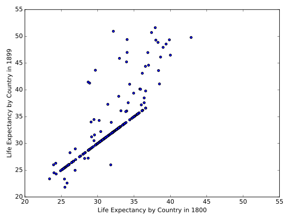

# Chapter 05: Case Study

## 01. Exploratory analysis
Whenever you obtain a new dataset, your first task should always be to do some exploratory analysis to get a better understanding of the data and diagnose it for any potential issues.

The Gapminder data for the 19th century has been loaded into a DataFrame called g1800s. In the IPython Shell, use pandas methods such as .head(), .info(), and .describe(), and DataFrame attributes like .columns and .shape to explore it.

Use the information that you acquire from your exploratory analysis to choose the true statement from the options provided below. 

### Instructions
* The DataFrame has 259 rows and 100 columns.  &emsp;&emsp;  press 1
* The DataFrame has no missing values encoded as NaN.  &emsp;&emsp;  press 2
* 100 of the columns are of type float64 and 1 column is of type object.  &emsp;&emsp;  press 3
* The DataFrame takes up 203.2+ KB of memory.  &emsp;&emsp;  press 4

#### Script & Output
```
In [1]: g1800s.info()
<class 'pandas.core.frame.DataFrame'>
RangeIndex: 260 entries, 0 to 259
Columns: 101 entries, Life expectancy to 1899
dtypes: float64(100), object(1)
memory usage: 205.2+ KB

In [6]: g1800s.head()
Out[6]: 
         Life expectancy   1800   1801   1802   1803   1804   1805   1806  \
0               Abkhazia    NaN    NaN    NaN    NaN    NaN    NaN    NaN   
1            Afghanistan  28.21  28.20  28.19  28.18  28.17  28.16  28.15   
2  Akrotiri and Dhekelia    NaN    NaN    NaN    NaN    NaN    NaN    NaN   
3                Albania  35.40  35.40  35.40  35.40  35.40  35.40  35.40   
4                Algeria  28.82  28.82  28.82  28.82  28.82  28.82  28.82   

    1807   1808  ...     1890   1891   1892   1893   1894   1895   1896  \
0    NaN    NaN  ...      NaN    NaN    NaN    NaN    NaN    NaN    NaN   
1  28.14  28.13  ...    27.29  27.28  27.27  27.26  27.25  27.24  27.23   
2    NaN    NaN  ...      NaN    NaN    NaN    NaN    NaN    NaN    NaN   
3  35.40  35.40  ...    35.40  35.40  35.40  35.40  35.40  35.40  35.40   
4  28.82  28.82  ...    28.82  28.82  28.82  28.82  28.82  28.82  28.82   

    1897   1898   1899  
0    NaN    NaN    NaN  
1  27.22  27.21  27.20  
2    NaN    NaN    NaN  
3  35.40  35.40  35.40  
4  28.82  28.82  28.82  

[5 rows x 101 columns]
```

##### Answer:
3

##### Comment:
Exactly! This information is provided by the g1800s.info(). 'Life expectancy' is the only column in the DataFrame that is not of type float64.

## 02. Visualizing your data
Since 1800, life expectancy around the globe has been steadily going up. You would expect the Gapminder data to confirm this.

The DataFrame g1800s has been pre-loaded. Your job in this exercise is to create a scatter plot with life expectancy in '1800' on the x-axis and life expectancy in '1899' on the y-axis.

Here, the goal is to visually check the data for insights as well as errors. When looking at the plot, pay attention to whether the scatter plot takes the form of a diagonal line, and which points fall below or above the diagonal line. This will inform how life expectancy in 1899 changed (or did not change) compared to 1800 for different countries. If points fall on a diagonal line, it means that life expectancy remained the same!

### Instructions:
* Import matplotlib.pyplot as plt.
* Use the .plot() method on g1800s with kind='scatter' to create a scatter plot with '1800' on the x-axis and '1899' on the y-axis.
* Display the plot.

#### Script:
```
# Import matplotlib.pyplot
import matplotlib.pyplot as plt

# Create the scatter plot
g1800s.plot(kind='scatter', x='1800', y='1899')

# Specify axis labels
plt.xlabel('Life Expectancy by Country in 1800')
plt.ylabel('Life Expectancy by Country in 1899')

# Specify axis limits
plt.xlim(20, 55)
plt.ylim(20, 55)

# Display the plot
plt.show()
```
##### Output:


##### Comment
Excellent work! As you can see, there are a surprising number of countries that fall on the diagonal line. In fact, examining the DataFrame reveals that the life expectancy for 140 of the 260 countries did not change at all in the 19th century! This is possibly a result of not having access to the data for all the years back then. In this way, visualizing your data can help you uncover insights as well as diagnose it for errors..

## 03. Thinking about the question at hand
Since you are given life expectancy level data by country and year, you could ask questions about how much the average life expectancy changes over each year.

Before continuing, however, it's important to make sure that the following assumptions about the data are true:

* 'Life expectancy' is the first column (index 0) of the DataFrame.
* The other columns contain either null or numeric values.
* The numeric values are all greater than or equal to 0.
* There is only one instance of each country.
* You can write a function that you can apply over the entire DataFrame to verify some of these assumptions. Note that spending the time to write such a script will help you when working with other datasets as well.

### Instructions
* Define a function called check_null_or_valid() that takes in one argument: row_data.
* Inside the function, convert no_na to a numeric data type using pd.to_numeric().
* Write an assert statement to make sure the first column (index 0) of the g1800s DataFrame is 'Life expectancy'.
* Write an assert statement to test that all the values are valid for the g1800s DataFrame. Use the check_null_or_valid() function placed inside the .apply() method for this. Note that because you're applying it over the entire DataFrame, and not just one column, you'll have to chain the .all() method twice, and remember that you don't have to use () for functions placed inside .apply().
* Write an assert statement to make sure that each country occurs only once in the data. Use the .value_counts() method on the 'Life expectancy' column for this. Specifically, index 0 of .value_counts() will contain the most frequently occuring value. If this is equal to 1 for the 'Life expectancy' column, then you can be certain that no country appears more than once in the data.

#### Script
```
def check_null_or_valid(row_data):
    """Function that takes a row of data,
    drops all missing values,
    and checks if all remaining values are greater than or equal to 0
    """
    no_na = row_data.dropna()[1:-1]
    numeric = pd.to_numeric(no_na)
    ge0 = numeric >= 0
    return ge0

# Check whether the first column is 'Life expectancy'
assert g1800s.columns[0] == 'Life expectancy'

# Check whether the values in the row are valid
assert g1800s.iloc[:, 1:].apply(check_null_or_valid, axis=1).all().all()

# Check that there is only one instance of each country
assert g1800s['Life expectancy'].value_counts()[0] == 1
```

##### Output:
<no output since the 'assert' function does not throw any error>

##### Comment:
Fantastic! Getting into the habit of testing your code like this is an important skill..

## 04. Assembling your data
Here, three DataFrames have been pre-loaded: g1800s, g1900s, and g2000s. These contain the Gapminder life expectancy data for, respectively, the 19th century, the 20th century, and the 21st century.

Your task in this exercise is to concatenate them into a single DataFrame called gapminder. This is a row-wise concatenation, similar to how you concatenated the monthly Uber datasets in Chapter 3.

### Instructions
* Use `pd.concat()` to concatenate g1800s, g1900s, and g2000s into one DataFrame called gapminder. Make sure you pass DataFrames to pd.concat() in the form of a list.
* Print the shape and the head of the concatenated DataFrame.

#### Script
```
# Concatenate the DataFrames row-wise
gapminder = pd.concat([g1800s, g1900s, g2000s])

# Print the shape of gapminder
print(gapminder.shape)

# Print the head of gapminder
print(gapminder.head())
```
##### Output
```
<script.py> output:
    (780, 218)
        1800   1801   1802   1803   1804   1805   1806   1807   1808   1809  \
    0    NaN    NaN    NaN    NaN    NaN    NaN    NaN    NaN    NaN    NaN   
    1  28.21  28.20  28.19  28.18  28.17  28.16  28.15  28.14  28.13  28.12   
    2    NaN    NaN    NaN    NaN    NaN    NaN    NaN    NaN    NaN    NaN   
    3  35.40  35.40  35.40  35.40  35.40  35.40  35.40  35.40  35.40  35.40   
    4  28.82  28.82  28.82  28.82  28.82  28.82  28.82  28.82  28.82  28.82   
    
               ...            2008  2009  2010  2011  2012  2013  2014  2015  \
    0          ...             NaN   NaN   NaN   NaN   NaN   NaN   NaN   NaN   
    1          ...             NaN   NaN   NaN   NaN   NaN   NaN   NaN   NaN   
    2          ...             NaN   NaN   NaN   NaN   NaN   NaN   NaN   NaN   
    3          ...             NaN   NaN   NaN   NaN   NaN   NaN   NaN   NaN   
    4          ...             NaN   NaN   NaN   NaN   NaN   NaN   NaN   NaN   
    
       2016        Life expectancy  
    0   NaN               Abkhazia  
    1   NaN            Afghanistan  
    2   NaN  Akrotiri and Dhekelia  
    3   NaN                Albania  
    4   NaN                Algeria  
    
    [5 rows x 218 columns]
```
##### Comment
Great work! All the Gapminder data, from 1800 to 2016, is now contained in one DataFrame.
