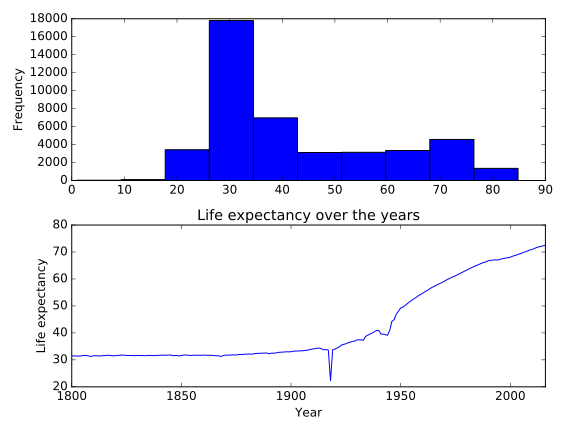

# Chapter 05: Case Study

## 01. Exploratory analysis
Whenever you obtain a new dataset, your first task should always be to do some exploratory analysis to get a better understanding of the data and diagnose it for any potential issues.

The Gapminder data for the 19th century has been loaded into a DataFrame called g1800s. In the IPython Shell, use pandas methods such as .head(), .info(), and .describe(), and DataFrame attributes like .columns and .shape to explore it.

Use the information that you acquire from your exploratory analysis to choose the true statement from the options provided below. 

### Instructions
* The DataFrame has 259 rows and 100 columns.  &emsp;&emsp;  press 1
* The DataFrame has no missing values encoded as NaN.  &emsp;&emsp;  press 2
* 100 of the columns are of type float64 and 1 column is of type object.  &emsp;&emsp;  press 3
* The DataFrame takes up 203.2+ KB of memory.  &emsp;&emsp;  press 4

#### Script & Output
```
In [1]: g1800s.info()
<class 'pandas.core.frame.DataFrame'>
RangeIndex: 260 entries, 0 to 259
Columns: 101 entries, Life expectancy to 1899
dtypes: float64(100), object(1)
memory usage: 205.2+ KB

In [6]: g1800s.head()
Out[6]: 
         Life expectancy   1800   1801   1802   1803   1804   1805   1806  \
0               Abkhazia    NaN    NaN    NaN    NaN    NaN    NaN    NaN   
1            Afghanistan  28.21  28.20  28.19  28.18  28.17  28.16  28.15   
2  Akrotiri and Dhekelia    NaN    NaN    NaN    NaN    NaN    NaN    NaN   
3                Albania  35.40  35.40  35.40  35.40  35.40  35.40  35.40   
4                Algeria  28.82  28.82  28.82  28.82  28.82  28.82  28.82   

    1807   1808  ...     1890   1891   1892   1893   1894   1895   1896  \
0    NaN    NaN  ...      NaN    NaN    NaN    NaN    NaN    NaN    NaN   
1  28.14  28.13  ...    27.29  27.28  27.27  27.26  27.25  27.24  27.23   
2    NaN    NaN  ...      NaN    NaN    NaN    NaN    NaN    NaN    NaN   
3  35.40  35.40  ...    35.40  35.40  35.40  35.40  35.40  35.40  35.40   
4  28.82  28.82  ...    28.82  28.82  28.82  28.82  28.82  28.82  28.82   

    1897   1898   1899  
0    NaN    NaN    NaN  
1  27.22  27.21  27.20  
2    NaN    NaN    NaN  
3  35.40  35.40  35.40  
4  28.82  28.82  28.82  

[5 rows x 101 columns]
```

##### Answer:
3

##### Comment:
Exactly! This information is provided by the g1800s.info(). 'Life expectancy' is the only column in the DataFrame that is not of type float64.

## 02. Visualizing your data
Since 1800, life expectancy around the globe has been steadily going up. You would expect the Gapminder data to confirm this.

The DataFrame g1800s has been pre-loaded. Your job in this exercise is to create a scatter plot with life expectancy in '1800' on the x-axis and life expectancy in '1899' on the y-axis.

Here, the goal is to visually check the data for insights as well as errors. When looking at the plot, pay attention to whether the scatter plot takes the form of a diagonal line, and which points fall below or above the diagonal line. This will inform how life expectancy in 1899 changed (or did not change) compared to 1800 for different countries. If points fall on a diagonal line, it means that life expectancy remained the same!

### Instructions:
* Import matplotlib.pyplot as plt.
* Use the .plot() method on g1800s with kind='scatter' to create a scatter plot with '1800' on the x-axis and '1899' on the y-axis.
* Display the plot.

#### Script:
```
# Import matplotlib.pyplot
import matplotlib.pyplot as plt

# Create the scatter plot
g1800s.plot(kind='scatter', x='1800', y='1899')

# Specify axis labels
plt.xlabel('Life Expectancy by Country in 1800')
plt.ylabel('Life Expectancy by Country in 1899')

# Specify axis limits
plt.xlim(20, 55)
plt.ylim(20, 55)

# Display the plot
plt.show()
```
##### Output:


##### Comment
Excellent work! As you can see, there are a surprising number of countries that fall on the diagonal line. In fact, examining the DataFrame reveals that the life expectancy for 140 of the 260 countries did not change at all in the 19th century! This is possibly a result of not having access to the data for all the years back then. In this way, visualizing your data can help you uncover insights as well as diagnose it for errors..

## 03. Thinking about the question at hand
Since you are given life expectancy level data by country and year, you could ask questions about how much the average life expectancy changes over each year.

Before continuing, however, it's important to make sure that the following assumptions about the data are true:

* 'Life expectancy' is the first column (index 0) of the DataFrame.
* The other columns contain either null or numeric values.
* The numeric values are all greater than or equal to 0.
* There is only one instance of each country.
* You can write a function that you can apply over the entire DataFrame to verify some of these assumptions. Note that spending the time to write such a script will help you when working with other datasets as well.

### Instructions
* Define a function called check_null_or_valid() that takes in one argument: row_data.
* Inside the function, convert no_na to a numeric data type using pd.to_numeric().
* Write an assert statement to make sure the first column (index 0) of the g1800s DataFrame is 'Life expectancy'.
* Write an assert statement to test that all the values are valid for the g1800s DataFrame. Use the check_null_or_valid() function placed inside the .apply() method for this. Note that because you're applying it over the entire DataFrame, and not just one column, you'll have to chain the .all() method twice, and remember that you don't have to use () for functions placed inside .apply().
* Write an assert statement to make sure that each country occurs only once in the data. Use the .value_counts() method on the 'Life expectancy' column for this. Specifically, index 0 of .value_counts() will contain the most frequently occuring value. If this is equal to 1 for the 'Life expectancy' column, then you can be certain that no country appears more than once in the data.

#### Script
```
def check_null_or_valid(row_data):
    """Function that takes a row of data,
    drops all missing values,
    and checks if all remaining values are greater than or equal to 0
    """
    no_na = row_data.dropna()[1:-1]
    numeric = pd.to_numeric(no_na)
    ge0 = numeric >= 0
    return ge0

# Check whether the first column is 'Life expectancy'
assert g1800s.columns[0] == 'Life expectancy'

# Check whether the values in the row are valid
assert g1800s.iloc[:, 1:].apply(check_null_or_valid, axis=1).all().all()

# Check that there is only one instance of each country
assert g1800s['Life expectancy'].value_counts()[0] == 1
```

##### Output:
<no output since the 'assert' function does not throw any error>

##### Comment:
Fantastic! Getting into the habit of testing your code like this is an important skill..

## 04. Assembling your data
Here, three DataFrames have been pre-loaded: g1800s, g1900s, and g2000s. These contain the Gapminder life expectancy data for, respectively, the 19th century, the 20th century, and the 21st century.

Your task in this exercise is to concatenate them into a single DataFrame called gapminder. This is a row-wise concatenation, similar to how you concatenated the monthly Uber datasets in Chapter 3.

### Instructions
* Use `pd.concat()` to concatenate g1800s, g1900s, and g2000s into one DataFrame called gapminder. Make sure you pass DataFrames to pd.concat() in the form of a list.
* Print the shape and the head of the concatenated DataFrame.

#### Script
```
# Concatenate the DataFrames row-wise
gapminder = pd.concat([g1800s, g1900s, g2000s])

# Print the shape of gapminder
print(gapminder.shape)

# Print the head of gapminder
print(gapminder.head())
```
##### Output
```
<script.py> output:
    (780, 218)
        1800   1801   1802   1803   1804   1805   1806   1807   1808   1809  \
    0    NaN    NaN    NaN    NaN    NaN    NaN    NaN    NaN    NaN    NaN   
    1  28.21  28.20  28.19  28.18  28.17  28.16  28.15  28.14  28.13  28.12   
    2    NaN    NaN    NaN    NaN    NaN    NaN    NaN    NaN    NaN    NaN   
    3  35.40  35.40  35.40  35.40  35.40  35.40  35.40  35.40  35.40  35.40   
    4  28.82  28.82  28.82  28.82  28.82  28.82  28.82  28.82  28.82  28.82   
    
               ...            2008  2009  2010  2011  2012  2013  2014  2015  \
    0          ...             NaN   NaN   NaN   NaN   NaN   NaN   NaN   NaN   
    1          ...             NaN   NaN   NaN   NaN   NaN   NaN   NaN   NaN   
    2          ...             NaN   NaN   NaN   NaN   NaN   NaN   NaN   NaN   
    3          ...             NaN   NaN   NaN   NaN   NaN   NaN   NaN   NaN   
    4          ...             NaN   NaN   NaN   NaN   NaN   NaN   NaN   NaN   
    
       2016        Life expectancy  
    0   NaN               Abkhazia  
    1   NaN            Afghanistan  
    2   NaN  Akrotiri and Dhekelia  
    3   NaN                Albania  
    4   NaN                Algeria  
    
    [5 rows x 218 columns]
```
##### Comment
Great work! All the Gapminder data, from 1800 to 2016, is now contained in one DataFrame.

## 05. Reshaping your data
Now that you have all the data combined into a single DataFrame, the next step is to reshape it into a tidy data format.

Currently, the gapminder DataFrame has a separate column for each year. What you want instead is a single column that contains the year, and a single column that represents the average life expectancy for each year and country. By having year in its own column, you can use it as a predictor variable in a later analysis.

You can convert the DataFrame into the desired tidy format by melting it.

### Instructions
* Reshape gapminder by melting it. Keep 'Life expectancy' fixed by specifying it as an argument to the id_vars parameter.
* Rename the three columns of the melted DataFrame to 'country', 'year', and 'life_expectancy' by passing them in as a list to gapminder_melt.columns.
* Print the head of the melted DataFrame.

#### Script
```
# Melt gapminder: gapminder_melt
gapminder_melt = pd.melt(gapminder, id_vars = 'Life expectancy')

# Rename the columns
gapminder_melt.columns = ['country', 'year', 'life_expectancy']

# Print the head of gapminder_melt
print(gapminder_melt.head())
```
##### Output
```
<script.py> output:
                     country  year  life_expectancy
    0               Abkhazia  1800              NaN
    1            Afghanistan  1800            28.21
    2  Akrotiri and Dhekelia  1800              NaN
    3                Albania  1800            35.40
    4                Algeria  1800            28.82
```
##### Comment
Well done! Having the data in this tidy format will make subsequent analysis far easier.

## 06. Checking the data types
Now that your data is in the proper shape, you need to ensure that the columns are of the proper data type. That is, you need to ensure that country is of type object, year is of type int64, and life_expectancy is of type float64.

The tidy DataFrame has been pre-loaded as gapminder. Explore it in the IPython Shell using the .info() method. Notice that the column 'year' is of type object. This is incorrect, so you'll need to use the pd.to_numeric() function to convert it to a numeric data type.

NumPy and pandas have been pre-imported as np and pd.

### Instructions
* Convert the year column of gapminder using pd.to_numeric().
* Assert that the country column is of type np.object. This has been done for you.
* Assert that the year column is of type np.int64.
* Assert that the life_expectancy column is of type np.float64.

#### Script
```
# Convert the year column to numeric
gapminder.year = pd.to_numeric(gapminder.year)

# Test if country is of type object
assert gapminder.country.dtypes == np.object

# Test if year is of type int64
assert gapminder.year.dtypes == np.int64

# Test if life_expectancy is of type float64
assert gapminder.life_expectancy.dtypes == np.float64
```
##### Comment:
Excellent work! Since the assert statements did not throw any errors, you can be sure that your columns have the correct data types!

## 07. Looking at country spellings
Having tidied your DataFrame and checked the data types, your next task in the data cleaning process is to look at the 'country' column to see if there are any special or invalid characters you may need to deal with.

It is reasonable to assume that country names will contain:

* The set of lower and upper case letters.
* Whitespace between words.
* Periods for any abbreviations.
To confirm that this is the case, you can leverage the power of regular expressions again. For common operations like this, Python has a built-in string method - str.contains() - which takes a regular expression pattern, and applies it to the Series, returning True if there is a match, and False otherwise.

Since here you want to find the values that do not match, you have to invert the boolean, which can be done using ~. This Boolean series can then be used to get the Series of countries that have invalid names.

### Instructions
* Create a Series called countries consisting of the 'country' column of gapminder.
* Drop all duplicates from countries using the .drop_duplicates() method.
* Write a regular expression that tests your assumptions of what characters belong in countries:
* Anchor the pattern to match exactly what you want by placing a ^ in the beginning and $ in the end.
* Use A-Za-z to match the set of lower and upper case letters, \. to match periods, and \s to match whitespace between words.
* Use str.contains() to create a Boolean vector representing values that match the pattern.
* Invert the mask by placing a ~ before it.
* Subset the countries series using the .loc[] accessor and mask_inverse. Then hit 'Submit Answer' to see the invalid country names!

#### Script
```
# Create the series of countries: countries
countries = gapminder.country

# Drop all the duplicates from countries
countries = countries.drop_duplicates()

# Write the regular expression: pattern
pattern = '^[A-Za-z\.\s]*$'

# Create the Boolean vector: mask
mask = countries.str.contains(pattern)

# Invert the mask: mask_inverse
mask_inverse = ~mask

# Subset countries using mask_inverse: invalid_countries
invalid_countries = countries[mask_inverse]

# Print invalid_countries
print(invalid_countries)

```
##### Output
```
<script.py> output:
    49            Congo, Dem. Rep.
    50                 Congo, Rep.
    53               Cote d'Ivoire
    73      Falkland Is (Malvinas)
    93               Guinea-Bissau
    98            Hong Kong, China
    118    United Korea (former)\n
    131               Macao, China
    132             Macedonia, FYR
    145      Micronesia, Fed. Sts.
    161            Ngorno-Karabakh
    187             St. Barthélemy
    193     St.-Pierre-et-Miquelon
    225                Timor-Leste
    251      Virgin Islands (U.S.)
    252       North Yemen (former)
    253       South Yemen (former)
    258                      Åland
    Name: country, dtype: object
```
##### Comment:
Excellent work! As you can see, not all these country names are actually invalid so maybe the assumptions need to be tweaked a little. However, there certainly are a few cases worth further investigation, such as St. Barth?lemy. Whenever you are dealing with columns of raw data consisting of strings, it is important to check them for consistency like this..

## 08. More data cleaning and processing
It's now time to deal with the missing data. There are several strategies for this: You can drop them, fill them in using the mean of the column or row that the missing value is in (also known as imputation), or, if you are dealing with time series data, use a forward fill or backward fill, in which you replace missing values in a column with the most recent known value in the column. See pandas Foundations for more on forward fill and backward fill.

In general, it is not the best idea to drop missing values, because in doing so you may end up throwing away useful information. In this data, the missing values refer to years where no estimate for life expectancy is available for a given country. You could fill in, or guess what these life expectancies could be by looking at the average life expectancies for other countries in that year, for example. Whichever strategy you go with, it is important to carefully consider all options and understand how they will affect your data.

In this exercise, you'll practice dropping missing values. Your job is to drop all the rows that have NaN in the life_expectancy column. Before doing so, it would be valuable to use assert statements to confirm that year and country do not have any missing values.

Begin by printing the shape of gapminder in the IPython Shell prior to dropping the missing values. Complete the exercise to find out what its shape will be after dropping the missing values!

### Instructions
* Assert that country and year do not contain any missing values. The first assert statement has been written for you. Note the chaining of the `.all()` method to `pd.notnull()` to confirm that all values in the column are not null.
* Drop the rows in the data where any observation in life_expectancy is missing. As you confirmed that country and year don't have missing values, you can use the `.dropna()` method on the entire gapminder DataFrame, because any missing values would have to be in the life_expectancy column. The .dropna() method has the default keyword arguments `axis=0` and `how='any'`, which specify that rows with any missing values should be dropped.
* Print the shape of gapminder.

#### Script
```
# Assert that country does not contain any missing values
assert pd.notnull(gapminder.country).all()

# Assert that year does not contain any missing values
assert pd.notnull(gapminder.year).all()

# Drop the missing values
gapminder = gapminder.dropna()

# Print the shape of gapminder
print(gapminder.shape)

```

##### Output:
```
<script.py> output:
    (43857, 3)
```
##### Comment
Great work! After dropping the missing values from 'life_expectancy', the number of rows in the DataFrame has gone down from 169260 to 43857. In general, you should avoid dropping too much of your data, but if there is no reasonable way to fill in or impute missing values, then dropping the missing data may be the best solution.

## 09. Wrapping up
Now that you have a clean and tidy dataset, you can do a bit of visualization and aggregation. In this exercise, you'll begin by creating a histogram of the life_expectancy column. You should not get any values under 0 and you should see something reasonable on the higher end of the life_expectancy age range.

Your next task is to investigate how average life expectancy changed over the years. To do this, you need to subset the data by each year, get the life_expectancy column from each subset, and take an average of the values. You can achieve this using the .groupby() method. This .groupby() method is covered in greater depth in Manipulating DataFrames with pandas.

Finally, you can save your tidy and summarized DataFrame to a file using the .to_csv() method.

Matplotlib and pandas have been pre-imported as plt and pd. Go for it!

### Instructions
* Create a histogram of the life_expectancy column using the .plot() method of gapminder. Specify kind='hist'.
* Group gapminder by 'year' and aggregate 'life_expectancy' by the mean. To do this:
* Use the `.groupby()` method on gapminder with 'year' as the argument. Then select 'life_expectancy' and chain the .mean() method to it.
* Print the head and tail of gapminder_agg. This has been done for you.
* Create a line plot of average life expectancy per year by using the .plot() method (without any arguments) on gapminder_agg.
* Save gapminder and gapminder_agg to csv files called 'gapminder.csv' and 'gapminder_agg.csv', respectively, using the .to_csv() method.

#### Script
```
# Add first subplot
plt.subplot(2, 1, 1) 

# Create a histogram of life_expectancy
gapminder.life_expectancy.plot(kind = 'hist')

# Group gapminder: gapminder_agg
gapminder_agg = gapminder.groupby('year')['life_expectancy'].mean()

# Print the head of gapminder_agg
print(gapminder_agg.head())

# Print the tail of gapminder_agg
print(gapminder_agg.tail())

# Add second subplot
plt.subplot(2, 1, 2)

# Create a line plot of life expectancy per year
gapminder_agg.plot()

# Add title and specify axis labels
plt.title('Life expectancy over the years')
plt.ylabel('Life expectancy')
plt.xlabel('Year')

# Display the plots
plt.tight_layout()
plt.show()

# Save both DataFrames to csv files
gapminder.to_csv('gapminder.csv')
gapminder_agg.to_csv('gapminder_agg.csv')
```
##### Output:


```
<script.py> output:
    year
    1800    31.486020
    1801    31.448905
    1802    31.463483
    1803    31.377413
    1804    31.446318
    Name: life_expectancy, dtype: float64
    year
    2012    71.663077
    2013    71.916106
    2014    72.088125
    2015    72.321010
    2016    72.556635
    Name: life_expectancy, dtype: float64
```

##### Comment:
Amazing work! You've stepped through each stage of the data cleaning process and your data is now ready for serious analysis! Looking at the line plot, it seems like life expectancy has, as expected, increased over the years. There is a surprising dip around 1920 that may be worth further investigation!
