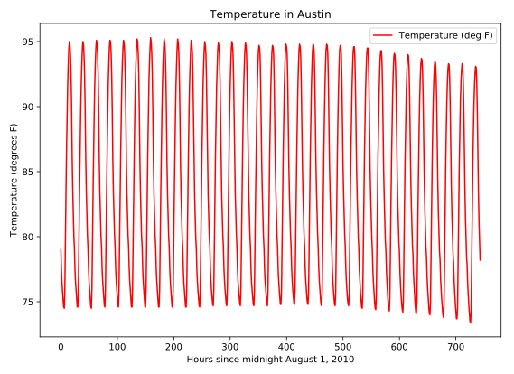

# Chapter 01: Data Ingestion andn Inspection

## 01. Inspecting your data
You can use the DataFrame methods .head() and .tail() to view the first few and last few rows of a DataFrame. In this exercise, we have imported pandas as pd and loaded population data from 1960 to 2014 as a DataFrame df. This dataset was obtained from the World Bank.

Your job is to use df.head() and df.tail() to verify that the first and last rows match a file on disk. In later exercises, you will see how to extract values from DataFrames with indexing, but for now, manually copy/paste or type values into assignment statements where needed. Select the correct answer for the first and last values in the 'Year' and 'Total Population' columns.

### Instructions
* First: 1980, 26183676.0; Last: 2000, 35.   			&emsp;&emsp;  	press 1
* First: 1960, 92495902.0; Last: 2014, 15245855.0.		&emsp;&emsp;	press 2
* First: 40.472, 2001; Last: 44.5, 1880.				&emsp;&emsp; 	press 3
* First: CSS, 104170.0; Last: USA, 95.203.				&emsp;&emsp;	press 4

#### Script
```
In [4]: df.Year.head()
Out[4]: 
0    1960
1    1960
2    1960
3    1960
4    1960
Name: Year, dtype: int64

In [5]: df.Year.tail()
Out[5]: 
13369    2014
13370    2014
13371    2014
13372    2014
13373    2014
Name: Year, dtype: int64
```

##### Answer:
2

##### Comment:
Great work! It's essential to inspect your data like this after you read it in.

## 02. DataFrame data types
Pandas is aware of the data types in the columns of your DataFrame. It is also aware of null and NaN ('Not-a-Number') types which often indicate missing data. In this exercise, we have imported pandas as pd and read in the world population data which contains some NaN values, a value often used as a place-holder for missing or otherwise invalid data entries. Your job is to use df.info() to determine information about the total count of non-null entries and infer the total count of 'null' entries, which likely indicates missing data. Select the best description of this data set from the following:

### Instructions
* The data is all of type float64 and none of it is missing.  &emsp;&emsp;  press 1
* The data is of mixed type, and 9914 of it is missing.   &emsp;&emsp;   press 2
* The data is of mixed type, and 3460 float64s are missing.   &emsp;&emsp;   press 3
* The data is all of type float64, and 3460 float64s are missing.   &emsp;&emsp;   press 4

#### Script & Output
```
In [2]: df.info()
<class 'pandas.core.frame.DataFrame'>
RangeIndex: 13374 entries, 0 to 13373
Data columns (total 5 columns):
CountryName                      13374 non-null object
CountryCode                      13374 non-null object
Year                             13374 non-null int64
Total Population                 9914 non-null float64
Urban population (% of total)    13374 non-null float64
dtypes: float64(2), int64(1), object(2)
memory usage: 522.5+ KB
```
##### Answer:
3

##### Comment:
Well done! You'll learn how to deal with missing values later on in this course..

## 03. NumPy and pandas working together
Pandas depends upon and interoperates with NumPy, the Python library for fast numeric array computations. For example, you can use the DataFrame attribute .values to represent a DataFrame df as a NumPy array. You can also pass pandas data structures to NumPy methods. In this exercise, we have imported pandas as pd and loaded world population data every 10 years since 1960 into the DataFrame df. This dataset was derived from the one used in the previous exercise.

Your job is to extract the values and store them in an array using the attribute .values. You'll then use those values as input into the NumPy np.log10() method to compute the base 10 logarithm of the population values. Finally, you will pass the entire pandas DataFrame into the same NumPy np.log10() method and compare the results.

### Instructions:
* Import numpy using the standard alias np.
* Assign the numerical values in the DataFrame df to an array np_vals using the attribute values.
* Pass np_vals into the NumPy method log10() and store the results in np_vals_log10.
* Pass the entire df DataFrame into the NumPy method log10() and store the results in df_log10.
* Inspect the output of the print() code to see the type() of the variables that you created.

#### Script
```
# Import numpy
import numpy as np

# Create array of DataFrame values: np_vals
np_vals = df.values

# Create new array of base 10 logarithm values: np_vals_log10
np_vals_log10 = np.log10(np_vals)

# Create array of new DataFrame by passing df to np.log10(): df_log10
df_log10 = np.log10(df)

# Print original and new data containers
[print(x, 'has type', type(eval(x))) for x in ['np_vals', 'np_vals_log10', 'df', 'df_log10']]
```

##### Output
```
<script.py> output:
    np_vals has type <class 'numpy.ndarray'>
    np_vals_log10 has type <class 'numpy.ndarray'>
    df has type <class 'pandas.core.frame.DataFrame'>
    df_log10 has type <class 'pandas.core.frame.DataFrame'>
```

##### Comment
Wonderful work! As a data scientist, you'll frequently interact with NumPy arrays, pandas Series, and pandas DataFrames, and you'll leverage a variety of NumPy and pandas methods to perform your desired computations. Understanding how NumPy and pandas work together will prove to be very useful.

## 04. Zip lists to build a DataFrame
In this exercise, you're going to make a pandas DataFrame of the top three countries to win gold medals since 1896 by first building a dictionary. list_keys contains the column names 'Country' and 'Total'. list_values contains the full names of each country and the number of gold medals awarded. The values have been taken from Wikipedia.

Your job is to use these lists to construct a list of tuples, use the list of tuples to construct a dictionary, and then use that dictionary to construct a DataFrame. In doing so, you'll make use of the list(), zip(), dict() and pd.DataFrame() functions. Pandas has already been imported as pd.

Note: The zip() function in Python 3 and above returns a special zip object, which is essentially a generator. To convert this zip object into a list, you'll need to use list(). You can learn more about the zip() function as well as generators in Python Data Science Toolbox (Part 2).

### Instructions
* Zip the 2 lists list_keys and list_values together into one list of (key, value) tuples. Be sure to convert the zip object into a list, and store the result in zipped.
* Inspect the contents of zipped using print(). This has been done for you.
* Construct a dictionary using zipped. Store the result as data.
* Construct a DataFrame using the dictionary. Store the result as df.

#### Script
```
# Zip the 2 lists together into one list of (key,value) tuples: zipped
zipped = list(zip(list_keys, list_values))

# Inspect the list using print()
print(zipped)

# Build a dictionary with the zipped list: data
data = dict(zipped)

# Build and inspect a DataFrame from the dictionary: df
df = pd.DataFrame(data)
print(df)
```
##### Output:
```
Zip the 2 lists list_keys and list_values together into one list of (key, value) tuples. Be sure to convert the zip object into a list, and store the result in zipped.
Inspect the contents of zipped using print(). This has been done for you.
Construct a dictionary using zipped. Store the result as data.
Construct a DataFrame using the dictionary. Store the result as df.
```
##### Comment:
Fantastic! Being able to build DataFrames from scratch is an important skill.

## 05. Labeling your data
You can use the DataFrame attribute df.columns to view and assign new string labels to columns in a pandas DataFrame.

In this exercise, we have imported pandas as pd and defined a DataFrame df containing top Billboard hits from the 1980s (from Wikipedia). Each row has the year, artist, song name and the number of weeks at the top. However, this DataFrame has the column labels a, b, c, d. Your job is to use the df.columns attribute to re-assign descriptive column labels.

### Instructions
* Create a list of new column labels with 'year', 'artist', 'song', 'chart weeks', and assign it to list_labels.
* Assign your list of labels to df.columns.

#### Script
```
# Build a list of labels: list_labels
list_labels = list(['year', 'artist', 'song', 'chart weeks'])

# Assign the list of labels to the columns attribute: df.columns
df.columns = list_labels
```
##### Comment:
Great work! You'll often need to rename column names like this to be more informative.

## 06. Building DataFrames with broadcasting
You can implicitly use 'broadcasting', a feature of NumPy, when creating pandas DataFrames. In this exercise, you're going to create a DataFrame of cities in Pennsylvania that contains the city name in one column and the state name in the second. We have imported the names of 15 cities as the list cities.

Your job is to construct a DataFrame from the list of cities and the string 'PA'.

### Instructions:
* Make a string object with the value 'PA' and assign it to state.
* Construct a dictionary with 2 key:value pairs: 'state':state and 'city':cities.
* Construct a pandas DataFrame from the dictionary you created and assign it to df.

#### Script:
```
# Make a string with the value 'PA': state
state = 'PA'

# Construct a dictionary: data
data = {'state':state, 'city':cities}

# Construct a DataFrame from dictionary data: df
df = pd.DataFrame(data)

# Print the DataFrame
print(df)
```

##### Output:
```
<script.py> output:
                   city state
    0           Manheim    PA
    1      Preston park    PA
    2       Biglerville    PA
    3           Indiana    PA
    4      Curwensville    PA
    5             Crown    PA
    6      Harveys lake    PA
    7   Mineral springs    PA
    8         Cassville    PA
    9        Hannastown    PA
    10        Saltsburg    PA
    11      Tunkhannock    PA
    12       Pittsburgh    PA
    13        Lemasters    PA
    14       Great bend    PA
```
##### Comment:
Excellent job! Broadcasting is a powerful technique.

## 07. Reading a flat file
In previous exercises, we have preloaded the data for you using the pandas function read_csv(). Now, it's your turn! Your job is to read the World Bank population data you saw earlier into a DataFrame using read_csv(). The file is available in the variable data_file.

The next step is to reread the same file, but simultaneously rename the columns using the names keyword input parameter, set equal to a list of new column labels. You will also need to set header=0 to rename the column labels.

Finish up by inspecting the result with df.head() and df.info() in the IPython Shell (changing df to the name of your DataFrame variable).

pandas has already been imported and is available in the workspace as pd.

### Instructions:
* Use pd.read_csv() with the string data_file to read the CSV file into a DataFrame and assign it to df1.
* Create a list of new column labels - 'year', 'population' - and assign it to the variable new_labels.
* Reread the same file, again using pd.read_csv(), but this time, add the keyword arguments header=0 and names=new_labels. Assign the resulting DataFrame to df2.
* Print both the df1 and df2 DataFrames to see the change in column names. This has already been done for you.

#### Script
```
# Read in the file: df1
df1 = pd.read_csv(data_file)

# Create a list of the new column labels: new_labels
new_labels = list(['year', 'population'])

# Read in the file, specifying the header and names parameters: df2
df2 = pd.read_csv(data_file, header=0, names=new_labels)

# Print both the DataFrames
print(df1)
print(df2)
```
##### Output
```
<script.py> output:
       Year  Total Population
    0  1960      3.034971e+09
    1  1970      3.684823e+09
    2  1980      4.436590e+09
    3  1990      5.282716e+09
    4  2000      6.115974e+09
    5  2010      6.924283e+09
       year    population
    0  1960  3.034971e+09
    1  1970  3.684823e+09
    2  1980  4.436590e+09
    3  1990  5.282716e+09
    4  2000  6.115974e+09
    5  2010  6.924283e+09

```
##### Comment:
Well done! Knowing how to read in flat files using pandas is a vital skill..

## 08. Delimiters, headers, and extensions
Not all data files are clean and tidy. Pandas provides methods for reading those not-so-perfect data files that you encounter far too often.

In this exercise, you have monthly stock data for four companies downloaded from Yahoo Finance. The data is stored as one row for each company and each column is the end-of-month closing price. The file name is given to you in the variable file_messy.

In addition, this file has three aspects that may cause trouble for lesser tools: multiple header lines, comment records (rows) interleaved throughout the data rows, and space delimiters instead of commas.

Your job is to use pandas to read the data from this problematic file_messy using non-default input options with read_csv() so as to tidy up the mess at read time. Then, write the cleaned up data to a CSV file with the variable file_clean that has been prepared for you, as you might do in a real data workflow.

You can learn about the option input parameters needed by using help() on the pandas function pd.read_csv().

### Instructions:
* Use `pd.read_csv()` without using any keyword arguments to read file_messy into a pandas DataFrame df1.
* Use `.head()` to print the first 5 rows of df1 and see how messy it is. Do this in the IPython Shell first so you can see how modifying `read_csv()` can clean up this mess.
* Using the keyword arguments delimiter=' ', header=3 and comment='#', use pd.read_csv() again to read file_messy into a new DataFrame df2.
* Print the output of df2.head() to verify the file was read correctly.
* Use the DataFrame method .to_csv() to save the DataFrame df2 to the variable file_clean. Be sure to specify index=False.
* Use the DataFrame method .to_excel() to save the DataFrame df2 to the file 'file_clean.xlsx'. Again, remember to specify index=False.

#### Script
```
# Read the raw file as-is: df1
df1 = pd.read_csv(file_messy)

# Print the output of df1.head()
print(df1.head())

# Read in the file with the correct parameters: df2
# space separated value
# the 3rd row will be used as the column names. 
df2 = pd.read_csv(file_messy, delimiter=' ', header=3, comment='#')

# Print the output of df2.head()
print(df2.head())

# Save the cleaned up DataFrame to a CSV file without the index
df2.to_csv(file_clean, index=False)

# Save the cleaned up DataFrame to an excel file without the index
df2.to_excel('file_clean.xlsx', index=False)

```
##### Output:
```
<script.py> output:
                                                       The following stock data was collect on 2016-AUG-25 from an unknown source
    These kind of comments are not very useful                                                  are they?                        
    Probably should just throw this line away too          but not the next since those are column labels                        
    name Jan Feb Mar Apr May Jun Jul Aug Sep Oct No...                                                NaN                        
    # So that line you just read has all the column...                                                NaN                        
    IBM 156.08 160.01 159.81 165.22 172.25 167.15 1...                                                NaN                        
         name   ...       Dec
    0     IBM   ...    137.96
    1    MSFT   ...     55.40
    2  GOOGLE   ...    755.35
    3   APPLE   ...    111.73
    
    [4 rows x 13 columns]
```
##### Comment
Superb! It's important to be able to save your cleaned DataFrames in the desired file format!

## 09. Plotting series using pandas
Data visualization is often a very effective first step in gaining a rough understanding of a data set to be analyzed. Pandas provides data visualization by both depending upon and interoperating with the matplotlib library. You will now explore some of the basic plotting mechanics with pandas as well as related matplotlib options. We have pre-loaded a pandas DataFrame df which contains the data you need. Your job is to use the DataFrame method df.plot() to visualize the data, and then explore the optional matplotlib input parameters that this .plot() method accepts.

The pandas .plot() method makes calls to matplotlib to construct the plots. This means that you can use the skills you've learned in previous visualization courses to customize the plot. In this exercise, you'll add a custom title and axis labels to the figure.

Before plotting, inspect the DataFrame in the IPython Shell using df.head(). Also, use type(df) and note that it is a single column DataFrame.

### Instructions
* Create the plot with the DataFrame method df.plot(). Specify a color of 'red'.
Note: c and color are interchangeable as parameters here, but we ask you to be explicit and specify color.
* Use plt.title() to give the plot a title of 'Temperature in Austin'.
* Use plt.xlabel() to give the plot an x-axis label of 'Hours since midnight August 1, 2010'.
* Use plt.ylabel() to give the plot a y-axis label of 'Temperature (degrees F)'.
* Finally, display the plot using plt.show().

#### Script
```
# Create a plot with color='red'
df.plot(color = 'red')

# Add a title
plt.title('Temperature in Austin')

# Specify the x-axis label
plt.xlabel('Hours since midnight August 1, 2010')

# Specify the y-axis label
plt.ylabel('Temperature (degrees F)')

# Display the plot
plt.show()
```
##### Output:


##### Comment:
Well done!
