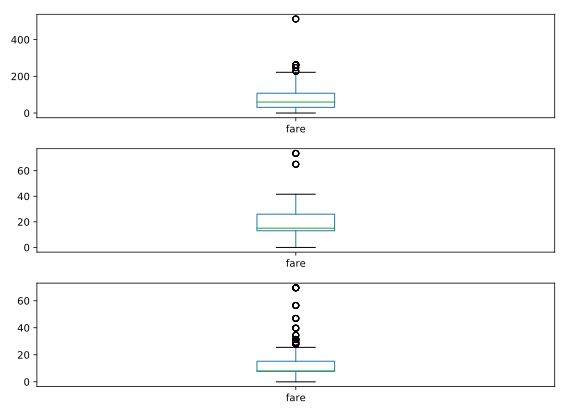

# Chapter 02: Exploratory Data Analysis

## 01. pandas line plots
In the previous chapter, you saw that the .plot() method will place the Index values on the x-axis by default. In this exercise, you'll practice making line plots with specific columns on the x and y axes.

You will work with a dataset consisting of monthly stock prices in 2015 for AAPL, GOOG, and IBM. The stock prices were obtained from Yahoo Finance. Your job is to plot the 'Month' column on the x-axis and the AAPL and IBM prices on the y-axis using a list of column names.

All necessary modules have been imported for you, and the DataFrame is available in the workspace as df. Explore it using methods such as .head(), .info(), and .describe() to see the column names.

### Instructions:
* Create a list of y-axis column names called y_columns consisting of 'AAPL' and 'IBM'.
* Generate a line plot with x='Month' and y=y_columns as inputs.
* Give the plot a title of 'Monthly stock prices'.
* Specify the y-axis label.
* Display the plot.

#### Script
```
# Create a list of y-axis column names: y_columns
y_columns = ['AAPL', 'IBM']

# Generate a line plot
df.plot(x='Month', y=y_columns)

# Add the title
plt.title('Monthly stock prices')

# Add the y-axis label
plt.ylabel('Price ($US)')

# Display the plot
plt.show()
```
##### Output:


##### Comment:
Wonderful work! It looks like the monthly stock prices of both AAPL and IBM peaked early in the year before falling.

## 02. pandas scatter plots
Pandas scatter plots are generated using the kind='scatter' keyword argument. Scatter plots require that the x and y columns be chosen by specifying the x and y parameters inside .plot(). Scatter plots also take an s keyword argument to provide the radius of each circle to plot in pixels.

In this exercise, you're going to plot fuel efficiency (miles-per-gallon) versus horse-power for 392 automobiles manufactured from 1970 to 1982 from the UCI Machine Learning Repository.

The size of each circle is provided as a NumPy array called sizes. This array contains the normalized 'weight' of each automobile in the dataset.

All necessary modules have been imported and the DataFrame is available in the workspace as df.

### Instructions:
* Generate a scatter plot with 'hp' on the x-axis and 'mpg' on the y-axis. Specify s=sizes.
* Add a title to the plot.
* Specify the x-axis and y-axis labels.

#### Script:
```
# Generate a scatter plot
df.plot(kind='scatter', x='hp', y='mpg', s=sizes)

# Add the title
plt.title('Fuel efficiency vs Horse-power')

# Add the x-axis label
plt.xlabel('Horse-power')

# Add the y-axis label
plt.ylabel('Fuel efficiency (mpg)')

# Display the plot
plt.show()
```
##### Output:


##### Comment:
Fantastic! As you would expect, automobiles with higher horsepower are less fuel efficient.

## 03. pandas box plots
While pandas can plot multiple columns of data in a single figure, making plots that share the same x and y axes, there are cases where two columns cannot be plotted together because their units do not match. The .plot() method can generate subplots for each column being plotted. Here, each plot will be scaled independently.

In this exercise your job is to generate box plots for fuel efficiency (mpg) and weight from the automobiles data set. To do this in a single figure, you'll specify subplots=True inside .plot() to generate two separate plots.

All necessary modules have been imported and the automobiles dataset is available in the workspace as df.

### Instructions:
* Make a list called cols of the column names to be plotted: 'weight' and 'mpg'.
* Call plot on df[cols] to generate a box plot of the two columns in a single figure. To do this, specify subplots=True.

#### Script
```
# Make a list of the column names to be plotted: cols
cols = ['weight', 'mpg']

# Generate the box plots
df[cols].plot(kind='box', subplots=True)

# Display the plot
plt.show()
```
##### Output:


##### Comment:
Excellent job! Box plots are a great way to visualize important summary statistics..

## 04. pandas hist, pdf and cdf
Pandas relies on the .hist() method to not only generate histograms, but also plots of probability density functions (PDFs) and cumulative density functions (CDFs).

In this exercise, you will work with a dataset consisting of restaurant bills that includes the amount customers tipped.

The original dataset is provided by the Seaborn package.

Your job is to plot a PDF and CDF for the fraction column of the tips dataset. This column contains information about what fraction of the total bill is comprised of the tip.

Remember, when plotting the PDF, you need to specify normed=True in your call to .hist(), and when plotting the CDF, you need to specify cumulative=True in addition to normed=True.

All necessary modules have been imported and the tips dataset is available in the workspace as df. Also, some formatting code has been written so that the plots you generate will appear on separate rows.

### Instructions:
* Plot a PDF for the values in fraction with 30 bins between 0 and 30%. The range has been taken care of for you. ax=axes[0] means that this plot will appear in the first row.
* Plot a CDF for the values in fraction with 30 bins between 0 and 30%. Again, the range has been specified for you. To make the CDF appear on the second row, you need to specify ax=axes[1].

#### Script:
```
# This formats the plots such that they appear on separate rows
fig, axes = plt.subplots(nrows=2, ncols=1)

# Plot the PDF
df.fraction.plot(ax=axes[0], kind ='hist', bins=30, normed=True, range=(0,.3))
plt.show()

# Plot the CDF
df.fraction.plot(ax=axes[1], kind='hist', bins=30, normed=True, cumulative=True, range=(0,.3))
plt.show()
```
##### Output:


##### Comment:
Well done!

## 05. Fuel efficiency
From the automobiles data set, which value corresponds to the median value of the 'mpg' column? Your job is to select the 'mpg' column and call the .median() method on it. The automobile DataFrame has been provided as df.

### Possible Answers
* 29.0  &emsp;&emsp  press 1
* 23.45 &emsp;&emsp  press 2
* 22.75 &emsp;&emsp  press 3
* 32    &emsp;&emsp  press 4

#### Script:
```
In [1]: df.mpg.median()
Out[1]: 22.75
```

##### Answer:
3

##### Comment:
Exactly - great work! The median is a very useful statistic, especially in the presence of outliers, when it is more robust than the mean.

## 06. Bachelor's degrees awarded to women
In this exercise, you will investigate statistics of the percentage of Bachelor's degrees awarded to women from 1970 to 2011. Data is recorded every year for 17 different fields. This data set was obtained from the Digest of Education Statistics.

Your job is to compute the minimum and maximum values of the 'Engineering' column and generate a line plot of the mean value of all 17 academic fields per year. To perform this step, you'll use the .mean() method with the keyword argument axis='columns'. This computes the mean across all columns per row.

The DataFrame has been pre-loaded for you as df with the index set to 'Year'.

### Instructions:
* Print the minimum value of the 'Engineering' column.
* Print the maximum value of the 'Engineering' column.
* Construct the mean percentage per year with .mean(axis='columns'). Assign the result to mean.
* Plot the average percentage per year. Since 'Year' is the index of df, it will appear on the x-axis of the plot. No keyword arguments are needed in your call to .plot().

#### Script:
```
# Print the minimum value of the Engineering column
print(df.Engineering.min())

# Print the maximum value of the Engineering column
print(df.Engineering.max())

# Construct the mean percentage per year: mean
mean = df.mean(axis='columns')

# Plot the average percentage per year
# the result will be the same with if we use plt.plot(mean) instead
mean.plot()

# Display the plot
plt.show()
```
##### Output:


```
<script.py> output:
    0.8
    19.0
```
##### Comment:
Well done! It looks like there has generally been an upward trend since 1970.

## 07. Median vs mean
In many data sets, there can be large differences in the mean and median value due to the presence of outliers.

In this exercise, you'll investigate the mean, median, and max fare prices paid by passengers on the Titanic and generate a box plot of the fare prices. This data set was obtained from <a href="http://biostat.mc.vanderbilt.edu/wiki/pub/Main/DataSets/titanic.html">Vanderbilt University </a>.
 
All necessary modules have been imported and the DataFrame is available in the workspace as df. 

### Instructions
* Print summary statistics of the 'fare' column of df with .describe() and print(). Note: df.fare and df['fare'] are equivalent.
* Generate a box plot of the 'fare' column.

#### Script
```
# Print summary statistics of the fare column with .describe()
print(df.fare.describe())

# Generate a box plot of the fare column
df.fare.plot(kind='box')

# Show the plot
plt.show()
```
##### Output:


```
<script.py> output:
    count    1308.000000
    mean       33.295479
    std        51.758668
    min         0.000000
    25%         7.895800
    50%        14.454200
    75%        31.275000
    max       512.329200
    Name: fare, dtype: float64
```
##### Comment:
Excellent job! Here you can see why the median is a more informative statistic in the presence of outliers.

## 08. Quantiles
In this exercise, you'll investigate the probabilities of life expectancy in countries around the world. This dataset contains life expectancy for persons born each year from 1800 to 2015. Since country names change or results are not reported, not every country has values. This dataset was obtained from <a href="https://docs.google.com/a/continuum.io/spreadsheets/d/1dgOdlUEq6_V55OHZCxz5BG_0uoghJTeA6f83br5peNs/pub?range=A1:D70&gid=1&output=html#">Gapminder</a>.

First, you will determine the number of countries reported in 2015. There are a total of 260 unique countries in the entire dataset. Then, you will compute the 5th and 95th percentiles of life expectancy over the entire dataset. Finally, you will make a box plot of life expectancy every 50 years from 1800 to 2000. Notice the large change in the distributions over this period.

The dataset has been pre-loaded into a DataFrame called df.

### Instructions
* Print the number of countries reported in 2015. To do this, use the .count() method on the '2015' column of df.
* Print the 5th and 95th percentiles of df. To do this, use the .quantile() method with the list [0.05, 0.95].
* Generate a box plot using the list of columns provided in years. This has already been done for you, so click on 'Submit Answer' to view the result!

#### Script
```
# Print the number of countries reported in 2015
print(df['2015'].count())

# Print the 5th and 95th percentiles
print(df.quantile([0.05, 0.95]))

# Generate a box plot
years = ['1800','1850','1900','1950','2000']
df[years].plot(kind='box')
plt.show()
```
##### Output:


```
<script.py> output:
    208
          Unnamed: 0   ...        2016
    0.05       12.95   ...     59.2555
    0.95      246.05   ...     82.1650
    
    [2 rows x 218 columns]
```
##### Comment:
Fantastic work! It looks like overall, life expectancy has steadily increased since 1900.

## 09. Filtering and counting
How many automobiles were manufactured in Asia in the automobile dataset? The DataFrame has been provided for you as df. Use filtering and the .count() member method to determine the number of rows where the 'origin' column has the value 'Asia'.

As an example, you can extract the rows that contain 'US' as the country of origin using df[df['origin'] == 'US'].

### Possible Answers
* 68   &emsp;&emsp;  press 1
* 79   &emsp;&emsp;  press 2
* 245  &emsp;&emsp;  press 3
* 392  &emsp;&emsp;  press 4

#### Script:
```
In [3]: df[df['origin'] == 'Asia'].count()
Out[3]: 
mpg       79
cyl       79
displ     79
hp        79
weight    79
accel     79
yr        79
origin    79
name      79
dtype: int64
```
##### Answer:
2

##### Comment:
Correct! In this dataset, 79 automobiles were manufactured in Asia.

## 10. Separate and summarize
Let's use population filtering to determine how the automobiles in the US differ from the global average and standard deviation. How does the distribution of fuel efficiency (MPG) for the US differ from the global average and standard deviation?

In this exercise, you'll compute the means and standard deviations of all columns in the full automobile dataset. Next, you'll compute the same quantities for just the US population and subtract the global values from the US values.

All necessary modules have been imported and the DataFrame has been pre-loaded as df.

### Instructtion:
* Compute the global mean and global standard deviations of df using the .mean() and .std() methods. Assign the results to global_mean and global_std.
* Filter the 'US' population from the 'origin' column and assign the result to us.
* Compute the US mean and US standard deviations of us using the .mean() and .std() methods. Assign the results to us_mean and us_std.
* Print the differences between us_mean and global_mean and us_std and global_std. This has already been done for you.

#### Script:
```
# Compute the global mean and global standard deviation: global_mean, global_std
global_mean = df.mean()
global_std = df.std()

# Filter the US population from the origin column: us
us = df[df['origin'] == 'US']

# Compute the US mean and US standard deviation: us_mean, us_std
us_mean = us.mean()
us_std = us.std()

# Print the differences
print(us_mean - global_mean)
print(us_std - global_std)
```
##### Output:
```
<script.py> output:
    mpg        -3.412449
    cyl         0.805612
    displ      53.100255
    hp         14.579592
    weight    394.905612
    accel      -0.551122
    yr         -0.387755
    dtype: float64
    mpg       -1.364623
    cyl       -0.049788
    displ     -6.267657
    hp         1.406630
    weight   -54.055870
    accel     -0.022844
    yr        -0.023369
    dtype: float64
```
##### Comment:
Well done! Interestingly, it looks like US automobiles weigh more than the global mean.

## 11. Separate and plot
Population filtering can be used alongside plotting to quickly determine differences in distributions between the sub-populations. You'll work with the Titanic dataset.

There were three passenger classes on the Titanic, and passengers in each class paid a different fare price. In this exercise, you'll investigate the differences in these fare prices.

Your job is to use Boolean filtering and generate box plots of the fare prices for each of the three passenger classes. The fare prices are contained in the 'fare' column and passenger class information is contained in the 'pclass' column.

When you're done, notice the portions of the box plots that differ and those that are similar.

The DataFrame has been pre-loaded for you as titanic.

### Instructions:
* Inside plt.subplots(), specify the nrows and ncols parameters so that there are 3 rows and 1 column.
* Filter the rows where the 'pclass' column has the values 1 and generate a box plot of the 'fare' column.
* Filter the rows where the 'pclass' column has the values 2 and generate a box plot of the 'fare' column.
* Filter the rows where the 'pclass' column has the values 3 and generate a box plot of the 'fare' column.

#### Script:
```
# Display the box plots on 3 separate rows and 1 column
fig, axes = plt.subplots(nrows=3, ncols=1)

# Generate a box plot of the fare prices for the First passenger class
titanic.loc[titanic['pclass'] == 1].plot(ax=axes[0], y='fare', kind='box')

# Generate a box plot of the fare prices for the Second passenger class
titanic.loc[titanic['pclass'] == 2].plot(ax=axes[1], y='fare', kind='box')

# Generate a box plot of the fare prices for the Third passenger class
titanic.loc[titanic['pclass'] == 3].plot(ax=axes[2], y='fare', kind='box')

# Display the plot
plt.show()
```

##### Output:


##### Comment:
Great work! Unsurprisingly, passengers in the first class had the highest fare.

## 12. Reading and slicing times
For this exercise, we have read in the same data file using three different approaches:

* ```df1 = pd.read_csv(filename)```

* ```df2 = pd.read_csv(filename, parse_dates=['Date'])```

* ```df3 = pd.read_csv(filename, index_col='Date', parse_dates=True)```

Use the .head() and .info() methods in the IPython Shell to inspect the DataFrames. Then, try to index each DataFrame with a datetime string. Which of the resulting DataFrames allows you to easily index and slice data by dates using, for example, df1.loc['2010-Aug-01']?

### Possible Answers
* df1.   &emsp;&emsp;  press 1
* df1 and df2.  &emsp;&emsp;   press 2
* df2.   &emsp;&emsp;   press 3
* df2 and df3.   &emsp;&emsp;   press 4
* df3.   &emsp;&emsp;  press 5

#### Output:
```
In [1]: df1.head()
Out[1]: 
   Temperature       ...                  Date
0         46.2       ...        20100101 00:00
1         44.6       ...        20100101 01:00
2         44.1       ...        20100101 02:00
3         43.8       ...        20100101 03:00
4         43.5       ...        20100101 04:00

[5 rows x 4 columns]

In [2]: df1.info()
<class 'pandas.core.frame.DataFrame'>
RangeIndex: 8759 entries, 0 to 8758
Data columns (total 4 columns):
Temperature    8759 non-null float64
DewPoint       8759 non-null float64
Pressure       8759 non-null float64
Date           8759 non-null object
dtypes: float64(3), object(1)
memory usage: 273.8+ KB

In [3]: df2.head()
Out[3]: 
   Temperature         ...                        Date
0         46.2         ...         2010-01-01 00:00:00
1         44.6         ...         2010-01-01 01:00:00
2         44.1         ...         2010-01-01 02:00:00
3         43.8         ...         2010-01-01 03:00:00
4         43.5         ...         2010-01-01 04:00:00

[5 rows x 4 columns]

In [4]: df2.info()
<class 'pandas.core.frame.DataFrame'>
RangeIndex: 8759 entries, 0 to 8758
Data columns (total 4 columns):
Temperature    8759 non-null float64
DewPoint       8759 non-null float64
Pressure       8759 non-null float64
Date           8759 non-null datetime64[ns]
dtypes: datetime64[ns](1), float64(3)
memory usage: 273.8 KB

In [5]: df3.head()
Out[5]: 
                     Temperature    ...     Pressure
Date                                ...             
2010-01-01 00:00:00         46.2    ...          1.0
2010-01-01 01:00:00         44.6    ...          1.0
2010-01-01 02:00:00         44.1    ...          1.0
2010-01-01 03:00:00         43.8    ...          1.0
2010-01-01 04:00:00         43.5    ...          1.0

[5 rows x 3 columns]

In [6]: df3.info()
<class 'pandas.core.frame.DataFrame'>
DatetimeIndex: 8759 entries, 2010-01-01 00:00:00 to 2010-12-31 23:00:00
Data columns (total 3 columns):
Temperature    8759 non-null float64
DewPoint       8759 non-null float64
Pressure       8759 non-null float64
dtypes: float64(3)
memory usage: 593.7 KB
```
##### Answer:
5

##### Comment:
Correct! This is why it is important to read in your data properly, especially when working with time series data.

## 13. Creating and using a DatetimeIndex
The pandas Index is a powerful way to handle time series data, so it is valuable to know how to build one yourself. Pandas provides the pd.to_datetime() function for just this task. For example, if passed the list of strings ['2015-01-01 091234','2015-01-01 091234'] and a format specification variable, such as format='%Y-%m-%d %H%M%S, pandas will parse the string into the proper datetime elements and build the datetime objects.

In this exercise, a list of temperature data and a list of date strings has been pre-loaded for you as temperature_list and date_list respectively. Your job is to use the .to_datetime() method to build a DatetimeIndex out of the list of date strings, and to then use it along with the list of temperature data to build a pandas Series.

### Instructions:
* Prepare a format string, time_format, using '%Y-%m-%d %H:%M' as the desired format.
* Convert date_list into a datetime object by using the pd.to_datetime() function. Specify the format string you defined above and assign the result to my_datetimes.
* Construct a pandas Series called time_series using pd.Series() with temperature_list and my_datetimes. Set the index of the Series to be my_datetimes.

#### Script:
```
# Prepare a format string: time_format
time_format = '%Y-%m-%d %H:%M'

# Convert date_list into a datetime object: my_datetimes
my_datetimes = pd.to_datetime(date_list, format=time_format)  

# Construct a pandas Series using temperature_list and my_datetimes: time_series
time_series = pd.Series(temperature_list, index=my_datetimes)
```
##### Comment:
Great work!

## 14. Partial string indexing and slicing
Pandas time series support "partial string" indexing. What this means is that even when passed only a portion of the datetime, such as the date but not the time, pandas is remarkably good at doing what one would expect. Pandas datetime indexing also supports a wide variety of commonly used datetime string formats, even when mixed.

In this exercise, a time series that contains hourly weather data has been pre-loaded for you. This data was read using the parse_dates=True option in read_csv() with index_col="Dates" so that the Index is indeed a DatetimeIndex.

All data from the 'Temperature' column has been extracted into the variable ts0. Your job is to use a variety of natural date strings to extract one or more values from ts0.

After you are done, you will have three new variables - ts1, ts2, and ts3. You can slice these further to extract only the first and last entries of each. Try doing this after your submission for more practice.

### Instructions
* Extract data from ts0 for a single hour - the hour from 9pm to 10pm on 2010-10-11. Assign it to ts1.
* Extract data from ts0 for a single day - July 4th, 2010 - and assign it to ts2.
* Extract data from ts0 for the second half of December 2010 - 12/15/2010 to 12/31/2010. Assign it to ts3.

#### Script
```
# Extract the hour from 9pm to 10pm on '2010-10-11': ts1
ts1 = ts0.loc['2010-10-11 21:00:00':'2010-10-11 22:00:00']

# Extract '2010-07-04' from ts0: ts2
ts2 = ts0.loc['July 4th, 2010']

# Extract data from '2010-12-15' to '2010-12-31': ts3
ts3 = ts0.loc['2010-12-15':'2010-12-31']
```

##### Comment:
Well done!
