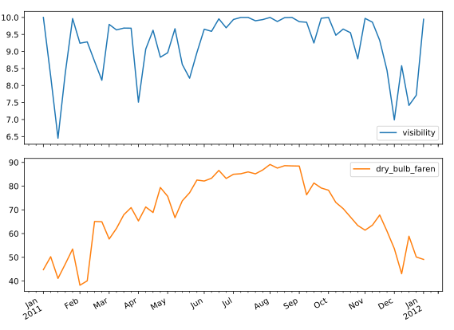
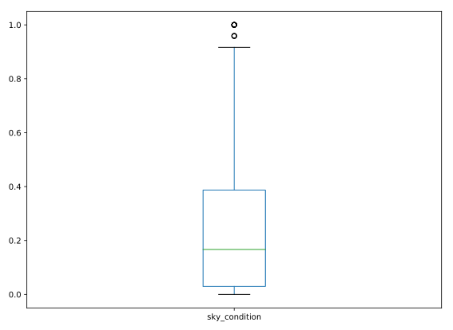
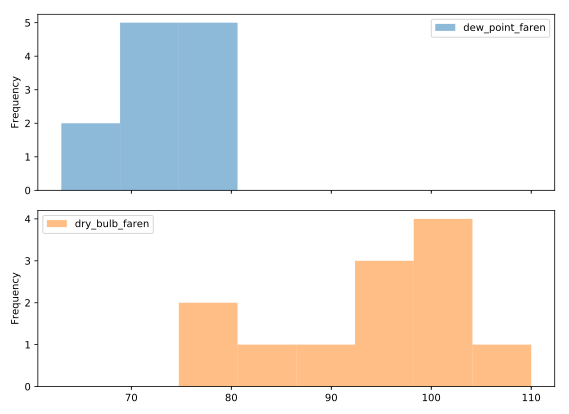

# Chapter 04: Case Studies - Sunlight in Austin

## 01. What method should we use to read the data?
The first step in our analysis is to read in the data. Upon inspection with a certain system tool, we find that the data appears to be ASCII encoded with comma delimited columns, but has no header and no column labels. Which of the following is the best method to start with to read the data files?

### Possible Answers
* pd.read_csv()  &emsp;&emsp;  press 1
* pd.to_csv()   &emsp;&emsp;  press 2
* pd.read_hdf()   &emsp;&emsp; press 3
* np.load()       &emsp;&emsp; press 4

#### Answer:
1

##### Comment:
Correct! The read_csv() function will become second nature to you as you continue using pandas.

## 02. Reading in a data file
Now that you have identified the method to use to read the data, let's try to read one file. The problem with real data such as this is that the files are almost never formatted in a convenient way. In this exercise, there are several problems to overcome in reading the file. First, there is no header, and thus the columns don't have labels. There is also no obvious index column, since none of the data columns contain a full date or time.

Your job is to read the file into a DataFrame using the default arguments. After inspecting it, you will re-read the file specifying that there are no headers supplied.

The CSV file has been provided for you as the variable data_file.

### Instructions
* Import pandas as pd.
* Read the file data_file into a DataFrame called df.
* Print the output of df.head(). This has been done for you. Notice the formatting problems in df.
* Re-read the data using specifying the keyword argument header=None and assign it to df_headers.
* Print the output of df_headers.head(). This has already been done for you. Hit 'Submit Answer' and see how this resolves the formatting issues.

#### Script:
```
# Import pandas
import pandas as pd

# Read in the data file: df
df = pd.read_csv(data_file)

# Print the output of df.head()
print(df.head())

# Read in the data file with header=None: df_headers
df_headers = pd.read_csv(data_file, header=None)

# Print the output of df_headers.head()
print(df_headers.head())
```
##### Output:
```
<script.py> output:
       13904  ...    .24
    0  13904  ...       
    1  13904  ...       
    2  13904  ...       
    3  13904  ...       
    4  13904  ...       
    
    [5 rows x 44 columns]
          0  ...  43
    0  13904 ...    
    1  13904 ...    
    2  13904 ...    
    3  13904 ...    
    4  13904 ...    
    
    [5 rows x 44 columns]
```
##### Comment:
Well done! Note how the column names are not informative. You'll fix this in the next exercise!

## 03. Re-assigning column names
After the initial step of reading in the data, the next step is to clean and tidy it so that it is easier to work with.

In this exercise, you will begin this cleaning process by re-assigning column names and dropping unnecessary columns.

pandas has been imported in the workspace as pd, and the file NOAA_QCLCD_2011_hourly_13904.txt has been parsed and loaded into a DataFrame df. The comma separated string of column names, column_labels, and list of columns to drop, list_to_drop, have also been loaded for you.

### Instructions
* Convert the comma separated string column_labels to a list of strings using .split(','). Assign the result to column_labels_list.
* Reassign df.columns using the list of strings column_labels_list.
* Call df.drop() with list_to_drop and axis='columns'. Assign the result to df_dropped.
* Print df_dropped.head() to examine the result. This has already been done for you.

#### Script
```
# Split on the comma to create a list: column_labels_list
column_labels_list = column_labels.split(',')

# Assign the new column labels to the DataFrame: df.columns
df.columns = column_labels_list

# Remove the appropriate columns: df_dropped
df_dropped = df.drop(list_to_drop, axis='columns')

# Print the output of df_dropped.head()
print(df_dropped.head())
```
##### Output
```
<script.py> output:
        Wban         ...          sea_level_pressure
    0  13904         ...                       29.95
    1  13904         ...                       30.01
    2  13904         ...                       30.01
    3  13904         ...                       30.03
    4  13904         ...                       30.04
    
    [5 rows x 17 columns]
```
##### Comment
Fantastic! Now that you have informative column names, it is a lot easier to interpret the data! But there is still some tidying work to be done: You'll clean the datetime data in the next exercise.

## 04. Cleaning and tidying datetime data
In order to use the full power of pandas time series, you must construct a DatetimeIndex. To do so, it is necessary to clean and transform the date and time columns.

The DataFrame df_dropped you created in the last exercise is provided for you and pandas has been imported as pd.

Your job is to clean up the date and Time columns and combine them into a datetime collection to be used as the Index.

### Instructions
* Convert the 'date' column to a string with `.astype(str)` and assign to df_dropped['date'].
* Add leading zeros to the 'Time' column. This has been done for you.
* Concatenate the new 'date' and 'Time' columns together. Assign to date_string.
* Convert the date_string Series to datetime values with pd.to_datetime(). Specify the format parameter.
* Set the index of the df_dropped DataFrame to be date_times. Assign the result to df_clean.

#### Script
```
# Convert the date column to string: df_dropped['date']
df_dropped['date'] = df_dropped['date'].astype(str)

# Pad leading zeros to the Time column: df_dropped['Time']
# :0>4 --> replace formatting by padding to 4 digits, starts from the right align. 
df_dropped['Time'] = df_dropped['Time'].apply(lambda x:'{:0>4}'.format(x))

# Concatenate the new date and Time columns: date_string
# to concatenate, use '+' instead of pd.concat()
# this is because pd.concat will result in the new df with number of rows = rows of date + rows of time
# concat using '+' will result in combining column-wise. 
date_string = df_dropped['date'] + df_dropped['Time']

# Convert the date_string Series to datetime: date_times
date_times = pd.to_datetime(date_string, format='%Y%m%d%H%M')

# Set the index to be the new date_times container: df_clean
df_clean = df_dropped.set_index(date_times)

# Print the output of df_clean.head()
print(df_clean.head())
```
##### Output:
```
<script.py> output:
                          Wban        ...         sea_level_pressure
    2011-01-01 00:53:00  13904        ...                      29.95
    2011-01-01 01:53:00  13904        ...                      30.01
    2011-01-01 02:53:00  13904        ...                      30.01
    2011-01-01 03:53:00  13904        ...                      30.03
    2011-01-01 04:53:00  13904        ...                      30.04
    
    [5 rows x 17 columns]
```
##### Comment:
Well done! All that's left now is to clean the numeric columns.

## 05. Cleaning the numeric columns
The numeric columns contain missing values labeled as 'M'. In this exercise, your job is to transform these columns such that they contain only numeric values and interpret missing data as NaN.

The pandas function pd.to_numeric() is ideal for this purpose: It converts a Series of values to floating-point values. Furthermore, by specifying the keyword argument errors='coerce', you can force strings like 'M' to be interpreted as NaN.

A DataFrame df_clean is provided for you at the start of the exercise, and as usual, pandas has been imported as pd.

### Instructions
* Print the 'dry_bulb_faren' temperature between 8 AM and 9 AM on June 20, 2011.
* Convert the 'dry_bulb_faren' column to numeric values with pd.to_numeric(). Specify errors='coerce'.
* Print the transformed dry_bulb_faren temperature between 8 AM and 9 AM on June 20, 2011.
* Convert the 'wind_speed' and 'dew_point_faren' columns to numeric values with pd.to_numeric(). Again, specify errors='coerce'.

#### Script:
```
# Print the dry_bulb_faren temperature between 8 AM and 9 AM on June 20, 2011
print(df_clean.loc['2011-06-20 08:00:00':'2011-06-20 09:00:00', 'dry_bulb_faren'])

# Convert the dry_bulb_faren column to numeric values: df_clean['dry_bulb_faren']
df_clean['dry_bulb_faren'] = pd.to_numeric(df_clean['dry_bulb_faren'], errors='coerce')

# Print the transformed dry_bulb_faren temperature between 8 AM and 9 AM on June 20, 2011
print(df_clean['dry_bulb_faren']['2011-06-20 08:00:00':'2011-06-20 09:00:00'])

# Convert the wind_speed and dew_point_faren columns to numeric values
df_clean['wind_speed'] = pd.to_numeric(df_clean['wind_speed'], errors='coerce')
df_clean['dew_point_faren'] = pd.to_numeric(df_clean['dew_point_faren'], errors='coerce')
```

##### Output:
```
<script.py> output:
    2011-06-20 08:27:00     M
    2011-06-20 08:28:00     M
    2011-06-20 08:29:00     M
    2011-06-20 08:30:00     M
    2011-06-20 08:31:00     M
    2011-06-20 08:32:00     M
    2011-06-20 08:33:00     M
    2011-06-20 08:34:00     M
    2011-06-20 08:35:00     M
    2011-06-20 08:53:00    83
    Name: dry_bulb_faren, dtype: object
    2011-06-20 08:27:00     NaN
    2011-06-20 08:28:00     NaN
    2011-06-20 08:29:00     NaN
    2011-06-20 08:30:00     NaN
    2011-06-20 08:31:00     NaN
    2011-06-20 08:32:00     NaN
    2011-06-20 08:33:00     NaN
    2011-06-20 08:34:00     NaN
    2011-06-20 08:35:00     NaN
    2011-06-20 08:53:00    83.0
    Name: dry_bulb_faren, dtype: float64
```
##### Comment:
Excellent job! Now that your data are clean, you can begin with your exploratory analysis.

## 06. Signal min, max, median
Now that you have the data read and cleaned, you can begin with statistical EDA. First, you will analyze the 2011 Austin weather data.

Your job in this exercise is to analyze the 'dry_bulb_faren' column and print the median temperatures for specific time ranges. You can do this using partial datetime string selection.

The cleaned dataframe is provided in the workspace as df_clean.

### Instructions
* Select the 'dry_bulb_faren' column and print the output of .median().
* Use .loc[] to select the range '2011-Apr':'2011-Jun' from dry_bulb_faren' and print the output of .median().
* Use .loc[] to select the month '2011-Jan' from 'dry_bulb_faren' and print the output of .median().

#### Script:
```
# Print the median of the dry_bulb_faren column
print(df_clean.dry_bulb_faren.median())

# Print the median of the dry_bulb_faren column for the time range '2011-Apr':'2011-Jun'
print(df_clean.loc['2011-04':'2011-06', 'dry_bulb_faren'].median())

# Print the median of the dry_bulb_faren column for the month of January
print(df_clean.loc['2011-01', 'dry_bulb_faren'].median())
```
##### Output:
```
<script.py> output:
    72.0
    78.0
    48.0
```
##### Comment:
Great work!

## 07. Signal variance
You're now ready to compare the 2011 weather data with the 30-year normals reported in 2010. You can ask questions such as, on average, how much hotter was every day in 2011 than expected from the 30-year average?

The DataFrames df_clean and df_climate from previous exercises are available in the workspace.

Your job is to first resample df_clean and df_climate by day and aggregate the mean temperatures. You will then extract the temperature related columns from each - 'dry_bulb_faren' in df_clean, and 'Temperature' in df_climate - as NumPy arrays and compute the difference.

Notice that the indexes of df_clean and df_climate are not aligned - df_clean has dates in 2011, while df_climate has dates in 2010. This is why you extract the temperature columns as NumPy arrays. An alternative approach is to use the pandas .reset_index() method to make sure the Series align properly. You will practice this approach as well.

### Instructions:
* Downsample df_clean with daily frequency and aggregate by the mean. Store the result as daily_mean_2011.
* Extract the 'dry_bulb_faren' column from daily_mean_2011 as a NumPy array using .values. Store the result as daily_temp_2011. Note: .values is an attribute, not a method, so you don't have to use ().
* Downsample df_climate with daily frequency and aggregate by the mean. Store the result as daily_climate.
* Extract the 'Temperature' column from daily_climate using the .reset_index() method. To do this, first reset the index of daily_climate, and then use bracket slicing to access 'Temperature'. Store the result as daily_temp_climate.

#### Script:
```
# Downsample df_clean by day and aggregate by mean: daily_mean_2011
daily_mean_2011 = df_clean.resample('D').mean()

# Extract the dry_bulb_faren column from daily_mean_2011 using .values: daily_temp_2011
daily_temp_2011 = daily_mean_2011.dry_bulb_faren.values

# Downsample df_climate by day and aggregate by mean: daily_climate
daily_climate = df_climate.resample('D').mean()

# Extract the Temperature column from daily_climate using .reset_index(): daily_temp_climate
# we reset_index() so that the old index is added as a column, and we can get extract this column
# after reset_index(), a new sequential index is used
daily_temp_climate = daily_climate.reset_index().Temperature

# Compute the difference between the two arrays and print the mean difference
difference = daily_temp_2011 - daily_temp_climate
print(difference.mean())
```
##### Output;
```
<script.py> output:
    1.3301831870056477
```

##### Comment:
Well done!

## 08. Sunny or cloudy
On average, how much hotter is it when the sun is shining? In this exercise, you will compare temperatures on sunny days against temperatures on overcast days.

Your job is to use Boolean selection to filter out sunny and overcast days, and then compute the difference of the mean daily maximum temperatures between each type of day.

The DataFrame df_clean from previous exercises has been provided for you. The column 'sky_condition' provides information about whether the day was sunny ('CLR') or overcast ('OVC').

### Instructions:
* Use .loc[] to select sunny days and assign to sunny. If 'sky_condition' equals 'CLR', then the day is sunny.
* Use .loc[] to select overcast days and assign to overcast. If 'sky_condition' contains 'OVC', then the day is overcast.
* Resample sunny and overcast and aggregate by the maximum (.max()) daily ('D') temperature. Assign to sunny_daily_max and overcast_daily_max.
* Print the difference between the mean of sunny_daily_max and overcast_daily_max. This has already been done for you, so click 'Submit Answer' to view the result!

#### Script
```
# Select days that are sunny: sunny
sunny = df_clean.loc[df_clean['sky_condition'].str.contains('CLR')]

# Select days that are overcast: overcast
overcast = df_clean.loc[df_clean['sky_condition'].str.contains('OVC')]

# Resample sunny and overcast, aggregating by maximum daily temperature
sunny_daily_max = sunny.resample('D').max()
overcast_daily_max = overcast.resample('D').max()

# Print the difference between the mean of sunny_daily_max and overcast_daily_max
print(sunny_daily_max.mean() - overcast_daily_max.mean())
```
##### Output:
```
<script.py> output:
    Wban               0.000000
    StationType        0.000000
    dry_bulb_faren     6.504304
    dew_point_faren   -4.339286
    wind_speed        -3.246062
    dtype: float64
```
##### Comment:
Great work!

## 09. Weekly average temperature and visibility
Is there a correlation between temperature and visibility? Let's find out.

In this exercise, your job is to plot the weekly average temperature and visibility as subplots. To do this, you need to first select the appropriate columns and then resample by week, aggregating the mean.

In addition to creating the subplots, you will compute the Pearson correlation coefficient using .corr(). The Pearson correlation coefficient, known also as Pearson's r, ranges from -1 (indicating total negative linear correlation) to 1 (indicating total positive linear correlation). A value close to 1 here would indicate that there is a strong correlation between temperature and visibility.

The DataFrame df_clean has been pre-loaded for you.

### Instructions:
* Import matplotlib.pyplot as plt.
* Select the 'visibility' and 'dry_bulb_faren' columns and resample them by week, aggregating the mean. Assign the result to weekly_mean.
* Print the output of weekly_mean.corr().
* Plot the weekly_mean dataframe with .plot(), specifying subplots=True.

#### Script:
```
# Import matplotlib.pyplot as plt
import matplotlib.pyplot as plt

# Select the visibility and dry_bulb_faren columns and resample them: weekly_mean
weekly_mean = df_clean[['visibility', 'dry_bulb_faren']].resample('W').mean()

# Print the output of weekly_mean.corr()
print(weekly_mean.corr())

# Plot weekly_mean with subplots=True
weekly_mean.plot(subplots=True)
plt.show()
```
##### Output:

```
<script.py> output:
                    visibility  dry_bulb_faren
    visibility        1.000000        0.490328
    dry_bulb_faren    0.490328        1.000000
```
##### Comment:
Great work!

## 10. Daily hours of clear sky
In a previous exercise, you analyzed the 'sky_condition' column to explore the difference in temperature on sunny days compared to overcast days. Recall that a 'sky_condition' of 'CLR' represents a sunny day. In this exercise, you will explore sunny days in greater detail. Specifically, you will use a box plot to visualize the fraction of days that are sunny.

The 'sky_condition' column is recorded hourly. Your job is to resample this column appropriately such that you can extract the number of sunny hours in a day and the number of total hours. Then, you can divide the number of sunny hours by the number of total hours, and generate a box plot of the resulting fraction.

As before, df_clean is available for you in the workspace.

### Instructions:
* Create a Boolean Series for sunny days. Assign the result to sunny.
* Resample sunny by day and compute the sum. Assign the result to sunny_hours.
* Resample sunny by day and compute the count. Assign the result to total_hours.
* Divide sunny_hours by total_hours. Assign to sunny_fraction.
* Make a box plot of sunny_fraction.

#### Script:
```
# Create a Boolean Series for sunny days: sunny
sunny = df_clean['sky_condition'] == 'CLR'

# Resample the Boolean Series by day and compute the sum: sunny_hours
sunny_hours = sunny.resample('D').sum()

# Resample the Boolean Series by day and compute the count: total_hours
total_hours = sunny.resample('D').count()

# Divide sunny_hours by total_hours: sunny_fraction
sunny_fraction = sunny_hours / total_hours

# Make a box plot of sunny_fraction
sunny_fraction.plot(kind='box')
plt.show()
```

##### Output:


##### Comment:
Wonderful work!

## 11. Heat or humidity
Dew point is a measure of relative humidity based on pressure and temperature. A dew point above 65 is considered uncomfortable while a temperature above 90 is also considered uncomfortable.

In this exercise, you will explore the maximum temperature and dew point of each month. The columns of interest are 'dew_point_faren' and 'dry_bulb_faren'. After resampling them appropriately to get the maximum temperature and dew point in each month, generate a histogram of these values as subplots. Uncomfortably, you will notice that the maximum dew point is above 65 every month!

df_clean has been pre-loaded for you.

### Instructions:
* Select the 'dew_point_faren' and 'dry_bulb_faren' columns (in that order). Resample by month and aggregate the maximum monthly temperatures. Assign the result to monthly_max.
* Plot a histogram of the resampled data with bins=8, alpha=0.5, and subplots=True.

#### Script:
```
# Resample dew_point_faren and dry_bulb_faren by Month, aggregating the maximum values: monthly_max
monthly_max = df_clean[['dew_point_faren', 'dry_bulb_faren']].resample('M').max()

# Generate a histogram with bins=8, alpha=0.5, subplots=True
monthly_max.plot(kind='hist', bins=8, alpha=0.5, subplots=True)

# Show the plot
plt.show()
```

##### Output:


##### Comment:
Excellent job!

## 12. Probability of high temperatures
We already know that 2011 was hotter than the climate normals for the previous thirty years. In this final exercise, you will compare the maximum temperature in August 2011 against that of the August 2010 climate normals. More specifically, you will use a CDF plot to determine the probability of the 2011 daily maximum temperature in August being above the 2010 climate normal value. To do this, you will leverage the data manipulation, filtering, resampling, and visualization skills you have acquired throughout this course.

The two DataFrames df_clean and df_climate are available in the workspace. Your job is to select the maximum temperature in August in df_climate, and then maximum daily temperatures in August 2011. You will then filter out the days in August 2011 that were above the August 2010 maximum, and use this to construct a CDF plot.

Once you've generated the CDF, notice how it shows that there was a 50% probability of the 2011 daily maximum temperature in August being 5 degrees above the 2010 climate normal value!

### Instructions:
* From df_climate, extract the maximum temperature observed in August 2010. The relevant column here is 'Temperature'. You can select the rows corresponding to August 2010 in multiple ways. For example, df_climate.loc['2011-Feb'] selects all rows corresponding to February 2011, while df_climate.loc['2009-09', 'Pressure'] selects the rows corresponding to September 2009 from the 'Pressure' column.
* From df_clean, select the August 2011 temperature data from the 'dry_bulb_faren'. Resample this data by day and aggregate the maximum value. Store the result in august_2011.
* Filter rows of august_2011 to keep days where the value exceeded august_max. Store the result in august_2011_high.
* Construct a CDF of august_2011_high using 25 bins. Remember to specify the kind, normed, and cumulative parameters in addition to bins.

#### Script:
```
# Extract the maximum temperature in August 2010 from df_climate: august_max
august_max = df_climate.loc['2010-08', 'Temperature'].max()
print(august_max)

# Resample August 2011 temps in df_clean by day & aggregate the max value: august_2011
august_2011 = df_clean.loc['2011-08', 'dry_bulb_faren'].resample('D').max()


# Filter for days in august_2011 where the value exceeds august_max: august_2011_high
august_2011_high = august_2011[august_2011 > august_max]

# Construct a CDF of august_2011_high
august_2011_high.plot(kind='hist', bins=25, normed=True, cumulative=True)

# Display the plot
plt.show()
```

##### Output:


##### Comment:
Fantastic work - you've reached the end of the course!
